# MCP_LOGS_DEVELOPER_GUIDE.md

**A developer-written codebase learning and architecture guide for the `mcp-logs` repository (the EKIP platform).**

> Audience: a developer who has never opened this repository before.
> Goal: after reading this guide, and then the source files in the order it recommends, you should be able to explain, debug, extend, and defend every major design decision in this codebase, including in a technical interview.

---

## 0. Read this first

### 0.1 What "mcp-logs" actually is (name clarification)

The first thing to know is that **the folder is called `mcp-logs`, but the project inside it is called EKIP**, short for *Enterprise Knowledge & Incident Intelligence Platform*.

- `README.md` opens with `# EKIP — Enterprise Knowledge & Incident Intelligence Platform`. [CODE VERIFIED]
- `pyproject.toml` declares `name = "ekip"`, `version = "0.1.0"`. [CODE VERIFIED]
- The Postgres application role is `ekip_app`, the MCP server is registered as `MCPServer(name="ekip", ...)`, and the Redis lock keys are prefixed `ekip:`. [CODE VERIFIED]
- The string `mcp-logs` appears in only three places I could find:
  1. the local folder name on the developer's machine;
  2. the Railway production hostname `https://mcp-logs-production.up.railway.app`, mentioned in `docs/PROJECT_STATUS.md` Phase 30 [DOCUMENTATION VERIFIED];
  3. two one-off root scripts, `check_mcp_logs_connector.py` and `clear_stuck_mcp_logs_lock.py`, which diagnose one specific connector's ingestion lock (their docstrings refer to "the orphaned mcp-logs ingestion lock"; the connector id is hardcoded). [CODE VERIFIED]

It is **not** a log-aggregation product. [INFERRED FROM CODE] The most likely explanation is that the GitHub repository and the Railway project were named `mcp-logs`, while the product was named EKIP. Nothing in the code depends on the name `mcp-logs`. Throughout this guide, **"mcp-logs", "the repo" and "EKIP" all mean the same codebase.**

### 0.2 How to use this guide

The guide has 25 parts. They are deliberately ordered:

| If you want to... | Read |
|---|---|
| Understand the idea behind the project from zero | Parts 1–2 |
| See the whole system as one picture | Part 3 |
| Know where everything lives | Part 4 |
| Actually learn the code, file by file | Parts 5–6 (the heart of the guide) |
| Deep-dive one subsystem | Parts 7–14 |
| Trace a request end to end | Part 15 |
| Configure, test, deploy | Parts 16–18 |
| Prepare for design reviews / interviews | Parts 19, 20, 23 |
| Debug something broken | Part 21 |
| Get a study plan | Part 22 |
| Know what is *not* finished | Part 24 |
| Keep everything in your head at once | Part 25 |

### 0.3 Evidence labels used everywhere

This guide was written by reading the actual repository. To stop inference from being mistaken for fact, claims carry these labels where it matters:

| Label | Meaning |
|---|---|
| **[CODE VERIFIED]** | I read the code/config/migration that does this. |
| **[DOCUMENTATION VERIFIED]** | A doc or docstring in the repo says this; I did not independently confirm the runtime behavior. |
| **[INFERRED FROM CODE]** | Not written anywhere explicitly; my conclusion from reading the code. Treat as a strong hypothesis. |
| **[UNCLEAR]** | The repository does not let me determine this. |
| **[NOT IMPLEMENTED]** | Referenced, planned, or typed, but no working code exists. |
| **[PLANNED]** | Documented as future work. |
| **[PARTIALLY IMPLEMENTED]** | Some of it exists; some documented parts don't. |

### 0.4 What I read, and what I did not

To be honest about coverage:

- **Read line by line, or nearly:** `app/shared/config/settings.py`, `app/database/session.py`, every Alembic migration in `app/database/migrations/versions/`, `app/api/main.py`, `app/api/deps.py`, `app/api/errors.py`, `app/api/middleware.py`, `app/api/rate_limit.py`, `app/core/exceptions.py`, `app/shared/schemas/identity.py`, `app/core/auth/service.py`, the relevant parts of `app/core/users/service.py` and `app/core/users/repository.py`, `app/mcp/auth.py`, `app/mcp/dispatch.py`, `app/mcp/rate_limit.py`, `app/mcp/servers/server.py`, `app/mcp/servers/main.py`, `scripts/run_mcp_server.py`, `app/mcp/oauth/provider.py`, every MCP tool handler, `app/agents/graph.py`, `app/agents/service.py` (main functions), `app/agents/confidence.py`, `app/agents/retrieval/node.py`, `app/agents/answer/node.py`, `app/agents/investigation/node.py`, the main parts of `app/agents/investigation/evidence.py`, `app/retrieval/service.py`, `app/retrieval/schemas.py`, `app/retrieval/embedding.py`, `app/retrieval/ranking/fusion.py`, the filter logic in `app/retrieval/pgvector/store.py`, the core of `app/ingestion/service.py`, `app/ingestion/workers/main.py`, `app/ingestion/workers/tasks.py`, `app/ingestion/connectors/base.py`, `app/ingestion/processors/*`, `scripts/verify_rls_isolation.py`, the CI workflows, the Dockerfile, `docker-compose.yml`, the Railway/Render/Cloudflare configs, the `.env*.example` files.
- **Read at docstring / signature level (enough to describe responsibilities, not every branch):** the other `core/*` services (graph, proactive, privacy, knowledge, memory, incidents, tenancy beyond the functions quoted), each individual connector implementation, `app/agents/investigation/critique.py` and `hypothesis.py`, the knowledge-gap and postmortem pipelines, `app/evaluation/*`, the frontend (only `client.ts`, `config.ts`, `auth.ts`, `mcp.ts`, `tokenStore.ts`, `AuthContext.tsx`, the routes file and the directory listing), `infra/main.bicep` (resource list only).
- **Test files:** I read the test *names* and a subset of test bodies (listed in Part 17). I did **not** run the test suite.
- **Not staged/read:** some large docs (`docs/USER_TESTING_GUIDE.md`, `docs/SEMANTIC_BENCHMARK.md`, `docs/REAL_E2E_TEST_PLAN.md`, `EKIP_CODE_READING_ROADMAP.md` only skimmed), most frontend pages and components, `frontend/e2e/*` bodies.

When a statement below depends on a file I only read at signature level, it is labelled [DOCUMENTATION VERIFIED] (it comes from that file's own docstring) rather than [CODE VERIFIED].

### 0.5 One-paragraph summary

EKIP is a **multi-tenant, FastAPI-based modular monolith** that pulls engineering knowledge (GitHub, Slack, Jira, Confluence, Teams, SharePoint, Azure DevOps, plus internal incidents and postmortems) into **PostgreSQL with pgvector**, and answers questions about it with a **LangGraph agent pipeline** (retrieve → score confidence → either answer with verified citations or run an investigation). It exposes the same capabilities two ways: a **REST API** (for its React frontend) and an **MCP server** over streamable HTTP (for AI clients like Claude), and both go through **exactly the same identity resolution, authorization, and tenant-isolation code**. Ingestion runs in a **separate arq worker process** fed by **Redis**. Tenant isolation is enforced twice: in application code (`organization_id` checks and permission codes on an immutable `Identity` object), and in the database itself (**PostgreSQL Row-Level Security** keyed on a per-transaction setting, enforced against a dedicated `NOSUPERUSER NOBYPASSRLS` role, `ekip_app`). The central product rule, stated in `README.md`: *"a confidently wrong answer is worse than an honest 'I don't know.'"*

---

## Table of contents

- [0. Read this first](#0-read-this-first)
- [Part 1 — Start from zero](#part-1--start-from-zero)
- [Part 2 — Problem → Solution](#part-2--problem--solution)
- [Part 3 — Complete Architecture](#part-3--complete-architecture)
- [Part 4 — Repository Map](#part-4--repository-map)
- [Part 5 — File-by-File Development History / Reading Order](#part-5--file-by-file-development-history--reading-order)
- [Part 6 — Every Important File](#part-6--every-important-file)
- [Part 7 — Database](#part-7--database)
- [Part 8 — RLS and Security Deep Dive](#part-8--rls-and-security-deep-dive)
- [Part 9 — MCP Deep Dive](#part-9--mcp-deep-dive)
- [Part 10 — Authentication / Authorization](#part-10--authentication--authorization)
- [Part 11 — Connectors and Ingestion](#part-11--connectors-and-ingestion)
- [Part 12 — RAG](#part-12--rag)
- [Part 13 — LangGraph / Agents](#part-13--langgraph--agents)
- [Part 14 — Background Jobs / Redis](#part-14--background-jobs--redis)
- [Part 15 — End-to-End Flows](#part-15--end-to-end-flows)
- [Part 16 — Configuration and Environment](#part-16--configuration-and-environment)
- [Part 17 — Testing](#part-17--testing)
- [Part 18 — Deployment](#part-18--deployment)
- [Part 19 — Design Decisions](#part-19--design-decisions)
- [Part 20 — "Why not X?"](#part-20--why-not-x)
- [Part 21 — Debugging Guide](#part-21--debugging-guide)
- [Part 22 — Code Reading Roadmap](#part-22--code-reading-roadmap)
- [Part 23 — Interview Master Section](#part-23--interview-master-section)
- [Part 24 — Current Limitations / Gaps](#part-24--current-limitations--gaps)
- [Part 25 — Final Mental Model](#part-25--final-mental-model)

### Flowchart index

Diagrams are written in **Mermaid** (rendered by GitHub, GitLab, VS Code's Markdown preview with Mermaid support, Obsidian, etc.). Most have an ASCII companion for plain-text viewers.

| Flow | Section |
|---|---|
| Process/deployment view (ASCII) | 3.1 |
| Request layers, REST + MCP | 3.2 |
| Every authenticated request (authN → authZ → RLS) | 10.5.1 |
| Password login + multi-org selection | 10.5.2 |
| SSO OIDC + PKCE sequence | 10.5.3 |
| Refresh-token rotation + reuse detection | 10.5.4 |
| Ingestion job internals | 11.4 |
| Connector registration → first sync | 11.5 |
| No-relevant-documents / decline logic | 12.4 |
| Hybrid retrieval | 12.5 |
| LangGraph state machine | 13.1 |
| `answer_question` execution trace | 13.4 |
| Investigation flow | 13.5 |
| Postmortem generation | 13.6 |
| Background job sequence + retry ladder | 14.3 |
| MCP `investigate_incident` end-to-end | 15 Flow A |
| `POST /ask` RAG flow | 15 Flow C |
| Incident triage (REST) | 15 Flow D |
| Signup → first question journey | 15 Flow F |
| Deployment targets | 18.2 |
| Whole system on one page | 25.1 |

---

# PART 1 — Start from zero

This part assumes you know nothing about the project and nothing about the technologies. Every technology is explained **in terms of what it does in this repository**, not as a generic definition.

## 1.1 What is `mcp-logs` (EKIP)?

**Simple intuition.** Picture an engineering team at 2 a.m. The checkout service is returning 500 errors. Somewhere there is a runbook, an old postmortem, a Slack thread from three months ago, and a GitHub commit from yesterday that together explain what is going on. Nobody can find them fast enough. EKIP is a system that has already read all of those sources, can answer "what is going on and why?" with **citations**, and, when it honestly doesn't know, says so and switches to a structured **investigation** instead of making something up.

**Technical implementation.** EKIP is a Python 3.13 application (`Dockerfile`: `FROM python:3.13-slim`; `pyproject.toml` still says `requires-python = ">=3.11"`) made of these runtime processes [CODE VERIFIED]:

1. **REST API**: FastAPI app `app.api.main:app`, served by uvicorn on port 8000.
2. **MCP server**: `scripts/run_mcp_server.py`, which runs `app.mcp.servers.server.mcp_server` with `transport="streamable-http"` on `MCP_PORT` (default 8001) or `$PORT`.
3. **Ingestion worker**: an arq worker (`app.ingestion.workers.main.WorkerSettings`, queue `arq:queue:ingestion`) started by `scripts/run_ingestion_worker.py`.
4. **Agents worker**: an arq worker (`app.agents.workers.main.WorkerSettings`, queue `arq:queue:agents`) that runs scheduled knowledge-gap and pattern-detection scans.
5. **Frontend**: a React + TypeScript + Vite single-page app in `frontend/`, served by nginx in its Docker image.

They share **one PostgreSQL database** (Neon in the documented development setup; pgvector-enabled Postgres everywhere) and **one Redis** instance.

## 1.2 Why was this project chosen?

[DOCUMENTATION VERIFIED] `docs/Architecture.md` §1 gives the rationale. There are two problems:

1. **Knowledge sprawl.** Knowledge needed to resolve incidents is spread over wikis, runbooks, Slack, GitHub, Jira and postmortems, so engineers either waste time searching or re-solve old problems.
2. **Confidently wrong AI.** "A naive RAG system will still confidently retrieve *something* and let an LLM generate a plausible-sounding but ungrounded answer. In an incident-response context, a confident wrong answer is worse than no answer."

[INFERRED FROM CODE] From a portfolio perspective, it is also a deliberately broad project: it combines multi-tenant SaaS security (RBAC, RLS, OIDC/PKCE, envelope encryption), retrieval engineering (hybrid search, reranking, grounding verification), agent orchestration (LangGraph), background processing (arq/Redis), and a modern AI integration surface (MCP with OAuth 2.1). That breadth is visible in the number of subsystems and in the documentation style (every decision recorded with its alternatives).

## 1.3 What real-world problem does it solve?

| Problem | EKIP capability | Where |
|---|---|---|
| "Where is the answer to X?" | Cited, retrieval-grounded Q&A | `POST /ask` → `app.agents.service.answer_question` |
| "Has this incident happened before?" | Similar-incident search over an `incidents` vector collection | `app.agents.service.search_similar_incidents` |
| "What changed recently that could explain this?" | Recent-changes search over code + documentation collections | `app.agents.service.search_recent_changes` |
| "Why is this incident happening?" | Investigation Agent: evidence gathering → hypotheses → bounded self-critique | `app.agents.investigation.*` |
| "Write the postmortem" | Postmortem pipeline: timeline → root cause → action items, then human approval | `app.agents.postmortem.*`, `core.incidents.service.trigger_postmortem_generation` |
| "What is under-documented?" | Knowledge Gap Agent clusters repeated low-confidence questions | `app.agents.knowledge_gap.*`, scheduled by the agents worker |
| "Let my AI assistant use all of this" | MCP server with 10 tools, 2 resources, 2 prompts | `app/mcp/` |

## 1.4 Who would use it?

[DOCUMENTATION VERIFIED] (`docs/Architecture.md` §1, "Who uses this system"):

- **On-call engineers** during an active incident.
- **Engineers doing routine work**, asking questions from a chat client or IDE (through MCP).
- **Incident commanders / team leads** generating and approving postmortems.
- **Platform / knowledge owners** watching knowledge-gap reports.
- [INFERRED FROM CODE] **Organization admins**, who configure SSO, access rules, invitations, and connectors (`app/api/routers/tenancy.py` `admin_router`, and the MCP tools `configure_sso`, `create_access_rule`, `create_invitation`, `create_project`).

## 1.5 What pain exists without this system?

- Searching five tools by hand during an outage.
- Answers that can't be traced to a source.
- AI assistants that hallucinate when the knowledge base is silent.
- No record of *which* questions the organization keeps failing to answer.
- For a SaaS vendor: no safe way to let many companies share one deployment without leaking each other's data.

## 1.6 What is the central idea?

**Confidence-gated, evidence-grounded answering on a tenant-isolated knowledge base, reachable from both humans (REST/UI) and AI clients (MCP) through one shared security path.**

Break that sentence down, because every part maps to code:

| Phrase | Code |
|---|---|
| "confidence-gated" | `app/agents/confidence.py` computes a score from retrieval signals; `Settings.confidence_threshold` (default `0.5`) decides `route = "answer" \| "investigation"` |
| "evidence-grounded" | `app/agents/answer/sufficiency.py` (is the evidence enough?) and `app/agents/answer/grounding.py` (is every sentence supported?) run before any answer is returned |
| "tenant-isolated" | `Identity.organization_id` + `_ensure_same_organization` checks in every `core/*` service + RLS policies from migration `c7d4e8f19a2b` |
| "both humans and AI clients" | `app/api/deps.py::get_current_identity` and `app/mcp/auth.py::resolve_mcp_identity` both call `verify_access_token` then `resolve_identity` |

## 1.7 What makes this different from "simply having logs"?

This question matters because of the folder name. EKIP is **not** a log store:

- Logs are append-only machine events. EKIP ingests **human knowledge artifacts**: code files, commits, PRs, issues, Slack/Teams messages, Jira tickets, Confluence pages, SharePoint documents, runbooks, postmortems and incidents (`app/ingestion/connectors/*.py`).
- Logs are searched by exact text. EKIP searches by **meaning** (embeddings) *and* keywords (Postgres full-text), fused together (Part 12).
- Logs don't answer questions. EKIP **generates answers**, but only after checking that the evidence is sufficient and that each sentence is grounded, and it attaches citations.
- EKIP does *produce* operational logs (structlog JSON events, `mcp_requests` rows, `agent_executions` rows, `audit_logs` rows), but those are observability for EKIP itself, not the product.

## 1.8 Why MCP is relevant

**What MCP is.** The Model Context Protocol is an open protocol that lets an AI application (the MCP *client*, e.g. Claude) discover and call **tools**, read **resources**, and use **prompt templates** exposed by an MCP *server*. Messages are JSON-RPC; transports include stdio (local subprocess) and **streamable HTTP** (a normal HTTP endpoint).

**Where it is used here.** `app/mcp/` [CODE VERIFIED]:

- `app/mcp/servers/server.py` creates `mcp_server = MCPServer(name="ekip", auth_server_provider=EkipOAuthProvider(), auth=AuthSettings(...))`.
- Ten tools are registered by importing modules in `app/mcp/servers/main.py`: `ask_question`, `investigate_incident`, `search_similar_incidents`, `search_recent_changes`, `generate_postmortem`, `propose_runbook_update`, `create_project`, `create_invitation`, `configure_sso`, `create_access_rule`.
- Two resources: `incident://{incident_id}` and `document://{document_id}`.
- Two prompts: `triage-incident` and `draft-postmortem`.

**Why this project needs it.** The target users often live inside an AI assistant or IDE. MCP lets Claude (or any MCP client) call EKIP's grounded search and investigation directly, instead of the user copy-pasting. [DOCUMENTATION VERIFIED] `docs/Architecture.md` lists "MCP as the interface layer" as a core capability.

**Alternative.** A bespoke plugin per AI vendor, or asking users to call the REST API from custom GPT actions.

**Why chosen.** One protocol many clients understand; tool descriptions (the docstrings on each `@mcp_server.tool()` function) tell the model *when* to use each tool.

**If removed.** The REST API and frontend would still work. AI clients would lose native access. No core logic would change, because MCP handlers contain no business logic (see `app/mcp/tools/__init__.py` docstring and `run_mcp_tool`).

## 1.9 Why FastAPI

**What it is.** An async Python web framework built on Starlette and Pydantic. Routes are async functions; request/response bodies are Pydantic models; **dependency injection** is done with `Depends(...)`.

**Where used.** `app/api/main.py::create_app`, 13 routers in `app/api/routers/`, dependencies in `app/api/deps.py` (`DbSession`, `CurrentIdentity`, `ArqPool`) and `app/api/rate_limit.py`. [CODE VERIFIED]

**Why this project needs it.** The whole stack is async (async SQLAlchemy, asyncpg, httpx, arq, LangGraph `ainvoke`). FastAPI's DI also lets identity resolution (`get_current_identity`) and rate limiting (`Depends(rate_limit_by_user(...))`) be composed per route without middleware duplication (see `app/api/rate_limit.py` docstring).

**Alternatives.** Django/DRF (sync-first, heavier ORM coupling), Flask (sync), Litestar.

**If removed.** You would lose the REST API, OpenAPI docs, and the frontend's backend. MCP would still run (it is a separate Starlette app inside the `mcp` package).

## 1.10 Why PostgreSQL (and Neon)

**What it is.** A relational database. Neon is a managed, serverless Postgres provider.

**Where used.** Everywhere persistence happens: `app/database/session.py` builds an asyncpg engine from `DATABASE_URL`; `app/database/models/*.py` define ~30 tables; Alembic migrations create them. [CODE VERIFIED] Neon is named in `Settings` docstrings (`database_url -> Neon Postgres connection`), in `session.py` (`_normalize_database_url` strips Neon's `sslmode`/`channel_binding` params), and in docs (`docs/operations/neon-recovery-plan.md`). Docker Compose and CI use `pgvector/pgvector:pg16`; Railway uses its own Postgres; Bicep provisions Azure PostgreSQL Flexible Server. [CODE VERIFIED]

**Why this project needs it.** Strong relational integrity for tenancy (organizations → projects → incidents → postmortems), JSONB for flexible config, **full-text search** (`tsvector`) for the lexical half of hybrid search, **pgvector** for the semantic half, and **Row-Level Security** for database-enforced tenant isolation. One database does all of that.

**Alternatives.** MySQL (no RLS, weaker vector story), MongoDB, a separate vector DB plus a relational DB.

**If removed.** Nothing would work; it is the system of record.

## 1.11 Why pgvector

**What it is.** A Postgres extension adding a `vector(N)` column type and distance operators (`<->` L2, `<#>` negative inner product, `<=>` cosine distance).

**Where used.** Migration `f8698cb5abae` runs `CREATE EXTENSION IF NOT EXISTS vector;` and creates `documentation_chunks`, `code_chunks`, `conversations_chunks` with `embedding VECTOR(384)`. `incidents_chunks` (migration `d4e5f6a7b8c9`) and `agent_memories` (`f1a2b3c4d5e6`) also use `VECTOR(384)`. Search uses `model.embedding.max_inner_product(query_embedding)` (the `<#>` operator) in `app/retrieval/pgvector/store.py`. [CODE VERIFIED]

**Why.** Embeddings live **next to** the tenant columns (`organization_id`, `project_id`, `acl_permission_code`), so tenancy/ACL filters are ordinary `WHERE` clauses in the same query, and RLS applies to vectors exactly as to any other row.

**Alternative.** Qdrant, which is explicitly the "planned" alternative: `Settings.default_vector_backend: Literal["pgvector", "qdrant"] = "qdrant"`, `qdrant-client` is a dependency, and `app/retrieval/qdrant/` exists, but it contains only an empty `__init__.py`. **Qdrant is [NOT IMPLEMENTED]**, and `default_vector_backend` is **not read anywhere** outside `settings.py` [CODE VERIFIED by grep]. Its default value `"qdrant"` is therefore misleading: all retrieval goes through `PgVectorStore`.

**Index note.** [CODE VERIFIED] No HNSW/IVFFlat index exists on any `embedding` column; searches are exact sequential scans over the tenant-filtered rows. `app/database/migrations/base.py` says the index type is "deliberately deferred ... until real data volume is known."

**If removed.** Semantic retrieval, memory recall, confidence signals, and grounding would all stop working. Lexical search alone would remain.

## 1.12 Why Redis and arq

**What they are.** Redis is an in-memory data store. arq is a small asyncio-native job queue library built on Redis (jobs, retries, cron).

**Where used** [CODE VERIFIED]:

- `app/api/main.py::_lifespan` creates an arq pool (`default_queue_name="arq:queue:ingestion"`) used only to **enqueue** `run_ingestion_job_task` (`POST /tenancy/connectors/{id}/sync`, `/events`, `/runs/{job_id}/replay`).
- `app/ingestion/workers/main.py::WorkerSettings`: functions `[run_ingestion_job_task]`, hourly cron `scheduled_reconciliation`, `max_tries = 3`, `job_timeout = ingestion_job_timeout_seconds` (7200 by default), `max_jobs = ingestion_worker_max_jobs` (2).
- `app/agents/workers/main.py::WorkerSettings`: knowledge-gap scan daily at 02:00 and pattern detection at 00/06/12/18, queue `arq:queue:agents`.
- `app/ingestion/workers/tasks.py::_acquire_connector_lock`: a Redis `SET NX EX` lock per connector (`ekip:ingestion:lock:{id}`), released by a Lua compare-and-delete script.
- `app/shared/distributed_rate_limiter.py::RedisTokenBucketRateLimiter`: an atomic Lua token bucket used by the REST rate limits and by ingestion's per-connector/per-org throttles.

**Why.** [DOCUMENTATION VERIFIED] `docs/ENGINEERING_DECISIONS.md` #002: ingestion is "bursty, I/O-bound, and subject to external rate limits"; running it in the API process would block request serving. #003: arq was chosen over Celery because it is asyncio-native.

**If removed.** Connector syncs could not be triggered or scheduled; scheduled agent scans would stop; REST rate limiting would **fail open** (see `RedisTokenBucketRateLimiter` docstring referenced in `app/api/rate_limit.py`). The API itself still starts: `_lifespan` catches a Redis failure and sets `app.state.arq_pool = None`, and only the sync endpoints return 503.

## 1.13 Why LangGraph

**What it is.** A library for building stateful LLM workflows as graphs: nodes are functions that read and update a typed state object; edges (including conditional edges) decide what runs next.

**Where used.** `app/agents/graph.py` [CODE VERIFIED]:

- `GraphState` (a Pydantic model) carries query, actor `Identity`, retrieved chunks, recalled memories, confidence score/signals, route, evidence, hypotheses, result, retry counters.
- `build_graph(session, llm)`: `retrieval_agent → confidence_evaluation → (answer_agent | investigation_agent) → END`.
- `build_investigation_graph(session, llm)`: `investigation_agent → END` (used by incident triage).

**Why.** The core product behavior is a *routing decision* (answer vs investigate) over shared state. A graph makes that explicit, testable (`tests/agents/test_graph_wiring.py` checks node sets, no cycles, single fork), and observable (`confidence_signals` are kept in state for "why was this routed?").

**Alternatives.** Plain async functions (the postmortem and knowledge-gap agents *are* plain linear pipelines, deliberately; see their docstrings), LangChain agents with tool-calling loops, or custom state machines.

**If removed.** You would replace ~40 lines of wiring with explicit function calls. The nodes themselves are ordinary async functions, so the logic would survive.

## 1.14 Why embeddings

**What they are.** An embedding model turns text into a fixed-length vector so that texts with similar meaning have vectors that point in similar directions.

**Where used.** `app/retrieval/embedding.py`: `embed_query(query)` and `embed_texts(texts)`, using `SentenceTransformer("sentence-transformers/all-MiniLM-L6-v2")` with `normalize_embeddings=True`, run on a dedicated `ThreadPoolExecutor` (`embedding_worker_threads`, default 1) with a 120-second timeout. [CODE VERIFIED] Also used in grounding verification (`app/agents/answer/grounding.py`), memory recall (`app/core/memory/service.py`), and knowledge-gap clustering.

**Why.** Engineers ask questions in words that don't match the source text ("checkout is down" vs "payment-service 500s"). Lexical search misses those; embeddings catch them.

## 1.15 Why `all-MiniLM-L6-v2` (384 dimensions)

[DOCUMENTATION VERIFIED] `docs/ENGINEERING_DECISIONS.md` #006: small (~80 MB), CPU-friendly, widely used, no GPU and no paid API, which suits a solo developer. pgvector needs a fixed `VECTOR(N)` width, so the dimension had to be pinned before the chunk tables could exist. A 2026-08-13 benchmark against `BAAI/bge-base-en-v1.5` (768-dim) on a 93-chunk corpus showed identical recall@5 (0.885), so no migration was made (`scripts/eval_embedding_models.py`, `scripts/eval_embedding_models_report.json`).

[CODE VERIFIED] The dimension is duplicated in `app/retrieval/embedding.py` (`EMBEDDING_DIMENSION = 384`) and in the models/migrations (`VECTOR(dim=384)`), because `app.database` may not import `app.retrieval` (import-linter). They must be kept in sync by hand.

[CODE VERIFIED] `scripts/bake_models.py` downloads the models at Docker build time into `/opt/models` (`HF_HOME`), so containers don't download at runtime.

## 1.16 Why RAG exists in the architecture

**RAG** (Retrieval-Augmented Generation) means: retrieve relevant documents first, then give them to the LLM as context and instruct it to answer only from them.

**Why EKIP needs it.** The LLM (`gpt-4o-mini` by default, `Settings.agent_llm_model`) knows nothing about a company's private incidents. RAG supplies that knowledge at question time, and makes **citations** possible (each chunk becomes a numbered source; `app/agents/answer/citations.py::build_citations`).

EKIP's RAG is stricter than typical RAG: it adds a **confidence gate** before generation, a **sufficiency check** before writing, and **sentence-level grounding** after writing (Part 12).

## 1.17 Why authentication and authorization exist

- **Authentication** ("who are you?"): verified by JWT access tokens (HS256, `jwt_secret_key`) issued after SSO/OIDC login, password login, or invitation acceptance (`app/core/auth/service.py`).
- **Authorization** ("what may you do?"): permission codes (`incident:read`, `incident:write`, `postmortem:write`, `postmortem:approve`, `knowledge:review`, `tenancy:manage`, `observability:read`, `audit:read`) resolved into an immutable `Identity` and checked with `require_permission` / `require_project_permission` (`app/core/users/service.py`).

Without these, anyone could read any company's incidents or trigger expensive LLM calls.

## 1.18 Why multi-tenancy exists

[DOCUMENTATION VERIFIED] `docs/Architecture.md` notes the project began single-tenant and was redesigned as **multi-tenant SaaS** (`PROJECT_PLAN.md` §3). Every tenant-owned table carries `organization_id`; an `Identity` is always scoped to exactly one organization (`organization_id` is a required field in `app/shared/schemas/identity.py`); a user can belong to several organizations through `user_roles` and must pick one at login (`login_with_password` returns `OrganizationSelectionRequired` when there is more than one).

## 1.19 Why RLS exists

**What RLS is.** PostgreSQL Row-Level Security lets a table have *policies*, SQL predicates that the database adds to every query against the table, so a query can only see (and write) rows the policy allows, no matter what SQL the application sent.

**Why here.** [DOCUMENTATION VERIFIED] Migration `c7d4e8f19a2b`'s docstring: before it, "every tenant-isolation guarantee this application had was enforced entirely in application code ... with no database-level backstop." One forgotten `WHERE organization_id = ...` would leak data. RLS makes the database refuse cross-tenant rows even if application code has a bug. Details in Part 8.

## 1.20 Why audit logging exists

[CODE VERIFIED] `app/core/audit/service.py::record_audit_event` writes to `audit_logs` (actor tag like `user:<uuid>` or `agent:postmortem_agent`, action, resource type/id, JSONB metadata, organization). It runs **in the same transaction** as the change it describes, so the audit row and the change commit or roll back together. It is called from tenancy (10 call sites), incidents (7), knowledge (4), memory (3), graph, proactive, privacy, agents, and the auth/users routers. Reading requires `audit:read` (`GET /organizations/{id}/audit`).

Separately, MCP calls are logged to `mcp_requests` (tool name, identity tag, request summary, status, latency) in a *separate* transaction so failures are still recorded (`app/mcp/dispatch.py`), and every agent run is recorded in `agent_executions`.

## 1.21 Why connectors and ingestion exist

Knowledge must be *copied in* before it can be searched. A **connector** knows how to authenticate to one external system, fetch pages of items, and normalize each item into a common `RawDocument` (`app/ingestion/connectors/base.py::Connector` protocol). The **ingestion pipeline** then cleans, hashes, classifies, chunks, embeds, and stores (`app/ingestion/service.py`, `app/ingestion/processors/*`). Credentials are envelope-encrypted at registration (`core.tenancy.service.register_connector`) and decrypted only inside `_execute_ingestion_job`.

## 1.22 What the project would look like without each major component

| Remove... | Consequence |
|---|---|
| MCP layer | UI/REST still work; AI assistants lose native access. No logic lost. |
| FastAPI layer | Frontend dead; MCP still works; workers still work. |
| PostgreSQL | Nothing works. |
| pgvector | No semantic search, no memory recall, no dense confidence signal; lexical-only search. |
| Redis/arq | No connector syncs or scheduled scans; rate limits fail open (REST) or in-process only (MCP); API still starts. |
| LangGraph | Replace graph wiring with direct calls; node logic survives. |
| Embeddings | Same as removing pgvector, plus grounding falls back to... nothing (grounding uses embeddings first). |
| RAG | The LLM would answer from general knowledge: exactly the hallucination the project exists to prevent. |
| AuthN/AuthZ | Any caller could read/write any tenant's data. |
| Multi-tenancy | Single-company deployment only. |
| RLS | Isolation depends solely on application code being bug-free (that was the state before migration `c7d4e8f19a2b`, and in practice until the runtime role was switched away from a `BYPASSRLS` role; see Part 8). |
| Audit logging | No accountability trail; privacy/data-deletion and security reviews lose evidence. |
| Connectors/ingestion | Knowledge base only contains manually proposed documents (`core.knowledge.service.propose_document` → `publish_document`). |

### Technology summary table

| Technology | What it is | Where in THIS repo | Why needed here | Alternative | Why chosen (evidence) | If removed |
|---|---|---|---|---|---|---|
| FastAPI | Async web framework + DI | `app/api/*` | Async stack; per-route DI for identity + rate limits | Django, Flask | Async-first, Pydantic-native [INFERRED] | No REST/UI backend |
| Pydantic / pydantic-settings | Typed models + env config | `app/shared/config/settings.py`, every `schemas.py` | Validated config, typed cross-module contracts | dataclasses + manual env parsing | Fail-fast validators (e.g. reject `*` CORS, reject local KMS in prod) [CODE VERIFIED] | Untyped config, silent misconfig |
| SQLAlchemy 2 async + asyncpg | ORM + async Postgres driver | `app/database/*`, all `repository.py` | Async DB access, one engine/pool | psycopg3, raw asyncpg | Async ecosystem [INFERRED] | No persistence layer |
| Alembic | Migration tool | `app/database/migrations/` | Versioned schema, RLS DDL, roles, SQL functions | Hand-run SQL | Standard with SQLAlchemy [INFERRED] | Unreproducible schema |
| PostgreSQL / Neon | Relational DB | everywhere | Integrity, JSONB, FTS, RLS, vectors in one place | MySQL, Mongo | One DB for everything [INFERRED from design] | Nothing works |
| pgvector | Vector type + operators | chunk tables, `agent_memories`, `PgVectorStore` | Tenant-filtered semantic search | Qdrant (planned, not built) | "simplest to stand up first" [DOCUMENTATION VERIFIED, retrieval_models.py docstring] | No semantic search |
| Postgres full-text (`tsvector`) | Lexical search | `content_tsv` generated columns + GIN indexes | Keyword half of hybrid search | Elasticsearch, BM25 library | Reuse existing DB [DOCUMENTATION VERIFIED] | Dense-only search |
| sentence-transformers | Local embedding + cross-encoder models | `app/retrieval/embedding.py`, `app/agents/retrieval/reranking.py` | Free, CPU-only embeddings and reranking | OpenAI embeddings | No GPU, no per-call cost [DOCUMENTATION VERIFIED, #006/#009] | No embeddings/reranking |
| LangChain (`langchain-openai`) | LLM client abstraction | `app/agents/llm.py::get_llm` → `ChatOpenAI` | Uniform `ainvoke`, callbacks for token usage | Raw OpenAI SDK | Integrates with LangGraph callbacks [INFERRED] | Rewrite LLM calls |
| LangGraph | Stateful graph orchestration | `app/agents/graph.py` | Explicit confidence routing | Plain functions | Explicit, testable routing [INFERRED] | Manual wiring |
| OpenAI (`gpt-4o-mini`) | LLM provider | `Settings.openai_api_key`, `agent_llm_model` | Rewriting, generation, grounding checks, hypotheses, critique, postmortems | Anthropic | User's explicit choice [DOCUMENTATION VERIFIED, #008] | No generation |
| Redis | In-memory store | arq queues, locks, rate-limit buckets | Queue + shared state across replicas | RabbitMQ, Postgres queue | Already needed for arq [DOCUMENTATION VERIFIED, #002/#003] | No background jobs |
| arq | Async job queue | `app/*/workers/*` | Run ingestion and scans off the request path | Celery | asyncio-native [DOCUMENTATION VERIFIED, #003] | No workers |
| MCP (`mcp` 2.0.0) | AI tool protocol | `app/mcp/*` | Native AI-client access | Vendor plugins | Standard protocol [INFERRED] | No AI-client surface |
| python-jose | JWT encode/decode | `core.auth.service` | Access tokens, ID-token verification | PyJWT | [UNCLEAR, no documented reason] | No token auth |
| bcrypt | Password hashing | `core.auth.service._hash_password` | Password login | argon2 | passlib/bcrypt 5.x incompatibility forced direct bcrypt [CODE VERIFIED docstring] | No password login |
| httpx | Async HTTP client | OIDC discovery/exchange, every connector | Async external calls | aiohttp | Also FastAPI test client [DOCUMENTATION VERIFIED, pyproject comment] | No external calls |
| cryptography (AES-GCM) + Azure Key Vault | Envelope encryption | `app/shared/security/*` | Encrypt connector creds and SSO/OAuth secrets at rest | Plaintext, Vault | PROJECT_PLAN §12.5 [DOCUMENTATION VERIFIED] | Secrets stored in clear |
| structlog | Structured logging | `app/shared/config/logging.py` | Correlated JSON logs (request_id, org, user) | stdlib logging | Contextvars binding [CODE VERIFIED usage] | Harder debugging |
| OpenTelemetry | Tracing | `app/shared/config/tracing.py`, spans in embedding/ingestion | Spans for embed/fetch/process | none | [DOCUMENTATION VERIFIED] no collector deployed | No traces |
| import-linter | Import-boundary checker | `pyproject.toml [tool.importlinter]`, CI | Enforce modular-monolith boundaries | Code review only | #001 mitigation [DOCUMENTATION VERIFIED] | Boundaries erode |
| React + Vite + TS | Frontend | `frontend/` | Human UI | server-rendered pages | [UNCLEAR, not documented as a decision] | No UI |

---

# PART 2 — Problem → Solution

## 2.1 The chain

```
REAL-WORLD PROBLEM
  Engineering knowledge is scattered; incidents need fast, trustworthy answers;
  AI assistants hallucinate when they don't know; SaaS tenants must never see
  each other's data.
        │
        ▼
REQUIREMENTS
  R1  Pull knowledge from many external tools, continuously and safely.
  R2  Search it by meaning AND keywords, scoped to the caller's tenant/permissions.
  R3  Answer with citations — or refuse honestly and investigate instead.
  R4  Serve humans (web UI) and AI clients (MCP) with identical security.
  R5  Many organizations in one deployment, isolated even against app bugs.
  R6  Keep ingestion from hurting interactive latency.
  R7  Store third-party credentials safely.
  R8  Be auditable and observable.
  R9  Be operable by one developer (modular monolith, not microservices).
        │
        ▼
ARCHITECTURAL DECISIONS
  D1  Modular monolith with import-linter-enforced boundaries      (R9)
  D2  Connectors behind a Protocol + shared processing pipeline      (R1)
  D3  Separate arq worker process, Redis queue                       (R6)
  D4  Postgres + pgvector + tsvector, hybrid search + RRF            (R2)
  D5  LangGraph: retrieve → confidence gate → answer | investigate   (R3)
  D6  Sufficiency check + sentence grounding before returning text   (R3)
  D7  One Identity resolver used by both REST and MCP                (R4)
  D8  organization_id everywhere + app checks + Postgres RLS         (R5)
  D9  Dedicated ekip_app role: NOSUPERUSER, NOBYPASSRLS              (R5)
  D10 Envelope encryption (AES-GCM DEK, KMS-wrapped)                 (R7)
  D11 audit_logs / agent_executions / mcp_requests + structlog + OTel (R8)
        │
        ▼
COMPONENTS
  app/ingestion  app/retrieval  app/agents  app/core/*  app/api  app/mcp
  app/database   app/shared     frontend/   workers    migrations
        │
        ▼
IMPLEMENTATION  (Part 6 walks each file)
        │
        ▼
RESULTING CAPABILITIES
  Cited Q&A · honest refusal · incident triage/investigation · postmortem drafts
  with human approval · similar-incident & recent-change search · knowledge-gap
  reports · proactive pattern findings · knowledge graph · per-user memory ·
  MCP access for Claude · multi-org SSO/password login · data-subject deletion
```

## 2.2 WHY each major decision

Each answer below points at evidence. Only technologies present in the repo are covered.

### Why MCP?
Because a core use case is "ask from inside an AI assistant/IDE." MCP is a standard way for such clients to discover tools and call them. The handlers are deliberately thin (`validate input → resolve Identity → call core/agents → translate result`, `app/mcp/tools/__init__.py` docstring), so MCP adds reach without a second copy of logic. [CODE VERIFIED]

### Why HTTP (not stdio) for MCP?
[DOCUMENTATION VERIFIED] `app/mcp/servers/server.py` docstring: stdio means a per-user local subprocess; EKIP is "a hosted, multi-tenant endpoint serving every organization's MCP traffic through one running process." Each HTTP request carries its own bearer token, which fits multi-tenancy.

### Why *streamable* HTTP specifically?
The `mcp` 2.0 SDK's `MCPServer.run(transport="streamable-http", ...)` is the SDK's HTTP transport; the endpoint path the live tests use is `/mcp` (`scripts/live_mcp_tests/conftest.py`: `DEFAULT_MCP_URL = f"http://127.0.0.1:{mcp_port}/mcp"`). [CODE VERIFIED] The docstring explicitly calls the earlier "stdio or HTTP+SSE" choice "genuinely undecided in the docs" and resolved it in favor of streamable HTTP for the hosted model.

### Why OAuth on the MCP server?
[DOCUMENTATION VERIFIED] `app/mcp/oauth/provider.py` docstring: Claude's "Add custom connector" UI only offers OAuth (or a beta-gated header field). So the MCP server acts as an OAuth 2.1 authorization server (dynamic client registration, PKCE, `/authorize`, `/token`) whose tokens are **the same EKIP access/refresh tokens** minted by `core.auth.service._issue_session`. It is a bridge, not a new identity system.

### Why LangGraph?
To make the answer-vs-investigate routing explicit and inspectable. State is a typed Pydantic `GraphState`; the conditional edge `_route_after_confidence` reads `state.route`. Linear flows (postmortem, knowledge gap) intentionally do *not* use LangGraph. [CODE VERIFIED]

### Why PostgreSQL?
One engine gives relational integrity for tenancy, JSONB configs, full-text search, vectors (pgvector), RLS, and `SECURITY DEFINER` functions for narrow bypasses. [INFERRED FROM CODE, supported by docstrings in `retrieval_models.py`]

### Why pgvector (instead of a dedicated vector DB)?
Chunks carry `organization_id`, `project_id`, `acl_permission_code` as real columns, so tenant/ACL filters are hard `WHERE` clauses inside the vector query ("never a post-filter", `app/retrieval/schemas.py::SearchFilters`) and RLS covers vectors too. Qdrant is planned but not built. [CODE VERIFIED]

### Why Redis?
It backs arq's queues, the per-connector ingestion lock, and the distributed token-bucket rate limiter. It is the one piece of shared state every replica can see (`app/api/rate_limit.py` docstring on why an in-process limiter gives N× the budget with N replicas). [CODE VERIFIED]

### Why background jobs?
Ingestion is long (first GitHub syncs measured beyond an hour, which is why `job_timeout` defaults to 7200 s), CPU-bound (embedding), and externally rate-limited. It must not block API requests. [DOCUMENTATION VERIFIED] `docs/ENGINEERING_DECISIONS.md` #002; `app/ingestion/workers/main.py` comments.

### Why embeddings?
Meaning-based recall for paraphrased questions; also reused for grounding verification, memory recall, gap clustering. [CODE VERIFIED]

### Why RAG?
The LLM has no private company knowledge; RAG supplies it and makes citations possible. [CODE VERIFIED]

### Why organization / project isolation?
Organization = tenant (hard boundary: RLS + app checks). Project = sub-scope inside a tenant with optional per-project role overrides (`Identity.project_permissions`, `require_project_permission`). [CODE VERIFIED] Note that **RLS enforces organization isolation only; project isolation is application-level only** (no policy mentions `project_id`).

### Why PostgreSQL RLS if the app already checks?
Defense in depth. The app checks are the first line; RLS is the backstop that makes a forgotten filter fail closed. The RLS migration's docstring is explicit that a session that forgets to set the tenant GUC sees **zero** rows, never all rows. [CODE VERIFIED]

### Why external identity mapping?
An SSO user's stable identifier is the IdP's `sub` claim, which is only unique *per IdP/organization*. `external_identity_mappings (organization_id, user_id, idp_subject)` with unique `(organization_id, idp_subject)` makes repeat SSO logins a direct lookup, and it keeps the internal `users.id` independent of any IdP (`core.auth.service._resolve_or_provision_user`). [CODE VERIFIED]

### Why connector configuration rows?
Each (organization, external tool) connection has its own source type, JSONB config (repos, channels, base_url...), status, sync timestamps, checkpoint state, and optional project scope (`connector_configs`). The worker needs all of it to run a job from nothing but an id. [CODE VERIFIED]

### Why credential *references* (encrypted envelopes) instead of plaintext?
`connector_configs.credential_ref` and `sso_configurations.client_secret_ref` store a JSON envelope `{"v":2,"key_version":...,"encrypted_dek":...,"nonce":...,"ciphertext":...}` produced by `app/shared/security/envelope.py::encrypt_secret`. The plaintext exists only transiently inside `_execute_ingestion_job` / `_resolve_client_secret`. A database leak alone does not reveal credentials without the KEK (local master key or Azure Key Vault key). [CODE VERIFIED] The column name `..._ref` predates encryption (an earlier design stored "references"); today the value is the ciphertext envelope itself.

### Why audit records?
Accountability for consequential actions, written atomically with the change (same session/transaction), readable only with `audit:read`. [CODE VERIFIED]

---

# PART 3 — Complete Architecture

## 3.1 Process/deployment view

```
                         ┌───────────────────────────────┐
   Browser (React SPA)   │  AI client (Claude, IDE, ...) │
        │                └───────────────┬───────────────┘
        │ HTTPS  JSON + "Authorization:  │ HTTPS  MCP JSON-RPC over streamable HTTP
        │        Bearer <access JWT>"    │ POST /mcp  (+ OAuth: /.well-known/*, /authorize,
        ▼                                ▼             /token, /register, /ekip/oauth/authorize)
┌──────────────────────────┐   ┌──────────────────────────────────┐
│ REST API  (uvicorn)      │   │ MCP server (scripts/run_mcp_     │
│ app.api.main:app  :8000  │   │ server.py) MCPServer "ekip" :8001│
│  RequestContextMiddleware│   │  OAuth provider (EkipOAuthProvider)
│  CORSMiddleware          │   │  transport security (allowed_hosts)
│  routers → deps          │   │  tools/resources/prompts         │
└──────────┬───────────────┘   └───────────────┬──────────────────┘
           │   both call the SAME core/agents/retrieval Python code
           │   (same process image, different entrypoint)
           ▼                                   ▼
   ┌───────────────────────────────────────────────────────────┐
   │ core/* services   agents/* (LangGraph)   retrieval/*      │
   │ shared/* (settings, Identity, security, rate limiters)    │
   └───────┬───────────────────────────────┬──────────────┬─────┘
           │ asyncpg (as ekip_app)          │ HTTPS         │ enqueue (arq)
           ▼                                ▼               ▼
   ┌──────────────────────┐      ┌────────────────┐   ┌──────────────┐
   │ PostgreSQL + pgvector│      │ OpenAI API      │   │ Redis        │
   │ RLS on tenant tables │      │ (gpt-4o-mini)   │   │ arq queues,  │
   │ tsvector + VECTOR(384)│     └────────────────┘   │ locks, rate  │
   └──────────▲───────────┘                            │ limit buckets│
              │                                         └──────┬───────┘
              │ asyncpg                                         │ poll
   ┌──────────┴──────────────────────────┐   ┌─────────────────┴────────┐
   │ Ingestion worker (arq)              │   │ Agents worker (arq)       │
   │ queue arq:queue:ingestion           │   │ queue arq:queue:agents    │
   │ run_ingestion_job_task + hourly cron│   │ knowledge-gap 02:00 daily │
   │ connectors → pipeline → embed → DB  │   │ pattern detection 6-hourly│
   └──────────┬──────────────────────────┘   └───────────────────────────┘
              │ HTTPS (per-connector token-bucket + per-org budget)
              ▼
   GitHub · Slack · Jira · Confluence · Teams · SharePoint · Azure DevOps
   GitLab · Google Drive · Notion · ServiceNow · PagerDuty · (internal: incidents, runbooks)
```

## 3.2 Request-layer view (one request, REST or MCP)

This is the architecture *inside* one call. It is derived from the real code paths, not a template.

```
Client
  │  bearer access token (JWT, HS256)
  ▼
Transport entry
  REST: RequestContextMiddleware → CORSMiddleware → router function        (app/api)
  MCP : mcp transport security → bearer middleware (EkipOAuthProvider.load_access_token)
        → @mcp_server.tool() handler → extract_bearer_token(ctx)           (app/mcp)
  │
  ▼
Authentication  ── core.auth.service.verify_access_token(token)  → TokenClaims(user_id, organization_id)
  │                (pure JWT decode; rejects non-"access" token types)
  ▼
Identity resolution ── core.users.service.resolve_identity(session, user_id, organization_id)
  │                     sets RLS GUC first, loads user, roles, permissions, project_permissions
  │                     → Identity (frozen)
  ▼
Tenant context ── app.database.session.set_tenant_context(session, organization_id)   (again, idempotent)
  │
  ▼
(MCP only) rate limit ── app.mcp.rate_limit.enforce_rate_limit(tool, identity)
(REST)     rate limit ── Depends(rate_limit_by_user/ip/org(...))  (Redis token bucket)
  │
  ▼
Dispatch
  REST: FastAPI route calls one core/agents function
  MCP : app.mcp.dispatch.run_mcp_tool(handler) calls one core/agents function
  │
  ├──► core/* service ── _ensure_same_organization(actor, org_id)
  │        │             require_permission / require_project_permission
  │        │             repository.* (SQLAlchemy, RLS-scoped)  → record_audit_event (same txn)
  │        ▼
  │     PostgreSQL (RLS policy: organization_id = current_setting('app.current_organization_id'))
  │
  └──► agents.service.answer_question / triage_incident
           │  cost_budget.check_cost_budget → insert agent_executions row
           ▼
        LangGraph: retrieval_agent → confidence_evaluation → answer_agent | investigation_agent
           │
           ▼
        retrieval.service.search_with_signals / search
           │  embed_query (sentence-transformers) ; SearchFilters(org, permission_codes, ...)
           ▼
        PgVectorStore: dense (<#>) + lexical (ts_rank_cd) per collection, JOIN documents
           │  WHERE organization_id=..., documents.deleted_at IS NULL,
           │        acl_permission_code IS NULL OR IN (permissions)  [+ RLS underneath]
           ▼
        reciprocal_rank_fusion → rerank (cross-encoder) → assemble_context (4000-token budget)
           │
           ▼
        OpenAI via ChatOpenAI (rewrite, sufficiency, generate, grounding, hypotheses, critique)
  │
  ▼
Response   REST: Pydantic model → JSON ; errors: EKIPError → ekip_error_handler → {error_code,message,detail}
           MCP : dict(model_dump) ; errors re-raised to the SDK
  │
  ▼
Observability   REST: http_request_completed log (request_id, duration)
                MCP : mcp_requests row in a SEPARATE session (status, latency) — always, even on failure
                Agents: agent_executions row updated (status, confidence, tokens)
                Mutations: audit_logs row in the SAME transaction
```

The same request path as a flowchart:

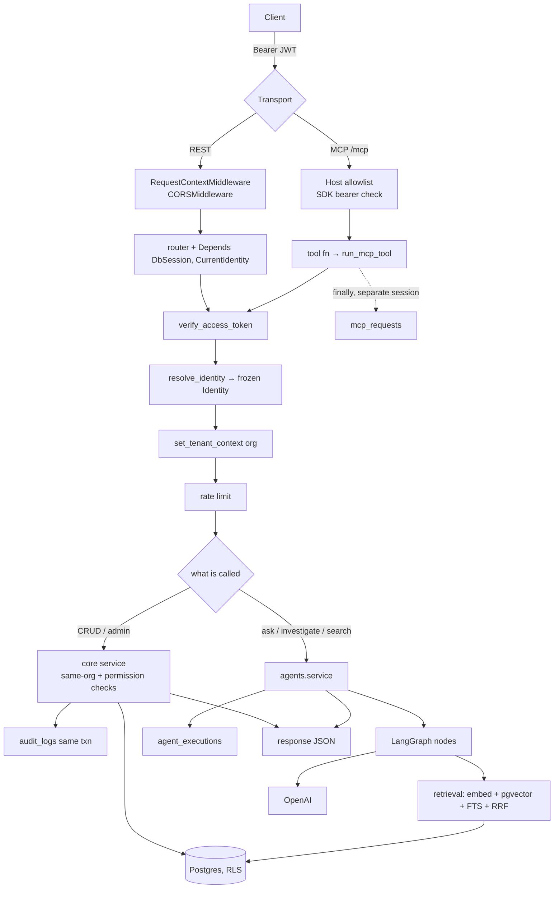

## 3.3 Every arrow explained

| Arrow | What moves | Code |
|---|---|---|
| Client → REST | HTTP request with `Authorization: Bearer <jwt>` | `frontend/src/api/client.ts::apiRequest` adds the header from `tokenStore.getAccessToken()` |
| Client → MCP | JSON-RPC over HTTP to `/mcp` with bearer | the SDK's streamable-HTTP transport |
| REST middleware | request id bound to structlog contextvars; CORS headers | `app/api/middleware.py::RequestContextMiddleware.dispatch`; `CORSMiddleware(allow_origins=settings.cors_allowed_origins, allow_credentials=True)` |
| MCP transport security | rejects unknown `Host` with 421 | `scripts/run_mcp_server.py::build_allowed_hosts` → `TransportSecuritySettings` |
| MCP bearer middleware | `401 + WWW-Authenticate` if the token doesn't verify, so Claude starts OAuth discovery | `EkipOAuthProvider.load_access_token` (calls `verify_access_token`) |
| → Authentication | raw token string → `TokenClaims` | `core/auth/service.py::verify_access_token` |
| → Identity | claims + session → `Identity` | `core/users/service.py::resolve_identity` |
| → Tenant context | `set_config('app.current_organization_id', org, true)` | `app/database/session.py::set_tenant_context` |
| → Rate limit | token-bucket acquire, raise `RateLimitedError` (429) | `app/api/rate_limit.py`, `app/mcp/rate_limit.py` |
| → Dispatch | one call into core/agents with `(session, identity, ...)` | routers; `app/mcp/dispatch.py::run_mcp_tool` |
| core → DB | SQLAlchemy statements; RLS silently scopes rows | `app/core/*/repository.py` |
| agents → retrieval | query string + `SearchFilters` | `app/agents/retrieval/node.py` |
| retrieval → DB | vector + FTS SQL, joined to `documents` | `app/retrieval/pgvector/store.py` |
| agents → OpenAI | LangChain messages; untrusted evidence fenced | `app/agents/llm.py::get_llm`, `app/agents/prompt_safety.py::build_messages` |
| API → Redis | `enqueue_job("run_ingestion_job_task", id)` | `app/api/routers/tenancy.py::sync_connector` |
| Redis → worker | job popped from `arq:queue:ingestion` | `app/ingestion/workers/main.py::WorkerSettings` |
| worker → external APIs | httpx calls with decrypted credential | each connector's `authenticate`/`fetch_batch` |
| worker → DB | documents, metadata, chunks+embeddings, job progress, checkpoint | `app/ingestion/service.py` |

## 3.4 Component responsibilities

For each component: **enters / leaves / called by / calls / fails how / security / errors handled where.**

**Frontend (`frontend/`)**
- Enters: user actions. Leaves: REST calls. Called by: browser. Calls: backend `API_BASE_URL` (`VITE_API_BASE_URL`, default `http://localhost:8000`).
- Security: keeps the access token **in memory**, the refresh token in **`localStorage`** (`ekip.refresh_token`) (`frontend/src/context/tokenStore.ts`). A 401 on a request that carried a token clears the session (`clearSessionAndNotifyExpired`). Frontend permission checks are UX only; the backend is authoritative (`docs/PROJECT_STATUS.md` "Important context").
- Mock mode: `USE_MOCK_DATA` is **true unless `VITE_USE_MOCK_DATA === "false"`** (`frontend/src/api/config.ts`). [CODE VERIFIED] A build that forgets this env var runs against mock data.

**REST API layer (`app/api`)**
- Enters: HTTP. Leaves: JSON. Calls: `core/*`, `agents/*`, `app.database.session`. Must not import `app.mcp`/`app.ingestion` (import-linter).
- Fails: `EKIPError` → mapped by `ekip_error_handler` to `status_hint` + `{error_code, message, detail}`; any other exception → 500. Redis unavailable → only queue endpoints 503.

**MCP layer (`app/mcp`)**
- Enters: MCP tool/resource/prompt calls. Leaves: JSON-serializable dicts/lists. Calls: `core/*`, `agents/*`. Must not import `app.database`, `app.retrieval`, `app.ingestion` directly; gets DB access through **injected** `session_factory` and `set_tenant_context` (set by `scripts/run_mcp_server.py`).
- Fails: `run_mcp_tool` logs the failure to `mcp_requests` (status from `EKIPError.status_hint` or 500) and re-raises.

**Authentication (`app/core/auth`)**
- Enters: tokens, passwords, OIDC codes. Leaves: `SessionTokens` (access JWT + opaque refresh token), `TokenClaims`, or `OrganizationSelectionRequired`.
- Security: bcrypt passwords; SHA-256-hashed refresh tokens with family-based reuse detection; PKCE S256; `redirect_uri` origin must be in `cors_allowed_origins`; ID-token signature verified against JWKS with `aud`/`iss` checks.

**Authorization (`app/core/users/service.py` + `Identity`)**
- `authorize`/`require_permission`/`require_project_permission` are **pure set-membership checks** on the pre-resolved `Identity`. No DB access. Denials raise `PermissionDeniedError` (403) and log `permission_denied`.

**Services / core business logic (`app/core/*`)**
- Pattern in every module: `service.py` (rules + authorization) → `repository.py` (SQL) → ORM models in `app/database/models`. Sessions are **passed in, never opened** (except in workers/scripts via `session_scope`). Return Pydantic schemas, never ORM rows.

**Agents (`app/agents`)**
- `service.py` is the public facade: `answer_question`, `triage_incident`, `generate_postmortem`, `search_similar_incidents`, `search_recent_changes`, `get_question_history`, `detect_knowledge_gaps`, `list_gap_reports`, `dismiss_gap_report`, `get_agent_execution_stats`.
- Two-tier failure policy: `EKIPError` → mark execution failed and re-raise; unexpected exception → mark failed and return a generic apologetic `AskResponse(confidence=0.0)`.

**Retrieval (`app/retrieval`)**
- Storage-agnostic facade: `search`, `search_with_signals`, `upsert`, `delete`. Knows nothing about identities; the caller passes `SearchFilters`.

**Database (`app/database`)**
- Leaf module (imports nothing from `core/agents/mcp/ingestion/retrieval`). Engine, sessions, `set_tenant_context`, ORM models, migrations.

**Background jobs / Redis (`app/*/workers`, `app/shared/redis_settings.py`)**
- Two arq workers with distinct queue names (a test enforces this: `tests/ingestion/test_worker_settings.py::test_workers_do_not_share_a_queue`).

**Connectors / ingestion (`app/ingestion`)**
- `Connector` protocol: `authenticate`, `fetch_batch`, `normalize`, `close`, plus `source_name`, `requests_per_second`, `supports_resume_token`. 14 registered in `_CONNECTOR_REGISTRY`.

**Embeddings / retrieval / RAG** — see Part 12.

**LangGraph** — see Part 13.

**External identity providers**
- OIDC via discovery document `{issuer}/.well-known/openid-configuration` (cached 1 hour in-process), token endpoint, JWKS. Providers typed as `entra_id | okta | auth0 | google_workspace`. [DOCUMENTATION VERIFIED] Not tested against a live IdP (module docstring of `core/auth/service.py`). SAML is accepted by the schema (`SSOProtocol = Literal["oidc","saml"]`) but **[NOT IMPLEMENTED]**.

**Audit logging** — `core.audit` (see 1.20).

**Configuration** — `Settings` (pydantic-settings, `.env`, case-insensitive), cached by `get_settings()` (`lru_cache`).

**Secrets** — `app/shared/security`: `encrypt_secret`/`decrypt_secret` over a `KeyManagementService` (`LocalKeyManagementService` with `CONNECTOR_SECRET_MASTER_KEY`, or `AzureKeyVaultKeyManagementService`). Production refuses `kms_provider=local` at settings-load time.

**Deployment** — Dockerfile (one image, multiple entrypoints), docker-compose, Railway (`railway.*.json`), Render (`render.yaml`, workers only), Cloudflare Containers (`cloudflare/backend`, API only), Azure Bicep (`infra/main.bicep`, never deployed per docs). See Part 18.

---

# PART 4 — Repository Map

## 4.1 Tree (derived from the actual repository)

Counts and names come from directory listings of the repository. `…` means "more files of the same kind, listed in the relevant Part".

```
mcp-logs/                                   (EKIP)
├── README.md                               project overview, local dev, testing, deployment pointers
├── pyproject.toml                          source of truth for Python deps + ruff/mypy/pytest + import-linter contracts
├── uv.lock                                 locked dependency graph (mcp 2.0.0, langgraph 1.2.9, fastapi 0.139.2, ...)
├── requirements.txt / requirements-dev.txt "mirror" of pyproject for tooling (OUT OF SYNC, see Part 24)
├── alembic.ini                             Alembic config; script_location = app/database/migrations
├── Dockerfile                              multi-stage image: uv sync, bake models, non-root user, tini, uvicorn CMD
├── docker-compose.yml                      local stack: postgres(pgvector) + redis + migrate + backend + worker + frontend
├── docker-compose.real-test.yml            small compose file for real-test runs
├── .env.example / .env.docker.example / .env.railway.example   env templates (no real secrets)
├── .gitleaks.toml                          secret-scanning config used by CI
├── .dockerignore / .gitignore
├── railway.backend.json / railway.mcp.json / railway.ingestion-worker.json / railway.agents-worker.json
├── render.yaml                             Render blueprint for the two workers
├── EKIP_CODE_READING_ROADMAP.md            (157 KB) earlier, author-written reading roadmap
├── EKIP_STRATEGIC_ANALYSIS.md              strategic review / proposed priorities
├── EKIP_TENANT_ISOLATION_SECURITY_REVIEW.md  the security review that drove RLS + ekip_app
├── check_*.py, clear_stuck_*.py, get_arq_job_*.py, list_*_connectors.py, find_ragflow_connectors.py,
│   create_incidents_connector.py, test_direct_enqueue.py   ~30 one-off operational/debug scripts (root)
├── Claude outputs/get_arq_job_results.py   near-duplicate of root get_arq_job_results.py (leftover)
├── _to_delete/sitecustomize.py.diagnostic  temporary diagnostic, self-described "safe to delete"
├── .claude/ (launch.json, settings.json)   local editor/assistant config
├── .github/workflows/
│   ├── ci.yml                   gitleaks + backend pytest + import-linter + deterministic eval + frontend checks
│   ├── rls-security.yml         real Postgres, migrations as admin, verify_rls_isolation.py as ekip_app
│   ├── e2e-and-eval.yml         Playwright E2E + live AI evaluation (needs OPENAI_API_KEY)
│   ├── main-extra.yml           empty-DB migration validation, alembic check, Docker builds
│   └── deploy-cloudflare.yml    Cloudflare deployment workflow
├── app/
│   ├── __init__.py              limits native math threads before numpy/torch import
│   ├── shared/                  cross-cutting: config, schemas (Identity...), security, rate limiters, redis settings
│   │   ├── config/  settings.py logging.py tracing.py native_runtime.py
│   │   ├── schemas/ identity.py common.py agent_contracts.py
│   │   ├── security/ envelope.py kms.py tokens.py
│   │   └── backoff.py rate_limiter.py distributed_rate_limiter.py redis_settings.py
│   ├── database/                leaf infrastructure module
│   │   ├── session.py           engine, session factory, get_db_session, session_scope, set_tenant_context
│   │   ├── models/              10 model files (~30 tables)
│   │   └── migrations/          base.py (real env), env.py (shim), script.py.mako, versions/ (24 revisions)
│   ├── core/                    transactional domain
│   │   ├── exceptions.py        EKIPError hierarchy with status_hint
│   │   ├── auth/                login (SSO/PKCE, password), tokens, refresh rotation, org selection
│   │   ├── users/               Identity resolution, RBAC checks, admin role bootstrap
│   │   ├── tenancy/             orgs, projects, SSO config, connectors, access rules, invitations, provisioning
│   │   ├── audit/               audit_logs write/read
│   │   ├── incidents/           incidents, timeline, postmortems (system of record)
│   │   ├── knowledge/           proposed/published documents, review queue
│   │   ├── memory/              per-user/project/org agent memory with vector recall
│   │   ├── graph/               derived knowledge-graph edges with authorized traversal
│   │   ├── proactive/           deterministic pattern detectors → findings
│   │   ├── privacy/             data-subject deletion plan/execute
│   │   ├── observability/       mcp_requests write + dashboards
│   │   └── mcp_oauth/           persistent OAuth client registry for the MCP server
│   ├── retrieval/               storage-agnostic search library
│   │   ├── service.py embedding.py schemas.py
│   │   ├── interfaces/base.py   VectorStore Protocol
│   │   ├── pgvector/store.py    the only implementation
│   │   ├── ranking/fusion.py    reciprocal rank fusion
│   │   └── qdrant/__init__.py   EMPTY placeholder
│   ├── ingestion/
│   │   ├── service.py           run_ingestion_job / reindex / dead-letter, the job loop
│   │   ├── repository.py schemas.py url_safety.py office_extraction.py
│   │   ├── connectors/          base.py + 14 connectors
│   │   ├── processors/          cleaning, metadata/hash, chunking, pipeline
│   │   └── workers/             arq WorkerSettings + tasks
│   ├── agents/
│   │   ├── graph.py service.py llm.py confidence.py retry.py prompt_safety.py
│   │   ├── cost_budget.py telemetry.py repository.py schemas.py
│   │   ├── retrieval/           Retrieval Agent node: rewriting, reranking, context assembly
│   │   ├── answer/              Answer Agent node: sufficiency, generation, grounding, citations
│   │   ├── investigation/       evidence, hypothesis, critique, node, live/ (GitHub, Slack, monitoring stub)
│   │   ├── postmortem/          timeline → root cause → action items pipeline
│   │   ├── knowledge_gap/       clustering + pipeline + repository
│   │   └── workers/             agents arq worker (scheduled scans)
│   ├── mcp/
│   │   ├── servers/server.py main.py   MCPServer instance, injected deps, tool registration
│   │   ├── auth.py dispatch.py rate_limit.py
│   │   ├── oauth/provider.py    OAuth 2.1 bridge for Claude's remote connector
│   │   ├── tools/ (10)  resources/ (2)  prompts/ (2)
│   │   └── repository.py schemas.py     intentionally empty (explanatory docstrings)
│   ├── api/
│   │   ├── main.py deps.py errors.py middleware.py rate_limit.py
│   │   └── routers/ (13)        ask auth graph health incidents insights knowledge memory
│   │                            observability postmortems tenancy(+admin_router) users
│   └── evaluation/              offline evaluation harness (not a runtime dependency)
├── scripts/
│   ├── run_api_server.py run_mcp_server.py run_ingestion_worker.py run_knowledge_gap_scan.py
│   ├── verify_rls_isolation.py rls_isolation_test.py migration_status.py diagnose_db_connection.py
│   ├── seed_test_organization.py e2e_seed.py bake_models.py deploy.sh
│   ├── eval_confidence.py eval_embedding_models.py run_evaluation.py run_semantic_evaluation.py
│   ├── annotate_semantic_cases.py real_e2e_quality.py run_real_e2e.ps1 prune_vendored_documents.py
│   ├── test_connectors.py test_milestone6.py   manual smoke tests (not pytest)
│   ├── live_connector_tests/    pytest suites against real third-party APIs
│   ├── live_mcp_tests/          pytest suites against a running MCP server (incl. OAuth + restart survival)
│   ├── realworld_onboarding/    01..10 numbered end-to-end onboarding/security scripts + common/
│   └── *.json                   eval datasets and reports
├── tests/                       ~180 pytest files, fully mocked (no real DB/Redis)
│   ├── conftest.py              resets in-process rate limiters between tests
│   ├── api/ core/ agents/ ingestion/ retrieval/ mcp/ database/ shared/ evaluation/
│   ├── ingestion_retrieval/     live-ish pipeline tests + README
│   ├── rag_validation/          live RAG validation harness
│   └── real_e2e/                fixture repo for real E2E quality runs
├── frontend/                    React + TS + Vite SPA, Tailwind, Playwright e2e, nginx Dockerfile
├── infra/main.bicep             Azure IaC (Key Vault, Postgres Flexible, Redis, Container Apps, migrate job)
├── cloudflare/backend/          Cloudflare Containers Worker that fronts the API image
└── docs/                        Architecture, PROJECT_PLAN, PROJECT_STATUS, DB design, decisions, operations/*
```

## 4.2 Directory-by-directory

For each: **purpose · why it exists · who depends on it · what it depends on · kind.**

### `app/shared/`
- **Purpose:** things every module needs but that have no business meaning: settings, logging, tracing, the `Identity` type, domain vocabularies (`Severity`, `IncidentStatus`, ...), security primitives, rate limiters, Redis settings.
- **Why:** avoids every module importing `core/` just for a type or a helper.
- **Depended on by:** everything. **Depends on:** third-party libs only.
- **Kind:** runtime.

### `app/database/`
- **Purpose:** engine/session lifecycle, `set_tenant_context`, ORM models, migrations.
- **Why:** one place that owns persistence mechanics; "database is a leaf module" contract.
- **Depended on by:** `core`, `agents`, `retrieval`, `ingestion`, `api`, scripts. **Not** by `mcp` (forbidden).
- **Kind:** runtime + migration code.

### `app/core/`
- **Purpose:** transactional domain logic and authorization for auth, users, tenancy, audit, incidents, knowledge, memory, graph, proactive, privacy, observability, mcp_oauth.
- **Depended on by:** `api`, `mcp`, `agents`, `ingestion` (ingestion calls `core.tenancy.service`). **Depends on:** `database`, `shared`, `retrieval` (knowledge publish/purge, memory embedding), and lazily `agents` (`trigger_postmortem_generation`).
- **Forbidden:** `core` → `mcp`, `ingestion`.
- **Kind:** runtime.

### `app/retrieval/`
- **Purpose:** embedding + vector/lexical search + fusion.
- **Depended on by:** `agents`, `ingestion`, `core` (knowledge, memory). **Forbidden:** → `agents`, `core`, `mcp`, `ingestion`.
- **Kind:** runtime.

### `app/ingestion/`
- **Purpose:** connectors, processing pipeline, job execution, workers.
- **Depended on by:** worker entrypoint only (API enqueues by *function name string*, not import). **Forbidden:** → `agents`, `mcp`.
- **Kind:** runtime (worker process).

### `app/agents/`
- **Purpose:** LangGraph Q&A/investigation graph, postmortem and knowledge-gap pipelines, agent telemetry and cost budget, agents worker.
- **Depended on by:** `api`, `mcp`, `core.incidents` (lazy import). **Forbidden:** → `mcp`, `ingestion`.
- **Kind:** runtime.

### `app/mcp/`
- **Purpose:** MCP server, OAuth bridge, tool/resource/prompt handlers, dispatch plumbing.
- **Depended on by:** `scripts/run_mcp_server.py`. **Forbidden direct imports:** `app.database`, `app.retrieval`, `app.ingestion` (indirect allowed).
- **Kind:** runtime (MCP process).

### `app/api/`
- **Purpose:** FastAPI app, routers, deps, error mapping, middleware, API rate limiting.
- **Forbidden:** → `mcp`, `ingestion`.
- **Kind:** runtime (API process).

### `app/evaluation/`
- **Purpose:** offline, deterministic evaluation of retrieval/grounding/confidence/investigation with fixtures and canned LLM generations; plus a "semantic" benchmark with human annotations.
- **Depended on by:** `scripts/run_evaluation.py` (CI regression gate), `scripts/run_semantic_evaluation.py`, tests. Not imported by runtime code [DOCUMENTATION VERIFIED, package docstring].
- **Kind:** tooling/test infrastructure.

### `scripts/`
- **Purpose:** process entrypoints (`run_*`), security verification, seeding, diagnostics, evaluations, live test suites, onboarding harness.
- **Kind:** mix of runtime entrypoints (`run_api_server.py`, `run_mcp_server.py`, `run_ingestion_worker.py`), tooling, and live tests.

### repository-root `check_*.py` / `clear_stuck_*.py` / etc.
- **Purpose:** one-off diagnostics written during specific incidents (hardcoded connector/job ids, e.g. `9b336f44-...`). Some are interactive and destructive in Redis (e.g. `clear_stuck_mcp_logs_lock.py` deletes three keys after typed confirmation).
- **Kind:** **operational leftovers**. Not imported by anything. Treat as historical debugging artifacts, not part of the product. [CODE VERIFIED by reading several headers]

### `tests/`
- **Purpose:** fully mocked unit/integration tests (no real DB/Redis; `README.md`: "backend (fully mocked — no real DB/Redis needed)").
- **Kind:** test code.

### `frontend/`
- **Purpose:** the web UI (auth, dashboard, ask/chat, incidents, knowledge review, knowledge gaps, connectors, search, MCP tool stats, audit, settings for org/project/users/SSO/access rules/connectors).
- **Kind:** runtime (separate deployable) + Playwright E2E tests in `frontend/e2e/`.

### `infra/`, `cloudflare/`, `railway.*.json`, `render.yaml`, `docker-compose*.yml`, `Dockerfile`
- **Purpose:** deployment definitions for five different targets. Part 18.
- **Kind:** deployment code.

### `docs/`
- **Purpose:** architecture, plans, status log, database design, decisions, agent workflows, memory/graph/proactive/critique designs, operations runbooks (CI, deployment variants, migration recovery, Neon recovery, security incidents, rollback, observability, reliability, RBAC audit, SECURITY DEFINER audit, go-live runbook, production certification).
- **Kind:** documentation. **Caveat:** several docs are running logs with stale top sections (Part 24).

---

# PART 5 — File-by-File Development History / Reading Order

## 5.1 How this order was derived

This is **not** alphabetical. It reconstructs "if I were building EKIP from scratch, in what order would each file have to exist, and in what order does understanding one unlock the next?" Three pieces of evidence shaped it:

1. **The Alembic chain** is a literal, timestamped history of the schema:
   `be0234931e65` (initial, 2026-08-01) → `f8698cb5abae` (Milestones 5–6: retrieval/ingestion/agents tables, 2026-08-02) → `a1c3e9f2b7d4` (Milestone 9: knowledge gaps) → `c7d4e8f19a2b` (Milestone 10: RLS) → `d2e5f8a3c1b6` (RLS bypass functions) → `e3f6a1b8d4c9` (mcp_requests) → `b4c7e2a9f5d1` (oauth_clients) → `c8f1a4d7e2b3` (password auth) → … → `b8f3d6a1c4e7` (`ekip_app` role) → `c5e2a9f4d7b3` → `f1a2b3c4d5e6` (memory) → `a7b8c9d0e1f2` (graph) → `b1c2d3e4f5a6` (proactive) → `c2d3e4f5a6b7` → `d4e5f6a7b8c9` (incidents_chunks) → `f6a7b8c9d0e1` (multi-org) → `f3e7c05b146e` → `a4c8e1f3b6d2` (head). [CODE VERIFIED]
2. **Docstrings** that say so explicitly: `settings.py` says "This is the first implementation file in the project, deliberately"; many files reference "task #N" and "Milestone N".
3. **Import dependencies**: a file can only be understood after the files it imports.

## 5.2 The ordered list (with the dependency chain for each)

Format: **PREVIOUS KNOWLEDGE → CURRENT FILE → NEW CONCEPT → FILES UNLOCKED.** Part 6 has the detailed entry for each step.

| Step | Current file(s) | Previous knowledge needed | New concept | Unlocks |
|---|---|---|---|---|
| 01 | `pyproject.toml` | none | dependency set; **module boundaries as import-linter contracts** | every module (you now know who may import whom) |
| 02 | `app/shared/config/settings.py` | 01 | typed env config, fail-fast validators, `get_settings()` cache | session.py, llm.py, auth, workers, MCP |
| 03 | `app/__init__.py`, `app/shared/config/native_runtime.py` | 02 | process-level runtime tuning before numpy import | embedding/reranking memory behavior |
| 04 | `app/shared/config/logging.py`, `tracing.py` | 02 | structlog contextvars, OTel spans | every `logger.*`, middleware, dispatch |
| 05 | `app/database/session.py` | 02, 04 | async engine, session lifecycle, **`set_tenant_context` (RLS GUC)** | every repository, deps.py, workers, MCP injection |
| 06 | `app/database/models/*.py` | 05 | the schema as Python; single `Base` | repositories, migrations |
| 07 | `alembic.ini`, `migrations/base.py`, `env.py`, `be0234931e65_initial_schema.py` | 05, 06 | versioned schema; migration vs runtime DB URL | all later migrations |
| 08 | `app/shared/schemas/common.py`, `identity.py` | 01 | **`Identity`**: the one security object; vocabularies | every service signature |
| 09 | `app/core/exceptions.py` | 08 | domain errors with `status_hint` → one mapping for REST and MCP | errors.py, dispatch.py, every service |
| 10 | `app/core/audit/*` | 05, 08, 09 | same-transaction audit writes | every mutating service |
| 11 | `app/core/users/repository.py`, `service.py` | 05, 06, 08, 09 | **`resolve_identity`**, `require_permission`, project overrides, admin role | auth, deps.py, mcp/auth.py, every service |
| 12 | `app/core/tenancy/*` | 10, 11 | orgs/projects, SSO config, connectors, access rules, invitations, provisioning policy | auth, ingestion, admin routes |
| 13 | `app/shared/security/*` | 02 | envelope encryption, KMS abstraction, opaque token hashing | tenancy.register_connector/configure_sso, auth, ingestion, mcp_oauth |
| 14 | `app/core/auth/*` | 11, 12, 13 | **authentication**: OIDC+PKCE, passwords, JWTs, refresh rotation, org selection | deps.py, mcp/auth.py, OAuth bridge |
| 15 | `app/core/incidents/*` | 10, 11, 12 | incidents, timeline, postmortems; project-scoped permissions | agents (triage, postmortem), MCP resources |
| 16 | `f8698cb5abae` migration, `retrieval_models.py`, `ingestion_models.py` | 07 | pgvector, `tsvector`, chunk tables, documents/versions | retrieval, ingestion |
| 17 | `app/retrieval/schemas.py` | 16 | `SearchFilters`, `UpsertChunk`, `ScoredChunk`, `HybridSearchResult` | store, service, agents |
| 18 | `app/retrieval/embedding.py` | 02 | local embeddings, normalized vectors, executor + timeout | store/service, grounding, memory |
| 19 | `app/retrieval/interfaces/base.py`, `pgvector/store.py` | 16–18 | dense `<#>` + lexical `ts_rank_cd`, hard filters, JOIN documents | retrieval service |
| 20 | `app/retrieval/ranking/fusion.py`, `app/retrieval/service.py` | 19 | **RRF**, hybrid search facade, signals | agents, ingestion, knowledge |
| 21 | `app/ingestion/connectors/base.py`, `app/ingestion/schemas.py` | 17 | Connector protocol, RawDocument, FetchResult, cursors/resume tokens | every connector, service |
| 22 | `app/ingestion/processors/*` | 21 | clean → hash → metadata → classify → chunk | service |
| 23 | `app/ingestion/repository.py`, `service.py` | 12, 13, 20–22, 05 | the job loop, checkpoints, retries, versioning, RLS bootstrap | workers |
| 24 | `app/ingestion/connectors/github.py`, `slack.py`, … | 21 | real source integrations, SSRF guard | service registry |
| 25 | `app/shared/rate_limiter.py`, `distributed_rate_limiter.py`, `redis_settings.py`, `backoff.py` | 02 | token buckets (in-process vs Redis/Lua), resilient Redis, jitter | ingestion, api rate limits, workers |
| 26 | `app/ingestion/workers/main.py`, `tasks.py` | 23, 25 | arq worker, queue names, locks, retry/dead-letter, cron reconciliation | API sync endpoints |
| 27 | `app/agents/llm.py`, `retry.py`, `prompt_safety.py` | 02 | LLM client, per-node retries, prompt-injection fencing | every agent node |
| 28 | `app/agents/graph.py` | 08, 17 | **LangGraph state + wiring** | all nodes, service |
| 29 | `app/agents/retrieval/*` | 20, 27, 28 | query rewriting, reranking, context budget, signal seeding | confidence |
| 30 | `app/agents/confidence.py` | 29 | **confidence score + routing threshold** | answer/investigation branch |
| 31 | `app/agents/answer/*` | 27, 30 | sufficiency → generation → grounding → citations | AskResponse |
| 32 | `app/agents/investigation/*` | 15, 20, 27 | evidence → hypotheses → bounded critique; live sources | triage |
| 33 | `app/agents/service.py`, `telemetry.py`, `cost_budget.py`, `repository.py` | 28–32 | public agent facade, execution records, token/cost tracking | api/ask, MCP tools |
| 34 | `app/agents/postmortem/*` (+ `core.incidents.service.trigger_postmortem_generation`) | 15, 33 | linear LLM pipeline, agents never write core tables | postmortem routes/tool |
| 35 | `app/agents/knowledge_gap/*`, `app/agents/workers/*`, `a1c3e9f2b7d4` | 33, 25 | clustering repeated low-confidence questions; scheduled agents worker | knowledge/gaps routes |
| 36 | `c7d4e8f19a2b` (RLS), `d2e5f8a3c1b6` (bypass functions) | 05, 07 | **Row-Level Security**, fail-closed GUC, SECURITY DEFINER narrow bypass | every "chicken-and-egg" lookup |
| 37 | `app/api/errors.py`, `middleware.py`, `deps.py` | 09, 11, 14, 05 | FastAPI DI: `DbSession`, `CurrentIdentity`; request correlation | every router |
| 38 | `app/api/main.py`, `rate_limit.py` | 37, 25 | app factory, lifespan-owned arq pool, CORS, distributed rate limits | routers |
| 39 | `app/api/routers/*` | 38 + services | REST surface | frontend |
| 40 | `app/core/observability/*`, `mcp_models.py`, `e3f6a1b8d4c9` | 05 | MCP request logging via core (mcp can't touch DB) | dispatch.py |
| 41 | `app/mcp/servers/server.py` | 02, 09 | MCPServer, **dependency inversion** for DB access, bearer extraction | tools, dispatch, OAuth |
| 42 | `app/mcp/auth.py`, `rate_limit.py`, `dispatch.py` | 11, 14, 40, 41 | the MCP request pipeline in one function | every tool |
| 43 | `app/mcp/tools/*`, `resources/*`, `prompts/*`, `servers/main.py` | 42, 33, 12, 15 | thin tool handlers, registration by import | run script |
| 44 | `scripts/run_mcp_server.py` | 41–43 | process entrypoint, injection, allowed hosts, transport | deployment |
| 45 | `app/mcp/oauth/provider.py`, `app/core/mcp_oauth/*`, `b4c7e2a9f5d1` | 14, 41 | OAuth 2.1 authorization server as a bridge to existing tokens | Claude connector |
| 46 | `c8f1a4d7e2b3`, `1269a7b553a9`, `b8f3d6a1c4e7`, `c5e2a9f4d7b3`, `f6a7b8c9d0e1`, `d706a360fc2a`, `f3e7c05b146e` | 36, 14 | password auth, invitation tokens, **`ekip_app` NOSUPERUSER/NOBYPASSRLS**, multi-org bootstrap functions, permission backfills | RLS actually meaning something |
| 47 | `scripts/verify_rls_isolation.py`, `.github/workflows/rls-security.yml` | 36, 46 | proving isolation with real Postgres | CI gate |
| 48 | `app/core/knowledge`, `memory`, `graph`, `proactive`, `privacy` + migrations `f1a2b3c4d5e6`, `a7b8c9d0e1f2`, `b1c2d3e4f5a6`, `a4c8e1f3b6d2` | 11, 15, 20, 36 | later "Priority" features, each RLS-covered from birth | routers memory/graph/insights/users |
| 49 | `app/evaluation/*`, `scripts/run_evaluation.py`, `scripts/eval_confidence.py` | 29–31 | offline deterministic evaluation, CI regression gate | CI |
| 50 | `tests/*` (key files) | all | what is actually asserted | confidence in changes |
| 51 | `Dockerfile`, `docker-compose.yml`, `railway.*.json`, `render.yaml`, `cloudflare/*`, `infra/main.bicep`, CI workflows | all | how it runs outside a laptop | operations |
| 52 | `frontend/src/api/*`, `context/*`, `routes/*` | 39 | how the UI consumes the API | end-user flows |

## 5.3 Why this order and not another

- **Settings before the database**: `session.py` calls `get_settings()` at import time to build the engine.
- **Identity before any service**: every `core` and `agents` public function takes `actor: Identity`.
- **Users before auth**: `core.auth` delegates "turn a token into permissions" to `core.users.resolve_identity`, and "who may join" to `core.tenancy.evaluate_provisioning`. Auth only verifies.
- **Retrieval before ingestion**: ingestion calls `retrieval.service.upsert` to embed and store; retrieval does not know ingestion exists (import-linter forbids it).
- **Agents after retrieval and incidents**: nodes call `retrieval.service` and `core.incidents.service`.
- **RLS after the tables exist**: the migration history shows RLS arrived as Milestone 10 *after* the core features, which is why so many functions have "Milestone 10 RLS note" docstrings that retrofit `set_tenant_context` calls.
- **MCP after REST-shaped services**: MCP tools are thin wrappers over services that already existed.
- **`ekip_app` after RLS**: RLS policies were inert until the app stopped connecting as a `BYPASSRLS` owner role; the role migration came later (see migration `b8f3d6a1c4e7` docstring).

---

# PART 6 — Every Important File

**Format.** The most load-bearing files get the full 13-section treatment. Files that are variations on a pattern already explained (e.g. the 14 connectors, 13 routers, 10 MCP tools) get a grouped entry that states what differs. Every entry starts with its dependency chain.

---

### Step 01 — `pyproject.toml`

**Chain:** *(nothing)* → `pyproject.toml` → dependency set + module-boundary contracts → every module.

#### 1. Why does this file exist?
It is the single source of truth for Python dependencies (`[project.dependencies]`), dev tools (`[project.optional-dependencies].dev`), tool config (ruff, mypy strict, pytest `asyncio_mode = "auto"`), and, most importantly for architecture, the **import-linter contracts** that turn the modular-monolith design into a CI-checked rule.

#### 2. Why was it created at this point?
Nothing can be installed or tested without it. The contracts encode `docs/Architecture.md` §3's "can call / cannot call" table so that boundaries don't depend on code review alone (`docs/ENGINEERING_DECISIONS.md` #001's "Tradeoffs accepted" mitigation).

#### 3. What does this file do?
*Simple:* lists libraries and says which parts of the app may import which other parts.
*Technical:* hatchling build backend packages `app`; `[tool.importlinter]` defines seven `forbidden` contracts over `root_package = "app"`.

#### 4. What does it contain?
- Runtime deps: fastapi, uvicorn, pydantic(-settings), sqlalchemy[asyncio], asyncpg, alembic, pgvector, python-jose[cryptography], passlib[bcrypt], httpx, redis, arq, pypdf, python-docx, openpyxl, langchain, langgraph, langchain-openai, sentence-transformers, qdrant-client, mcp, azure-identity, azure-keyvault-keys, opentelemetry-sdk, opentelemetry-instrumentation-fastapi, prometheus-client, structlog.
- Dev deps: pytest, pytest-asyncio, pytest-cov, ruff, mypy, import-linter.
- Contracts (verbatim names):
  1. "database is a leaf module": `app.database` ✗→ core, agents, mcp, ingestion, retrieval
  2. "retrieval library does not depend on agents, core, or mcp": `app.retrieval` ✗→ agents, core, mcp, ingestion
  3. "mcp never touches database or retrieval directly": `app.mcp` ✗→ database, retrieval, ingestion, with `allow_indirect_imports = true`
  4. "core does not depend on mcp or ingestion"
  5. "agents does not depend on mcp or ingestion internals"
  6. "ingestion does not depend on agents or mcp"
  7. "api does not depend on mcp or ingestion internals"

#### 5. Read this file in this order
1. `[project.dependencies]`, grouped by comment headers (Core API, Database, Auth, Queue, Ingestion, AI, MCP, KMS, Observability). This tells you the whole tech stack in 40 lines.
2. `[tool.importlinter]` contracts, then re-read `README.md`'s module list with them in mind.
3. Tool config last.

#### 6. Important code sections
- **Contract 3's `allow_indirect_imports = true`**: without it, `app.mcp.dispatch → app.core.users.service → app.database` would be flagged. The contract's intent is "no *direct* import", which is exactly why MCP gets its session through injection (Step 41).
- **Contract 7's comment**: `app.api` *may* import `app.database` (unlike MCP) because `get_db_session` is already a FastAPI dependency.

#### 7. Which files does this unlock?
All of them. You can now predict, for any file, what it is allowed to import.

#### 8. Which files depend on this?
Build/install (`uv sync`, Dockerfile), CI (`uv run lint-imports`, `pytest`), `uv.lock`.

#### 9. Mental model
"The constitution of the codebase": dependencies are the citizens; contracts are the separation of powers.

#### 10. What would happen if this file disappeared?
Nothing installs; CI can't enforce boundaries; the Dockerfile's `uv sync --frozen` fails.

#### 11. Common misunderstandings
- *"requirements.txt is the dependency list."* No. `requirements.txt` says itself that `pyproject.toml` is the source of truth, and it is **out of sync**: it lists `langchain-anthropic` and omits `langchain-openai` (Part 24). The Dockerfile uses `uv sync` against `uv.lock`, not `requirements.txt`.
- *"`mcp>=1.0` means MCP 1.x."* The lock pins `mcp==2.0.0`, and `app/mcp/servers/server.py` imports `mcp.server.mcpserver.MCPServer`, a 2.0-only path. The lower bound is stale.
- *"qdrant-client being present means Qdrant is used."* It isn't (Step 19).

#### 12. Interview questions
- Beginner: What does import-linter enforce here?
- Intermediate: Why is `app.api` allowed to import `app.database` but `app.mcp` isn't?
- Advanced: What does `allow_indirect_imports = true` change, and what risk does it accept?
- Why did you do this? Why enforce boundaries in a monolith at all?
- What if this fails? A developer adds `from app.database.session import session_scope` in an MCP tool: `lint-imports` fails CI.
- Security: How do import boundaries relate to security? (MCP can't bypass `core` authorization by querying tables directly.)
- Design: When would you split a module into its own service?

#### 13. Related files
`uv.lock` (resolved versions), `requirements*.txt` (stale mirror), `.github/workflows/ci.yml` (runs `lint-imports`), `docs/ENGINEERING_DECISIONS.md` #001.

---

### Step 02 — `app/shared/config/settings.py`

**Chain:** Step 01 (deps: pydantic-settings) → `Settings` → typed, validated runtime configuration → `session.py`, `llm.py`, auth, rate limits, workers, MCP.

#### 1. Why does this file exist?
Every process needs the same validated configuration: database URLs, Redis URL, OpenAI key, JWT secret, KMS mode, thresholds, limits. Its docstring says: "This is the first implementation file in the project, deliberately: almost every other module ... depends on settings being loaded correctly."

#### 2. Why was it created at this point?
Nothing can connect anywhere without it. It came before the database layer because `session.py` builds the engine from `get_settings().database_url` at import time.

#### 3. What does this file do?
*Simple:* reads environment variables (and `.env`), checks them, and exposes one cached `Settings` object.
*Technical:* `class Settings(BaseSettings)` with `SettingsConfigDict(env_file=".env", case_sensitive=False, extra="ignore")`, field-level constraints (`ge`, `le`, `gt`), and `model_validator`/`field_validator` hooks that **fail at process start** on dangerous configurations. `get_settings()` is `@lru_cache`d.

#### 4. What does it contain?
- Environment: `environment` (`development|test|production`), `log_level`.
- Tracing: `otel_exporter_otlp_endpoint`, `otel_console_exporter_enabled`.
- Database: `database_url` (required `PostgresDsn`), `database_echo`, `migration_database_url` (optional admin DSN for Alembic).
- Queue: `redis_url` (required `RedisDsn`).
- Vector: `default_vector_backend` (`"qdrant"` default, **unused**), `qdrant_url`.
- LLM: `openai_api_key` (required), `agent_llm_model` (`gpt-4o-mini`).
- Agent behavior: `confidence_threshold` (0.5, with a long provenance comment), `max_organization_cost_usd_per_day` (None = no budget).
- Memory: `memory_recall_limit` (5), `memory_relevance_threshold` (0.35), `memory_context_char_budget` (2000).
- Auth: `jwt_secret_key` (required), `jwt_algorithm` (HS256), `jwt_expiry_minutes` (60), `REFRESH_TOKEN_EXPIRY_DAYS` ClassVar 30 (**not used**: `core/auth/service.py` hardcodes `_REFRESH_TOKEN_LIFETIME = timedelta(days=30)`), `org_selection_token_expiry_minutes` (10).
- MCP: `mcp_port` (8001), `mcp_public_base_url` (`http://localhost:8001`).
- CORS: `cors_allowed_origins` (defaults to Vite dev origins).
- Investigation: `investigation_live_evidence_enabled`, `..._lookback_hours` (24), `investigation_critique_enabled`, `..._min_evidence_count` (2), `..._overconfidence_threshold` (0.75), `..._min_evidence_per_hypothesis` (2).
- Knowledge gaps: `knowledge_gap_lookback_days` (14), `..._min_cluster_size` (3), `..._similarity_threshold` (0.82).
- Ingestion: `ingestion_org_max_requests_per_second` (5.0), `ingestion_job_timeout_seconds` (7200), `ingestion_worker_max_jobs` (2), `ingestion_checkpoint_ttl_seconds` (86400), `ingestion_max_pages_per_attempt` (10000), `ingestion_max_items_per_page` (2000), `ingestion_max_document_bytes` (10 MB), `ingestion_max_chunks_per_document` (1000), `embedding_worker_threads` (1), `embedding_batch_size` (32), `agent_reranking_enabled` (True).
- KMS: `kms_provider` (`local|azure`), `azure_key_vault_url`, `azure_key_vault_key_name`, `connector_secret_master_key`.
- Validators: `_require_provider_specific_kms_settings`, `_reject_local_kms_in_production`, `_split_cors_origins`, `_reject_wildcard_origin`, `_sync_local_public_base_url_port`.

#### 5. Read this file in this order
1. The class docstring (what is deliberately *not* here: per-connector credentials).
2. Required fields (no default): `database_url`, `redis_url`, `openai_api_key`, `jwt_secret_key`. These are what a new environment must set.
3. The security validators at the bottom.
4. The `confidence_threshold` comment: it is a small history of how the threshold was (and was not) calibrated.
5. Everything else as reference.

#### 6. Important code sections
- **`_reject_local_kms_in_production`**: raises if `environment == "production"` and `kms_provider == "local"`. *Security implication:* production can't silently run with the dev KMS. *Failure case:* **`cloudflare/backend/wrangler.toml` sets `ENVIRONMENT = "production"` and `KMS_PROVIDER = "local"`**, so that deployment as committed would fail at startup [INFERRED FROM CODE]. Railway's example avoids it by using `ENVIRONMENT=development`.
- **`_reject_wildcard_origin`**: forbids `*` because `create_app` uses `allow_credentials=True`, where Starlette would reflect any origin.
- **`_split_cors_origins` + `NoDecode`**: accepts comma-separated env values; the comment records a real startup crash this fixed.
- **`database_url` description**: documents the most important operational rule in the repo: *the runtime must connect as `ekip_app` (NOSUPERUSER/NOBYPASSRLS), never an admin role, or every RLS policy is a no-op.*
- **`migration_database_url`**: lets Alembic use an admin DSN in topologies where migrations run in the same environment as the app (Railway `preDeployCommand`).
- **`get_settings()`**: `lru_cache` so tests can `cache_clear()` and monkeypatch env.

#### 7. Which files does this unlock?
`app/database/session.py`, `app/agents/llm.py`, `app/core/auth/service.py`, `app/api/main.py`, `app/api/rate_limit.py`, `app/shared/redis_settings.py`, both workers, `app/mcp/servers/server.py`, `app/retrieval/embedding.py`, `app/agents/confidence.py`.

#### 8. Which files depend on this?
Essentially every runtime module (grep for `get_settings`). Tests: `tests/shared/config/test_settings.py`.

#### 9. Mental model
"The pre-flight checklist": if a setting is dangerous, the plane never leaves the gate.

#### 10. What would happen if this file disappeared?
No process could start; every module importing `get_settings` would fail.

#### 11. Common misunderstandings
- `default_vector_backend="qdrant"` does **not** mean Qdrant is used.
- `REFRESH_TOKEN_EXPIRY_DAYS` looks configurable but isn't wired.
- `confidence_threshold=0.5` is explicitly "an honest placeholder, not a validated one" per its own comment.
- Settings are loaded **once per process** (cache). Changing env at runtime has no effect without a restart.
- `extra="ignore"` means a typo in an env var name is silently ignored, not an error.

#### 12. Interview questions
- Beginner: Where does `DATABASE_URL` come from and how is it validated?
- Intermediate: Why use `lru_cache` instead of a module-level singleton?
- Advanced: Why does `allow_credentials=True` make a wildcard CORS origin dangerous?
- Why? Why fail at startup instead of at first use?
- What if this fails? Missing `OPENAI_API_KEY`: `Settings()` raises a validation error at startup, even for the ingestion worker, which never calls OpenAI (all required fields are process-wide).
- Security: What prevents production from using the local KMS?
- Design: Should per-connector credentials live here? (No, explicitly excluded; see docstring.)

#### 13. Related files
`.env.example`, `.env.docker.example`, `.env.railway.example`, `tests/shared/config/test_settings.py`, `docs/operations/deployment.md`.

---

### Step 03 — `app/__init__.py` and `app/shared/config/native_runtime.py` (short entry)

**Chain:** Step 02 → thread-limit env vars → predictable memory use for torch/numpy.

- **Why it exists:** importing any `app.*` module runs `app/__init__.py`, which calls `limit_native_math_threads()` **before** numpy/torch are imported. It sets `OMP_NUM_THREADS`, `OPENBLAS_NUM_THREADS`, `MKL_NUM_THREADS`, `NUMEXPR_NUM_THREADS`, `VECLIB_MAXIMUM_THREADS` to `"2"` via `os.environ.setdefault` (never overrides an operator value). [CODE VERIFIED]
- **Why:** docstring: co-located model-loading processes (API + workers + MCP on one host) exhausted memory because each math library allocates per-core buffers.
- **Mental model:** "tell the math libraries to share the kitchen before they start cooking."
- **If removed:** higher memory use and possible native allocation failures when loading the embedding model and cross-encoder together.
- **Misunderstanding:** it's not a performance optimization; it's a stability guard.

---

### Step 04 — `app/shared/config/logging.py` and `tracing.py` (short entry)

**Chain:** Step 02 → structured logs + spans → correlation in middleware/dispatch/workers.

- **`configure_logging()`** sets a structlog processor chain (`merge_contextvars`, logger name, level, ISO timestamp, stack/exception formatting, **`_redact_sensitive_fields`**) and routes stdlib logs (uvicorn, sqlalchemy, arq) through the same renderer (JSON in production, console otherwise, per docstring). It quiets `sqlalchemy.engine`, `httpx`, `httpcore`.
- **`_redact_sensitive_fields`** replaces the value of any key matching `password|token|secret|api_key|apikey|authorization|credential|client_secret|private_key`, at any dict depth. A safety net, not the primary control.
- **`get_logger(name)`** is the only logging entry point.
- **Where `configure_logging()` is called:** `scripts/run_api_server.py`, `scripts/run_mcp_server.py`, `scripts/run_ingestion_worker.py`, `scripts/run_knowledge_gap_scan.py`, `app/ingestion/workers/main.py`, `app/agents/workers/main.py`. [CODE VERIFIED by grep] **`app/api/main.py` does not call it.** The Dockerfile's default `CMD ["uvicorn", "app.api.main:app", ...]` and `railway.backend.json`'s `uvicorn app.api.main:app ...` therefore start the API **without** `configure_logging()`, so structlog runs with its defaults: no redaction processor, no JSON renderer. [INFERRED FROM CODE] This is worth knowing when debugging production logs.
- **`tracing.py`:** `configure_tracing(app)` (API, called in `create_app`) and `configure_worker_tracing(name)` (workers' `on_startup`). With `OTEL_EXPORTER_OTLP_ENDPOINT` set, it imports `opentelemetry.exporter.otlp.proto.grpc...`, but **that exporter package is not in `pyproject.toml` or `uv.lock`** [CODE VERIFIED by grep of uv.lock], so setting the variable would raise `ImportError` at startup [INFERRED FROM CODE]. Default: spans are created and dropped (or printed if `otel_console_exporter_enabled`).
- **Spans in code:** `retrieval.embed` (embedding.py), `ingestion.fetch_page`, `ingestion.process_item` (ingestion/service.py), plus FastAPI auto-instrumentation.

---

### Step 05 — `app/database/session.py`

**Chain:** Steps 02, 04 → engine, sessions, **tenant context** → every repository, `deps.py`, workers, MCP injection, RLS.

#### 1. Why does this file exist?
To be the **only** place that constructs database connections and sessions, so commit/rollback/close behavior is identical everywhere, and to own the one function that tells Postgres which tenant the current transaction belongs to (`set_tenant_context`).

#### 2. Why was it created at this point?
Immediately after settings: every later module needs a session. `set_tenant_context` was added in Milestone 10 when RLS arrived (its docstring lists the call sites added then).

#### 3. What does this file do?
*Simple:* opens database sessions and makes sure they're always committed or rolled back and closed; lets code say "for this transaction, I am acting for organization X."
*Technical:* builds an `AsyncEngine` (asyncpg) at import time with `pool_pre_ping=True`, `pool_recycle=1800`, `connect_args={"ssl": <derived>, "command_timeout": 30.0}`; defines `Base(DeclarativeBase)`; exposes `async_session_factory` (`expire_on_commit=False`), `get_db_session()` (FastAPI dependency), `session_scope()` (async context manager), and `set_tenant_context(session, organization_id)`.

#### 4. What does it contain?
- Constants: `_TENANT_GUC_NAME = "app.current_organization_id"`, `_UNSUPPORTED_ASYNCPG_QUERY_PARAMS = {"sslmode","channel_binding","ssl"}`, `_SSL_DISABLED_VALUES`, `_COMMAND_TIMEOUT_SECONDS = 30.0`, `_POOL_RECYCLE_SECONDS = 1800`.
- Functions: `_normalize_database_url`, `_ssl_connect_arg`, `_build_engine(database_url=None)`, `get_db_session`, `set_tenant_context`, `session_scope`.
- Objects: `engine`, `async_session_factory`, `Base`.
- Side effect at import: logs `database_engine_created` with host and database name (never credentials).

#### 5. Read this file in this order
1. Module docstring (the "sessions never cross module boundaries" rule).
2. `_TENANT_GUC_NAME`, then jump to `set_tenant_context` and read it fully. **This is the most security-relevant function in the file.**
3. `_normalize_database_url` + `_ssl_connect_arg` (why Neon URLs "just work").
4. `_build_engine` (timeouts, pool recycle, the `database_url` override for migrations).
5. `get_db_session` / `session_scope` (why `BaseException`, not `Exception`).

#### 6. Important code sections
- **`set_tenant_context`**: executes `SELECT set_config(:guc_name, :org_id, true)`. `true` means *transaction-local* (like `SET LOCAL`): it is cleared on COMMIT/ROLLBACK, so it can't leak to the next request that reuses the pooled connection. Uses a bound parameter instead of string-building a `SET` statement (which can't take parameters). *Called by:* `app/api/deps.py::get_current_identity`, `app/mcp/dispatch.py::run_mcp_tool` (via injection), `core.users.service.resolve_identity`, `core.auth.service._issue_session`/`refresh`/`logout`/`peek_refresh_token`, `core.tenancy.service.evaluate_provisioning`/`get_organization_sso_config`/`create_organization`, ingestion's job loop (after every commit), agents worker tasks. *Security:* without it, RLS-protected queries return zero rows (fail-closed). *Subtlety:* because it is transaction-scoped, **code that commits mid-flow must call it again**: `_execute_ingestion_job` does exactly that after every `session.commit()` (comment: "SET LOCAL does not survive COMMIT").
- **`get_db_session` / `session_scope`**: `yield`, then commit; on `BaseException` rollback and re-raise; always close. `BaseException` catches `asyncio.CancelledError` (e.g. arq job timeout), which previously left transactions idle-in-transaction.
- **`_build_engine(database_url)`**: the override exists so migrations can build an engine from `migration_database_url`; the docstring records a real bug where migrations silently used the runtime role.
- **`_ssl_connect_arg`**: TLS on unless `sslmode`/`ssl` explicitly disables it (Railway private network uses `?sslmode=disable`).

#### 7. Which files does this unlock?
All `repository.py` files, `app/api/deps.py`, `app/ingestion/workers/tasks.py`, `app/agents/workers/tasks.py`, `scripts/run_mcp_server.py`, `app/database/migrations/base.py`, `app/api/routers/health.py` (uses `engine` for `/ready`).

#### 8. Which files depend on this?
Every repository; `tests/database/test_session.py` tests the GUC call's bound parameters, UUID stringification, command timeout, and SSL handling.

#### 9. Mental model
"The front desk of the database": hands out sessions, collects them back, and stamps each transaction with the tenant it belongs to.

#### 10. What would happen if this file disappeared?
No module could talk to Postgres; RLS would have no way to know the tenant.

#### 11. Common misunderstandings
- *"`set_tenant_context` is a security check."* It isn't: it *declares* the tenant; RLS policies do the checking. If the application passed the wrong org id, RLS would faithfully scope to the wrong org. The app-level `Identity` resolution is what makes the org id trustworthy.
- *"A session with no tenant context sees nothing."* True on a fresh connection (NULL GUC). On a reused pooled connection the GUC resets to `''`, and `''::uuid` **raises** instead of returning zero rows. Still fail-closed. (`scripts/verify_rls_isolation.py` documents this.)
- *"The engine connects as whatever user I want."* It connects as whatever `DATABASE_URL` says. RLS only works if that is `ekip_app`.

#### 12. Interview questions
- Beginner: What does `session_scope()` do on an exception?
- Intermediate: Why `set_config(..., true)` rather than `SET`?
- Advanced: Why must `set_tenant_context` be called again after `commit()`?
- Why? Why catch `BaseException`?
- What if this fails? DB unreachable at import: the engine object is created lazily (connections happen on first use), so import succeeds but the first query fails; `/ready` reports `database: unavailable`.
- Security: How would a tenant GUC leak across requests, and why can't it here?
- Design: Why a single shared `Base`?

#### 13. Related files
`app/database/migrations/versions/c7d4e8f19a2b_milestone_10_row_level_security.py` (reads the GUC), `app/api/deps.py`, `app/mcp/servers/server.py` (injected copy), `scripts/verify_rls_isolation.py`, `scripts/rls_isolation_test.py`.

---

### Step 06 — `app/database/models/*.py` (grouped entry)

**Chain:** Step 05 (`Base`) → ORM classes → repositories + Alembic autogenerate.

- **Why:** one file per owning module's table group, all registered on the single `Base` so Alembic sees the whole schema (`models/__init__.py` docstring).
- **Files and classes** [CODE VERIFIED]:
  - `tenancy_models.py`: `Organization`, `Project`, `SSOConfiguration`, `ExternalIdentityMapping`, `ConnectorConfig`, `ProjectMembership`, `OrganizationAccessRule`, `Invitation`
  - `core_models.py`: `User`, `Role`, `Permission`, `RolePermission`, `UserRole`, `Incident`, `IncidentTimeline`, `Postmortem`, `AuditLog`
  - `auth_models.py`: `RefreshToken`
  - `ingestion_models.py`: `IngestionJob`, `Document`, `DocumentMetadata`
  - `retrieval_models.py`: `_ChunkColumns` mixin, `_RepoScopedChunkColumns`, `DocumentationChunk`, `CodeChunk`, `ConversationChunk`, `IncidentChunk`
  - `agent_models.py`: `AgentExecution`, `KnowledgeGapReport`
  - `mcp_models.py`: `McpRequest`, `OAuthClient`
  - `memory_models.py`: `AgentMemory`
  - `graph_models.py`: `KnowledgeGraphEdge`
  - `pattern_models.py`: `ProactiveFinding`, `ProactiveFindingEvidence`
- **Read order:** tenancy → core → auth → ingestion → retrieval → agent → mcp → memory → graph → pattern (matches the migration history).
- **Important detail:** chunk tables denormalize `organization_id`, `project_id`, `acl_permission_code` so filters are single-table `WHERE`s and RLS can use a direct compare (`retrieval_models.py` docstring). `content_tsv` is a `GENERATED ALWAYS AS (to_tsvector('english', content)) STORED` column with a GIN index.
- **Mental model:** "the schema, written as Python."
- **Misunderstanding:** the models define columns, but **RLS policies, roles and SQL functions exist only in migrations**, not in the models. Autogenerate can't see them.
- **Guard test:** `tests/database/test_migration_coverage.py::test_every_model_table_has_a_creating_migration` statically scans migrations for `op.create_table('name')` for every model table (added after `mcp_requests` shipped as a model with no migration; see Step 40).
- Full table-by-table analysis: Part 7.

---

### Step 07 — `alembic.ini`, `app/database/migrations/base.py`, `env.py`, `be0234931e65_initial_schema.py`

**Chain:** Steps 05–06 → versioned schema + migration/runtime role split → every later migration.

#### 1. Why does this file exist?
To make the schema reproducible from an empty database (`alembic upgrade head`) and to run migrations as an **admin** role while the app runs as a **restricted** role.

#### 2. Why was it created at this point?
As soon as models existed. `be0234931e65` (2026-08-01) is autogenerated from the first models.

#### 3. What does it do?
- `alembic.ini`: `script_location = app/database/migrations`; `sqlalchemy.url` is a placeholder overridden at runtime.
- `env.py`: a one-line shim, `from app.database.migrations import base`. Alembic requires the filename `env.py`; the real logic lives in `base.py` (docstring explains why a rename wasn't done).
- `base.py`: imports every model module so `Base.metadata` is complete; sets `sqlalchemy.url` from `migration_database_url or database_url` (for **offline** mode); in **online** mode builds a dedicated engine from `migration_database_url` if set, else reuses the runtime `engine`.
- `be0234931e65`: creates organizations, permissions, roles, users, audit_logs, external_identity_mappings, invitations, organization_access_rules, projects, refresh_tokens, role_permissions, sso_configurations, user_roles, connector_configs, documents, incidents, project_memberships, document_metadata, incident_timeline, ingestion_jobs, postmortems.

#### 4. What does it contain?
`run_migrations_offline`, `do_run_migrations`, `run_migrations_online`; the model imports; the `config.set_main_option(...)` call with the comment about `str()` being required.

#### 5. Read this file in this order
`alembic.ini` → `env.py` (see it's a shim) → `base.py` top to bottom → skim `be0234931e65` table by table, noting FKs and `ondelete` choices.

#### 6. Important code sections
- **Online-mode engine selection** (`run_migrations_online`): the docstring records that an earlier version always used the runtime engine, "silently defeating the migration/runtime role split." Why it matters: `ekip_app` is deliberately not allowed to `CREATE ROLE`/`ALTER TABLE`/`GRANT`, so migrations must run as admin.
- **`ondelete` choices in the initial schema**: `RESTRICT` from tenant data to `organizations` (you can't delete an org with data), `CASCADE` from mappings/memberships/timeline to their parents, `SET NULL` from `connector_configs.project_id`.
- **Partial unique index** `uq_invitations_org_email_pending ... WHERE status = 'pending'`: at most one pending invitation per email per org.

#### 7–8. Unlocks / dependents
All 23 later migrations; `tests/database/test_migration_*.py`; CI `main-extra.yml` (empty DB → head, then `alembic check`), `rls-security.yml`.

#### 9. Mental model
"The schema's git history": each revision is a commit, `down_revision` is the parent pointer.

#### 10. If it disappeared
No reproducible schema; RLS, roles and SQL functions (which exist only in migrations) would be lost.

#### 11. Common misunderstandings
- The `vector` extension is **not** created in the initial migration; it is created in `f8698cb5abae`. (The `f1a2b3c4d5e6` docstring says "already enabled by the initial migration", which is inaccurate.)
- `env.py` is not where the logic is.

#### 12. Interview questions
- Why run migrations with a different DB role than the app?
- What's the difference between Alembic offline and online mode, and which one reads `sqlalchemy.url`?
- What breaks if a migration uses a variable table name? (`test_migration_coverage.py`'s static scan can't see it.)
- Security: why must `ekip_app` lack DDL privileges?

#### 13. Related files
`app/database/session.py::_build_engine`, `scripts/migration_status.py`, `docs/operations/migration-recovery.md`, `.github/workflows/main-extra.yml`.

---

### Step 08 — `app/shared/schemas/identity.py` (+ `common.py`, `agent_contracts.py`)

**Chain:** Step 01 → **`Identity`** → every `core`/`agents` signature, every authorization decision.

#### 1. Why does this file exist?
To have **one immutable object** that says who is calling, in which organization, and with which permissions, passed explicitly to every service call, so authorization is identical whether a call came from REST, MCP, a worker, or an agent.

#### 2. Why was it created at this point?
Before any service: every public service signature takes `actor: Identity`. `docs/ENGINEERING_DECISIONS.md` #004 made it organization-scoped.

#### 3. What does it do?
*Simple:* a frozen ID card: name, company, badge permissions.
*Technical:* `class Identity(BaseModel)` with `model_config = ConfigDict(frozen=True)`; fields `kind: ActorKind` (`user|service|agent`), `subject: str`, `organization_id: uuid.UUID` (**required**), `user_id`, `display_name`, `roles: tuple[str,...]`, `permissions: frozenset[str]`, `project_permissions: dict[UUID, frozenset[str]]`. Methods: `audit_tag` property (`"user:<id>"`), `has_permission(code, project_id=None)`, classmethod `for_agent(name, organization_id)`.

#### 4. What does it contain?
Also: `common.py` defines domain vocabularies (`Severity`, `IncidentStatus`, `PostmortemStatus`, `DocumentStatus`, `IngestionJobStatus`, `TriggerSource`, `AgentExecutionStatus`, `ActionItemStatus`) and `ErrorBody` (TypedDict `{error_code, message, detail}`); `agent_contracts.py` defines `AskResponse`, `Citation`, `EvidenceItem`, `RootCauseHypothesis`, `InvestigationResult`, `GapReport`.

#### 5. Read this file in this order
Module docstring → `ActorKind` → `Identity` fields (note which are required) → `has_permission` (read its docstring twice) → `for_agent`.

#### 6. Important code sections
- **`has_permission`**: if `project_id` is given **and** the identity has an override for that project, check **only** the project set (no fallback to org permissions, so a restrictive project role can actually restrict). Otherwise check the org-level set. *Security implication:* a project override can both grant and remove permissions for that project.
- **`frozen=True`**: nothing downstream can grant itself a permission mid-request.
- **`organization_id` required**: there is no "global" identity to fall back to.
- **`for_agent`**: agent identities have **no permissions** (empty frozenset). Code paths using them (ingestion worker, postmortem agent write) either don't check permissions or check them against the human actor first.

#### 7. Unlocks
`core/users/service.py` (builds it), every service (consumes it), `retrieval` callers (`SearchFilters(permission_codes=actor.permissions)`), audit (`audit_tag`).

#### 8. Dependents
Everything. Tests: `tests/core/users/*`, `tests/core/memory/test_authorization.py` (agent identity with no user_id).

#### 9. Mental model
"A laminated badge, printed once at the door (token verification + role lookup), shown at every room."

#### 10. If it disappeared
Every signature changes; authorization would have to re-query the DB at each check or trust raw tokens.

#### 11. Common misunderstandings
- `Identity` is **not** the JWT. The JWT carries only `sub` and `organization_id`; roles/permissions are loaded from the DB per request.
- Permissions are **not** refreshed mid-request; but because they're loaded per request, a role change takes effect on the next request, not at token expiry.

#### 12. Interview questions
- Why make `Identity` immutable?
- Why is `organization_id` required?
- Walk through `has_permission` with and without a project override.
- Security: what happens if an agent identity reaches a `require_permission` check? (Denied: empty permissions.)
- Design: why not put permissions in the JWT?

#### 13. Related files
`app/core/users/service.py`, `app/core/users/repository.py::get_project_permission_map`, `app/core/audit/service.py`.

---

### Step 09 — `app/core/exceptions.py`

**Chain:** Step 08 (`ErrorBody`) → typed domain errors with HTTP semantics → `api/errors.py`, `mcp/dispatch.py`, every service.

- **Why:** services must signal "not found / forbidden / conflict / bad input / rate limited / budget exceeded / unavailable" without knowing about HTTP or MCP. Each subclass carries `status_hint` and `default_error_code`, and `.to_error_body()` returns the single wire shape.
- **Classes** [CODE VERIFIED]: `EKIPError` (500, `internal_error`), `ValidationError` (400), `PermissionDeniedError` (403), `NotFoundError` (404), `ConflictError` (409), `ServiceUnavailableError` (503), `RateLimitedError` (429), `CostBudgetExceededError` (429, distinct code `cost_budget_exceeded`).
- **Rule:** unexpected failures must **not** be `EKIPError`; they propagate as ordinary exceptions → 500.
- **Callers:** REST maps via `app/api/errors.py::ekip_error_handler` (one handler for the base class). MCP: `run_mcp_tool` reads `status_hint` for the `mcp_requests` log and re-raises.
- **Security note:** authentication failures are raised as `PermissionDeniedError` (**403**, not 401). A missing bearer header on REST returns 403 `auth.missing_bearer_token`. The frontend's 401 handler in `client.ts` therefore fires only on responses that are actually 401, e.g. from other layers. [INFERRED FROM CODE] Worth knowing when reasoning about "session expired" UX.
- **Interview:** Why keep status mapping on the exception? What's the difference between the two 429s? Why not raise `ValueError`?

---

### Step 10 — `app/core/audit/service.py` (+ `repository.py`, `schemas.py`)

**Chain:** Steps 05, 08, 09 → same-transaction audit trail → every mutating service.

- **`record_audit_event(session, actor, action, resource_type, resource_id=None, metadata=None)`**: inserts into `audit_logs` with `organization_id = actor.organization_id`, `actor = actor.audit_tag`; logs `audit_event_recorded`. **Takes the caller's session**, so the audit row commits/rolls back with the change.
- **`query_audit_log(session, actor, organization_id, query)`**: `_ensure_same_organization` + `require_permission(actor, "audit:read")`; returns `AuditLogEntry` models. Exposed at `GET /organizations/{organization_id}/audit`.
- **Why same transaction:** a change with no audit row, or an audit row for a change that rolled back, would both be lies.
- **RLS:** `audit_logs` is RLS-protected; `organization_id` is nullable (pre-multi-tenancy column), and null-org rows become invisible under RLS (migration docstring).
- **Misunderstanding:** audit is not append-only at the DB level. No trigger/permission prevents `UPDATE/DELETE` by `ekip_app` [INFERRED FROM CODE: `ekip_app` has DML on all tables]. "Append-only" is a convention in the docstring.
- **Tests:** `tests/core/audit/test_service.py`.

---

### Step 11 — `app/core/users/repository.py` and `app/core/users/service.py`

**Chain:** Steps 05, 06, 08, 09 → **identity resolution + RBAC** → auth, `deps.py`, `mcp/auth.py`, every service.

#### 1. Why does this file exist?
Authentication proves *who*; this module computes *what they may do* in one organization, and provides the enforcement helpers every service uses.

#### 2. Why was it created at this point?
Before auth: `core/auth` delegates to it ("auth never reads roles/permissions itself", `resolve_identity` docstring).

#### 3. What does it do?
*Simple:* looks up the user and their roles in the chosen company and prints the badge; offers `require_permission` for services to check the badge.
*Technical:* `resolve_identity(session, user_id, organization_id)` sets the tenant GUC, loads `User` (404 if missing, 403 if inactive), role names, org-level permission codes (join `user_roles → role_permissions → permissions` filtered by user and org), and a per-project permission map (join `project_memberships → projects → role_permissions → permissions`), returning a frozen `Identity`.

#### 4. What does it contain?
Service: `_ensure_same_organization`, `resolve_identity`, `get_user_profile`, `list_organization_members`, `get_or_create_user`, `assign_role`, `authorize`, `require_permission`, `get_credential_lookup`, `set_password`, `resolve_organization_for_login`, `list_organizations_for_login`, `ensure_admin_role`, `require_project_permission`.
Repository: `get_by_id`, `get_by_email`, `list_organization_members`, `get_role_names`, `insert_user`, `get_role_by_name`, `get_user_role`, `insert_user_role`, `get_permission_codes`, `get_project_permission_map`, `update_password_hash`, `get_first_organization_id` (calls SQL function `resolve_user_first_organization`), `list_organization_ids` (calls `list_user_organization_ids`), `get_or_create_permissions`, `get_or_create_role_by_name`, `grant_permissions_to_role`; constant `ADMIN_PERMISSION_CODES`.

#### 5. Read this file in this order
1. `ADMIN_PERMISSION_CODES` (the full permission vocabulary in one place): `tenancy:manage, incident:read, incident:write, postmortem:write, postmortem:approve, knowledge:review, observability:read, audit:read`.
2. `resolve_identity` + its "Milestone 10 RLS note".
3. `authorize` → `require_permission` → `require_project_permission`.
4. `get_permission_codes`, `get_project_permission_map`.
5. `list_organization_ids` / `get_first_organization_id` (why they call SQL functions).
6. `ensure_admin_role`.

#### 6. Important code sections
- **`resolve_identity` sets the GUC first**: `user_roles` is RLS-protected; without the GUC, role lookups would silently return empty sets and every check would fail closed. *Inputs:* user_id, org_id from a verified token. *Output:* `Identity`. *Failure:* `NotFoundError("user.not_found")`, `PermissionDeniedError("user.inactive")`. *Security:* **it does not verify membership**: a user with zero roles in the org gets an `Identity` with empty permissions (fails closed downstream). Membership is checked at login/switch time via `list_organizations_for_login`.
- **`require_permission`**: logs `permission_denied` with the required permission, raises 403 with `detail={"required_permission": code}`.
- **`list_organization_ids`**: `SELECT organization_id FROM list_user_organization_ids(:user_id)`, a `SECURITY DEFINER` function, because at login no tenant context exists yet and `user_roles` is `FORCE ROW LEVEL SECURITY`.
- **`ensure_admin_role`**: fetch-or-create **one global role named `"admin"`** and (re)grant `ADMIN_PERMISSION_CODES`. *Design implication:* `roles` has no `organization_id` column. Roles are **global catalog rows**; an "admin" in org A and an "admin" in org B are the same role row, scoped by `user_roles.organization_id`. The migration `f3e7c05b146e` docstring notes `get_or_create_role_by_name` has exactly one caller, which only ever names `"admin"`. So in practice **there is one role** today.

#### 7. Unlocks
`core/auth/service.py`, `app/api/deps.py`, `app/mcp/auth.py`, `app/mcp/oauth/provider.py`, all services using `require_permission`.

#### 8. Dependents
`core.tenancy`, `core.incidents`, `core.knowledge`, `core.memory`, `core.graph`, `core.audit`, `core.privacy`, `agents.service`. Tests: `tests/core/users/test_service.py`, `test_repository.py`, `test_admin_permission_codes.py`, `test_multi_org_repo_additions.py`.

#### 9. Mental model
"The badge printer and the door guard's rulebook."

#### 10. If it disappeared
No identities → no REST/MCP request can be authorized.

#### 11. Common misunderstandings
- Roles are not per-organization definitions; they're global names assigned per organization.
- `authorize` does no DB I/O; it's a set lookup.
- The invite-role dropdown once offered roles that don't exist (`docs/PROJECT_STATUS.md` Phase 7.9); only "admin" is ever created by code. Other roles could exist only if inserted by seed scripts or manually. [DOCUMENTATION VERIFIED]

#### 12. Interview questions
- Beginner: Where are permissions loaded?
- Intermediate: What happens if a user is removed from an org while holding a valid token? (Next request: empty permissions → 403 everywhere; the token still "works" as authentication until expiry.)
- Advanced: Why does `resolve_identity` need to set the GUC before querying?
- Why? Why global roles?
- What if it fails? DB slow → every request slow, since this runs every request (3–4 indexed queries).
- Security: how do project overrides restrict an org admin?
- Design: how would you add per-org custom roles? (Add `organization_id` to `roles`, scope RLS, update `ensure_admin_role`.)

#### 13. Related files
`app/shared/schemas/identity.py`, migrations `c5e2a9f4d7b3`, `f6a7b8c9d0e1`, `f3e7c05b146e`, `d706a360fc2a`, `scripts/seed_test_organization.py`.

---

### Step 12 — `app/core/tenancy/service.py` (+ `repository.py`, `schemas.py`)

**Chain:** Steps 10, 11 → organizations, projects, SSO config, connectors, access rules, invitations, provisioning policy → auth, ingestion, admin routes, MCP admin tools.

#### 1. Why does this file exist?
Everything that defines a *tenant* and its configuration lives here: the organization and its default project, how its employees log in (SSO config), who may auto-join (access rules, invitations), and which external tools it connects (connector configs).

#### 2. Why was it created at this point?
Auth needs `get_organization_sso_config` and `evaluate_provisioning`; ingestion needs connector configs; incidents need default projects.

#### 3. What does it do?
*Simple:* the company's admin console, as functions.
*Technical:* every mutating function checks `_ensure_same_organization(actor, organization_id)` and `require_permission(actor, "tenancy:manage")` (or `require_project_permission` when a project is involved), writes via `repository`, and records an audit event.

#### 4. What does it contain?
Constants: `_MANAGE_PERMISSION = "tenancy:manage"`, `_OBSERVABILITY_READ_PERMISSION`, `_DEFAULT_INVITATION_LIFETIME = timedelta(days=14)`, redaction placeholders `_REDACTED_CLIENT_SECRET` / `_REDACTED_CREDENTIAL`.
Functions: `create_organization`, `get_organization`, `list_organizations`, `get_organization_sso_config` (pre-login, by slug), `get_sso_config`, `configure_sso`, `list_projects`, `get_default_project`, `create_project`, `register_connector`, `list_connectors`, `get_connector`, `get_connector_by_source`, `list_ingestion_runs`, `get_replayable_ingestion_run`, `get_ingestion_job_stats`, `update_connector_sync_status`, `checkpoint_connector_sync`, `disconnect_connector`, `create_access_rule`, `list_access_rules`, `deactivate_access_rule`, `create_invitation`, `list_invitations`, `revoke_invitation`, `accept_invitation`, `evaluate_provisioning`.

#### 5. Read this file in this order
`_ensure_same_organization` → `create_organization` → `register_connector` → `configure_sso` → `evaluate_provisioning` → invitations → connector status/checkpoint functions (used by ingestion).

#### 6. Important code sections
- **`create_organization(session, data, actor=None)`**: the only mutating function allowed without an actor (self-service signup has no identity yet). With an actor (REST `POST /organizations`), requires `tenancy:manage` in the actor's *current* org. After inserting the org, **calls `set_tenant_context(session, org_row.id)` before inserting the default "General" project**; this line fixes the RLS failure that `scripts/verify_rls_isolation.py`'s docstring still describes as open (that docstring is stale). Slug uniqueness is a pre-check plus the DB unique constraint.
- **`register_connector`**: validates `project_id` belongs to the org (write-time tenant leak prevention), checks permission (project-scoped when a project is given), **envelope-encrypts** `data.credential_ref` with `encrypt_secret(get_kms(), ...)`, translates `KmsUnavailableError` into a 503 `ServiceUnavailableError`, inserts, audits, and returns a **redacted** copy.
- **`evaluate_provisioning(session, *, organization_id, email, groups)`**: no actor (runs mid-login). Sets the GUC, then precedence: (1) pending, unexpired invitation for the email → allowed with its role (an expired one is lazily marked `expired`); (2) active `domain` rule matching the email domain; (3) active `group` rule matching an IdP group (only if groups were sent); (4) denied. Returns `ProvisioningDecision(allowed, grants_role_id, matched_invitation_id, reason)`.
- **`update_connector_sync_status` / `checkpoint_connector_sync`**: how ingestion writes back status, `last_synced_at`, `_resume_token`, and the `_ingestion_checkpoint` JSONB patch.
- **`disconnect_connector`**: status → `disconnected` instead of deleting (because `ingestion_jobs.connector_config_id` is `ON DELETE RESTRICT`).

#### 7. Unlocks
`core/auth/service.py`, `app/ingestion/service.py`, `app/api/routers/tenancy.py`, MCP admin tools.

#### 8. Dependents
Auth, ingestion, incidents (default project), graph, API, MCP. Tests: `tests/core/tenancy/test_service.py` (52 KB), `test_repository.py`, `tests/api/test_tenancy_router.py`.

#### 9. Mental model
"The company's HR + IT onboarding desk."

#### 10. If it disappeared
No orgs, no SSO, no connectors, no invitations.

#### 11. Common misunderstandings
- `list_organizations(session)` is deliberately cross-tenant (used by the agents worker's scheduled scans). `organizations` is not RLS-protected.
- "Delete connector" doesn't delete.
- Credentials returned by list/get are always redacted (`"••••••••"`).

#### 12. Interview questions
- How does SSO just-in-time provisioning decide whether a new user may join?
- Why is `create_organization` allowed without an actor?
- Why validate `project_id` on connector registration?
- What happens if the KMS is down during connector registration? (503 with `connector_config.kms_unavailable`.)
- Security: why redact the credential on read even though it is encrypted?

#### 13. Related files
`app/shared/security/envelope.py`, `app/core/auth/service.py`, `app/ingestion/service.py`, `app/api/routers/tenancy.py`, `app/mcp/tools/{create_project,create_invitation,configure_sso,create_access_rule}.py`.

---

### Step 13 — `app/shared/security/` (`envelope.py`, `kms.py`, `tokens.py`, `__init__.py`)

**Chain:** Step 02 → envelope encryption + KMS abstraction + opaque token hashing → tenancy, auth, ingestion, mcp_oauth.

- **`envelope.encrypt_secret(kms, plaintext)`**: asks the KMS for a fresh data-encryption key (`generate_data_key()` → `(dek, encrypted_dek, key_version)`), encrypts with AES-GCM (12-byte nonce), returns JSON `{"v": 2, "key_version", "encrypted_dek", "nonce", "ciphertext"}`. **`decrypt_secret(kms, envelope)`** reverses it and still reads legacy `v=1` envelopes (no `key_version`). [CODE VERIFIED header + signatures; DOCUMENTATION VERIFIED envelope shape]
- **`kms.py`**: `KeyManagementService` protocol; `LocalKeyManagementService` (KEK = hex `CONNECTOR_SECRET_MASTER_KEY`, dev/test only); `AzureKeyVaultKeyManagementService` (wrap/unwrap with an RSA key in Key Vault; per-key-version unwrapping supports rotation); `KmsUnavailableError`; `LocalKmsRequiredInProductionError`; `get_kms()` factory.
- **`tokens.py`**: `generate_opaque_token()` (`secrets.token_urlsafe(32)`), `hash_opaque_token()` (SHA-256 hex). Used for invitation tokens.
- **Why envelope encryption:** one compromised DEK exposes one secret; rotating the KEK doesn't require re-encrypting data (only re-wrapping DEKs); the DB alone is insufficient to decrypt.
- **Where plaintext exists:** only inside `ingestion.service._execute_ingestion_job` (connector credentials, once per job) and `core.auth.service._resolve_client_secret` (SSO secret, per login), and `core.mcp_oauth` (OAuth client secrets). [DOCUMENTATION VERIFIED + CODE VERIFIED for the first two]
- **Misunderstanding:** the local KMS is not "no encryption"; it's real AES-GCM with a KEK from an env var, which is weaker because the KEK sits next to the app.
- **Tests:** `tests/shared/security/test_envelope.py`, `test_kms.py`, `test_azure_kms.py`.
- **Interview:** Explain envelope encryption. Why store `key_version`? What does the production guard prevent?

---

### Step 14 — `app/core/auth/service.py` (+ `repository.py`, `schemas.py`)

**Chain:** Steps 11, 12, 13 → **authentication** (OIDC + PKCE, passwords, JWTs, refresh rotation, org selection) → `deps.py`, `mcp/auth.py`, OAuth bridge.

#### 1. Why does this file exist?
To turn proof of identity (an IdP authorization code, an email+password, an invitation token, a refresh token) into EKIP session tokens, and to verify access tokens on every request.

#### 2. Why was it created at this point?
After users and tenancy, because it delegates to both. Password auth came later (migration `c8f1a4d7e2b3`), then invitation tokens (`1269a7b553a9`), then multi-org selection (`f6a7b8c9d0e1`).

#### 3. What does it do?
*Simple:* the login desk: checks your proof, hands you a short-lived badge (access token) and a long-lived renewal slip (refresh token), and later checks badges.
*Technical:* HS256 JWT access tokens with claims `sub`, `organization_id`, `type: "access"`, `iat`, `exp` (60 min); opaque refresh tokens (`secrets.token_urlsafe(48)`), stored as SHA-256 hashes in `refresh_tokens` with a `family_id`, 30-day lifetime, rotation on use, family revocation on reuse.

#### 4. What does it contain?
- SSO: `_assert_redirect_uri_allowed`, `begin_sso_login`, `_pkce_challenge`, `_build_authorization_url`, `_get_discovery_document` (1-hour in-process cache `_discovery_cache`), `_discover_authorization_endpoint`, `complete_sso_login`, `_resolve_client_secret`, `_exchange_code_for_claims`, `_resolve_or_provision_user`.
- Password: `_hash_password`, `_verify_password` (direct `bcrypt`, see docstring on passlib incompatibility), `signup`, `login_with_password`, `accept_invitation_with_password`.
- Sessions: `_hash_token`, `_issue_access_token`, `_issue_org_selection_token`, `_verify_org_selection_token`, `_issue_session`, `peek_refresh_token`, `refresh`, `logout`, `revoke_all_sessions`, `verify_access_token`.
- Multi-org: `select_organization`, `switch_organization`, `list_available_organizations`.

#### 5. Read this file in this order
1. `verify_access_token` (the function every request runs).
2. `_issue_access_token` → `_issue_session` (note the `set_tenant_context` call and why).
3. `refresh` (reuse detection) → `logout`.
4. `login_with_password` → `select_organization` → `switch_organization`.
5. `signup` → `accept_invitation_with_password`.
6. SSO: `begin_sso_login` → `complete_sso_login` → `_exchange_code_for_claims` → `_resolve_or_provision_user`.

#### 6. Important code sections
- **`verify_access_token(token)`**: `jose_jwt.decode(token, jwt_secret_key, algorithms=[jwt_algorithm])`; rejects if `claims.get("type", "access") != "access"` (a missing `type` is accepted for backward compatibility); returns `TokenClaims(user_id, organization_id, issued_at, expires_at)`. **No DB access.** *Failure:* `PermissionDeniedError("auth.invalid_token")` → 403.
- **`_issue_session`**: sets the GUC to the target org, **because `refresh_tokens` is RLS-protected** and none of the callers had an Identity yet (docstring records the `invalid input syntax for type uuid: ""` failure this fixed under `ekip_app`).
- **`refresh`**: resolves the token's org via the `SECURITY DEFINER` function `resolve_refresh_token_organization` (no tenant context yet), sets GUC, loads the row; if already revoked → **revoke the whole family** and deny (`auth.refresh_token_reused`); if expired → deny; else revoke this row and issue a new pair with the **same** `family_id`.
- **`login_with_password`**: identical error for unknown email / no password / wrong password (`auth.invalid_credentials`, no enumeration); inactive → `user.inactive`; 0 orgs → `auth.no_organization`; 1 org → tokens; >1 → `OrganizationSelectionRequired(selection_token, organizations)` where the selection token is a JWT with `type: "org_selection"`, no `organization_id`, 10-minute life.
- **`select_organization` / `switch_organization`**: the requested org id is **never trusted**; membership is re-checked via `list_organizations_for_login` before issuing tokens. Switching issues a *new* token pair; the old one remains valid until expiry/logout.
- **`begin_sso_login`**: validates `redirect_uri` origin ∈ `cors_allowed_origins`; creates `code_verifier` (64-byte urlsafe), S256 `code_challenge`, `state`; returns `SSOAuthorizationRedirect(authorization_url, state, code_verifier)` **to the client**.
- **`complete_sso_login`**: re-validates `redirect_uri`; exchanges the code at the discovered token endpoint with `client_secret` (decrypted) and `code_verifier`; fetches JWKS; finds key by `kid`; `jose_jwt.decode(..., audience=client_id, issuer=issuer_url)`; requires an `email` claim; then `_resolve_or_provision_user`.
- **`_resolve_or_provision_user`**: existing `external_identity_mappings (org, sub)` → user_id; else `evaluate_provisioning` → create/resolve user → `assign_role` → accept matched invitation → insert mapping.

#### 7. Unlocks
`app/api/deps.py`, `app/api/routers/auth.py`, `app/mcp/auth.py`, `app/mcp/oauth/provider.py`.

#### 8. Dependents
Tests: `tests/core/auth/test_service.py`, `test_multi_organization_login.py` (14 tests incl. "selection token rejected by verify_access_token"), `test_redirect_uri.py`, `tests/api/test_auth_router.py`; live: `scripts/realworld_onboarding/05_login_flow.py`, `06_verify_token.py`, `09_negative_tests.py`, `10_logout_tests.py`.

#### 9. Mental model
"Passport control": checks documents, stamps a short visa (access JWT) and a renewal slip (refresh token) that becomes void the moment you use it, and if someone uses a void slip, cancels every slip in that booklet (family).

#### 10. If it disappeared
No logins, no token verification; REST and MCP both dead.

#### 11. Common misunderstandings
- **The server does not validate `state`.** `SSOCallbackRequest` carries `state` and `code_verifier`, but the REST router passes the body straight to `complete_sso_login`, and nothing compares `state` to anything server-side [CODE VERIFIED]. The docstring says the api layer "looks up the stashed code_verifier by state", but the actual router doesn't; the client is responsible for storing and checking both. CSRF protection for the SSO callback therefore depends on the frontend.
- The SSO path is "spec-correct-by-inspection, not battle-tested"; it has not been run against a live IdP (module docstring).
- Access tokens can't be revoked individually (stateless JWT); logout revokes refresh tokens only. A stolen access token is valid up to 60 minutes.
- `revoke_all_sessions` has no permission check itself; the routers add them (`/auth/logout-all` for self, `/users/{id}/logout-all` for admins).

#### 12. Interview questions
- Beginner: What's in the access token? Why so little?
- Intermediate: Explain refresh-token rotation and reuse detection.
- Advanced: Why does `refresh` need a `SECURITY DEFINER` function?
- Why? Why HS256 instead of RS256? (Single issuer/verifier inside one trust boundary; simpler key management. [INFERRED])
- What if this fails? JWKS endpoint down → `httpx` raises → unexpected 500 on callback.
- Security: How does the org-selection token avoid being usable as an access token?
- Design: How would you add SAML?

#### 13. Related files
`app/core/auth/repository.py` (refresh tokens, identity mappings), `app/core/auth/schemas.py`, migration `d2e5f8a3c1b6` (bypass functions), `c8f1a4d7e2b3` (password_hash), `app/api/routers/auth.py`, `frontend/src/api/auth.ts`, `frontend/src/context/AuthContext.tsx`.

---

### Step 15 — `app/core/incidents/service.py` (+ `repository.py`, `reads.py`, `schemas.py`)

**Chain:** Steps 10–12 → incidents, timeline, postmortems (system of record) with project-scoped permissions → agents (triage/postmortem), MCP resource, REST.

- **Functions** [CODE VERIFIED names]: `_ensure_same_organization`, `_get_owned_incident`, `_get_owned_postmortem`, `create_incident`, `get_incident`, `list_incidents`, `update_incident`, `add_timeline_note`, `get_timeline`, `record_investigation_result`, `create_postmortem`, `trigger_postmortem_generation`, `get_postmortem`, `get_postmortem_by_incident`, `list_recent_postmortems`, `update_postmortem`, `approve_postmortem`.
- **Permissions:** `incident:write` for create/update/notes (project-scoped); `incident:read` for get (project-scoped) / list (org-level) / timeline; `postmortem:write` to trigger/update; `postmortem:approve` to approve. Draft/in-review postmortems are visible only to holders of write/approve; approved/published are visible to org members (per `d706a360fc2a` docstring and the `has_permission` checks at lines ~564/615).
- **History:** `incident:read` did not exist originally; reads only checked same-org membership (audit finding "H4"). Migration `d706a360fc2a` added the permission and granted it to every existing role; `f3e7c05b146e` later fixed signup-created admin roles missing it.
- **`record_investigation_result`**: not permission-gated; called by the Investigation Agent to append its result to the incident timeline (best-effort).
- **`trigger_postmortem_generation`**: requires resolved/closed incident, `postmortem:write`, no existing postmortem; lazily imports `app.agents.service.generate_postmortem` (to avoid a circular import), then persists via `create_postmortem` under `Identity.for_agent("postmortem_agent", org)` so `generated_by` is the agent, and audits the request under the human actor.
- **Mental model:** "the incident binder": agents may read it and add notes; only humans with the right stamp may sign the postmortem.
- **Interview:** Why do agents never write postmortems directly? Why is `record_investigation_result` ungated? What was audit finding H4?

---

### Step 16 — Migration `f8698cb5abae`, `retrieval_models.py`, `ingestion_models.py`

**Chain:** Step 07 → pgvector, `tsvector`, chunk tables, document versioning → retrieval, ingestion.

- `f8698cb5abae` (Milestones 5–6): `CREATE EXTENSION IF NOT EXISTS vector;` creates `agent_executions`, `code_chunks`, `conversations_chunks`, `documentation_chunks` (each: `organization_id`, `project_id`, `document_id` FK CASCADE, `chunk_index`, `content`, `embedding VECTOR(384)`, `source_offset_start/end`, `acl_permission_code`, generated `content_tsv` + GIN index, unique `(document_id, chunk_index)`, index `(organization_id, project_id)`), and adds `documents.acl_permission_code`.
- **Documents are versioned, not updated**: unique `(organization_id, source, external_id, content_hash)`; changed content becomes a new row with `version + 1` (`ingestion/repository.py::get_latest_document`, `insert_document`).
- **Why one table per collection** (not one `chunks` table with a discriminator): so each collection could independently move to Qdrant later (`retrieval_models.py` docstring). [DOCUMENTATION VERIFIED]
- **Offsets**: `source_offset_start/end` point into the *cleaned* content, for citation.
- Detailed table analysis: Part 7.

---

### Step 17 — `app/retrieval/schemas.py`

**Chain:** Step 16 → the retrieval contracts → store, service, agents, ingestion.

- **`CollectionName = Literal["documentation", "code", "conversations", "incidents"]`**. `incidents` is only searchable by explicit collection, never by the default all-collections search.
- **`SearchFilters`** (frozen): `organization_id` (required), `project_ids: list[UUID] | None` (None = all projects), `permission_codes: frozenset[str]` (a chunk with `acl_permission_code` NULL is unrestricted; otherwise the code must be in this set), `repository: str | None` (GitHub `owner/name`; only valid for `code`/`documentation`). Docstring: applied **on the query itself**, never as a post-filter.
- **`UpsertChunk`**: content + tenant columns + `collection` + offsets + optional `repo_full_name`. No vector: retrieval embeds it.
- **`ScoredChunk`**: `chunk_id`, `document_id`, `collection`, `content`, `score`, offsets, `title`, `source_url` (from a join to `documents`), `metadata` (only with `include_metadata=True`).
- **`HybridSearchResult`**: fused `chunks` + `top_dense_similarity` (the best raw cosine similarity before fusion flattens scores; a confidence signal).
- **Design point:** retrieval never sees an `Identity`; callers translate identity into filters. That keeps retrieval reusable and testable.
- **Interview:** Why isn't `project_ids` populated by the Retrieval Agent? (Its comment says `Identity.project_permissions` had no resolution path, but that comment is **stale**: `resolve_identity` now populates it. Retrieval still searches all projects in the org.)

---

### Step 18 — `app/retrieval/embedding.py`

**Chain:** Step 02 → local, normalized embeddings with bounded concurrency → store/service, grounding, memory, gap clustering.

#### 1. Why does this file exist?
To give the rest of the app two async functions, `embed_query` and `embed_texts`, without each caller knowing about model loading, threads, or timeouts.

#### 2. Why at this point?
Milestone 5: vector columns need vectors.

#### 3. What does it do?
*Simple:* turns text into 384 numbers.
*Technical:* `_get_model()` lazily loads `SentenceTransformer("sentence-transformers/all-MiniLM-L6-v2")` once per process (`lru_cache`); `_get_embedding_executor()` creates a dedicated `ThreadPoolExecutor(max_workers=embedding_worker_threads)`; `_encode()` runs `model.encode(value, normalize_embeddings=True, batch_size=embedding_batch_size)` in that executor under `asyncio.wait_for(..., timeout=120)` and an OTel span `retrieval.embed`.

#### 4. Contents
`_MODEL_NAME`, `_ENCODE_TIMEOUT_SECONDS = 120.0`, `EMBEDDING_DIMENSION = 384`, `_get_model`, `_get_embedding_executor`, `_encode`, `embed_query`, `embed_texts`.

#### 5. Reading order
Docstring (why normalized vectors let pgvector use inner product) → constants → `_encode` → the two public functions.

#### 6. Important sections
- **`normalize_embeddings=True`**: unit vectors make inner product == cosine similarity, so `PgVectorStore` uses `<#>` (cheaper) and negates it back to a similarity.
- **Dedicated executor + timeout**: a stalled encode can't hold a DB transaction open forever, and timed-out threads can't multiply in the default executor.
- **Failure cases:** first call downloads weights (mitigated by `scripts/bake_models.py` in Docker); timeout raises `asyncio.TimeoutError` → in ingestion becomes an item failure/retry; in the Retrieval Agent it's caught by `call_with_retry` and degrades to zero chunks.

#### 7–8. Unlocks / dependents
`retrieval/service.py`, `agents/answer/grounding.py`, `core/memory/service.py`, `agents/knowledge_gap/pipeline.py`.

#### 9. Mental model
"A translator that turns sentences into coordinates on a map of meaning."

#### 10. If removed
No semantic anything.

#### 11. Misunderstandings
- The docstring still says `asyncio.to_thread`; the code uses `run_in_executor` with a dedicated executor.
- The model runs **in every process that embeds**: the API/MCP (query embedding, grounding), the ingestion worker (documents), the agents worker (gap clustering). Each loads its own copy.

#### 12. Interview questions
Why normalize? Why 384? What happens on the first request of a fresh container? How would you switch to a 768-dim model? (Migrate every `VECTOR(384)` column and re-embed; keep `EMBEDDING_DIMENSION` in sync.)

#### 13. Related
`scripts/bake_models.py`, `Dockerfile` (`HF_HOME=/opt/models`), `docs/ENGINEERING_DECISIONS.md` #006, `scripts/eval_embedding_models.py`.

---

### Step 19 — `app/retrieval/interfaces/base.py` and `app/retrieval/pgvector/store.py`

**Chain:** Steps 16–18 → hard-filtered dense + lexical search → retrieval service.

#### 1. Why do these exist?
`base.py` defines a `VectorStore` Protocol (`search`, `lexical_search`, `upsert`, `delete`) so a Qdrant backend could slot in. `store.py` is the only implementation.

#### 2–3. What `PgVectorStore` does
- **Dense search** (`search`, `search_all`): `distance = model.embedding.max_inner_product(query_embedding)` (`<#>`, negative inner product), ordered ascending; score returned as the negated distance (a cosine similarity).
- **Lexical search**: `lexical_search_all` uses `websearch_to_tsquery('english', q)` and `lexical_search` uses `plainto_tsquery('english', q)`; both rank with `ts_rank_cd(content_tsv, tsquery)` and filter `content_tsv @@ tsquery`. (The two differ; see Part 24.)
- **Hard filters on every query** [CODE VERIFIED]: `model.organization_id == filters.organization_id`; `JOIN documents` with `Document.deleted_at IS NULL`; `acl_permission_code IS NULL OR acl_permission_code IN (permission_codes)`; optional `project_id IN (...)`; optional repository filter (raises for collections without `repo_full_name`).
- **`search_all`/`lexical_search_all`**: one `UNION ALL` over the three default collections (`documentation`, `code`, `conversations`). **`_SINGLE_COLLECTION_MODELS`** adds `incidents` for explicit-collection calls.
- **`upsert`**: `INSERT ... ON CONFLICT` on `(document_id, chunk_index)` updating content/embedding/etc.
- **`delete`**: delete all chunks of a document in a collection.
- **Metadata join** (`_load_metadata_by_document`) only when `include_metadata=True`.

#### 4. Contents
`_COLLECTION_MODELS`, `_SINGLE_COLLECTION_MODELS`, `_repository_filter_clause`, class `PgVectorStore` with the methods above.

#### 5. Reading order
Module docstring → the two model dicts → `search` → `search_all` → `lexical_search` → `upsert`.

#### 6. Security implications
Filters are applied **in SQL**, so unauthorized chunks never enter the candidate set. RLS applies underneath as a second layer. The `documents.deleted_at` join means soft-deleting (rejecting) a document hides its chunks even before they're purged.

#### 7–8. Unlocks / dependents
`app/retrieval/service.py`. Tests: `tests/retrieval/test_incidents_collection.py`, `test_search_with_signals.py`.

#### 9. Mental model
"Two librarians searching the same locked shelf: one by meaning, one by keywords; both only see books your badge allows."

#### 10. If removed
Nothing can be searched.

#### 11. Misunderstandings
- There is **no ANN index**; queries are exact scans over tenant-filtered rows (fine at small scale, slow at large scale).
- Qdrant is not implemented; `app/retrieval/qdrant/` is empty.
- **Old document versions are not filtered out.** The query filters `deleted_at IS NULL` but not "latest version", and ingestion does not delete chunks of the previous version when a new version is inserted (Step 23). [INFERRED FROM CODE]

#### 12. Interview questions
Why `<#>` instead of `<=>`? Why join `documents`? Why not post-filter? What's the cost of no vector index? How do you prevent a stale version from being retrieved?

#### 13. Related
`app/database/models/retrieval_models.py`, `app/retrieval/service.py`, `app/core/knowledge/service.py::_purge_document_chunks`.

---

### Step 20 — `app/retrieval/ranking/fusion.py` and `app/retrieval/service.py`

**Chain:** Step 19 → hybrid search via RRF + public facade → agents, ingestion, knowledge.

#### 1. Why
One public entry point for other modules (`search`, `search_with_signals`, `upsert`, `delete`), and one fusion algorithm.

#### 3. What
- **`reciprocal_rank_fusion(result_lists, top_k, k=60)`**: each list contributes `1/(k + rank)` per chunk (rank from 1); scores summed across lists; sorted descending; truncated to `top_k`. Chunks found by both dense and lexical search rise.
- **`search(session, query, filters, top_k, collection=None, *, include_metadata=False)`**: embeds the query once; with `collection=None` and no metadata: `search_all` + `lexical_search_all` → RRF. Otherwise, per collection: dense + lexical lists → RRF across all lists.
- **`search_with_signals(...)`**: same as the fast path but also returns `top_dense_similarity = dense[0].score` for the Confidence node. With `collection="incidents"` it's used for the `historical_similarity` signal.
- **`upsert(session, chunks)`**: embeds all chunk contents in **one** batched call, groups by collection, calls `PgVectorStore.upsert` per collection.
- **`delete(session, collection, document_id)`**.

#### 6. Important
- `_ALL_COLLECTIONS = ("documentation","code","conversations")` excludes `incidents`.
- RRF scores have tiny dynamic range (~0.016–0.033), useless as a quality magnitude; hence `search_with_signals`.
- **No relevance threshold exists in retrieval.** Every search returns up to `top_k` results however weak. Weak evidence is handled downstream (confidence gate, sufficiency, grounding).

#### 9. Mental model
"A referee merging two judges' rankings: agreement beats one strong vote."

#### 12. Interview
Why RRF instead of score normalization? What does `k=60` do? Why is there no retrieval threshold here, and where is weak evidence rejected instead?

#### 13. Related
`app/agents/retrieval/node.py`, `app/agents/service.py::search_recent_changes` (applies RRF *across collections*), `app/ingestion/service.py::_process_one_item`, `app/core/knowledge/service.py::publish_document`.

---

### Step 21 — `app/ingestion/connectors/base.py` and `app/ingestion/schemas.py`

**Chain:** Step 17 → Connector protocol + raw/processed shapes → every connector, the service.

- **`Connector` Protocol** (`@runtime_checkable`): `source_name`, `requests_per_second`, `supports_resume_token = False`; `async authenticate(config) -> client`; `async fetch_batch(client, *, since, cursor[, resume_token]) -> FetchResult`; `normalize(raw_item) -> RawDocument` (sync, pure); `async close(client)`.
- **Contract:** a connector *only* authenticates, fetches, normalizes. It must not chunk, dedupe, embed, or know about incidents/confidence (docstring, PROJECT_PLAN §4.1–4.2). Composition over inheritance: a Protocol, not a base class.
- **Sync semantics:** `since=None, cursor=None` = full sync; `since=last_synced_at, cursor=None` = incremental from the top; non-None `cursor` = resume a page sequence. `resume_token` (opt-in, used by SharePoint/Teams for Graph delta links) persists across separate syncs.
- **`ResolvedConnectorConfig.credential_ref`** is **already decrypted plaintext** by the time a connector sees it.
- **Schemas** (`ingestion/schemas.py`, [DOCUMENTATION VERIFIED at signature level]): `RawDocument`, `FetchResult(items, has_more, next_cursor, resume_token)`, `ProcessedDocument`, `Chunk`, `ContentType = "code"|"chat"|"document"|"incident"`, `IngestionJob`.
- **Interview:** Why a Protocol? What's the difference between `cursor` and `resume_token`? Why does `normalize` have no I/O?

---

### Step 22 — `app/ingestion/processors/` (`cleaning.py`, `metadata.py`, `chunking.py`, `pipeline.py`)

**Chain:** Step 21 → deterministic processing → service.

- **`pipeline.process_document(raw)`**: `clean_content` → `compute_content_hash(cleaned)` → `extract_metadata(raw)` → `classify_content_type(raw)` → `chunk_document(cleaned, content_type)` → `ProcessedDocument`.
- **`cleaning.clean_content`**: strips HTML tags (`<[^>]+>`), control characters, collapses 3+ blank lines. [CODE VERIFIED regexes]
- **`metadata.compute_content_hash`**: hash of the *cleaned* content, so noise that cleaning removes doesn't create new versions.
- **`chunking.classify_content_type`**: source `slack`/`teams` → `chat`; `incidents` → `incident`; path/title/external_id ending in a code extension → `code`; else `document`. **By shape, not by connector**, so GitHub commits/PRs/issues (no extension) become `document` → `documentation` collection (the reason migration `e2b3c4d5f6a7` added `repo_full_name` to documentation chunks too).
- **`chunk_document`**: code → split at code boundaries (`_CODE_BOUNDARY` regex); chat/incident → one unit; document → split at Markdown headings; then `_split_oversized` caps each piece at `_MAX_CHUNK_CHARS = 2000` characters. Each `Chunk` records exact offsets into the cleaned text.
- **Mental model:** "a mail room: open the envelope, throw away packaging, stamp a fingerprint, sort by type, cut into pages."
- **Tests:** `tests/ingestion/processors/test_chunking.py`.
- **Interview:** Why hash cleaned content? Why are commits "documentation"? How are citation offsets preserved?

---

### Step 23 — `app/ingestion/repository.py` and `app/ingestion/service.py`

**Chain:** Steps 05, 12, 13, 20–22 → the ingestion job → workers.

#### 1. Why
To run one connector sync end to end, durably, safely, and idempotently.

#### 2. When
Milestone 4 (connectors) → Milestone 10 (credential decryption, rate limits, RLS bootstrap) → later reliability work (page checkpoints, safety limits, retries, dead-letter).

#### 3. What
*Simple:* "for connector X: get its settings and password, fetch pages, turn each item into chunks with embeddings, save them, remember where we got to, and mark the job done or failed."
*Technical:* `run_ingestion_job` / `reindex` → `_execute_ingestion_job(session, connector_config_id, force_full_sync, rate_limiter, attempt_number)`.

#### 4. Contents
Registry `_CONNECTOR_REGISTRY` (14 connectors), `_CONTENT_TYPE_TO_COLLECTION` (`document→documentation`, `code→code`, `chat→conversations`, `incident→incidents`), checkpoint helpers (`_CHECKPOINT_CONFIG_KEY = "_ingestion_checkpoint"`, `_connector_config_fingerprint`, `_load_ingestion_checkpoint`, `_build_ingestion_checkpoint`, `_validate_fetch_result`), `IngestionSafetyLimitError`, fetch retry (`_MAX_FETCH_TRANSPORT_RETRIES = 3`, retryable statuses `{408, 425, 429, 500, 502, 503, 504}`, honors `Retry-After` up to 60 s), item retry (`_process_one_item_with_retry`, 3 attempts on connection errors), failure-record retry (3 attempts in a fresh session), `dead_letter_ingestion_job`, `get_job_status`.

#### 5. Reading order
`_execute_ingestion_job` top to bottom, then `_process_one_item`, then the retry helpers, then checkpoint helpers.

#### 6. Important code sections (the job, step by step) [CODE VERIFIED]
1. `resolve_connector_config_organization_id` (SQL function, bypasses RLS for just the org id) → 404 if missing.
2. `set_tenant_context(org)` → `get_connector_config` (RLS-scoped).
3. `disconnected` → `ConflictError("connector_config.disconnected")` (the worker treats this as "skip").
4. Look up connector in the registry → `ConflictError("ingestion.unsupported_source")` if none (e.g. `monitoring`).
5. `actor = Identity.for_agent("ingestion_worker", org)`.
6. **Decrypt credential** once: `decrypt_secret(get_kms(), config_row.credential_ref)` → `ResolvedConnectorConfig`.
7. Insert `ingestion_jobs` row, set `running`, `retry_count = attempt - 1`, **commit**, re-set GUC.
8. Load checkpoint (if not force-full, not expired by `ingestion_checkpoint_ttl_seconds`, fingerprint matches config) → resume `since`/`cursor`/`resume_token`.
9. `connector.authenticate(resolved_config)`.
10. Loop: acquire rate-limit tokens for `connector:{id}` (connector's `requests_per_second`) and `org:{id}` (`ingestion_org_max_requests_per_second`); `_fetch_batch_with_retry`; validate page (item count ≤ `ingestion_max_items_per_page`, pages ≤ max, cursor not repeating); lazily resolve default project if the connector has none; for each item `_process_one_item_with_retry` (runs `_process_one_item` inside a savepoint, **commits each changed item individually**, re-sets the GUC, and retries up to 3 times only for dropped-connection `DBAPIError`s or `TimeoutError`); if `has_more`, save counters + checkpoint (`checkpoint_connector_sync`), **commit**, re-set GUC, continue with `next_cursor`.
11. Success: job `succeeded`, connector `status="active"`, `last_synced_at`, clear checkpoint, save `_resume_token`; commit.
12. Failure (any `Exception` or `CancelledError`): rollback, re-set GUC, job `failed` with `failed_stage` and `last_error_type`, connector `status="error"`; commit. If even that fails, retry the failure write up to 3 times in fresh `session_scope()`s. **The exception is not re-raised** (except `CancelledError`) so the failure record isn't rolled back; the worker inspects `job.status` instead.
13. `finally: connector.close(client)`.

**`_process_one_item`**: `normalize` → size limit (`ingestion_max_document_bytes`) → `process_document` → chunk-count limit → `get_latest_document(org, source, external_id)`; if same `content_hash` → no-op (idempotency); else insert a new `documents` row with `version+1`, `status="published"`, insert metadata (values truncated to 2000 bytes to fit a btree index), build `UpsertChunk`s (with `repo_full_name` from `metadata["repo"]`), `retrieval_service.upsert`.

#### 7. Unlocks
Workers (Step 26).

#### 8. Dependents
`app/ingestion/workers/tasks.py`. Tests: `tests/ingestion/test_service.py` (46 KB), `test_repository.py`, `test_resilient_worker.py`, `tests/ingestion/workers/test_tasks.py`.

#### 9. Mental model
"A careful mover: checks the address, uses the key once, moves box by box, writes down after each room which room is next, and if something breaks, writes that down in a notebook that can't be torn out."

#### 10. If removed
No ingestion.

#### 11. Misunderstandings / limitations
- **Previous versions' chunks are not removed** when a document changes: the new version gets new chunks; the old document row (still `deleted_at IS NULL`) keeps its chunks, and retrieval doesn't filter by latest version. Both versions can be retrieved. [INFERRED FROM CODE; I found no cleanup path]
- **Deleted source items are not detected.** Nothing removes documents whose source item was deleted upstream. [INFERRED FROM CODE]
- `acl_permission_code` is always NULL for ingested documents (no connector sets it), so document-level ACL enforcement exists but is never triggered by ingestion (`docs/ENGINEERING_DECISIONS.md` #007).
- A page can be replayed after a crash between item commit and checkpoint commit; content-hash idempotency makes it safe.

#### 12. Interview questions
- Walk through one ingestion job.
- Why not re-raise failures?
- How does resume work after a timeout?
- How does ingestion get past RLS without a user?
- What bug would appear if you forgot to re-call `set_tenant_context` after `commit()`?

#### 13. Related
`app/core/tenancy/service.py` (status/checkpoint writers), migration `d2e5f8a3c1b6` (bypass functions), `c2d3e4f5a6b7` (progress columns), `app/shared/rate_limiter.py`, `app/shared/distributed_rate_limiter.py`, root diagnostics (`check_ingestion_job_status.py`, `clear_stuck_*`).

---

### Step 24 — `app/ingestion/connectors/*.py` (grouped entry: 14 connectors)

**Chain:** Step 21 → concrete source integrations → `_CONNECTOR_REGISTRY` in `ingestion/service.py`.

All implement the `Connector` protocol structurally. Credential semantics and auth header come from each file [CODE VERIFIED via grep of `source_name`, `requests_per_second`, `Authorization`, `assert_safe_connector_url`]:

| Connector (`source_name`) | Auth | `requests_per_second` | Resume token | SSRF guard | Notes |
|---|---|---|---|---|---|
| `github` | `Bearer <PAT>` to `api.github.com` | 1.0 | no | n/a (fixed host) | config `{"repos":[{"repo":"owner/name","ref":"main"}]}`; per repo, phases `files` → `commits` → `pulls` → `issues` (`_PHASES`); sets `metadata["repo"]` → `repo_full_name` on chunks |
| `slack` | `Bearer <bot token>` | 0.5 | no | n/a | chat → `conversations` |
| `teams` | Graph `Bearer <token>` | 1.0 | **yes** (`@odata.deltaLink`) | n/a | chat → `conversations` |
| `sharepoint` | Graph `Bearer <token>` | 1.0 | **yes** | n/a | uses `office_extraction.py` (pypdf/python-docx/openpyxl) |
| `jira` | Basic (email + API token) | 2.0 | no | **yes** (`base_url`) | config `{"base_url": ..., "projects": [...]}` |
| `confluence` | Basic (email + API token) | 2.0 | no | **yes** (`base_url`) | config `{"base_url": ..., "spaces": [...]}` |
| `azure_devops` | Basic (PAT) to `dev.azure.com/{org}/` | 2.0 | no | n/a (org is a path segment) | |
| `gitlab` | token, `base_url` default `https://gitlab.com` | 5.0 | no | **yes** | issues + MRs |
| `google_drive` | `Bearer` | 5.0 | no | n/a | Drive API v3 |
| `notion` | `Bearer` | 3.0 | no | n/a | |
| `servicenow` | Basic or Bearer | 3.0 | no | **yes** (`instance_url`) | incidents + KB articles |
| `pagerduty` | `Token token=...` | 5.0 | no | n/a | |
| `runbooks` | internal (reads EKIP's own postmortems via `core.incidents`) | 100.0 | no | n/a | re-ingests approved postmortems as searchable content |
| `incidents` | internal (EKIP's own incidents) | 100.0 | no | n/a | populates the `incidents` collection (title + description + resolution) |

- **`url_safety.assert_safe_connector_url(base_url)`**: allows only `http`/`https`, resolves the host, rejects private/loopback/link-local/reserved IPs (`_is_unsafe_ip`), raising `UnsafeConnectorUrlError`. Prevents a tenant admin from pointing a connector at internal infrastructure (SSRF). [CODE VERIFIED signatures; DOCUMENTATION VERIFIED rules] Test: `tests/ingestion/test_url_safety.py`.
- **`monitoring`** is a valid `ConnectorSource` but has **no ingestion connector**; registering one makes ingestion fail with `ingestion.unsupported_source`. It exists only as a live-evidence source (Step 32).
- **Maturity:** GitHub, Slack, Jira, Confluence, Teams, SharePoint, Azure DevOps, Runbooks, Incidents have dedicated unit-test files in `tests/ingestion/connectors/`; GitLab, Google Drive, Notion, ServiceNow, PagerDuty are covered only by `test_enterprise_connectors.py` (4.5 KB) [CODE VERIFIED file sizes]. Live suites exist in `scripts/live_connector_tests/` for GitHub, Slack, Jira, Confluence, Teams, SharePoint, Azure DevOps, Runbooks and an enterprise file. Frontend registration UI covered only GitHub, Slack, Jira, Confluence as of `docs/PROJECT_STATUS.md` Phase 9 [DOCUMENTATION VERIFIED; later phases may have changed it, UNCLEAR].
- **Interview:** Why declare `requests_per_second` on the connector but enforce it in the service? Which connectors need an SSRF guard, and why not GitHub? Why re-ingest internal incidents through the same pipeline instead of embedding them directly?

---

### Step 25 — `app/shared/rate_limiter.py`, `distributed_rate_limiter.py`, `redis_settings.py`, `backoff.py`

**Chain:** Step 02 → token buckets (local and Redis), resilient Redis, jittered backoff → ingestion, API rate limits, workers.

- **`TokenBucketRateLimiter`** (in-process): per-key buckets in `_buckets`; `acquire` (wait) and `try_acquire` (non-blocking). Used by **MCP** rate limiting and as the ingestion default limiter when there's no Redis context.
- **`RedisTokenBucketRateLimiter`**: one atomic Lua script (`_TOKEN_BUCKET_SCRIPT`) per acquisition, keys under `ekip:rate-limit:*`, TTL `max(60s, 2·capacity/rate)`. `acquire` blocks (worker mode, **Redis errors propagate**); `try_acquire` returns immediately and **fails open** (returns `True`) on Redis connection/timeout errors (API mode). [CODE VERIFIED]
- **`build_redis_settings()`**: `RedisSettings.from_dsn(redis_url)` plus longer connect timeout, `retry_on_timeout=True`, retry on connection/timeout errors with exponential backoff. Shared by the API pool and both workers.
- **`full_jitter_backoff_seconds(attempt, base=1.0, cap)`**: random delay in `[0, min(cap, base·2^attempt)]`. Used by ingestion retries, arq `Retry(defer=...)`, agent node retries.
- **Why two limiters:** the in-process one gives each replica its own budget (N replicas → N× limit); Redis makes one budget global. The API migrated to Redis; MCP didn't (Part 24).
- **Interview:** Why a Lua script? Why fail open for the API but not for workers? What's "full jitter"?

---

### Step 26 — `app/ingestion/workers/main.py` and `tasks.py` (+ `scripts/run_ingestion_worker.py`)

**Chain:** Steps 23, 25 → the arq worker process → API sync endpoints, hourly reconciliation.

#### 1. Why
To run ingestion jobs outside the API process with retries, timeouts, per-connector locking, and scheduling.

#### 3. What
- **`WorkerSettings`**: `functions=[run_ingestion_job_task]`, `on_startup=_on_startup` (tracing; sets `health_check_interval=30` and `socket_timeout=30` on the Redis pool so a dead idle connection fails fast), `cron_jobs=[cron(scheduled_reconciliation, minute=0)]` (hourly), `redis_settings=build_redis_settings()`, `queue_name="arq:queue:ingestion"`, `max_tries=MAX_JOB_TRIES` (3), `job_timeout=ingestion_job_timeout_seconds` (7200), `max_jobs=ingestion_worker_max_jobs` (2).
- **`run_ingestion_job_task(ctx, connector_config_id)`**:
  1. `_acquire_connector_lock`: `SET ekip:ingestion:lock:{id} <job_id:uuid4> NX EX (job_timeout + 300)`. Not acquired → log `ingestion_job_task_skipped_duplicate` and return (so clicks + cron can't double-run a connector). Lock errors → retry/exhaust.
  2. `session_scope()` → `service.run_ingestion_job(session, id, rate_limiter=RedisTokenBucketRateLimiter(ctx["redis"]), attempt_number=job_try)`.
  3. If `job.status == "failed"` and this is the last try → `dead_letter_ingestion_job` (status `dead_lettered`).
  4. `EKIPError` `connector_config.disconnected` → skip quietly; other exceptions → `_schedule_retry` (raises `arq.Retry(defer=full_jitter_backoff(attempt, cap=300))`) until exhausted.
  5. `failed` (not last try) → `Retry`.
  6. `finally`: release lock with the Lua compare-and-delete script (only the owner token deletes).
- **`scheduled_reconciliation(ctx)`**: lists active/error connector ids via the SQL function `list_active_connector_config_ids()` (cross-tenant by design, bypasses RLS for ids only) and enqueues one job per connector.
- **`scripts/run_ingestion_worker.py`**: runs a `ResilientIngestionWorker(Worker)` that catches Redis `ConnectionError`/`TimeoutError`/`WatchError` in `_poll_iteration` and backs off (up to 30 s) instead of letting the stock arq CLI crash. Used by docker-compose, Railway, and Render for the ingestion worker. The **agents** worker is started with the plain `arq` CLI (`railway.agents-worker.json`, `render.yaml`).

#### 11. Misunderstandings
- The API process never runs jobs; it only enqueues by **function name string**, so `app.api` doesn't import `app.ingestion`.
- Queue names must match: the API pool's `default_queue_name="arq:queue:ingestion"` (tested by `test_api_lifespan_enqueues_onto_the_ingestion_worker_queue`).
- `scheduled_reconciliation` enqueues with `ctx["redis"].enqueue_job(...)` without an explicit `_queue_name`; it relies on the worker's pool default queue being its own `queue_name`. [INFERRED FROM CODE: arq's worker pool uses the worker's queue as default; not explicitly verified in this repo]

#### 12. Interview
How do you prevent two workers syncing the same connector? What happens on the third failure? Why a custom worker subclass? What happens if Redis restarts mid-job? (The job's in-progress key may be lost; the lock TTL self-heals; root scripts `clear_stuck_*_lock.py` exist precisely for stuck locks.)

#### 13. Related
`app/api/main.py::_lifespan`, `app/api/routers/tenancy.py::sync_connector` / `trigger_connector_event` / replay, `tests/ingestion/test_worker_settings.py`, `tests/ingestion/workers/test_tasks.py`, root `check_arq_queue.py`, `get_arq_job_info.py`, `clear_stuck_locks.py`.

---

### Step 27 — `app/agents/llm.py`, `retry.py`, `prompt_safety.py`

**Chain:** Step 02 → LLM client, retry policy, prompt-injection fencing → every agent node.

- **`get_llm(*, temperature=0.2) -> ChatOpenAI`** (`lru_cache` per temperature): `model=agent_llm_model`, `api_key=openai_api_key`, `timeout=60.0`; SDK default retries (2) left in place. A previous bug where `timeout=None` disabled timeouts is recorded in `docs/PROJECT_STATUS.md` Phase 6.
- **`call_with_retry(node_name, operation, *, retry_count)`**: up to `_MAX_RETRIES = 2` retries on **any** exception with full-jitter backoff (≤1 s, ≤2 s); records attempts in `retry_count[node_name]` (visible in `GraphState`). Layered on top of the OpenAI SDK's own retries.
- **`prompt_safety`**: `UNTRUSTED_EVIDENCE_NOTICE`, `fence_evidence(block)`, `build_messages(system_instructions, evidence_block, task)`. Retrieved content (which may come from Slack/GitHub and could contain "ignore previous instructions") is fenced and labeled untrusted inside a structured message list. `docs/PROJECT_STATUS.md` Phase 10 says it's imported by 8 agent modules. [DOCUMENTATION VERIFIED] Test: `tests/agents/test_prompt_safety.py`.
- **Interview:** Why retry blindly? What does prompt fencing defend against, and what can't it guarantee? (It reduces, not eliminates, prompt-injection risk.)

---

### Step 28 — `app/agents/graph.py`

**Chain:** Steps 08, 17 → **LangGraph state + wiring** → nodes, agents service.

#### 1. Why
One typed state object for the whole Q&A/investigation flow, and the graph that routes it.

#### 2. When
Task #21 (graph), task #23 (investigation wired in), Priority 4 (memory field).

#### 3. What
*Simple:* a flowchart with a shared clipboard.
*Technical:* `GraphState(BaseModel)` (mutable; nodes return partial dicts that LangGraph merges). `build_graph(session, llm)` compiles `retrieval_agent → confidence_evaluation → {answer_agent | investigation_agent} → END`; `build_investigation_graph(session, llm)` compiles `investigation_agent → END`. Both are **rebuilt per call** because nodes close over a request-scoped `session`.

#### 4. Contents
`GraphState` fields: `query`, `incident_id`, `actor`, `retrieved_chunks`, `rewritten_query`, `recalled_memories`, `confidence_score`, `confidence_signals`, `route`, `evidence`, `hypotheses`, `result`, `retry_count`, `terminal_error`. Functions: `_route_after_confidence`, `build_graph`, `build_investigation_graph`.

#### 5. Reading order
Docstring → `GraphState` field groups (input / retrieval / memory / confidence / routing / investigation / output / control) → `build_graph` (note the local imports) → `build_investigation_graph`.

#### 6. Important sections
- **`recalled_memories` separate from `retrieved_chunks`**: memory is context, never a citation, and has no document provenance.
- **Local imports inside `build_graph`**: nodes import `GraphState` from this module; importing them at module level would be circular.
- **Why a second graph for triage:** forcing the main graph's conditional edge would require faking a confidence score for a stage that never ran.

#### 7–8
Unlocks the node modules and `agents/service.py`. Tests: `tests/agents/test_graph_wiring.py` (exact node set, single fork, no cycles, every node reaches END, triage graph enters investigation directly).

#### 9. Mental model
"A two-way railway switch after the confidence station."

#### 10. If removed
Rewire as direct function calls.

#### 11. Misunderstandings
- There is **no loop** in the graph. Retries happen *inside* nodes (`call_with_retry`), and the investigation critique loop is bounded inside the investigation node, not a graph cycle.
- `terminal_error` is declared but never set or read anywhere in `app/`. [CODE VERIFIED by grep] It is an unused field.

#### 12. Interview
Draw the graph. Why rebuild per call? Why is confidence a separate node with no LLM? Why no cycles?

#### 13. Related
`app/agents/retrieval/node.py`, `confidence.py`, `answer/node.py`, `investigation/node.py`, `service.py`.

---

### Step 29 — `app/agents/retrieval/` (`node.py`, `rewriting.py`, `reranking.py`, `context_assembly.py`)

**Chain:** Steps 20, 27, 28 → query understanding, recall→precision, context budget, confidence signals → Confidence node.

- **`make_retrieval_agent_node(session, llm)`** returns `node(state)`:
  1. `rewrite_query(...)`: expands abbreviations locally (`sso`, `oidc`, `saml`, `rbac`, `slo`, `sla`, `p0`, `p1`, `rca`); if an `incident_id` is given, loads the incident (**`get_incident` enforces `incident:read`**; a bad/foreign id propagates as an error, deliberately not swallowed); calls the LLM **only** if the query looks vague (`"this error"`, `"that issue"`, ...) or is incident-scoped; on LLM failure falls back to the original query.
  2. `SearchFilters(organization_id=actor.organization_id, permission_codes=actor.permissions)`; `project_ids` left `None` (all projects; see Step 17 note).
  3. `search_with_signals(session, rewritten_query, filters, 24)` inside `call_with_retry`; exhaustion → **zero candidates** (not an error; the Confidence node will route to investigation).
  4. `top_similarity` = best raw dense cosine similarity (0.0 if none).
  5. If `agent_reranking_enabled`: `rerank(query, candidates, top_k=12)` with `cross-encoder/ms-marco-MiniLM-L-6-v2` via `asyncio.to_thread`; on `OSError/RuntimeError/MemoryError/ImportError` falls back to fused order with a neutral score `-8.0`. Disabled → `fused_order_fallback` (same neutral score).
  6. `assemble_context(narrowed)`: keeps chunks in order until a 4000-token budget (estimated as chars/4) is reached.
  7. If `incident_id`: second `search_with_signals(..., top_k=5, collection="incidents")` → `historical_similarity` signal (omitted on failure/no match).
  8. Returns `retrieved_chunks`, `rewritten_query`, `retry_count`, `confidence_signals`.
- **Why rerank:** RRF gives recall; the cross-encoder reads query and chunk together for precision. The neutral `-8.0` exists because the Confidence node interprets the top chunk's score as a cross-encoder logit.
- **Tests:** `tests/agents/test_reranking_fallback.py`, `test_query_rewriting.py`.
- **Interview:** When does rewriting call the LLM? Why a 24→12 pool? What does the Confidence node read from here?

---

### Step 30 — `app/agents/confidence.py`

**Chain:** Step 29 → **deterministic confidence score + route** → answer vs investigation.

#### 1. Why
The core product rule needs a gate: "answer only when retrieval evidence looks strong; otherwise investigate."

#### 3. What
*Simple:* combine a few numbers about how good the search results look into one score; compare to a threshold.
*Technical:* `evaluate_confidence(state)` (pure):
- `top_similarity` → `_normalize_top_similarity(x) = clamp((x − 0.35) / (0.65 − 0.35), 0, 1)`.
- `rerank_score` → `_normalize_rerank_score(top_chunk.score)`: sigmoid of `(logit + 8) / 2` (calibrated so −8 → 0.5, −3 → strong).
- `source_count` → `1 − 0.3^distinct_documents` (1 doc → 0.70, 2 → 0.91, 3 → 0.973).
- `historical_similarity` (incident calls only) → same normalization as top_similarity; dropped for non-incident calls.
- `_weighted_score`: weights `top_similarity 0.40, rerank_score 0.35, source_count 0.15, historical_similarity 0.10`, renormalized over present signals.
- `route = "answer" if score >= settings.confidence_threshold (0.5) else "investigation"`; logs `confidence_evaluated` with all signals.
- `confidence_evaluation_node` is **synchronous** (no I/O).

#### 6. Important sections
- **Two audit fixes** (2026-09-02): `source_count` used to be `n/5` (a correct single-source answer scored 0.2), and `top_similarity` used to be the fused RRF score (a near-constant ~0.5). Both changed; threshold moved 0.6 → 0.5 **provisionally**.
- **No retrieval-level threshold exists**; *this* is the threshold that matters for RAG routing.

#### 9. Mental model
"A weighted scorecard with a pass mark."

#### 11. Misunderstandings
- The threshold is **not empirically calibrated**; `Settings.confidence_threshold`'s comment calls it "an honest placeholder."
- Passing the gate does **not** guarantee an answer; sufficiency and grounding can still decline.
- Zero chunks → score = 0 (rerank 0, source_count 0, top_similarity 0) → investigation.

#### 12. Interview
Compute the score for 1 document, top similarity 0.5, rerank logit −4. (top = 0.5, rerank = sigmoid(2) ≈ 0.881, source = 0.70; weighted (0.4·0.5 + 0.35·0.881 + 0.15·0.7)/0.9 ≈ 0.68 → answer.) Why renormalize weights? Why is this node deterministic?

#### 13. Related
`app/shared/config/settings.py` (`confidence_threshold` comment), `scripts/eval_confidence.py`, `tests/agents/test_confidence.py`, `test_confidence_routing_scenarios.py`, `test_confidence_calibration.py`.

---

### Step 31 — `app/agents/answer/` (`node.py`, `sufficiency.py`, `generation.py`, `grounding.py`, `citations.py`, `markers.py`)

**Chain:** Steps 27, 30 → verified, cited answer or honest decline → `AskResponse`.

- **`make_answer_agent_node(llm)`**: zero chunks → `_insufficient_grounding_result`. Else `call_with_retry("answer_agent.generate", _generate_and_verify(...))`; exhaustion → insufficient-grounding result. Success → `AskResponse(confidence, route_taken="answer", answer, answer_mode="answered", citations)`.
- **`generate_answer_with_outcome(llm, query, chunks, memory_context)`** (the single authority):
  1. `assess_sufficiency(llm, query, chunks)` → `"sufficient" | "partial" | "insufficient"`. Anything but sufficient → `no_answer` (reason `sufficiency_partial`/`_insufficient`). Catches "chunks conflict" and "topic-adjacent borrowing".
  2. `generate_answer(...)` with numbered context (`build_context_block`) and optional memory context; the model may return the `NO_ANSWER` marker → `no_answer` (`model_declined`).
  3. `split_sentences` (regex) → `verify_grounding(llm, sentences, chunks)`: per sentence, embedding cosine vs each chunk; `≥ 0.55` grounded, `≤ 0.35` ungrounded, in between → LLM check. No grounded sentences → `no_answer` (`grounding_failed`).
  4. `build_citations(grounded_text, chunks)` from `[n]` markers (excerpts ≤ 300 chars) → `strip_markers` → `answered`.
- **Decline text:** "I don't have enough grounded information from the available sources to answer this confidently."
- **Retry behavior:** `_generate_and_verify` raises `_UngroundedAnswerError` on any decline so `call_with_retry` regenerates (up to 2 retries), then gives up with the decline.
- **Cost note:** one answer can make several LLM calls (sufficiency, generation, 0..N grounding checks, times up to 3 attempts).
- **Tests:** `tests/agents/answer/test_node.py`, `test_generation.py`; evaluation `app/evaluation/metrics/grounding.py`.
- **Interview:** Why check sufficiency *before* generating? Why drop ungrounded sentences instead of the whole answer? What are the two grounding thresholds?

---

### Step 32 — `app/agents/investigation/` (`evidence.py`, `hypothesis.py`, `critique.py`, `node.py`, `live/*`)

**Chain:** Steps 15, 20, 27 → evidence → hypotheses → bounded critique → `InvestigationResult`.

- **Node flow** (`make_investigation_agent_node`): `gather_evidence` → if empty, return "no automated evidence" next steps (no LLM call) → `generate_hypotheses` (with retry; exhaustion → zero hypotheses + "review manually") → `critique.review_investigation(...)` → `AskResponse(route_taken="investigation", investigation=InvestigationResult(evidence, hypotheses, suggested_owner_team, suggested_next_steps, review_status, critique_verdict, revision_count, critique_issues))` → best-effort `record_investigation_result` on the incident timeline.
- **`gather_evidence`** priority order, capped at `_EVIDENCE_CAP = 10`, `_PER_SOURCE_TOP_K = 5`, filters `SearchFilters(org, permission_codes=actor.permissions)`:
  1. code + documentation (GitHub-tagged) with metadata;
  2. knowledge/runbooks (documentation chunks **without** `repo` metadata → source `"runbook"`);
  3. Slack/Teams conversations;
  4. `_gather_jira_evidence()` → **always `[]`**; its docstring says "No Jira/Azure DevOps connector exists yet", which is **stale**: both connectors exist. Jira/Azure DevOps content, once ingested, lands in `documentation` and can surface through step 2. [CODE VERIFIED]
  5. recent postmortems via `core.incidents.list_recent_postmortems` (deduplicated against runbook evidence);
  6. `_gather_monitoring_evidence()` → `[]` (mock);
  7. **live evidence** (`live/`) if enabled and indexed evidence is thin/stale/incident-attached (`_should_augment_with_live_evidence`: fewer than 3 items, freshest older than 2 h, or a real incident): `GitHubLiveSource`, `SlackLiveSource`, `MonitoringLiveSource` (always `[]`), dispatched by the org's registered `connector_configs.source`, within `investigation_live_evidence_lookback_hours`.
- **Verified vs generated:** evidence (sub-stage A) and hypotheses (sub-stage B) live in separate modules so "verified fact" and "AI reasoning" can't blur (`evidence.py` docstring). The `triage-incident` MCP prompt tells the client to keep them separate.
- **Critique** (`critique.py`): `MAX_CRITIQUE_PASSES = 2`, `MAX_REVISION_ATTEMPTS = 1` (**code constants, not settings**, so config can't make it unbounded); structural validation first (min evidence count, overconfidence = confidence ≥ 0.75 with < 2 cited evidence ids, unknown evidence ids), then an LLM semantic critique; penalties (`_OVERCONFIDENCE_PENALTY = 0.2`, `_UNSUPPORTED_CLAIM_PENALTY = 0.3`); outcomes `not_reviewed` (disabled), `reviewed`, `review_failed`, or rejected. [CODE VERIFIED constants; DOCUMENTATION VERIFIED semantics, `docs/INVESTIGATION_CRITIQUE.md`]
- **Tests:** `tests/agents/investigation/test_evidence.py` (29 KB), `test_critique.py`, `live/test_github_live.py`, `live/test_slack_live.py`.
- **Interview:** Why cap evidence? Why is the critique loop bounded by constants? How is live evidence authorized? (It uses the org's own registered connectors, decrypted credentials, scoped to that org.)

---

### Step 33 — `app/agents/service.py` (+ `telemetry.py`, `cost_budget.py`, `repository.py`, `schemas.py`)

**Chain:** Steps 28–32 → the public agent API with execution records and cost control → `api/routers/ask.py`, MCP tools.

#### 1. Why
One facade that builds graphs, seeds state, records `agent_executions`, attaches token-usage callbacks, enforces the cost budget, and applies a consistent failure policy.

#### 3. What
- **`answer_question(session, query, incident_id, actor, *, trigger_source="core_api")`**: `get_llm()`, `build_graph`, **memory recall** (`memory_service.recall_relevant`; any failure → empty list, never fails the answer), `GraphState(...)`, `_run_graph_and_record(agent_name="answer_question", input_summary={query, incident_id, recalled_memory_count}, fallback_route="answer")`.
- **`triage_incident(...)`**: `get_incident` (403/404 propagate, no execution recorded), query = title + description, `build_investigation_graph`, `_run_graph_and_record(agent_name="triage_incident", fallback_route="investigation")`.
- **`_run_graph_and_record`**: `check_cost_budget` (may raise 429 `CostBudgetExceededError`) → insert `agent_executions` (status `running`, `user_id`) → `graph.ainvoke(initial_state, config={"callbacks": [UsageMetadataCallbackHandler()]})` → on `EKIPError`: mark failed, re-raise; on other exceptions: mark failed, return `AskResponse(confidence=0.0, answer="Something went wrong ... This has been logged.")`; `result is None` → same; success → `succeeded` with `confidence_score` and token usage (`summarize_usage`).
- **`generate_postmortem`**: cost check → execution row → timeline → `run_postmortem_pipeline(llm.with_config(callbacks=[...]), timeline)`; transient LLM errors → 503 `agents.llm_unavailable`; always mark failed and re-raise on errors (never fabricate content); returns `(root_cause, action_items)`, **not** a persisted row.
- **`search_similar_incidents`**: `retrieval.search(..., "incidents", include_metadata=True)` with `SearchFilters(organization_id=...)` only (so `permission_codes` is empty → ACL-restricted chunks excluded; no permission check).
- **`search_recent_changes`**: searches `documentation` and `code` (default) and fuses with RRF; optional `repository` and best-effort client-side `since` filter on metadata keys `source_timestamp|updated_at|timestamp` (chunks without timestamps are kept).
- **`detect_knowledge_gaps`, `list_gap_reports` (`knowledge:review`), `dismiss_gap_report`, `get_agent_execution_stats` (`observability:read`), `get_question_history`** (requires `actor.user_id`).
- **`telemetry.summarize_usage`** → `model_used`, prompt/completion/total tokens (None = not captured, not zero); `get_estimated_cost_usd` uses a local pricing table.
- **`cost_budget.check_cost_budget`**: no-op if `max_organization_cost_usd_per_day` is unset; else sums the org's tokens over 24 h and raises when estimated cost ≥ budget.

#### 11. Misunderstandings
- `answer_question` requires **no permission** beyond being an authenticated org member; data access is limited by retrieval filters (org + ACL codes) and RLS.
- Unexpected errors return HTTP **200** with a generic message and `confidence=0.0` (by design, AGENT_WORKFLOWS §4).
- `trigger_source` is `"mcp"` for MCP tools and defaults to `"core_api"` for REST.

#### 12. Interview
Explain the two-tier failure policy. Why check the budget before creating the execution row? Why doesn't `generate_postmortem` persist anything? How is token usage captured without touching every node?

#### 13. Related
`app/agents/repository.py` (execution rows, token sums), `app/database/models/agent_models.py`, migration `f1ea4eb67264` (token columns), `tests/agents/test_service.py`, `test_run_graph_and_record_telemetry.py`, `test_cost_budget.py`, `test_telemetry.py`.

---

### Step 34 — `app/agents/postmortem/` (`timeline.py`, `root_cause.py`, `action_items.py`, `pipeline.py`) + `core.incidents.service.trigger_postmortem_generation`

**Chain:** Steps 15, 33 → linear LLM pipeline, human-approved persistence → `POST /incidents/{id}/postmortem`, MCP `generate_postmortem`.

- **Pipeline:** timeline reconstruction → root-cause extraction → action-item generation (`run_postmortem_pipeline(llm, timeline_entries) -> (root_cause, action_items)`). Linear, not a graph (AGENT_WORKFLOWS §2.5: "no routing logic"). [DOCUMENTATION VERIFIED]
- **Persistence rule:** agents never write the `postmortems` table; `core.incidents.service.trigger_postmortem_generation` calls the agent, then `create_postmortem` under `Identity.for_agent("postmortem_agent", org)` (so `generated_by` records the agent), status `draft`; humans with `postmortem:approve` move it forward via `approve_postmortem`.
- **Preconditions:** incident `resolved`/`closed`; no existing postmortem; caller has `postmortem:write` for the incident's project.
- **Tests:** `tests/agents/test_postmortem_service.py`, `tests/api/test_postmortems_router.py`.

---

### Step 35 — `app/agents/knowledge_gap/` + `app/agents/workers/` + migration `a1c3e9f2b7d4`

**Chain:** Steps 33, 25 → recurring-gap detection on a schedule → `/knowledge/gaps`.

- **Pipeline** (`pipeline.py`, linear): fetch low-confidence `answer_question` executions over `knowledge_gap_lookback_days` (14) → embed queries → **leader clustering** by cosine ≥ `knowledge_gap_similarity_threshold` (0.82) (`clustering.cluster_by_similarity`) → keep clusters with ≥ `knowledge_gap_min_cluster_size` (3) → LLM synthesizes a topic → resolve a suggested action (e.g. relate to an existing document via retrieval) → **merge** into an open report if its stored centroid is similar, else insert a new `knowledge_gap_reports` row. Never auto-creates documents. [DOCUMENTATION VERIFIED, pipeline docstring]
- **`knowledge_gap_reports.topic_embedding` is JSONB, not a vector** (migration `a1c3e9f2b7d4`), so centroid comparison happens in Python.
- **Agents worker** (`app/agents/workers/main.py`): queue `arq:queue:agents`, cron `scheduled_knowledge_gap_scan` daily 02:00 and `scheduled_pattern_detection_scan` at 00/06/12/18; each scan lists all organizations (`tenancy_service.list_organizations`, cross-tenant) and enqueues one per-org task; each task opens `session_scope()`, **sets the tenant context from its org argument**, uses `Identity.for_agent(...)`, and retries with `Retry(defer=...)`.
- **Manual run:** `scripts/run_knowledge_gap_scan.py`.
- **Tests:** `tests/agents/knowledge_gap/test_clustering.py`, `test_pipeline.py`, `test_repository.py`, `tests/agents/workers/test_tasks.py`.

---

### Step 36 — Migrations `c7d4e8f19a2b` (RLS) and `d2e5f8a3c1b6` (narrow RLS bypass functions)

**Chain:** Steps 05, 07 → database-enforced tenant isolation + controlled exceptions → every "chicken-and-egg" lookup.

#### 1. Why
Before Milestone 10, isolation was 100% application code. The tenant-isolation security review's one real finding was the missing database backstop.

#### 3. What
- **`c7d4e8f19a2b`**: for 19 tables with their own `organization_id` (`projects, sso_configurations, external_identity_mappings, connector_configs, organization_access_rules, invitations, user_roles, incidents, incident_timeline, postmortems, audit_logs, ingestion_jobs, documents, agent_executions, knowledge_gap_reports, refresh_tokens, documentation_chunks, code_chunks, conversations_chunks`): `ENABLE ROW LEVEL SECURITY`, `FORCE ROW LEVEL SECURITY`, and `CREATE POLICY tenant_isolation ON <t> USING (organization_id = current_setting('app.current_organization_id', true)::uuid)`. For `document_metadata` and `project_memberships` (no `organization_id`): `USING (<fk> IN (SELECT id FROM <parent> WHERE organization_id = current_setting(...)::uuid))`.
- **No `FOR` clause** → applies to SELECT/INSERT/UPDATE/DELETE; with no `WITH CHECK`, `USING` also validates new rows, so the app can't insert a row tagged with another org.
- **Excluded deliberately:** `organizations`, `users`, `roles`, `permissions`, `role_permissions`, `mcp_requests` (and later `oauth_clients`).
- **`d2e5f8a3c1b6`**: four `SECURITY DEFINER` SQL functions with `SET search_path = public`: `resolve_connector_config_organization(uuid)`, `resolve_document_organization(uuid)`, `list_active_connector_config_ids()` (status in `active`, `error`), `resolve_refresh_token_organization(text)`. Each returns **only** an org id or ids, never row contents.

#### 6. Important sections
- `current_setting(..., true)` returns NULL when unset → `organization_id = NULL` is never true → **zero rows (fail-closed)**.
- `FORCE` makes policies apply to the table owner too. **Superusers and `BYPASSRLS` roles still bypass everything**, which is why Step 46's `ekip_app` role matters.
- `SET search_path = public` closes the classic `SECURITY DEFINER` search-path hijack.

#### 11. Misunderstandings
- RLS is **organization-level only**. Nothing in any policy mentions `project_id`; project isolation is purely application logic.
- Later tables (`agent_memories`, `knowledge_graph_edges`, `proactive_findings`, `proactive_finding_evidence`, `incidents_chunks`) got the same policy **in their own creating migrations**.

#### 12. Interview
What does `FORCE` add? Why is a missing GUC fail-closed? Why functions instead of `BYPASSRLS`? What is the search_path attack? Why can't policies reference `Identity`?

#### 13. Related
Part 8 (deep dive), `app/database/session.py::set_tenant_context`, `app/ingestion/repository.py`, `app/core/auth/repository.py::resolve_refresh_token_organization_id`, `docs/operations/security-definer-audit.md`.

---

### Step 37 — `app/api/errors.py`, `app/api/middleware.py`, `app/api/deps.py`

**Chain:** Steps 05, 09, 11, 14 → FastAPI DI for session + identity, uniform errors, request correlation → every router.

#### 1. Why
So no router has to know how to open a session, parse a token, resolve permissions, set the tenant, or format an error.

#### 3. What
- **`errors.ekip_error_handler`**: `JSONResponse(status_code=exc.status_hint, content=exc.to_error_body())`. Registered once for `EKIPError`.
- **`middleware.RequestContextMiddleware`**: takes `X-Request-ID` or mints a UUID, clears then binds structlog contextvars, times the request, logs `http_request_completed` (method, path, status, duration_ms) or `http_request_failed`, echoes `X-Request-ID`.
- **`deps`**:
  - `DbSession = Annotated[AsyncSession, Depends(get_db_session)]`.
  - `get_arq_pool(request)` → `ServiceUnavailableError("service.queue_unavailable")` if the lifespan couldn't connect; `ArqPool` alias.
  - `_bearer_scheme = HTTPBearer(auto_error=False)`: declared only so Swagger shows an "Authorize" button; never read.
  - `_extract_bearer_token(authorization)`: requires `Bearer ` prefix (case-insensitive) → else `PermissionDeniedError("auth.missing_bearer_token")`.
  - **`get_current_identity(session, authorization, _credentials)`**: `verify_access_token` → `resolve_identity` → `set_tenant_context` (idempotent second call) → bind `organization_id`/`user_id` into log context → `Identity`. `CurrentIdentity` alias.

#### 5. Reading order
`deps.get_current_identity` first; then `errors`; then `middleware`.

#### 6. Important sections
- **The same two calls as MCP** (`verify_access_token` + `resolve_identity`). "Access control never differs by entry point."
- **Session sharing:** `get_current_identity` depends on `DbSession`; FastAPI caches a dependency per request, so the route's `DbSession` is the **same** session, and the GUC set here applies to all of the route's queries.

#### 8. Dependents
All routers. Tests: `tests/api/test_deps.py` (header parsing, tenant context set after identity), `test_errors.py`, `test_middleware.py`.

#### 9. Mental model
"The receptionist: checks the badge, opens your meeting room (session), and writes your name on the visitor log."

#### 11. Misunderstandings
Auth failures are 403, not 401 (Step 09). An expired access token therefore returns **403** `auth.invalid_token`; the frontend's automatic "session expired" handling only triggers on 401 (`client.ts`), and the frontend only refreshes on page load (`AuthContext.tsx`). [INFERRED FROM CODE] After 60 minutes a long-lived browser tab may show 403 errors instead of silently refreshing.

#### 12. Interview
How does FastAPI ensure the route and the identity dependency share a session? Why declare an unused `HTTPBearer`? Why bind identity into log context here?

---

### Step 38 — `app/api/main.py` and `app/api/rate_limit.py`

**Chain:** Steps 37, 25 → the app factory, lifespan-owned queue pool, CORS, distributed rate limiting → routers.

- **`_lifespan(app)`**: `create_pool(build_redis_settings(), default_queue_name="arq:queue:ingestion")`, then sets `health_check_interval=30` on the pool's connection kwargs and disconnects the initial connection (so every later connection is health-checked; fixes silent enqueue into dead connections after ~20–30 idle minutes). **Any failure → `app.state.arq_pool = None` and a warning**; the API still starts. On shutdown closes the pool.
- **`create_app()`**: `FastAPI(title="EKIP API", version="0.1.0", lifespan=_lifespan)`; `CORSMiddleware(allow_origins=settings.cors_allowed_origins, allow_credentials=True, allow_methods=["*"], allow_headers=["*"])`; `RequestContextMiddleware` added last (outermost); one exception handler; routers: health, auth, incidents, ask, postmortems, knowledge, observability, tenancy, tenancy.admin_router, users, memory, graph, insights; `configure_tracing(app)`. Module-level `app = create_app()`.
- **`rate_limit.py`**: a module-level `RedisTokenBucketRateLimiter(Redis.from_url(redis_url))` (lazy connection); factories `rate_limit_by_ip(scope, rpm)` (pre-auth: login/signup/select-org/invitation-accept), `rate_limit_by_user(scope, rpm)` (ask 20/min, investigate 10/min, search 30/min), `rate_limit_by_org(scope, rpm)` (connector sync/events/replay 10/min). `capacity=rpm` so the full per-minute burst is allowed. Raises `RateLimitedError` (429). **Fails open** if Redis is down.
- **Caveat:** `_client_ip` uses `request.client.host`, which behind a proxy/load balancer is the proxy's IP unless uvicorn is run with proxy headers. [INFERRED FROM CODE: no `ProxyHeadersMiddleware`/`--proxy-headers` found in the repo's start commands]
- **Tests:** `tests/api/test_cors.py`, `test_rate_limit.py`, `test_health.py`, `tests/ingestion/test_worker_settings.py::test_api_lifespan_enqueues_onto_the_ingestion_worker_queue`.

---

### Step 39 — `app/api/routers/*` (grouped: 13 routers)

**Chain:** Step 38 + services → REST surface → frontend.

Every handler is `validate → CurrentIdentity/DbSession → one service call → return model`. [CODE VERIFIED paths]

| Router (prefix) | Endpoints | Auth / limits | Calls |
|---|---|---|---|
| `health` | `GET /health` (liveness, no deps), `GET /ready` (DB `SELECT 1` required; Redis ping reported as `degraded`, not failing) | none | `engine`, `app.state.arq_pool` |
| `auth` (`/auth`) | `GET /{org_slug}/login`, `POST /callback`, `POST /signup` (IP 10/min), `POST /login` (IP 10/min), `POST /select-organization` (IP 10/min), `POST /switch-organization`, `GET /organizations`, `POST /refresh`, `POST /logout`, `POST /logout-all`, `GET /me` | mixed | `core.auth.service`, `core.users.service` |
| `incidents` (`/incidents`) | `POST ""`, `GET /{id}`, `GET ""`, `PATCH /{id}`, `GET /{id}/timeline`, `POST /{id}/timeline` (note), `GET /{id}/postmortem` | identity | `core.incidents.service` |
| `ask` (no prefix) | `POST /ask` (user 20/min), `GET /ask/history`, `POST /incidents/{id}/investigate` (user 10/min), `POST /search/similar-incidents` (30/min), `POST /search/recent-changes` (30/min) | identity | `agents.service` |
| `postmortems` (no prefix) | `POST /incidents/{incident_id}/postmortem` (generate), `GET /postmortems/{id}`, `PATCH /postmortems/{id}`, `POST /postmortems/{id}/approve` | identity | `core.incidents.service` |
| `knowledge` (`/knowledge`) | `GET ""` (published), `POST ""` (propose), `GET /proposed`, `GET /gaps`, `POST /gaps/{id}/dismiss`, `GET /{id}`, `PATCH /{id}`, `POST /{id}/publish`, `POST /{id}/reject` | identity | `core.knowledge.service`, `agents.service` |
| `observability` (`/observability`) | `GET /agents`, `/mcp`, `/ingestion`, `/ingestion/queue` | `observability:read` | agents/observability/tenancy services |
| `tenancy` (`/tenancy`) | `POST/GET /connectors`, `POST /connectors/{id}/sync` (org 10/min, 202), `POST /connectors/{id}/events` (org 10/min; idempotent via `_job_id=ingestion-event:{id}:{sha256(event_id)[:32]}`), `DELETE /connectors/{id}` (disconnect), `GET /connectors/{id}/runs`, `POST /connectors/{id}/runs/{job_id}/replay` (org 10/min) | `tenancy:manage` (in service) | `core.tenancy.service`, `ArqPool` |
| `tenancy.admin_router` | `POST/GET /organizations`, `GET /organizations/{id}`, `POST/GET /organizations/{id}/projects`, `GET .../members`, `GET .../audit` (`audit:read`), `GET .../sso`, `POST .../sso/configure`, `POST/GET .../access-rules`, `PATCH /access-rules/{id}/deactivate`, `POST/GET .../invitations`, `POST /invitations/{id}/accept` (IP-limited, unauthenticated, token-checked), `POST /invitations/{id}/revoke` | mostly `tenancy:manage` | `core.tenancy`, `core.audit`, `core.auth` |
| `users` (`/users`) | `POST /{user_id}/logout-all` (router checks `tenancy:manage`), `GET /{user_id}/data-deletion/plan`, `POST /{user_id}/data-deletion` | `tenancy:manage` / privacy service rules | `core.auth`, `core.privacy` |
| `memory` (`/memories`) | `POST ""`, `GET ""`, `GET /{id}`, `PATCH /{id}`, `DELETE /{id}` | identity | `core.memory.service` |
| `graph` (`/knowledge-graph`) | `GET /entities/{entity_type}/{entity_id}/relationships`, `GET /entities/{entity_type}/{entity_id}/related`, `POST /relationships` (manual edge) | identity | `core.graph.service` |
| `insights` (`/insights`) | `GET ""`, `GET /{finding_id}` | identity | `core.proactive.service` |

- **`/connectors/{id}/events`** is documented as the target of "provider-specific edge adapters [that] verify GitHub/Slack/Jira signatures". **No such adapters exist in this repository** (no signature-verification code found). The endpoint itself requires a normal EKIP bearer token. [CODE VERIFIED by search] → [NOT IMPLEMENTED] webhook adapters.
- **Tests:** one file per router in `tests/api/`.

---

### Step 40 — `app/core/observability/*`, `app/database/models/mcp_models.py`, migration `e3f6a1b8d4c9`

**Chain:** Step 05 → MCP request logging through `core` → `mcp/dispatch.py`, `/observability/mcp`.

- **Why in `core`:** `app.mcp` can't import `app.database`, so it calls `core.observability.service.record_mcp_request(...)` (no permission gate; bookkeeping). `get_mcp_dashboard` requires `observability:read`.
- **`mcp_requests`** columns: `id`, `tool_name`, `identity` (text audit tag, e.g. `user:<uuid>` or `"unresolved"`), `request_summary` JSONB (summaries, not raw payloads), `status_code`, `latency_ms`, `occurred_at`; index `(tool_name, occurred_at)`. **No `organization_id` and no RLS**, so the dashboard is platform-wide, not per tenant. [CODE VERIFIED migration; DOCUMENTATION VERIFIED rationale]
- **History lesson:** the model existed long before any migration created the table; every write failed with `UndefinedTableError` on fresh databases. Migration `e3f6a1b8d4c9` fixed it; `tests/database/test_migration_coverage.py` now prevents a repeat.
- **Security note:** because `mcp_requests` is not tenant-scoped, anyone with `observability:read` in any org sees tool stats across **all** orgs, including `request_summary` (e.g. the `query` text of `ask_question`, the `title` of `propose_runbook_update`). [INFERRED FROM CODE: summaries include user query text; I did not read `get_mcp_dashboard`'s aggregation to see whether summaries are returned or only aggregates. The `McpToolStats` shape in the frontend has only counts/latencies, suggesting aggregates only.]

---

### Step 41 — `app/mcp/servers/server.py`

**Chain:** Steps 02, 09 → the MCPServer + dependency inversion + bearer extraction → tools, dispatch, OAuth.

#### 1. Why
To own the single `MCPServer` instance and the glue every tool needs, without importing the database.

#### 3. What
- `_oauth_provider = EkipOAuthProvider()`; `mcp_server = MCPServer(name="ekip", auth_server_provider=_oauth_provider, auth=AuthSettings(issuer_url=mcp_public_base_url, resource_server_url=mcp_public_base_url, client_registration_options=ClientRegistrationOptions(enabled=True, valid_scopes=["ekip"], default_scopes=["ekip"]), revocation_options=RevocationOptions(enabled=True)))`; `register_authorization_confirmation_route(mcp_server, _oauth_provider)`.
- `session_factory: Callable[[], AbstractAsyncContextManager[AsyncSession]] | None = None` and `set_tenant_context: Callable[[AsyncSession, UUID], Awaitable[None]] | None = None`: **injected at startup** by `scripts/run_mcp_server.py`.
- `extract_bearer_token(ctx)`: reads `ctx.headers["authorization"]` (mcp 2.0's public accessor); missing context → `mcp.no_transport_context`; missing/malformed → `mcp.missing_token` (403).

#### 6. Important
- **Dependency inversion:** declare the *shape* of what you need (typed against SQLAlchemy's `AsyncSession`, a third-party type), let the entrypoint outside `app.mcp` provide the implementation. `run_mcp_tool` reads the attributes at call time (not `from ... import session_factory`, which would freeze `None`).
- **mcp 2.0:** `MCPServer` replaced 1.x `FastMCP`; the docstring records verifying this against the installed package.

#### 11. Misunderstandings
- OAuth is an **additional front door**, not a replacement for per-tool identity/RLS resolution.
- `mcp_public_base_url` must be the public HTTPS URL for Claude's OAuth discovery; `localhost` only works for same-machine clients.

#### 12. Interview
Why can't MCP import the database? How does it still get sessions? Why is `extract_bearer_token` called in each tool rather than in dispatch?

---

### Step 42 — `app/mcp/auth.py`, `app/mcp/rate_limit.py`, `app/mcp/dispatch.py`

**Chain:** Steps 11, 14, 40, 41 → the whole MCP request pipeline in one function → every tool.

#### 1. Why
"Every tool handler's body is, without exception: validate input → resolve Identity → call core/agents → translate result." `run_mcp_tool` makes that literally true instead of a convention.

#### 3. What
- **`resolve_mcp_identity(session, raw_token)`** = `verify_access_token` + `resolve_identity`. Per call, not cached per connection.
- **`enforce_rate_limit(tool_name, identity)`**: in-process `TokenBucketRateLimiter`; per tool per caller (`user_id` or `subject`); `ask_question` 20/min, `investigate_incident` 10, `generate_postmortem` 10, `search_similar_incidents` 30, `search_recent_changes` 30, default 30. Raises `RateLimitedError`.
- **`run_mcp_tool(*, tool_name, raw_token, request_summary, handler)`**:
  1. Fail loudly (`McpServerNotReadyError`) if `session_factory` or `set_tenant_context` isn't injected.
  2. Mint `request_id`; clear + bind log contextvars (`request_id`, `mcp_tool`).
  3. `async with session_factory() as session:` → `resolve_mcp_identity` → bind org/user → `enforce_rate_limit` → `set_tenant_context(session, identity.organization_id)` → `return await handler(session, identity)` (commit on exit via `session_scope`).
  4. `except EKIPError` → `status_code = exc.status_hint`, re-raise; `except Exception` → 500, re-raise.
  5. `finally`: in a **separate** session, `record_mcp_request(tool_name, identity_tag, request_summary, status_code, latency_ms)`; logging failures are swallowed with a warning.

#### 6. Important
- Identity, rate limit, and handler share **one transaction**; the log uses **another**, so a rolled-back failure is still logged.
- Rate limit runs **after** identity resolution (it keys on the caller) and **before** any real work.

#### 8. Dependents / tests
Every tool. `tests/mcp/test_dispatch.py` (raises when not injected, sets tenant context before handler, logs 200/`status_hint`/500/429, swallows logging failures), `tests/mcp/test_rate_limit.py`.

#### 9. Mental model
"The airport security lane every MCP passenger walks through."

#### 11. Misunderstandings
- The rate limiter is **per process**. The `rate_limit.py` docstring says it's the "same engine and same disclosed limitation as `app.api.rate_limit`", but `app.api.rate_limit` has since moved to Redis; the MCP one hasn't. That docstring is stale.
- A request with a missing/invalid header fails in `extract_bearer_token` **before** `run_mcp_tool`, so it is not recorded in `mcp_requests`. An expired/invalid token that passes the header check but fails `verify_access_token` **is** recorded (identity `"unresolved"`, 403). [INFERRED FROM CODE] (In practice the SDK's bearer middleware, `load_access_token`, rejects invalid tokens before the tool runs at all.)

#### 12. Interview
Why two sessions? Why is the rate limit after identity? What happens if logging fails? What's the risk of an in-process limiter with 3 MCP replicas?

---

### Step 43 — `app/mcp/tools/*`, `app/mcp/resources/*`, `app/mcp/prompts/*`, `app/mcp/servers/main.py` (grouped)

**Chain:** Steps 42, 33, 12, 15 → the MCP surface → run script.

| Name | Kind | Calls | Permission enforced in service |
|---|---|---|---|
| `ask_question(query, incident_id?)` | tool | `agents_service.answer_question(..., trigger_source="mcp")` | none (org member); incident scope needs `incident:read` |
| `investigate_incident(incident_id)` | tool | `agents_service.triage_incident(..., "mcp")` | `incident:read` |
| `search_similar_incidents(description)` | tool | `agents_service.search_similar_incidents` | none (org filter; ACL-restricted chunks excluded) |
| `search_recent_changes(query, since?, repository?, collection?)` | tool | `agents_service.search_recent_changes` | none; malformed `since` → `ValueError` → 500 (documented rough edge) |
| `generate_postmortem(incident_id)` | tool | `incidents_service.trigger_postmortem_generation` | `postmortem:write` |
| `propose_runbook_update(title, content, source_incident_id?)` | tool | `knowledge_service.propose_document` | none (low-risk proposal) |
| `create_project(name, is_default?)` | tool | `tenancy_service.create_project` | `tenancy:manage` |
| `create_invitation(...)` | tool | `tenancy_service.create_invitation` | `tenancy:manage` |
| `configure_sso(provider, issuer_url, client_id, client_secret_ref, protocol?)` | tool | `tenancy_service.configure_sso` | `tenancy:manage` |
| `create_access_rule(...)` | tool | `tenancy_service.create_access_rule` | `tenancy:manage` |
| `incident://{incident_id}` | resource | `incidents_service.get_incident` (logged as `resource:incident`) | `incident:read` |
| `document://{document_id}` | resource | `knowledge_service.get_document` | document visibility rules |
| `triage-incident` | prompt | returns text instructing the model to call `investigate_incident` and keep evidence vs hypotheses distinct | n/a (no DB) |
| `draft-postmortem` | prompt | returns text framing postmortem drafting | n/a |

- **Registration:** `app/mcp/servers/main.py` imports each module for its decorator side effect; it does **not** run the server.
- **Tool docstrings are the model-facing descriptions** (e.g. `ask_question`: "Use this whenever the user asks what happened in an incident, why something broke...").
- **Sensitive-parameter note:** `configure_sso` takes `client_secret_ref` as a plain tool argument, so the secret passes through the MCP client/LLM context. `request_summary` logs only `provider` and `issuer_url`. [CODE VERIFIED] Worth flagging in a security review.
- **Live tests:** `scripts/live_mcp_tests/test_mcp_live.py` (handshake, tools/list, resources, prompts, each tool shape, invalid token rejected, calls recorded in `mcp_requests`).

---

### Step 44 — `scripts/run_mcp_server.py`

**Chain:** Steps 41–43 → the MCP process → deployment.

- `configure_logging()`; import `app.mcp.servers.main` (registers everything); **inject** `server_module.session_factory = session_scope` and `server_module.set_tenant_context = set_tenant_context`.
- `build_allowed_hosts()`: `localhost`, `127.0.0.1` (bare + `:*`), the host of `MCP_PUBLIC_BASE_URL`, `RAILWAY_PUBLIC_DOMAIN`, `RAILWAY_PRIVATE_DOMAIN`, and comma-separated `MCP_ALLOWED_HOSTS`. Requests with other `Host` headers get **421** before dispatch (DNS-rebinding protection).
- `resolve_port()`: `$PORT` else `mcp_port`. Host: `MCP_HOST` else `0.0.0.0`.
- `mcp_server.run(transport="streamable-http", host, port, transport_security=TransportSecuritySettings(allowed_hosts=...))`.
- Railway: `railway.mcp.json` start command `python scripts/run_mcp_server.py`, health check `/.well-known/oauth-authorization-server`.
- Test: `tests/mcp/test_run_mcp_server.py`.
- **Debugging tip:** a `421 Invalid Host header` means the public hostname isn't in `allowed_hosts`; set `MCP_PUBLIC_BASE_URL` or `MCP_ALLOWED_HOSTS`.

---

### Step 45 — `app/mcp/oauth/provider.py`, `app/core/mcp_oauth/*`, migration `b4c7e2a9f5d1`

**Chain:** Steps 14, 41 → OAuth 2.1 authorization server bridged onto existing EKIP tokens → Claude custom connector.

#### 3. What
`EkipOAuthProvider` implements the `mcp` SDK's `OAuthAuthorizationServerProvider`:
- **Dynamic client registration** (`get_client`, `register_client`): persisted in `oauth_clients` via `core.mcp_oauth.service` (restart-safe; the docstring records Claude failing with `401 invalid_client` after restarts when clients were in memory). Client secrets stored encrypted (`client_secret_encrypted`).
- **`authorize(client, params)`**: stores a pending flow (in memory, 10-minute TTL) and redirects to EKIP's own page `/ekip/oauth/authorize?flow_id=...`.
- **Confirmation page** (custom Starlette routes, GET renders an HTML form, POST handles it): the human **pastes an existing EKIP access token**; it is verified with `verify_access_token` + `resolve_identity`; a **fresh** session is minted with `_issue_session`; an authorization code (two uuid4 hexes, >128 bits) is stored in memory (5-minute TTL) with the PKCE challenge; redirect back to the client with `code` and `state`. The flow is popped atomically to prevent double-submits; a bad token re-renders with an error.
- **`load_authorization_code` / `exchange_authorization_code`**: single use; returns the real EKIP access/refresh tokens.
- **`load_refresh_token`** (`peek_refresh_token`, no rotation) / **`exchange_refresh_token`** (`core.auth.service.refresh`, rotation + reuse detection).
- **`load_access_token`**: transport-level gate via `verify_access_token` so the SDK can answer `401 + WWW-Authenticate` (which triggers Claude's OAuth discovery).
- **`revoke_token`**: refresh tokens → `logout`; access tokens → no-op (stateless).

#### 11. Misunderstandings / limitations
- **Not SSO-integrated**: users must already hold an EKIP access token (from the frontend login or `scripts/seed_test_organization.py`) to paste. Redirecting `/authorize` into per-org SSO is explicitly **not built**.
- Pending flows and codes are **in memory**, so with multiple MCP replicas the authorize and token steps must hit the same instance. [INFERRED FROM CODE]
- The confirmation page interpolates `flow.error` (from `EKIPError.message`) into HTML without escaping; messages are server-generated, so low risk, but worth noting. [CODE VERIFIED]
- The token pasted on the page travels over whatever scheme `MCP_PUBLIC_BASE_URL` uses; must be HTTPS in practice.

#### 12. Interview
Why build an OAuth server at all? How does it avoid creating a second identity system? Why persist clients but not codes? What would break with two replicas?

#### 13. Related
`scripts/live_mcp_tests/test_mcp_oauth_live.py`, `test_mcp_oauth_restart_survival.py`, `app/database/models/mcp_models.py::OAuthClient`.

---

### Step 46 — Security-hardening migrations (grouped)

**Chain:** Steps 36, 14 → making RLS real, password/invitation auth, multi-org login, permission fixes.

| Migration | What | Why |
|---|---|---|
| `c8f1a4d7e2b3` | `users.password_hash` (nullable), `agent_executions.user_id` (FK SET NULL) + index | password signup/login alongside SSO; per-user question history (`GET /ask/history`) |
| `1269a7b553a9` | `invitations.token_hash` (nullable, not backfilled) | accepting an invitation required only its UUID; now requires a hashed single-use token (old pending invitations can't be accepted, fail-closed) |
| `b8f3d6a1c4e7` | creates/converges role **`ekip_app`** `LOGIN NOBYPASSRLS NOCREATEDB NOCREATEROLE NOREPLICATION` (NOSUPERUSER by default), password from `EKIP_APP_ROLE_PASSWORD` (refuses empty), grants CONNECT, USAGE on schema, DML on all tables, USAGE/SELECT on sequences, EXECUTE on functions, plus `ALTER DEFAULT PRIVILEGES` for future objects | every environment previously connected as a `BYPASSRLS` owner role (e.g. Neon's `neondb_owner`), making all RLS policies no-ops. `NOSUPERUSER` is omitted because Neon's owner can't set it (Postgres rule); it's the default anyway |
| `c5e2a9f4d7b3` | `CREATE OR REPLACE FUNCTION resolve_user_first_organization(uuid)` SECURITY DEFINER | password login ran `SELECT ... FROM user_roles` before any tenant context; under `ekip_app` it would return nothing |
| `f6a7b8c9d0e1` | `list_user_organization_ids(uuid)` SECURITY DEFINER | multi-org login/switch must enumerate all orgs without tenant context |
| `d706a360fc2a` | seeds `incident:read`, grants it to **every existing role** | incident reads had no permission check (finding H4); backward-compatible backfill |
| `f3e7c05b146e` | grants `incident:read` to role `admin` | `ADMIN_PERMISSION_CODES` lacked it, so signup-created admins couldn't read incidents (production bug) |
| `90ff736ced55` | idempotently drops objects from an unmerged branch (`eval_runs`, `eval_case_results`, four `agent_executions` token columns) | Neon had drifted to include branch-only objects; fixed to be a no-op on fresh DBs |

**Key operational fact:** provisioning `ekip_app` is necessary but not sufficient; **`DATABASE_URL` must actually use `ekip_app`**. The committed examples do (`.env.docker.example`, `.env.railway.example`, CI's `rls-security.yml`). Whether the live Neon/Railway deployment currently does is **[UNCLEAR]**: `docs/PROJECT_STATUS.md`'s summary table still says `DATABASE_URL` connects as `neondb_owner` ("REQUIRES HUMAN ACTION"), but that section is older than later phases.

---

### Step 47 — `scripts/verify_rls_isolation.py` and `.github/workflows/rls-security.yml`

**Chain:** Steps 36, 46 → proof, against real Postgres, that isolation holds under the runtime role → CI gate.

- **Workflow:** GitHub Actions service `pgvector/pgvector:pg16`; `DATABASE_URL` = `ekip_app@...`, `MIGRATION_DATABASE_URL` = admin `ekip@...`, `EKIP_APP_ROLE_PASSWORD` placeholder; `uv run alembic upgrade head` (as admin; creates `ekip_app`); then `uv run python scripts/verify_rls_isolation.py` (as `ekip_app`). No OpenAI dependency, so it always runs.
- **Checks** (each `_check(condition, description)`, exit 1 on any failure): connected role is `ekip_app`; `rolbypassrls = false`; not superuser; `ekip_app` holds SELECT/INSERT/UPDATE/DELETE on `incidents`; at least one table has an RLS policy; every policy-bearing table has `relrowsecurity` **and** `relforcerowsecurity`; bootstraps two orgs ("RLS Verify Org A/B") with one incident each; Org A context reads its own incident; **Org A context with an unscoped query (no `WHERE organization_id`) does not see Org B's incident**; same for B; a session with **no** tenant context sees zero incidents (either empty or the `invalid input syntax for type uuid: ""` error, both fail-closed).
- **Stale docstring:** it says `create_organization` fails under RLS; the service now sets the GUC before inserting the default project (Step 12). The script still bootstraps orgs via repositories directly.
- **Also:** `scripts/rls_isolation_test.py` (older, disposable-DB proof including pooled-connection reuse A→B→A and concurrency), run in `e2e-and-eval.yml`'s real-DB tier per the workflow step names.

---

### Step 48 — Later "Priority" features: `core/knowledge`, `core/memory`, `core/graph`, `core/proactive`, `core/privacy` (grouped)

**Chain:** Steps 11, 15, 20, 36 → product depth, each tenant-isolated from birth.

- **`core/knowledge`** (documents review lifecycle): `propose_document` (ungated, creates `source="manual"`, `status="proposed"`), `list_proposed_documents` / `publish_document` / `reject_document` / `update_document` (`knowledge:review`), `list_published_documents`, `get_document`. `publish_document` embeds the **whole document as one chunk** into `documentation` (`chunk_index=0`, no chunking). `reject_document` soft-deletes and purges chunks from every collection (`_purge_document_chunks`). Migration `a4c8e1f3b6d2` backfilled connector documents stuck in `proposed` to `published`; ingestion now inserts `published` directly.
- **`core/memory`** (Priority 4, `agent_memories`, migration `f1a2b3c4d5e6`): scopes `organization`/`project`/`user`; `recall_relevant` filters by tenant, active status, and scope **inside SQL**, orders by vector distance, applies `memory_recall_limit` (5), `memory_relevance_threshold` (0.35 cosine), `memory_context_char_budget` (2000 chars). Project-scoped memory requires a **project membership** (org-level fallback is deliberately not used, since it would widen visibility). No automatic LLM extraction of memories. Embedding is a column on the row (no orphanable child table). Tests: `tests/core/memory/test_authorization.py`, `test_service.py`, `test_agent_integration.py`.
- **`core/graph`** (Priority 5, `knowledge_graph_edges`, migration `a7b8c9d0e1f2`): only *derived, non-FK* relationships are stored; FK relationships are resolved live. **Authorization is part of resolution**: every node is re-fetched from its own table and re-checked with that entity's read rule, so an edge never reveals an entity the caller couldn't otherwise see. Unique logical identity `(org, source type/id, relationship, target type/id)` excludes provenance/status so rediscovery converges.
- **`core/proactive`** (Priority 6, `proactive_findings` + `proactive_finding_evidence`, migration `b1c2d3e4f5a6`): deterministic SQL detectors (`_detect_recurring_incident_severity`, `_detect_incident_multi_document`), no LLM; "detection is unscoped; resolution is authorized": findings are computed system-wide per org and filtered by the caller's visibility when read (support counts recomputed over visible evidence). Evidence has a join-scoped RLS policy.
- **`core/privacy`** (Phase 18): `plan_user_data_deletion` / `execute_user_data_deletion`, synchronous in one transaction; deletes/anonymizes per-user rows (sessions, memberships, identity mappings, the user's agent executions anonymized with `user_id = NULL`, `users` row anonymized and deactivated with a deterministic placeholder email on a reserved domain, invitations' emails replaced). Organization-owned documents/chunks are retained (`docs/DATA_LIFECYCLE.md`). Tests: `tests/core/privacy/*`.

---

### Step 49 — `app/evaluation/*`, `scripts/run_evaluation.py`, `scripts/eval_confidence.py`, `scripts/run_semantic_evaluation.py`

**Chain:** Steps 29–31 → measurement → CI regression gate.

- **Deterministic harness** (`app/evaluation/`): fixture corpora (`fixtures/*.jsonl`, `corpus.py`), canned LLM generations (`canned_generations.py`), adapters for retrieval/generation/graph/memory/proactive/semantic, metrics (Recall@K, Precision@K, MRR, grounding, confidence calibration, investigation), JSON/console reporting, `runner.py`. **No DB, no API key.** CI's `backend` job runs `scripts/run_evaluation.py --report-path run_evaluation_report.json` as a regression gate. `docs/PROJECT_STATUS.md` records 28 cases (18 pass + 10 negative controls correctly detected). [DOCUMENTATION VERIFIED]
- **Live harnesses:** `scripts/eval_confidence.py` (threshold sweep; needs live corpus + funded key), `scripts/run_semantic_evaluation.py` (answer quality + investigation A/B, human annotations in `app/evaluation/semantic/annotations/`), `tests/rag_validation/run_validation.py`, `scripts/eval_embedding_models.py`. Run in `e2e-and-eval.yml` when secrets exist.
- **Not a runtime dependency**; no import-linter contract.

---

### Step 50 — `tests/` (key files). Part 17 covers testing in depth.

---

### Step 51 — Deployment files. Part 18 covers them in depth.

---

### Step 52 — `frontend/src/api/*`, `context/*`, `routes/*` (short entry)

- **`api/config.ts`**: `API_BASE_URL` from `VITE_API_BASE_URL` (build-time), else `http://localhost:8000`; `USE_MOCK_DATA = VITE_USE_MOCK_DATA !== "false"` (**mock by default**).
- **`api/client.ts::apiRequest`**: JSON fetch, adds `Authorization: Bearer <access token>`, converts keys camelCase↔snake_case, maps error bodies (`message`, `error_code`, `detail`), clears the session on **401** with a token.
- **`context/tokenStore.ts`**: access token in memory; refresh token in `localStorage["ekip.refresh_token"]`. [Security trade-off: survives reloads, but readable by any XSS on the origin.]
- **`context/AuthContext.tsx`**: restores the session on load via `POST /auth/refresh` (deduplicated), handles org selection/switching.
- **`routes/index.tsx`, `ProtectedRoute.tsx`, `nav.ts`**: pages for auth (login, signup, accept invitation), dashboard, ask, incidents (list/create/detail), knowledge (list/detail/review), knowledge gaps, connectors, search, MCP tools (stats only), agents, audit, settings (organization, project, users, SSO, access rules, connectors), about.
- **Tests:** `frontend/e2e/*.spec.ts` (auth, accept-invitation, RBAC, tenant isolation, critical workflow, knowledge review, accessibility, responsive).

---

# PART 7 — Database

## 7.1 Conventions used across the schema [CODE VERIFIED]

- Primary keys: `id UUID DEFAULT gen_random_uuid()` (composite PKs for pure join tables).
- Timestamps: `created_at`/`updated_at TIMESTAMPTZ DEFAULT now()`; some tables use `occurred_at`.
- Tenancy: `organization_id UUID NOT NULL REFERENCES organizations(id)` on every tenant-owned table, usually `ON DELETE RESTRICT` (you cannot delete an org that still has data), `CASCADE` for pure dependents.
- Soft delete: `deleted_at` on `documents`, `incidents`, `postmortems`.
- Status/vocabulary columns are `TEXT` with **no CHECK constraints**; vocabularies live in Python (`app/shared/schemas/common.py`, `core/*/schemas.py`).
- Actor columns (`audit_logs.actor`, `incident_timeline.actor`, `postmortems.generated_by`, `agent_memories.created_by`, `knowledge_graph_edges.created_by`) are **tagged strings** (`user:<uuid>`, `agent:<name>`) rather than FKs, so agents and services can be actors.
- JSONB: `audit_logs.metadata`, `connector_configs.config`, `incident_timeline.event_data`, `postmortems.action_items`, `agent_executions.input_summary`, `knowledge_gap_reports.topic_embedding` and `supporting_execution_ids`, `mcp_requests.request_summary`, `oauth_clients.metadata`, `agent_memories.metadata`, `knowledge_graph_edges.metadata`.
- Vectors: `VECTOR(384)` on the four chunk tables and `agent_memories`; no ANN indexes.
- Full-text: `content_tsv TSVECTOR GENERATED ALWAYS AS (to_tsvector('english', content)) STORED` + GIN index on each chunk table.

## 7.2 Entity overview

```
organizations ─┬─< projects ─┬─< incidents ─┬─< incident_timeline
               │             │              └─< postmortems
               │             ├─< project_memberships >─ users, roles
               │             ├─< documents ─┬─< document_metadata
               │             │              └─< *_chunks (documentation|code|conversations|incidents)
               │             └─< connector_configs (project_id optional) ─< ingestion_jobs
               ├─< user_roles >─ users, roles ─< role_permissions >─ permissions
               ├─ sso_configurations (1:1)
               ├─< external_identity_mappings >─ users
               ├─< organization_access_rules >─ roles
               ├─< invitations >─ roles, users(invited_by)
               ├─< refresh_tokens >─ users
               ├─< audit_logs
               ├─< agent_executions >─ users(optional)
               ├─< knowledge_gap_reports >─ documents(optional)
               ├─< agent_memories >─ users/projects(optional), self(supersedes)
               ├─< knowledge_graph_edges (polymorphic endpoints)
               └─< proactive_findings ─< proactive_finding_evidence (polymorphic)

platform-wide (no organization_id): users, roles, permissions, role_permissions, mcp_requests, oauth_clients
```

## 7.3 Table-by-table

### Tenancy and identity

**`organizations`** (`id, name, slug UNIQUE, status, created_at, updated_at`)
- Why: the tenant root. Writers: `core.tenancy.service.create_organization` (signup, admin, scripts). Readers: auth (slug lookup for SSO), tenancy, agents worker (cross-tenant list). **No RLS** (nothing to scope it against). Security: org enumeration by slug is possible via `/auth/{org_slug}/login` (NotFound vs SSO redirect). [INFERRED FROM CODE]

**`projects`** (`id, organization_id FK CASCADE, name, is_default, ...`, unique `(organization_id, name)`)
- Why: sub-scopes; every org gets a "General" default project at creation. Writers: `create_organization`, `create_project`. Readers: everything that defaults `project_id`. RLS: direct.

**`users`** (`id, email UNIQUE, display_name, is_active, password_hash (nullable, c8f1a4d7e2b3), ...`)
- Why: global people table; a person can belong to many orgs via `user_roles`. **No RLS** (deliberately organization-less). Writers: `core.users` (create, password), `core.privacy` (anonymize). Security: email is globally unique, so signup with an existing email is a 409 (`auth.email_taken`), which reveals account existence on signup (login is enumeration-safe). [INFERRED FROM CODE]

**`roles`** (`id, name UNIQUE, description`), **`permissions`** (`id, code UNIQUE, description`), **`role_permissions`** (`role_id, permission_id` PK)
- Why: RBAC catalog, **global**. In practice one role (`admin`) is created by code. **No RLS.** Seeds: `ensure_admin_role`, migrations `d706a360fc2a`, `f3e7c05b146e`, `scripts/seed_test_organization.py`.

**`user_roles`** (`user_id, organization_id FK RESTRICT, role_id` PK)
- Why: membership + role per org, the basis of multi-tenancy. Readers: `resolve_identity`, login (via SQL functions). RLS: direct (hence the `SECURITY DEFINER` bootstrap functions).

**`project_memberships`** (`user_id, project_id, role_id` PK)
- Why: per-project role overrides (`Identity.project_permissions`). RLS: **join-scoped** via `projects.organization_id`.

**`sso_configurations`** (`id, organization_id UNIQUE, provider, protocol, issuer_url, client_id, client_secret_ref, ...`)
- Why: per-org OIDC config. `client_secret_ref` holds an **envelope-encrypted** secret. Writers: `configure_sso` (create-only; no update path per `docs/PROJECT_STATUS.md` Phase 7.23). RLS: direct (read pre-login after `get_organization_sso_config` sets the GUC).

**`external_identity_mappings`** (`id, organization_id, user_id, idp_subject`, unique `(organization_id, idp_subject)`)
- Why: map IdP `sub` → EKIP user per org. Writers: `_resolve_or_provision_user`. RLS: direct.

**`organization_access_rules`** (`id, organization_id, rule_type ('domain'|'group'), value, grants_role_id, is_active, ...`)
- Why: SSO auto-provisioning policy. Readers: `evaluate_provisioning`. RLS: direct.

**`invitations`** (`id, organization_id, email, status, grants_role_id, invited_by, expires_at, accepted_at, token_hash (1269a7b553a9), ...`; partial unique `(organization_id, email) WHERE status='pending'`)
- Why: invite a specific email with a role. Lifecycle: `pending → accepted | revoked | expired` (expired lazily). Token: raw token shown once, SHA-256 stored. RLS: direct.

**`refresh_tokens`** (`id, user_id, organization_id, family_id, token_hash UNIQUE, expires_at, revoked_at, created_at`; indexes on expires_at, family_id, (user_id, organization_id))
- Why: rotating refresh sessions with reuse detection. Writers/readers: `core.auth`. RLS: direct (bypass function `resolve_refresh_token_organization`).

**`connector_configs`** (`id, organization_id, project_id (nullable, SET NULL), source, credential_ref, config JSONB, status, last_synced_at, ...`; index `(organization_id, status)`)
- Why: one row per org-to-tool connection. `credential_ref` = encrypted envelope. `config` also stores `_ingestion_checkpoint` and `_resume_token`. Status: `active | error | disconnected` (from code paths). RLS: direct (bypass functions for worker bootstrap and cross-tenant reconciliation).

### Ingestion and retrieval

**`ingestion_jobs`** (`id, organization_id, connector_config_id FK RESTRICT, status, failed_stage, documents_processed, started_at, completed_at, created_at` + `pages_fetched, items_discovered, items_skipped, chunks_embedded, retry_count, last_error_type` from `c2d3e4f5a6b7`)
- Why: durable job history and progress. Status: `queued | running | succeeded | failed | dead_lettered`. Readers: `/tenancy/connectors/{id}/runs`, `/observability/ingestion`. RLS: direct.

**`documents`** (`id, organization_id RESTRICT, project_id RESTRICT, source, external_id, content_hash, title, source_url, status, version, deleted_at, acl_permission_code (f8698cb5abae), ...`; unique `(organization_id, source, external_id, content_hash)`)
- Why: one row **per version** of each source item; also manual proposals (`source='manual'`). Writers: `ingestion.repository.insert_document` (status `published`), `core.knowledge.repository.insert_document` (status `proposed`). Lifecycle: proposed → published / rejected (soft delete); ingested → new version rows on change. RLS: direct.

**`document_metadata`** (`id, document_id FK CASCADE, key, value`; indexes on document_id and (key, value))
- Why: EAV metadata (e.g. `repo`, `path`, `source_timestamp`, `incident_id`, `content` for manual docs). Values truncated to 2000 bytes (btree tuple limit). RLS: join-scoped via `documents`.

**`documentation_chunks`, `code_chunks`, `conversations_chunks`, `incidents_chunks`** (`id, organization_id, project_id, document_id FK CASCADE, chunk_index, content, embedding VECTOR(384), source_offset_start/end, acl_permission_code, content_tsv`; unique `(document_id, chunk_index)`; GIN on tsv; `(organization_id, project_id)`; `repo_full_name` + index on documentation and code only)
- Why: searchable units, one table per collection. Writers: `retrieval.service.upsert` (from ingestion and knowledge publish). Readers: `PgVectorStore`. Deleted: `retrieval.service.delete` (knowledge reject), or cascade from `documents`. RLS: direct.

### Incidents

**`incidents`** (`id, organization_id, project_id, title, description, status, severity, owner_team, reported_by FK users, resolved_at, deleted_at, ...`; indexes on (org, created_at), (org, severity), (org, status))
- Status vocabulary `open | investigating | resolved | closed`; severity `low | medium | high | critical`. RLS: direct.

**`incident_timeline`** (`id, organization_id, incident_id FK CASCADE, event_type, event_data JSONB, actor, occurred_at`)
- Why: append-only event log per incident (notes, status changes, investigation results). RLS: direct.

**`postmortems`** (`id, organization_id, incident_id, status, root_cause, action_items JSONB, generated_by, reviewed_by FK users, deleted_at, ...`)
- Status `draft | in_review | approved | published`. Written by `core.incidents` only. RLS: direct.

### Agents, observability, AI

**`agent_executions`** (`id, organization_id, agent_name, trigger_source, input_summary JSONB, confidence_score NUMERIC, status, error_detail, started_at, completed_at` + `user_id (c8f1a4d7e2b3)` + `model_used, prompt_tokens, completion_tokens, total_tokens (f1ea4eb67264)`)
- Why: every agent run: observability, cost budget, knowledge-gap source, question history. Status `running | succeeded | failed`. Security: `input_summary` stores the **query text** and only a **count** of recalled memories (never memory text). RLS: direct.

**`knowledge_gap_reports`** (`id, organization_id, suggested_topic, topic_embedding JSONB, supporting_execution_ids JSONB, suggested_action, related_document_id FK SET NULL, status DEFAULT 'open', ...`)
- RLS: direct.

**`agent_memories`** (`id, organization_id, scope, owner_user_id FK CASCADE, project_id FK SET NULL, memory_type, content, embedding VECTOR(384), source_type, source_id, created_by, status, supersedes_memory_id self-FK, metadata JSONB, last_accessed_at, ...`)
- Why: persistent, permission-aware memory; the first table with rows private to one user inside an org. RLS: direct (from its own migration).

**`knowledge_graph_edges`** (`id, organization_id, project_id, source_entity_type/id, relationship_type, target_entity_type/id, provenance_type/id, status, created_by, metadata, ...`; unique logical identity; indexes on source, target, status)
- Endpoints are polymorphic plain UUIDs (no FK); traversal re-resolves them. RLS: direct.

**`proactive_findings`** (`id, organization_id, project_id, finding_type, status, title, summary, fingerprint, support_count, detector_name, first_seen_at, last_seen_at, deactivated_at, ...`; unique `(organization_id, fingerprint)`) and **`proactive_finding_evidence`** (`id, finding_id FK CASCADE, entity_type, entity_id, role`; unique identity)
- RLS: direct / join-scoped.

**`mcp_requests`** (`id, tool_name, identity, request_summary JSONB, status_code, latency_ms, occurred_at`) — **no org, no RLS**.

**`oauth_clients`** (`client_id PK, client_secret_encrypted, client_secret_expires_at, client_id_issued_at, metadata JSONB, created_at`) — platform-wide, **no RLS**.

**`audit_logs`** (`id, organization_id (nullable) FK RESTRICT, actor, action, resource_type, resource_id, metadata JSONB, occurred_at`; indexes (org, occurred_at), (resource_type, resource_id)) — RLS: direct.

## 7.4 SQL functions (all `SECURITY DEFINER`, `SET search_path = public`)

| Function | Returns | Caller | Migration |
|---|---|---|---|
| `resolve_connector_config_organization(uuid)` | org id | `ingestion.repository.resolve_connector_config_organization_id` | `d2e5f8a3c1b6` |
| `resolve_document_organization(uuid)` | org id | `ingestion.repository.resolve_document_organization_id` (reindex) | `d2e5f8a3c1b6` |
| `list_active_connector_config_ids()` | ids (status active/error) | `scheduled_reconciliation` | `d2e5f8a3c1b6` |
| `resolve_refresh_token_organization(text)` | org id | `core.auth.repository.resolve_refresh_token_organization_id` | `d2e5f8a3c1b6` |
| `resolve_user_first_organization(uuid)` | one org id | `core.users.repository.get_first_organization_id` | `c5e2a9f4d7b3` |
| `list_user_organization_ids(uuid)` | org ids | `core.users.repository.list_organization_ids` | `f6a7b8c9d0e1` |

`EXECUTE` is granted to `PUBLIC` by Postgres default and additionally to `ekip_app` (`b8f3d6a1c4e7`). None is revoked (`b8f3d6a1c4e7` docstring). **Any role that can connect can call these functions**; they reveal only organization ids given a known id/hash. [CODE VERIFIED + INFERRED]

## 7.5 Roles

| Role | Created by | Attributes | Used for |
|---|---|---|---|
| admin/owner (e.g. `neondb_owner`, compose `ekip`, Railway `postgres`) | provider | owner, often `BYPASSRLS` | **migrations only** (`MIGRATION_DATABASE_URL` or the compose `migrate` service override) |
| `ekip_app` | `b8f3d6a1c4e7` | `LOGIN NOBYPASSRLS NOCREATEDB NOCREATEROLE NOREPLICATION`, not superuser; DML on all tables; EXECUTE on functions; default privileges for future objects | the **runtime** `DATABASE_URL` for API, MCP, workers |

## 7.6 Migration history, in order, as architecture evolution

1. **`be0234931e65` initial schema** (2026-08-01) → tenancy, RBAC, users, incidents, postmortems, documents, connectors, ingestion jobs, audit. *Enabled:* the transactional core. *Notable:* already multi-tenant (`organization_id` everywhere), already had `external_identity_mappings`, `refresh_tokens` with families, `invitations`, `access_rules`.
2. **`f8698cb5abae` Milestones 5–6** → `CREATE EXTENSION vector`, three chunk tables with `VECTOR(384)` + `tsvector`, `agent_executions`, `documents.acl_permission_code`. *Enabled:* hybrid retrieval and agent observability.
3. **`a1c3e9f2b7d4` Milestone 9** → `knowledge_gap_reports`. *Enabled:* the Knowledge Gap Agent.
4. **`c7d4e8f19a2b` Milestone 10 RLS** → policies on 21 tables. *Changed the architecture:* every code path that queried before knowing the org had to be retrofitted (the many "Milestone 10 RLS note" docstrings).
5. **`d2e5f8a3c1b6`** → four narrow bypass functions. *Enabled:* worker bootstrap, reindex, reconciliation, refresh/logout under RLS.
6. **`e3f6a1b8d4c9`** → `mcp_requests` (the table the model had assumed existed). *Lesson:* led to `test_migration_coverage.py`.
7. **`b4c7e2a9f5d1`** → `oauth_clients`. *Enabled:* Claude connector surviving MCP restarts.
8. **`c8f1a4d7e2b3`** → `users.password_hash`, `agent_executions.user_id`. *Enabled:* self-service signup/login without an IdP; question history.
9. **`d1a2b3c4e5f6`, `e2b3c4d5f6a7`** → `repo_full_name` on code, then documentation chunks (+ backfill from `document_metadata`). *Why the second one:* GitHub commits/PRs/issues are classified as documents, not code.
10. **`90ff736ced55`** → cleanup of an unmerged branch's objects on the shared Neon DB; made idempotent so fresh DBs can migrate. *Lesson:* see `docs/operations/migration-recovery.md`.
11. **`d706a360fc2a`** → `incident:read` permission + backfill to all roles. *Closed:* audit finding H4.
12. **`f1ea4eb67264`** → token/cost columns on `agent_executions`. *Enabled:* cost telemetry and budgets.
13. **`1269a7b553a9`** → `invitations.token_hash`. *Closed:* invitations accepted by bare UUID.
14. **`b8f3d6a1c4e7`** → `ekip_app` role. *Changed the architecture:* RLS finally binding (once `DATABASE_URL` uses it); introduced the migration-vs-runtime credential split across compose/Railway/Bicep/CI.
15. **`c5e2a9f4d7b3`** → `resolve_user_first_organization`. *Enabled:* password login under `ekip_app`.
16. **`f1a2b3c4d5e6`** → `agent_memories` (+ RLS in the same migration).
17. **`a7b8c9d0e1f2`** → `knowledge_graph_edges` (+ RLS).
18. **`b1c2d3e4f5a6`** → `proactive_findings`, `proactive_finding_evidence` (+ RLS).
19. **`c2d3e4f5a6b7`** → ingestion progress counters and `last_error_type`. *Enabled:* dead-letter observability.
20. **`d4e5f6a7b8c9`** → `incidents_chunks` (+ RLS). *Closed:* "no real incidents collection" (audit finding 6); rechained to avoid two heads.
21. **`f6a7b8c9d0e1`** → `list_user_organization_ids`. *Enabled:* multi-organization login/selection/switching.
22. **`f3e7c05b146e`** → `incident:read` for the `admin` role. *Fixed:* production "incidents unable to load."
23. **`a4c8e1f3b6d2`** (head) → data-only backfill of connector documents from `proposed` to `published`.

**Pattern to notice:** after step 4, every new tenant table ships with its RLS policy in the *same* migration ("so the table is never RLS-less even transiently").

---

# PART 8 — RLS and Security Deep Dive

## 8.1 Why RLS is needed here

**Simple intuition.** The application already checks "is this row yours?" in code. But code has bugs. One forgotten `WHERE organization_id = :org` in one repository function, and company A reads company B's incidents. RLS moves the final check into the database: even a buggy query cannot return another tenant's rows.

**Without it** (the state before `c7d4e8f19a2b`, and in practice whenever the app connects as a `BYPASSRLS` role): isolation = the sum of every developer remembering every filter, forever. The security review (`EKIP_TENANT_ISOLATION_SECURITY_REVIEW.md`) called this its one real finding.

## 8.2 The mechanism, end to end

```
Request arrives with a JWT {sub: user, organization_id: X}
        │
        ▼
verify_access_token  → claims trusted only because the HS256 signature verifies
        │
        ▼
resolve_identity(session, user, X)
   └─ set_tenant_context(session, X)      ← SELECT set_config('app.current_organization_id', 'X', true)
   └─ SELECT ... FROM user_roles ...      ← RLS: organization_id = 'X' only
        │
        ▼
set_tenant_context(session, X)  (again, deps.py / dispatch.py, idempotent)
        │
        ▼
any query on any RLS table in this transaction
   Postgres silently adds:  AND organization_id = current_setting('app.current_organization_id', true)::uuid
   (or, for document_metadata/project_memberships/proactive_finding_evidence, a subquery on the parent)
        │
        ▼
COMMIT / ROLLBACK  → the setting disappears (is_local = true)
```

## 8.3 Roles and why `NOSUPERUSER` + `NOBYPASSRLS` matter

- Postgres **skips RLS entirely** for superusers and for roles with `BYPASSRLS`, before looking at any policy. `FORCE ROW LEVEL SECURITY` only extends policies to the *table owner*; it does **not** override `BYPASSRLS`.
- Managed providers' default users often have `BYPASSRLS` (Neon's `neondb_owner` was confirmed `rolbypassrls = true`; `docs/operations/migration-recovery.md` and the `b8f3d6a1c4e7` docstring).
- So `b8f3d6a1c4e7` creates **`ekip_app`** with `NOBYPASSRLS`, not superuser, no `CREATEDB`/`CREATEROLE`/`REPLICATION`, and only DML + sequence + function privileges. Migrations run as the admin role (`MIGRATION_DATABASE_URL` or a separate compose/Bicep job), the app as `ekip_app`.
- `Settings.database_url`'s own description states this as the rule.

## 8.4 Policies (what exactly is enforced)

- Policy name `tenant_isolation`, **no `FOR` clause** (ALL commands), `USING` only (also acts as `WITH CHECK`), so reads, updates, deletes, **and inserts** are constrained to the current org.
- 19 direct-compare tables in `c7d4e8f19a2b` + 2 join-scoped; later: `agent_memories`, `knowledge_graph_edges`, `proactive_findings` (direct), `proactive_finding_evidence` (join), `incidents_chunks` (direct).
- Not covered: `organizations`, `users`, `roles`, `permissions`, `role_permissions`, `mcp_requests`, `oauth_clients`.

## 8.5 Organization isolation vs project isolation

| Boundary | App-level enforcement | DB-level enforcement |
|---|---|---|
| Organization | `Identity.organization_id` from the signed token; `_ensure_same_organization(actor, org_id)` in every service; queries filter by org | **RLS** on all tenant tables |
| Project | `require_project_permission`, `Identity.project_permissions`, `register_connector` validates project ∈ org; memory recall limits project scope to memberships | **none** (no policy mentions `project_id`) |

Also: retrieval does **not** filter by project (`project_ids=None`), so within an org, any member can retrieve chunks from any project (subject to `acl_permission_code`, which ingestion never sets). [CODE VERIFIED]

## 8.6 How the application connects and how identity maps to the GUC

- API: `get_db_session` → `get_current_identity` sets the GUC on the **same** session the route uses.
- MCP: `run_mcp_tool` opens one session via the injected `session_scope`, resolves identity, sets the GUC, then calls the handler with that session.
- Workers: ingestion resolves the org via a bypass function, sets the GUC, **re-sets it after every commit**; agents worker sets it from its job argument.
- Pre-identity flows (login, refresh, logout, SSO config lookup, provisioning, org creation): each sets the GUC itself as soon as it knows the org.

## 8.7 How RLS complements application authorization

- **Application:** "may this *person* do this *action*?" (permissions, project scope, ownership, business rules). RLS can't know permissions.
- **RLS:** "does this *row* belong to the *tenant* this transaction declared?" It can't know people.
- Together: the app picks the tenant from a verified token and checks permissions; the database guarantees that nothing outside that tenant is touched even if an app-level filter is missing.

## 8.8 What the verification scripts/workflows prove

- `scripts/verify_rls_isolation.py` in `.github/workflows/rls-security.yml` (every PR/push to main): role is `ekip_app`, no `BYPASSRLS`, not superuser, has DML grants, policies exist, RLS enabled+forced everywhere policies exist, same-tenant read works, **unscoped cross-tenant read returns nothing**, no-context read returns nothing. (Step 47.)
- `scripts/rls_isolation_test.py`: pooled-connection reuse A→B→A on one connection, concurrency, fail-closed.
- `.github/workflows/main-extra.yml`: migrations from an empty DB, `alembic check`, "verify schema landed (pgvector extension, tables, RLS)".
- Unit tests: `tests/database/test_session.py` (GUC call shape), `tests/database/test_incidents_chunks_migration.py` (RLS enabled+forced+policy), `tests/api/test_deps.py` / `tests/mcp/test_dispatch.py` (tenant context set before work).
- Live: `scripts/realworld_onboarding/08_isolation_tests.py`, `frontend/e2e/tenant-isolation.spec.ts`.

## 8.9 Other security controls in the repo

| Control | Where |
|---|---|
| Envelope encryption of connector creds / SSO secrets / OAuth client secrets | `app/shared/security/*`, `core.tenancy.register_connector`/`configure_sso`, `core.mcp_oauth` |
| Production refuses local KMS | `Settings._reject_local_kms_in_production` |
| CORS allowlist, no wildcard with credentials | `Settings._reject_wildcard_origin`, `create_app` |
| OAuth `redirect_uri` origin allowlist (= CORS origins) | `core.auth.service._assert_redirect_uri_allowed` |
| PKCE S256, ID-token signature + `aud` + `iss` + `exp` | `core.auth.service` |
| Password hashing bcrypt; enumeration-safe login | `core.auth.service` |
| Refresh-token hashing, rotation, family reuse detection | `core.auth.service.refresh`, `refresh_tokens` |
| Invitation tokens hashed, compared with `secrets.compare_digest` | `accept_invitation_with_password` |
| SSRF guard for admin-configurable connector URLs | `app/ingestion/url_safety.py` (Jira, Confluence, GitLab, ServiceNow) |
| Prompt-injection fencing of retrieved evidence | `app/agents/prompt_safety.py` |
| Rate limiting (IP, user, org; MCP per tool) | `app/api/rate_limit.py`, `app/mcp/rate_limit.py` |
| Cost budget per org | `app/agents/cost_budget.py` |
| Log redaction of secret-shaped keys | `app/shared/config/logging.py` (only when `configure_logging()` ran; see Step 04) |
| MCP Host allowlist (DNS rebinding) | `scripts/run_mcp_server.py::build_allowed_hosts` |
| Secret scanning in CI | `ci.yml` gitleaks job, `.gitleaks.toml` |
| Non-root container user, tini | `Dockerfile` |
| Import boundaries (MCP can't bypass core) | import-linter contracts |

## 8.10 Security limitations (honest list)

1. **Runtime role in live deployments is [UNCLEAR].** All committed configs use `ekip_app`, but `docs/PROJECT_STATUS.md`'s summary says the Neon `DATABASE_URL` still used `neondb_owner` (BYPASSRLS) at that time. If so, RLS is a no-op there.
2. **Project isolation is app-only**, and retrieval doesn't filter by project.
3. **Document-level ACL is never populated** by ingestion (`acl_permission_code` always NULL).
4. **SSO `state` is not verified server-side**; CSRF protection relies on the client.
5. **SSO not validated against a live IdP**; SAML not implemented.
6. **Access tokens can't be revoked** before expiry (60 min).
7. **Refresh token in `localStorage`** (XSS-exposed).
8. **MCP rate limiting is per process**; REST's fails open when Redis is down.
9. **`mcp_requests` is platform-wide**; `observability:read` in any org sees cross-tenant MCP stats (content depends on the dashboard's aggregation; see Step 40).
10. **`configure_sso` over MCP** passes the client secret through the AI client's context.
11. **SECURITY DEFINER functions are callable by PUBLIC**; they reveal org ids for known ids/hashes (low risk, but no `REVOKE`).
12. **Audit log isn't immutable at the DB level** (`ekip_app` can UPDATE/DELETE).
13. **API process may run without log redaction** when started via plain `uvicorn` (Dockerfile/Railway), because `configure_logging()` isn't called in `app.api.main`. [INFERRED FROM CODE]
14. **Client IP rate limiting behind a proxy** keys on the proxy IP unless proxy headers are enabled. [INFERRED FROM CODE]
15. **OAuth confirmation page** relies on users pasting an access token; codes/flows in memory; unescaped error string interpolation.

---

# PART 9 — MCP Deep Dive

## 9.1 What MCP is (for this project)

An AI client connects to an MCP server, asks it "what tools do you have?" (`tools/list`), and calls them (`tools/call`) with JSON arguments. Servers can also expose **resources** (readable by URI, e.g. `incident://<id>`) and **prompts** (templates). EKIP's server is a normal HTTP service that happens to speak this protocol.

## 9.2 Client/server relationship, transport, endpoint, sessions

- **Server:** `MCPServer(name="ekip")` from `mcp` 2.0.0.
- **Transport:** streamable HTTP (`transport="streamable-http"`), endpoint **`/mcp`** (per `scripts/live_mcp_tests/conftest.py`'s default URL; `/mcp` is the SDK default path). [CODE VERIFIED for the test URL]
- **Port/host:** `$PORT` or `MCP_PORT` (8001); `MCP_HOST` or `0.0.0.0`.
- **Sessions:** EKIP does **not** keep per-connection identity. Every tool call carries a bearer token and resolves identity anew (`app/mcp/auth.py` docstring). Whatever protocol-level session the SDK maintains is irrelevant to authorization.
- **OAuth endpoints** are provided by the SDK when `auth_server_provider`/`auth` are set: OAuth metadata under `/.well-known/...` (Railway health-checks `/.well-known/oauth-authorization-server`), dynamic client registration, `/authorize`, `/token`, revocation [INFERRED from SDK conventions + `AuthSettings` flags + the health check path]; plus EKIP's custom `/ekip/oauth/authorize` (GET/POST). [CODE VERIFIED]

## 9.3 Authentication and authorization for MCP

- **Layer 1 (transport gate):** the SDK's bearer middleware calls `EkipOAuthProvider.load_access_token(token)` → `verify_access_token`; failure → `401 + WWW-Authenticate` (starts Claude's OAuth discovery).
- **Layer 2 (per tool):** `extract_bearer_token(ctx)` → `run_mcp_tool` → `resolve_mcp_identity` (= `verify_access_token` + `resolve_identity`) → RLS GUC → rate limit → handler.
- **Authorization:** entirely in `core`/`agents` services (`require_permission`, etc.), identical to REST.

## 9.4 Tool discovery, dispatch, execution

- **Discovery:** decorators `@mcp_server.tool()`, `.resource(uri)`, `.prompt(name=...)` register functions when `app/mcp/servers/main.py` imports each module. Tool names = function names; descriptions = docstrings; parameters = type-hinted signature (`ctx: Context` is injected and hidden).
- **Dispatch:** the SDK routes `tools/call` to the function; the function calls `run_mcp_tool(tool_name=..., raw_token=..., request_summary=..., handler=...)`.
- **Execution:** `handler(session, identity)` calls exactly one `core`/`agents` function and returns `model_dump(mode="json")`.

## 9.5 Errors and audit

- `EKIPError` → logged with its `status_hint`, **re-raised**; the SDK converts it into an MCP error response. Other exceptions → logged as 500, re-raised.
- Every call through `run_mcp_tool` → one `mcp_requests` row (separate session). Mutating services also write `audit_logs`; agent runs write `agent_executions` with `trigger_source="mcp"`.

## 9.6 Trace: an `ask_question` call from Claude, step by step

| # | Where | What happens | Data passed on |
|---|---|---|---|
| 1 | Claude | `POST /mcp` JSON-RPC `tools/call {name:"ask_question", arguments:{query, incident_id?}}` with `Authorization: Bearer <jwt>` | HTTP request |
| 2 | SDK transport security | `Host` checked against `allowed_hosts` (`scripts/run_mcp_server.py::build_allowed_hosts`) | request |
| 3 | SDK bearer middleware | `EkipOAuthProvider.load_access_token(token)` → `core.auth.service.verify_access_token` | `AccessToken` or 401 |
| 4 | `app/mcp/tools/ask_question.py::ask_question(query, ctx, incident_id)` | `extract_bearer_token(ctx)`; parse `incident_id` to UUID | raw token, args |
| 5 | `app/mcp/dispatch.py::run_mcp_tool` | check injected deps; bind `request_id`, `mcp_tool` | — |
| 6 | same | `async with session_factory() as session` (= `app.database.session.session_scope`) | `AsyncSession` |
| 7 | `app/mcp/auth.py::resolve_mcp_identity` | `verify_access_token(token)` → `TokenClaims(user_id, organization_id)` | claims |
| 8 | `app/core/users/service.py::resolve_identity` | `set_tenant_context`; load user, roles, permissions, project permissions | `Identity` |
| 9 | `app/mcp/rate_limit.py::enforce_rate_limit("ask_question", identity)` | 20/min per caller or `RateLimitedError` | — |
| 10 | `run_mcp_tool` | `set_tenant_context(session, identity.organization_id)` (injected) | — |
| 11 | handler → `app/agents/service.py::answer_question(session, query, incident_id, identity, trigger_source="mcp")` | `get_llm`, `build_graph`, `memory_service.recall_relevant` | `GraphState` |
| 12 | `_run_graph_and_record` | `check_cost_budget`; insert `agent_executions` (running) | execution id |
| 13 | `graph.ainvoke` → `retrieval_agent` | rewrite (maybe LLM); `search_with_signals` (embed, pgvector dense + FTS, RRF); rerank; assemble; signals | `retrieved_chunks`, `confidence_signals` |
| 14 | `confidence_evaluation` | weighted score vs 0.5 → `route` | `confidence_score`, `route` |
| 15a | `answer_agent` | sufficiency → generate → grounding → citations | `AskResponse(route_taken="answer")` |
| 15b | `investigation_agent` | evidence → hypotheses → critique; timeline attach if incident | `AskResponse(route_taken="investigation")` |
| 16 | `_run_graph_and_record` | update execution: `succeeded`, confidence, tokens | `AskResponse` |
| 17 | handler | `result.model_dump(mode="json")` | dict |
| 18 | `run_mcp_tool` exit | `session_scope` commits | — |
| 19 | `run_mcp_tool` finally | new session → `core.observability.service.record_mcp_request(tool_name="ask_question", identity="user:<id>", request_summary={query, incident_id}, status_code=200, latency_ms)` | `mcp_requests` row |
| 20 | SDK | JSON-RPC result to Claude | response |

---

# PART 10 — Authentication / Authorization

## 10.1 The two questions

- **Authentication: "Who are you?"** Answered by verifying something only the real user could present: an IdP-signed ID token (SSO), a password (bcrypt), an invitation token (hash match), or an EKIP-signed JWT/refresh token.
- **Authorization: "What are you allowed to do?"** Answered by the `Identity`'s permission sets, checked by `require_permission`/`require_project_permission` inside services, plus tenant checks and RLS.

## 10.2 Mapping to the implementation

| Concept | Implemented? | Where |
|---|---|---|
| Bearer tokens | yes | `Authorization: Bearer <jwt>` on REST (`deps.py`) and MCP (`server.extract_bearer_token`) |
| Access token format | HS256 JWT `{sub, organization_id, type:"access", iat, exp}`, 60 min | `core.auth.service._issue_access_token` |
| Refresh tokens | opaque 48-byte urlsafe, SHA-256 stored, 30 days, rotation + family reuse detection | `_issue_session`, `refresh`, `refresh_tokens` |
| OIDC | yes (discovery, code exchange, JWKS verify) — not tested against a live IdP | `begin_sso_login`, `complete_sso_login`, `_exchange_code_for_claims` |
| PKCE | yes, S256 (for SSO; the MCP OAuth flow's PKCE is handled by the SDK with `code_challenge` stored on the code) | `_pkce_challenge`; `EkipOAuthProvider` |
| OAuth 2.1 authorization server | yes, MCP only, as a bridge | `app/mcp/oauth/provider.py` |
| SAML | no | typed only |
| Password auth | yes | `signup`, `login_with_password` |
| Invitation acceptance | yes, hashed token | `accept_invitation_with_password` |
| Organization identity | `organization_id` claim; `Identity.organization_id` required | JWT + `resolve_identity` |
| Multi-org users | yes: selection token + `select_organization`; `switch_organization`; `GET /auth/organizations` | `core.auth.service` |
| External identity mapping | `(organization_id, idp_subject) → user_id` | `external_identity_mappings`, `_resolve_or_provision_user` |
| JIT provisioning policy | invitation > domain rule > group rule > deny | `core.tenancy.service.evaluate_provisioning` |
| Permissions / RBAC | permission codes via global roles assigned per org | `user_roles`, `role_permissions`, `ADMIN_PERMISSION_CODES` |
| Project scope | per-project role overrides | `project_memberships`, `Identity.has_permission(code, project_id)` |
| MCP authorization | same services, same checks; plus per-tool rate limits | `run_mcp_tool` |
| Session revocation | `logout` (one), `logout-all` (self), `/users/{id}/logout-all` (admin) | `revoke_all_sessions` |

## 10.3 Complete authentication flows

**A. Password signup** (`POST /auth/signup`, IP 10/min): email exists? → 409 → `create_organization` (+ "General" project, GUC) → `get_or_create_user` → `set_password` (bcrypt) → `ensure_admin_role` (global "admin" + `ADMIN_PERMISSION_CODES`) → `assign_role(user, org, admin)` → `_issue_session` (GUC, JWT, refresh row) → `SessionTokens`.

**B. Password login** (`POST /auth/login`, IP 10/min): `get_credential_lookup(email)` → bcrypt verify (uniform failure) → active? → `list_organizations_for_login` (SQL function) → 0: 403 / 1: tokens / >1: `OrganizationSelectionRequired(selection_token, orgs)` → client calls `POST /auth/select-organization {selection_token, organization_id}` → verify selection token type → re-check membership → tokens.

**C. SSO login:** `GET /auth/{org_slug}/login?redirect_uri=...` → redirect_uri origin check → SSO config by slug (GUC set) → discovery → PKCE + state → `{authorization_url, state, code_verifier}` to client → browser to IdP → IdP redirects back with `code` → client `POST /auth/callback?redirect_uri=... {org_slug, code, state, code_verifier}` → token exchange (decrypted client secret) → JWKS signature, aud, iss, exp → email required → mapping lookup or JIT provisioning → `_issue_session`.

**D. Invitation (password orgs):** admin `POST /organizations/{id}/invitations` → raw token returned once (EKIP sends no email; the UI shows a copyable link per `docs/PROJECT_STATUS.md` Phase 7.5) → invitee `POST /invitations/{id}/accept {token, password, display_name}` (IP-limited) → hash compare → pending? unexpired? → create/resolve user, set password, assign invitation's role, mark accepted → `_issue_session`.

**E. Every authenticated request:** `verify_access_token` → `resolve_identity` → GUC → service-level authorization.

**F. Refresh:** `POST /auth/refresh {refresh_token}` → hash → org via SQL function → GUC → row → revoked? revoke family, 403 : expired? 403 : revoke row, new pair (same family).

**G. MCP via Claude connector (OAuth):** DCR → `/authorize` → EKIP page → paste an existing EKIP access token → verified → fresh session → code → `/token` → EKIP tokens → tool calls with bearer (Part 9).

## 10.4 Authorization in practice: permission matrix [CODE VERIFIED where named in services]

| Permission | Gates |
|---|---|
| `tenancy:manage` | projects, SSO config, connectors (register/list/get/sync/events/runs/replay/disconnect), access rules, invitations, create additional org, admin logout-all |
| `incident:read` | get incident (project-scoped), list incidents, timeline, incident resource, triage/investigate, incident-scoped questions |
| `incident:write` | create/update incidents, timeline notes |
| `postmortem:write` | trigger generation, update, view drafts |
| `postmortem:approve` | approve, view drafts |
| `knowledge:review` | list proposed, publish, reject, update documents; list gap reports |
| `observability:read` | `/observability/*` |
| `audit:read` | `/organizations/{id}/audit` |
| *(none, org member)* | `/ask`, search endpoints, MCP searches, propose documents, memories (own scope), graph/insights (filtered by per-entity read rules) |

---
## 10.5 Flowcharts: authentication and authorization

### 10.5.1 Every authenticated request (REST and MCP share this path)

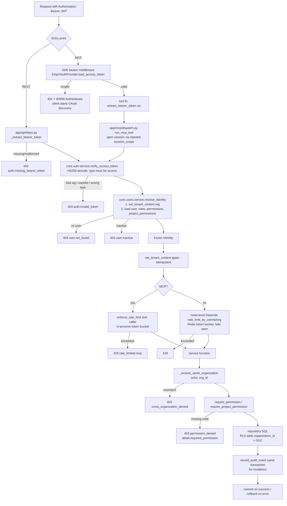

ASCII version:

```
Bearer JWT
   │
   ├─REST──► deps._extract_bearer_token ──(missing)──► 403
   │
   └─MCP───► SDK load_access_token ──(invalid)──► 401 + WWW-Authenticate
                 │
                 ▼
             tool fn ─► extract_bearer_token ─► run_mcp_tool (open session)
   │
   ▼
verify_access_token ──(bad/expired/wrong type)──► 403 auth.invalid_token
   │
   ▼
resolve_identity: set GUC → user → roles → permissions → project perms
   │         └─(missing)► 404   └─(inactive)► 403
   ▼
Identity (frozen) → set GUC again
   │
   ├─MCP: in-process rate limit ─(exceeded)─► 429
   └─REST: Redis rate limit (route Depends) ─(exceeded)─► 429
   │
   ▼
service: same-org check ─► 403 | permission check ─► 403
   │
   ▼
repository SQL  (RLS: organization_id = current_setting(...))
   │
   ▼
audit_logs row (same txn) → commit / rollback
```

### 10.5.2 Password login with multi-organization selection

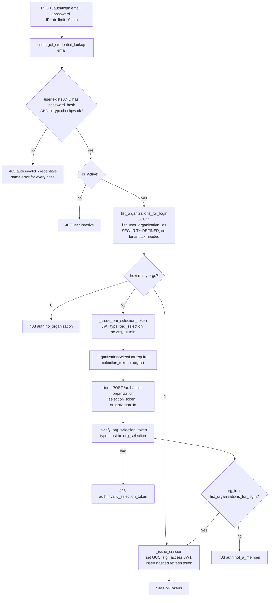

### 10.5.3 SSO (OIDC + PKCE) login

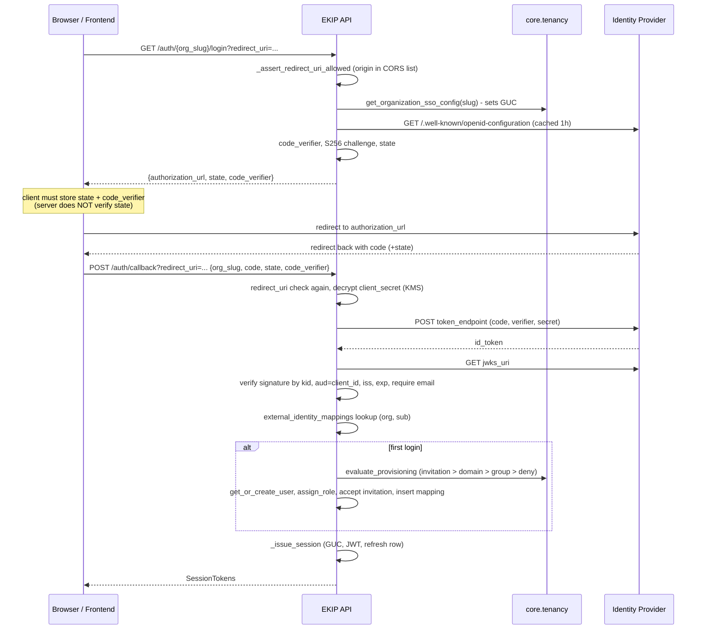

### 10.5.4 Refresh-token rotation and reuse detection

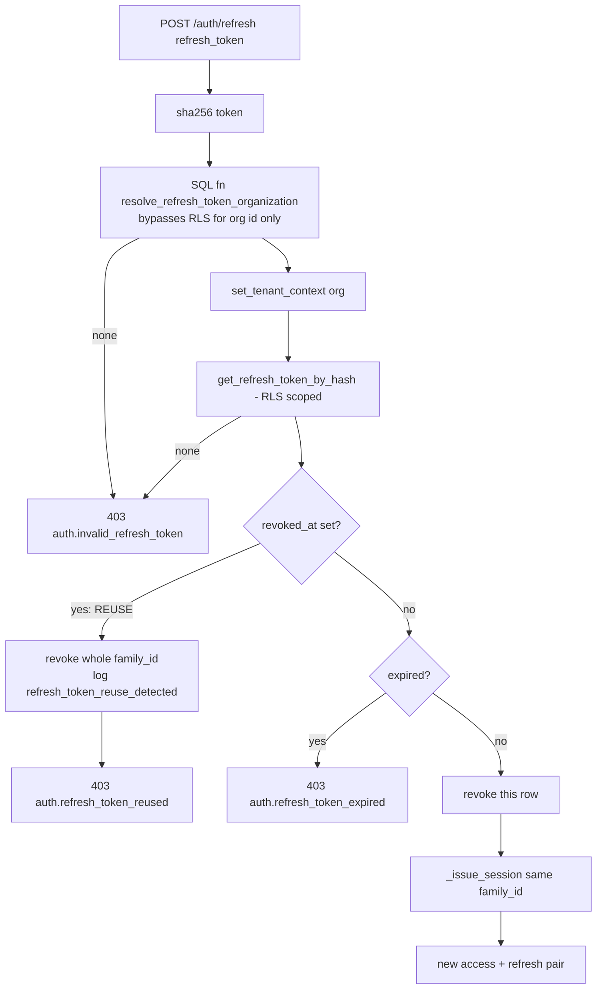

---

# PART 11 — Connectors and Ingestion

## 11.1 Connector inventory

See the table in Step 24 for all 14 registered connectors (source, auth, rate, resume support, SSRF guard). Summary by credential handling: every connector receives the **plaintext** credential in `ResolvedConnectorConfig.credential_ref`, decrypted once per job by `_execute_ingestion_job` from the envelope stored at registration. Connectors never persist credentials.

## 11.2 Per-connector dimensions (common behavior)

| Dimension | Behavior (all connectors unless noted) | Where |
|---|---|---|
| Source system | per table in Step 24 | `connectors/*.py` |
| Authentication | `authenticate()` builds an `httpx.AsyncClient` with the right header (Bearer / Basic / `Token token=`); internal connectors (`incidents`, `runbooks`) read EKIP's own tables | each connector |
| Configuration | `connector_configs.config` JSONB: repos (GitHub), projects (Jira), spaces (Confluence), base_url (Jira/Confluence/GitLab), instance_url (ServiceNow), channels/sites as relevant | `ConnectorConfigCreate` → `register_connector` |
| Credential handling | encrypted at registration (`encrypt_secret`), decrypted per job (`decrypt_secret`), redacted on every read | `core.tenancy.service`, `ingestion.service` |
| Synchronization | `since=None` full / `since=last_synced_at` incremental / `cursor` pagination; `resume_token` for Teams/SharePoint delta links | `Connector.fetch_batch` |
| Documents | one `RawDocument` per item via `normalize()` | each connector |
| Chunks | by content shape (code/chat/incident/document), ≤2000 chars | `processors/chunking.py` |
| Embeddings | batched per item, all-MiniLM-L6-v2, 384-d, normalized | `retrieval.service.upsert` |
| Persistence | `documents` (versioned), `document_metadata`, `<collection>_chunks` | `ingestion.repository`, `PgVectorStore.upsert` |
| Incremental sync | `last_synced_at` + connector-specific `since` support (e.g. GitHub commits/issues support `since`; PRs don't, per `github.py` docstring) | connectors |
| Idempotency | same `(org, source, external_id, content_hash)` → skip | `_process_one_item` |
| Errors | fetch transport/5xx/429 retried 3× with `Retry-After`; item DB connection blips retried 3×; any other error → job `failed` with `failed_stage` | `ingestion.service` |
| Retry behavior | arq retries the whole task up to 3 attempts with jittered backoff (≤300 s); resumes from the page checkpoint; 3rd failure → `dead_lettered` | `workers/tasks.py` |
| Background processing | ingestion worker process, queue `arq:queue:ingestion`, `max_jobs=2`, `job_timeout=7200` | `workers/main.py` |
| Rate limiting | per connector (`requests_per_second`) + per org (5 rps default) token buckets, Redis-backed in the worker | `ingestion.service`, `RedisTokenBucketRateLimiter` |
| Concurrency safety | Redis lock per connector (`SET NX EX`) | `_acquire_connector_lock` |
| Safety limits | pages/attempt, items/page, bytes/document, chunks/document; repeated cursor detection | `_validate_fetch_result`, `_process_one_item` |

## 11.3 Pipeline trace (where each stage is implemented)

```
External source (GitHub API, Slack API, ...)
   │  connector.authenticate(ResolvedConnectorConfig)          ingestion/connectors/<x>.py
   │  connector.fetch_batch(client, since, cursor[, resume])   → FetchResult(items, has_more, next_cursor)
   ▼
Raw item
   │  connector.normalize(raw_item)                            → RawDocument(source, external_id, title,
   ▼                                                              source_url, content, metadata)
Document (normalized)
   │  processors.pipeline.process_document                     ingestion/processors/pipeline.py
   │    clean_content → compute_content_hash → extract_metadata
   │    → classify_content_type → chunk_document               → ProcessedDocument(chunks with offsets)
   ▼
Dedup / versioning
   │  repository.get_latest_document → same hash? skip        ingestion/repository.py
   │  repository.insert_document(version+1, status=published)
   │  repository.insert_document_metadata
   ▼
Chunks
   │  _CONTENT_TYPE_TO_COLLECTION → UpsertChunk[...]           ingestion/service.py::_process_one_item
   ▼
Embedding
   │  retrieval.service.upsert → embedding.embed_texts          retrieval/service.py, retrieval/embedding.py
   ▼
Vector storage
   │  PgVectorStore.upsert → INSERT ... ON CONFLICT             retrieval/pgvector/store.py
   │  into documentation_chunks | code_chunks | conversations_chunks | incidents_chunks
   ▼
Retrieval
      PgVectorStore.search / lexical_search (+ RRF)             retrieval/service.py
```

## 11.4 Flowchart: one ingestion job (inside `_execute_ingestion_job`)

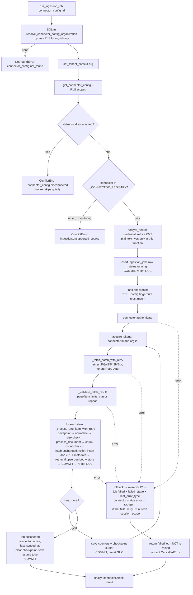

## 11.5 Registration → first sync (user-level flow)

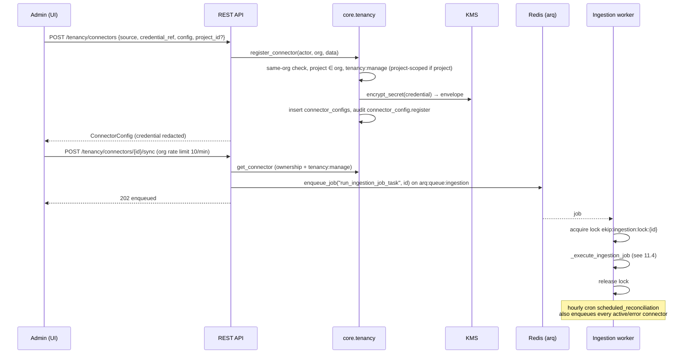

## 11.6 Limitations

- Deleted upstream items are never removed; superseded versions' chunks stay searchable (Step 23).
- `acl_permission_code` never set by any connector.
- Webhook signature adapters referenced by `/connectors/{id}/events` are not in the repo.
- `monitoring` source can be registered but can't be ingested.
- Enterprise connectors (GitLab, Drive, Notion, ServiceNow, PagerDuty) are the least tested.

---

# PART 12 — RAG

## 12.1 The pipeline in 12 stages

| # | Stage | Implementation | Key numbers |
|---|---|---|---|
| 1 | Ingestion | connectors + `_execute_ingestion_job` | Part 11 |
| 2 | Document processing | `clean_content`, `compute_content_hash`, `extract_metadata` | hash of cleaned text |
| 3 | Chunking | `chunk_document` (code boundaries / headings / whole message or incident) | ≤ 2000 chars |
| 4 | Embeddings | `embed_texts`, all-MiniLM-L6-v2 | 384-d, L2-normalized, batch 32, 120 s timeout |
| 5 | Storage | `<collection>_chunks` (vector + tsvector + tenant cols) | no ANN index |
| 6 | Query embedding | `embed_query` (after optional LLM rewrite + abbreviation expansion) | same model |
| 7 | Vector search | `PgVectorStore.search_all` via `<#>`; lexical via `ts_rank_cd`; RRF k=60 | candidate pool 24 |
| 8 | Threshold | **no retrieval threshold**; the gate is `confidence_threshold = 0.5` on a weighted score; grounding thresholds 0.55/0.35; memory relevance 0.35 | see below |
| 9 | Filtering | `organization_id`, `documents.deleted_at IS NULL`, `acl_permission_code IS NULL OR IN (permissions)`, optional project/repository; plus RLS | hard `WHERE` |
| 10 | Retrieved context | cross-encoder rerank to 12 → `assemble_context` 4000 est. tokens → numbered context block; memories as a separate, non-citable context section (≤ 5, ≤ 2000 chars) | |
| 11 | Agent | confidence gate → Answer Agent (sufficiency → generate → grounding) or Investigation Agent | |
| 12 | Final response | `AskResponse{confidence, route_taken, answer, answer_mode, citations[], investigation?}` | citations excerpt ≤ 300 chars |

## 12.2 Why this embedding model and dimension
Covered in 1.15: small, CPU-only, free; benchmark showed no gain from a 768-d model at the tested corpus size; 384 is baked into every `VECTOR(384)` column.

## 12.3 The thresholds actually configured [CODE VERIFIED]

| Threshold | Value | Meaning | Where |
|---|---|---|---|
| `confidence_threshold` | 0.5 | weighted retrieval score ≥ 0.5 → try to answer; else investigate | `settings.py`, `agents/confidence.py` |
| `_DENSE_SIMILARITY_FLOOR/CEILING` | 0.35 / 0.65 | cosine similarity normalized to 0..1 between these | `agents/confidence.py` |
| rerank calibration | center −8, temperature 2 | cross-encoder logit → 0..1 | `_normalize_rerank_score` |
| `_GROUNDED_THRESHOLD` / `_UNGROUNDED_THRESHOLD` | 0.55 / 0.35 | per-sentence embedding similarity; between them → LLM check | `agents/answer/grounding.py` |
| `memory_relevance_threshold` | 0.35 | minimum cosine relevance for memory injection | `settings.py`, `core/memory/service.py` |
| `knowledge_gap_similarity_threshold` | 0.82 | clustering low-confidence queries | `settings.py` |

## 12.4 What happens when no relevant documents are found

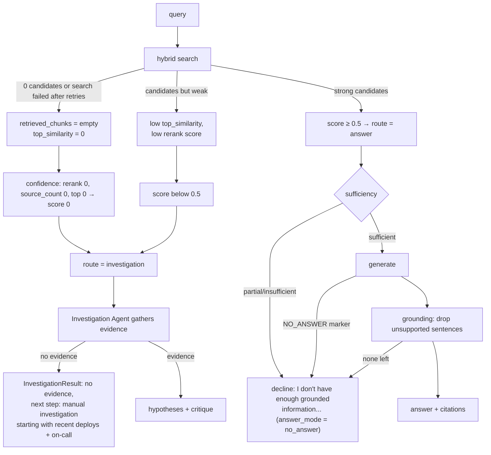

Key behavior: **the system never returns an ungrounded answer**. Weak retrieval turns into either an investigation or an explicit decline. (Retries: a decline triggers up to 2 regeneration retries before the decline is returned.)

## 12.5 Flowchart: hybrid retrieval inside `search_with_signals`

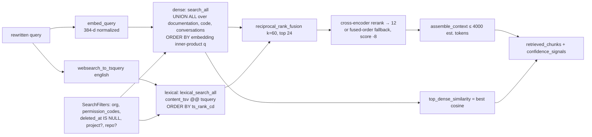

---

# PART 13 — LangGraph / Agents

## 13.1 Graph, state, transitions

```
build_graph(session, llm):                          build_investigation_graph(session, llm):

   [entry] retrieval_agent                             [entry] investigation_agent
              │                                                  │
              ▼                                                  ▼
       confidence_evaluation                                    END
              │  _route_after_confidence(state)
     ┌────────┴─────────┐
 "answer"          "investigation"
     ▼                   ▼
 answer_agent     investigation_agent
     │                   │
     ▼                   ▼
    END                 END
```

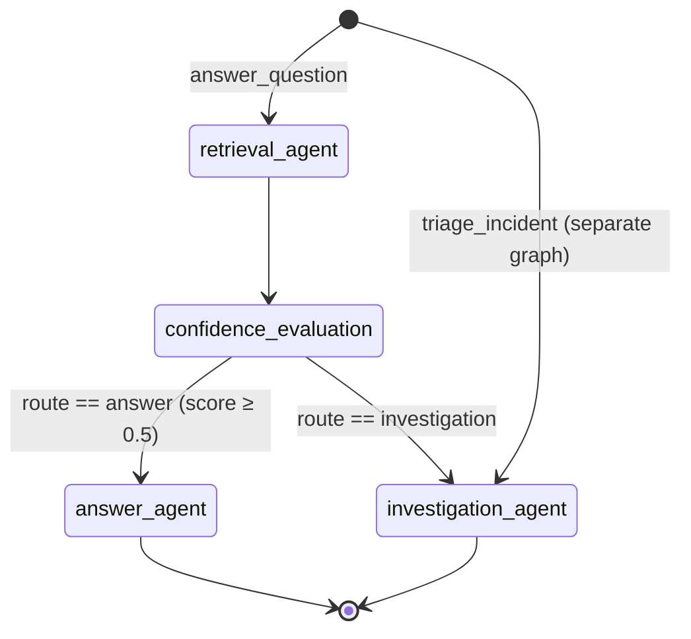

State: `GraphState` (Step 28). Nodes return partial dicts; LangGraph merges them.

## 13.2 Node table

| Node | Purpose | Inputs (state) | Outputs | Next | Why it exists |
|---|---|---|---|---|---|
| `retrieval_agent` (`agents/retrieval/node.py`) | turn a query into ranked, authorized evidence + signals | `query`, `incident_id`, `actor`, `retry_count` | `retrieved_chunks`, `rewritten_query`, `confidence_signals{top_similarity[, historical_similarity]}` | `confidence_evaluation` | recall + precision + context budget |
| `confidence_evaluation` (`agents/confidence.py`) | deterministic score + route | `retrieved_chunks`, `confidence_signals`, `incident_id` | `confidence_score`, normalized `confidence_signals`, `route` | conditional | explicit, testable honesty gate |
| `answer_agent` (`agents/answer/node.py`) | grounded, cited answer or decline | `retrieved_chunks`, `rewritten_query`/`query`, `recalled_memories`, `confidence_score` | `result` (`route_taken="answer"`) | END | never return ungrounded text |
| `investigation_agent` (`agents/investigation/node.py`) | evidence → hypotheses → critique | `query`, `actor`, `incident_id`, `confidence_score` | `evidence`, `hypotheses`, `result` (`route_taken="investigation"`) | END | structured starting point when knowledge is missing |

## 13.3 Tools, retrieval, error handling inside nodes

- Nodes call **Python services**, not LLM tool-calling: `retrieval.service`, `core.incidents.service`, `core.memory` (before the graph), live evidence sources. The LLM is used only for text tasks (rewrite, sufficiency, generation, grounding checks, hypotheses, critique).
- Per-node retries: `call_with_retry` (2 retries). Degradations: search failure → no chunks; rewrite failure → original query; rerank failure → fused order; hypothesis failure → none + manual next steps; critique failure → `review_failed`; timeline attach failure → logged only.
- Graph-level: `_run_graph_and_record` two-tier policy (Step 33).

## 13.4 Trace: one real execution of `answer_question` (illustrative values)

Question: *"Why does checkout return 500 after the payments deploy?"* (no incident id).

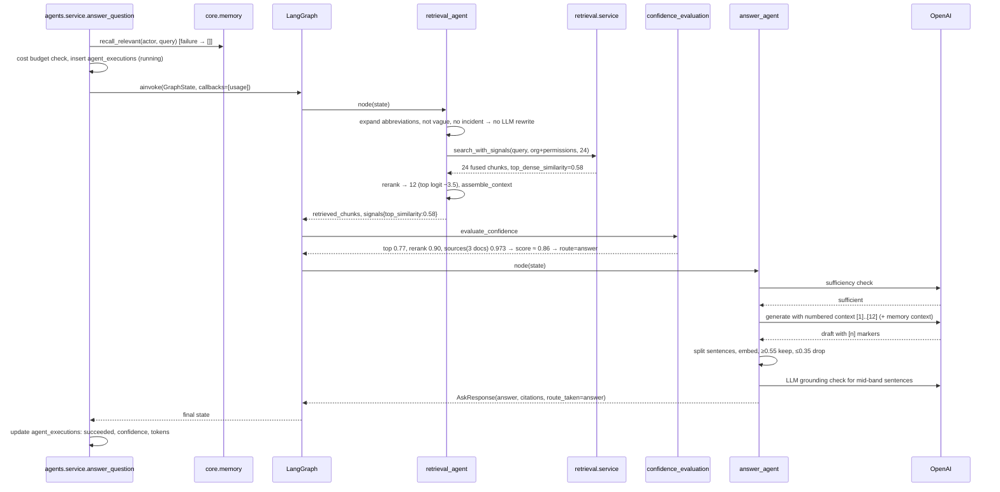

(The arithmetic: top_similarity (0.58−0.35)/0.30 = 0.767; rerank sigmoid((−3.5+8)/2) = sigmoid(2.25) ≈ 0.905; source_count 1−0.3³ = 0.973; weighted (0.4·0.767 + 0.35·0.905 + 0.15·0.973)/0.9 ≈ 0.86.)

## 13.5 Investigation flow

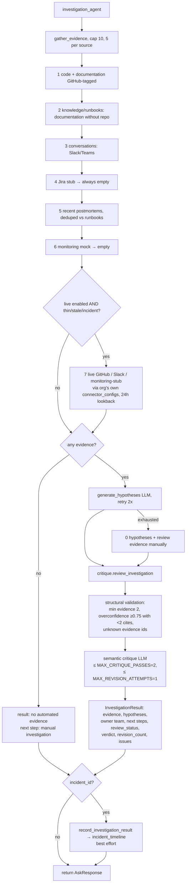

## 13.6 Non-graph agents

- **Postmortem**: linear `timeline → root cause → action items`, called by `core.incidents.trigger_postmortem_generation`, persisted as a draft by the postmortem agent identity.
- **Knowledge gap**: linear `fetch low-confidence runs → embed → cluster → synthesize topic → resolve action → merge or insert report`, scheduled daily.

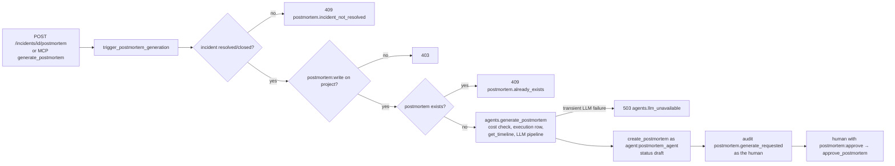

---

# PART 14 — Background Jobs / Redis

## 14.1 Why asynchronous processing is needed
Syncs are long (hours for a first large GitHub sync), CPU-heavy (embedding), and throttled by external APIs. Knowledge-gap and pattern scans iterate over every organization. None of that belongs in a request/response cycle.

## 14.2 Components

| Concept | Ingestion | Agents |
|---|---|---|
| Queue | `arq:queue:ingestion` | `arq:queue:agents` |
| Worker | `WorkerSettings` in `app/ingestion/workers/main.py`, run by `scripts/run_ingestion_worker.py` (`ResilientIngestionWorker`) | `WorkerSettings` in `app/agents/workers/main.py`, run by `arq app.agents.workers.main.WorkerSettings` |
| Tasks | `run_ingestion_job_task(ctx, connector_config_id)` | `run_knowledge_gap_detection_task(ctx, org_id)`, `run_pattern_detection_task(ctx, org_id)` |
| Cron | `scheduled_reconciliation` hourly at :00 | `scheduled_knowledge_gap_scan` 02:00; `scheduled_pattern_detection_scan` 00/06/12/18 |
| Producers | API (`/sync`, `/events`, `/runs/{id}/replay`), reconciliation cron | the scans |
| Retry | `max_tries=3`; `Retry(defer=full_jitter ≤300s)` | `max_tries=3`; `Retry(defer=...)` |
| Failure | `failed` → retry; last try → `dead_lettered` (DB); exceptions before a job row exists → logged `ingestion_job_exhausted_before_start` | logged + retried |
| Persistence | Postgres `ingestion_jobs` (status, counters), `connector_configs.config._ingestion_checkpoint` | `knowledge_gap_reports`, `proactive_findings` |
| Status | `GET /tenancy/connectors/{id}/runs`, `/observability/ingestion`, `/observability/ingestion/queue` | `/knowledge/gaps`, `/insights` |
| Concurrency | `max_jobs=2`; Redis lock per connector | [UNCLEAR, not inspected] |
| Timeout | `job_timeout=7200` | `job_timeout = 600` |

## 14.3 Trace: one complete background job

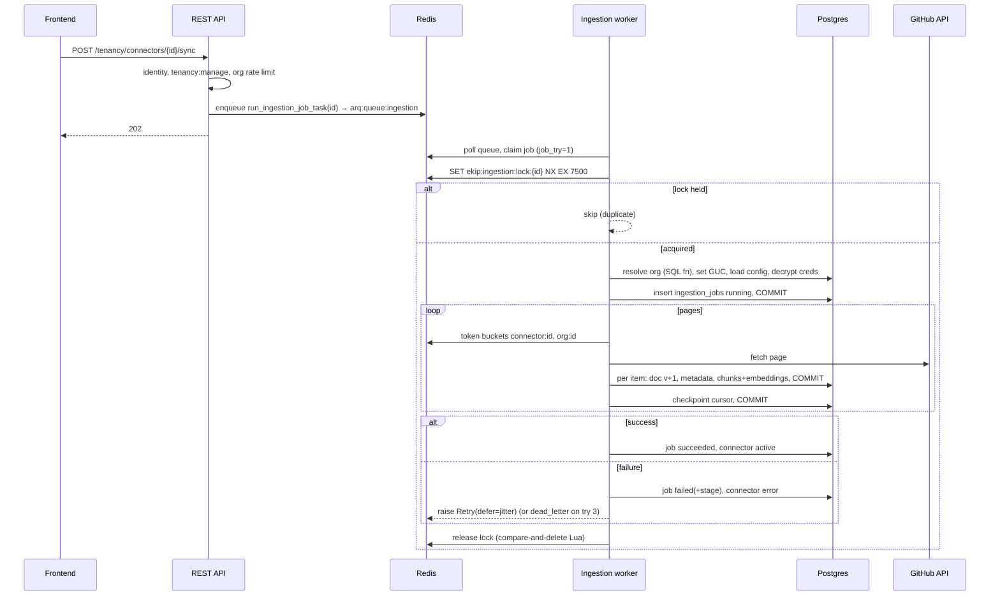

```
Retry ladder (ingestion):
  try 1 ── failed ──► Retry(defer ≤ 2^1 s jitter) ──► try 2 ── failed ──► Retry(defer ≤ 2^2 s) ──► try 3
                                                                                         │
                                                         failed on try 3 ───────────────┘
                                                                  ▼
                                                  ingestion_jobs.status = dead_lettered
                                                  (operator replays via POST /tenancy/connectors/{id}/runs/{job_id}/replay)
  Each retry resumes from the last saved page checkpoint (if not expired and config unchanged).
```

## 14.4 What happens if Redis fails

| Component | Behavior |
|---|---|
| API startup | continues; `arq_pool = None` |
| `/sync`, `/events`, `/replay` | 503 `service.queue_unavailable` |
| `/ready` | Redis reported `degraded`; readiness still depends only on the DB |
| REST rate limits | fail open (requests allowed, warning logged) |
| MCP rate limits | unaffected (in-process) |
| Ingestion worker | `ResilientIngestionWorker` backs off and reconnects between jobs; running job's Redis token-bucket `acquire` errors propagate → job fails → retried later |
| Agents worker | stock arq CLI; depends on arq/redis-py retry settings from `build_redis_settings` |
| Locks | TTL expiry self-heals; root `clear_stuck_*_lock.py` scripts exist for manual cleanup |

---

# PART 15 — End-to-End Flows

Each flow lists exact files/functions, then a flowchart. All paths are [CODE VERIFIED] unless labeled.

## Flow A — MCP request (`investigate_incident` via Claude)

**Path:** Claude → `POST /mcp` → SDK transport security (`scripts/run_mcp_server.py::build_allowed_hosts`) → SDK bearer middleware (`EkipOAuthProvider.load_access_token` → `core.auth.service.verify_access_token`) → `app/mcp/tools/investigate_incident.py::investigate_incident` → `app/mcp/servers/server.py::extract_bearer_token` → `app/mcp/dispatch.py::run_mcp_tool` → `app/mcp/auth.py::resolve_mcp_identity` → `core.users.service.resolve_identity` → `app/mcp/rate_limit.py::enforce_rate_limit` (10/min) → injected `set_tenant_context` → handler → `app/agents/service.py::triage_incident` → `core.incidents.service.get_incident` (`incident:read`, project-scoped) → `build_investigation_graph` → `_run_graph_and_record` → investigation node (Part 13) → `record_investigation_result` (timeline) → `AskResponse.model_dump` → commit → `core.observability.service.record_mcp_request` (separate session) → JSON-RPC response.

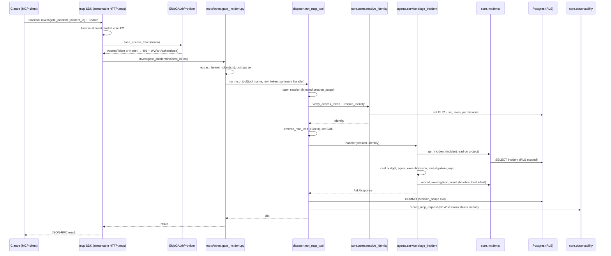

## Flow B — Document ingestion (GitHub)

**Path:** `POST /tenancy/connectors/{id}/sync` (`app/api/routers/tenancy.py::sync_connector`) → `tenancy_service.get_connector` → `arq_pool.enqueue_job("run_ingestion_job_task", id)` → Redis → `app/ingestion/workers/tasks.py::run_ingestion_job_task` → `_acquire_connector_lock` → `session_scope` → `app/ingestion/service.py::run_ingestion_job` → `_execute_ingestion_job` → `GitHubConnector.authenticate/fetch_batch/normalize` (phases files → commits → pulls → issues per repo) → `processors.pipeline.process_document` → `repository.insert_document` / `insert_document_metadata` → `retrieval.service.upsert` → `embedding.embed_texts` → `PgVectorStore.upsert` → `code_chunks` (files with code extensions) / `documentation_chunks` (READMEs, commits, PRs, issues) → checkpoint → success status.

Flowchart: see 11.4 (job internals), 11.5 (registration → sync), 14.3 (queue/lock/retry).

```
UI click ──► /sync ──► enqueue ──► Redis ──► worker ──► lock ──► job row ──► pages ──► items
                                                                              │
                         ┌────────────────────────────────────────────────────┘
                         ▼
   normalize ► clean ► hash ► (unchanged? skip) ► doc v+1 ► metadata ► chunk ► embed ► upsert ► COMMIT
                         │
                         └─► after each page: checkpoint cursor ► COMMIT ► next page
   end ► job succeeded / failed ► connector active / error ► release lock
```

## Flow C — Search / RAG (`POST /ask`)

**Path:** `app/api/routers/ask.py::ask_question` (`Depends(rate_limit_by_user("ask.question", 20))`, `CurrentIdentity`, `DbSession`) → `app/agents/service.py::answer_question` → `core.memory.service.recall_relevant` → `build_graph` → `_run_graph_and_record` → `agents/retrieval/node.py` (`rewrite_query` → `retrieval.service.search_with_signals` → `rerank` → `assemble_context`) → `agents/confidence.py::evaluate_confidence` → `agents/answer/node.py` (`assess_sufficiency` → `generate_answer` → `verify_grounding` → `build_citations`) **or** investigation → `AskResponse` → JSON.

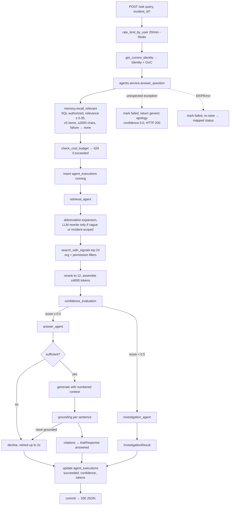

## Flow D — Incident triage (REST)

**Path:** `POST /incidents/{incident_id}/investigate` (`app/api/routers/ask.py::investigate_incident`, 10/min per user) → `agents.service.triage_incident` → same as Flow A from `triage_incident` onward. The incident's `title + "\n\n" + description` becomes the query; Retrieval Agent and Confidence Evaluation are **skipped** (separate graph), so `confidence` in the response is `0.0` (state never set) [INFERRED FROM CODE: `AskResponse(confidence=state.confidence_score or 0.0)`].

```mermaid
flowchart LR
    A[POST /incidents/id/investigate] --> B[rate limit 10/min]
    B --> C[Identity]
    C --> D[triage_incident]
    D --> E[get_incident<br/>incident:read on project<br/>404/403 propagate, no execution row]
    E --> F[query = title + description]
    F --> G[build_investigation_graph]
    G --> H[_run_graph_and_record]
    H --> I[investigation_agent<br/>evidence → hypotheses → critique]
    I --> J[record_investigation_result<br/>incident_timeline]
    J --> K[AskResponse route_taken=investigation]
```

## Flow E — Plain REST CRUD (e.g. `PATCH /incidents/{id}`)

```
PATCH /incidents/{id}
  → RequestContextMiddleware (request_id) → CORS
  → deps: DbSession (get_db_session) + CurrentIdentity (verify → resolve → GUC)
  → routers/incidents.update_incident → core.incidents.service.update_incident
       _ensure_same_organization → _get_owned_incident (RLS scoped)
       require_project_permission(actor, incident.project_id, "incident:write")
       repository update (+ timeline event) → record_audit_event (same session)
  → get_db_session commits → 200 Incident
  errors: EKIPError → ekip_error_handler → {error_code, message, detail} with status_hint
```

## Flow F — Password signup → first question (full user journey)

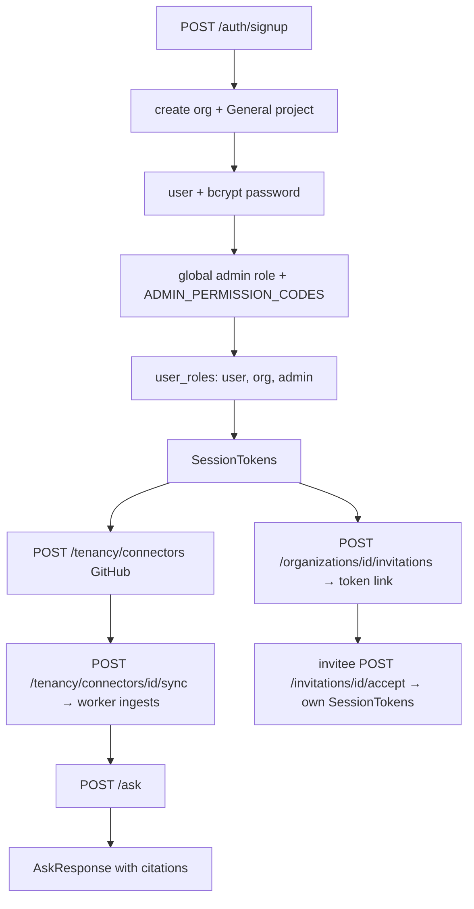

---

# PART 16 — Configuration and Environment

All from `app/shared/config/settings.py` unless noted. Env var names are case-insensitive field names. **No real secrets are shown.**

| Variable | Purpose | Read in | Required? / default | Production & security notes | If missing |
|---|---|---|---|---|---|
| `ENVIRONMENT` | `development|test|production` | settings validators, logging renderer | `development` | `production` forbids `KMS_PROVIDER=local` | defaults to development |
| `LOG_LEVEL` | root log level | `configure_logging` | `INFO` | | |
| `DATABASE_URL` | runtime asyncpg DSN | `session._build_engine` | **required** | must be **`ekip_app`** (NOBYPASSRLS); TLS on unless `sslmode=disable` | startup validation error |
| `MIGRATION_DATABASE_URL` | admin DSN for Alembic | `migrations/base.py` | optional | needed when migrations share env with the app (Railway) | Alembic uses `DATABASE_URL` |
| `EKIP_APP_ROLE_PASSWORD` | password for `ekip_app` at migration time | migration `b8f3d6a1c4e7` (`os.environ`) | required when that migration runs | must equal the password in `DATABASE_URL` | migration raises `RuntimeError` |
| `DATABASE_ECHO` | log every SQL statement | engine | `false` | noisy; debug only | |
| `REDIS_URL` | arq, locks, rate limits | `redis_settings`, `api/rate_limit` | **required** | `rediss://` for TLS | startup validation error |
| `OPENAI_API_KEY` | LLM calls | `agents/llm.get_llm` | **required** (every process) | secret | startup validation error |
| `AGENT_LLM_MODEL` | chat model | `get_llm`, cost estimate | `gpt-4o-mini` | affects cost table lookup | |
| `JWT_SECRET_KEY` | HS256 signing | `core.auth.service` | **required** | rotate = invalidate all access tokens; long random | startup validation error |
| `JWT_ALGORITHM` / `JWT_EXPIRY_MINUTES` | token alg / TTL | auth | `HS256` / `60` | | |
| `ORG_SELECTION_TOKEN_EXPIRY_MINUTES` | multi-org selection token TTL | auth | `10` | | |
| `CORS_ALLOWED_ORIGINS` | browser origins + SSO redirect allowlist | `create_app`, `_assert_redirect_uri_allowed` | Vite dev origins | comma-separated; `*` rejected | defaults (dev only) |
| `CONFIDENCE_THRESHOLD` | answer vs investigate gate | `agents/confidence.py` | `0.5` | uncalibrated placeholder | |
| `MAX_ORGANIZATION_COST_USD_PER_DAY` | per-org daily AI budget | `agents/cost_budget.py` | unset (no limit) | estimate, not billing | no enforcement |
| `MEMORY_RECALL_LIMIT` / `MEMORY_RELEVANCE_THRESHOLD` / `MEMORY_CONTEXT_CHAR_BUDGET` | memory injection bounds | `core/memory/service.py` | 5 / 0.35 / 2000 | `0` limit disables memory | |
| `MCP_PORT` | local MCP port | `run_mcp_server.py` | 8001 | `$PORT` wins | |
| `MCP_PUBLIC_BASE_URL` | OAuth issuer/resource URL; allowed host | `servers/server.py`, `run_mcp_server.py` | `http://localhost:8001` | must be public HTTPS for Claude | OAuth discovery advertises localhost |
| `MCP_HOST`, `MCP_ALLOWED_HOSTS`, `PORT`, `RAILWAY_PUBLIC_DOMAIN`, `RAILWAY_PRIVATE_DOMAIN` | MCP bind + Host allowlist | `run_mcp_server.py` (`os.environ`) | optional | missing host → 421 | |
| `INVESTIGATION_LIVE_EVIDENCE_ENABLED` / `..._LOOKBACK_HOURS` | live GitHub/Slack lookups | `evidence.py` | `true` / 24 | kill-switch for rate-limit issues | |
| `INVESTIGATION_CRITIQUE_*` | critique toggles/thresholds | `critique.py` | true / 2 / 0.75 / 2 | pass limits are code constants | |
| `KNOWLEDGE_GAP_*` | gap lookback/cluster size/similarity | knowledge_gap | 14 / 3 / 0.82 | | |
| `INGESTION_ORG_MAX_REQUESTS_PER_SECOND` | per-org fetch budget | ingestion service | 5.0 | | |
| `INGESTION_JOB_TIMEOUT_SECONDS` | arq job timeout (+ lock TTL) | worker, tasks | 7200 | | |
| `INGESTION_WORKER_MAX_JOBS` | worker concurrency | worker | 2 | embedding is CPU/memory heavy | |
| `INGESTION_CHECKPOINT_TTL_SECONDS` | checkpoint max age | ingestion service | 86400 | | |
| `INGESTION_MAX_PAGES_PER_ATTEMPT` / `..._ITEMS_PER_PAGE` / `..._DOCUMENT_BYTES` / `..._CHUNKS_PER_DOCUMENT` | safety limits | ingestion service | 10000 / 2000 / 10 MB / 1000 | DoS protection | |
| `EMBEDDING_WORKER_THREADS` / `EMBEDDING_BATCH_SIZE` | embedding executor/batch | embedding.py | 1 / 32 | | |
| `AGENT_RERANKING_ENABLED` | load cross-encoder | retrieval node | `true` | disable on small hosts | |
| `KMS_PROVIDER` | `local` or `azure` | `shared/security/kms.get_kms` | `local` | production must be `azure` | |
| `CONNECTOR_SECRET_MASTER_KEY` | hex 32-byte KEK (local KMS) | local KMS | required if `local` | platform secret; losing it makes all stored credentials unreadable | validation error |
| `AZURE_KEY_VAULT_URL` / `AZURE_KEY_VAULT_KEY_NAME` (+ `AZURE_TENANT_ID/CLIENT_ID/CLIENT_SECRET` for azure-identity outside Azure) | Azure KMS | Azure KMS | required if `azure` | managed identity in Azure | validation error |
| `OTEL_EXPORTER_OTLP_ENDPOINT` / `OTEL_CONSOLE_EXPORTER_ENABLED` | tracing export | `tracing.py` | unset / false | OTLP exporter package not installed (Step 04) | spans dropped |
| `DEFAULT_VECTOR_BACKEND` / `QDRANT_URL` | vector backend | **nowhere** | `qdrant` / None | unused | no effect |
| `OMP_NUM_THREADS` etc. | native thread caps | `native_runtime` | set to 2 if absent | | |
| `HF_HOME` / `SENTENCE_TRANSFORMERS_HOME` | model cache | Dockerfile | `/opt/models` | baked at build | download at first use |
| Frontend `VITE_API_BASE_URL` | API base URL (build time) | `frontend/src/api/config.ts` | `http://localhost:8000` | | points at localhost |
| Frontend `VITE_USE_MOCK_DATA` | mock vs real | `config.ts` | **mock unless `"false"`** | set to `false` in real builds | UI shows mock data |
| `EKIP_TEST_GITHUB_TOKEN` / `EKIP_TEST_GITHUB_REPOS` | real-connector E2E | Playwright | optional | | test skipped |

---

# PART 17 — Testing

## 17.1 Kinds of tests

| Kind | Where | Needs | Runs in CI |
|---|---|---|---|
| Unit/integration (mocked sessions, no real DB/Redis) | `tests/` (~180 files) | nothing external | `ci.yml` backend job |
| Static migration checks | `tests/database/test_migration_*.py`, `test_incidents_chunks_migration.py` | source files | yes |
| Import boundary | `lint-imports` | pyproject contracts | yes |
| Deterministic AI evaluation | `scripts/run_evaluation.py` + `app/evaluation` | fixtures, canned generations | yes (regression gate) |
| RLS security gate | `scripts/verify_rls_isolation.py` | real Postgres+pgvector | `rls-security.yml` |
| Migration from empty DB, `alembic check`, Docker builds | `main-extra.yml` | Postgres, Docker | yes (main) |
| Browser E2E | `frontend/e2e/*.spec.ts` | running stack, OpenAI key | `e2e-and-eval.yml` (conditional on secrets) |
| Live AI evaluation | `scripts/eval_confidence.py`, `run_semantic_evaluation.py` | live corpus + key | `e2e-and-eval.yml` (conditional) |
| Live connectors | `scripts/live_connector_tests/` | real third-party credentials | manual |
| Live MCP (incl. OAuth, restart survival) | `scripts/live_mcp_tests/` | running MCP server + token | manual |
| Real-world onboarding harness | `scripts/realworld_onboarding/01..10` | running stack | manual |
| Manual smoke | `scripts/test_connectors.py`, `test_milestone6.py`, `tests/ingestion_retrieval/*`, `tests/rag_validation/*` | real services | manual (one deselected in CI: `tests/ingestion_retrieval/test_connectors.py::test_one_connector`) |

## 17.2 Important fixtures
- `tests/conftest.py::_reset_rate_limiters` (autouse): clears the in-process MCP limiter's buckets before/after each test (the API limiter is Redis-based; its tests monkeypatch an in-process one).
- Most service tests build `Identity` objects directly and mock `AsyncSession`/repositories (pattern visible in `tests/core/memory/test_authorization.py`, which inspects generated SQL).

## 17.3 What each important test catches

| Test | Bug it would catch |
|---|---|
| `tests/database/test_migration_coverage.py::test_every_model_table_has_a_creating_migration` | a model with no `CREATE TABLE` (the `mcp_requests` outage) |
| `tests/database/test_migration_idempotency.py` | `90ff736ced55` breaking fresh-DB migrations again |
| `tests/database/test_incidents_chunks_migration.py` | a new tenant table shipped without RLS enabled/forced/policy |
| `tests/database/test_session.py::test_set_tenant_context_calls_set_config_with_bound_parameters` | string-built `SET` (SQL injection risk) or non-local GUC |
| `tests/database/test_session.py::test_build_engine_*` | missing command timeout; wrong TLS handling for `sslmode` |
| `tests/api/test_deps.py::test_get_current_identity_sets_tenant_context_after_resolving_identity` | REST requests running without the RLS GUC |
| `tests/api/test_deps.py::test_get_arq_pool_raises_service_unavailable...` | Redis outage becoming 500s |
| `tests/api/test_cors.py` | disallowed origins getting CORS headers |
| `tests/mcp/test_dispatch.py::test_sets_tenant_context_before_calling_handler` | MCP tools querying before the GUC is set |
| `tests/mcp/test_dispatch.py::test_logging_failure_is_swallowed_not_raised` | a logging error masking the real tool result |
| `tests/mcp/test_dispatch.py::test_rate_limited_call_is_rejected_and_logged_429` | unthrottled MCP LLM tools |
| `tests/core/auth/test_multi_organization_login.py::test_switch_organization_cannot_be_forced_by_requesting_arbitrary_id` | switching into an org you don't belong to |
| `...::test_selection_token_is_rejected_by_verify_access_token` | using an org-selection token as an access token |
| `...::test_pre_existing_access_token_without_type_claim_still_verifies` | a deploy logging everyone out |
| `tests/core/auth/test_redirect_uri.py` | open redirect of SSO completions |
| `tests/core/memory/test_authorization.py::test_another_users_id_never_appears_in_the_query` | reading another user's private memories |
| `tests/core/privacy/test_repository_scoping.py::test_every_user_scoped_mutation_filters_by_user_and_organization` | deletion affecting other users/orgs |
| `tests/core/users/test_admin_permission_codes.py` | `ADMIN_PERMISSION_CODES` missing a permission (the `incident:read` production bug) |
| `tests/ingestion/test_worker_settings.py::test_workers_do_not_share_a_queue` | one worker stealing the other's jobs |
| `...::test_api_lifespan_enqueues_onto_the_ingestion_worker_queue` | syncs enqueued to a queue nobody polls |
| `tests/ingestion/test_url_safety.py` | SSRF to internal IPs |
| `tests/agents/test_graph_wiring.py` | accidental cycles or missing routes in the graph |
| `tests/agents/test_confidence*.py` | regressions in scoring/normalization/routing |
| `tests/agents/test_reranking_fallback.py` | reranker failures killing answers or inflating confidence |
| `tests/agents/test_prompt_safety.py` | evidence not fenced as untrusted |
| `tests/agents/test_cost_budget.py` | budget not enforced / enforced when unset |
| `tests/agents/investigation/test_critique.py` | unbounded critique loops, overconfidence not flagged |
| `tests/evaluation/test_ci_gate.py` | the evaluation gate not failing on regressions |

## 17.4 Important areas NOT tested (or only by live/manual suites)
- **RLS inside the unit suite** (by design); only the live gate/scripts test it.
- **SSO against a real IdP** (never run; module docstring).
- **Old document versions remaining retrievable** (no test asserts superseded chunks are hidden, consistent with there being no such behavior).
- **API process logging configuration** (no test that the uvicorn entrypoint configures redaction).
- **MCP OAuth flow in unit tests** (live suite only: `test_mcp_oauth_live.py`, `test_mcp_oauth_restart_survival.py`).
- **Multi-replica behavior** (in-memory OAuth flows, in-process MCP limiter).
- **Cloudflare/Azure deployments** (never deployed; Cloudflare config conflicts with the production KMS guard).
- **Frontend unit tests**: none found; only Playwright E2E.
- **Enterprise connectors** (GitLab, Drive, Notion, ServiceNow, PagerDuty): one shared small test file.

---

# PART 18 — Deployment

## 18.1 One image, many roles

`Dockerfile` (multi-stage): builder installs deps with `uv sync --frozen --no-dev`, copies `app/`, `alembic.ini`, the three `run_*.py` scripts, bakes the sentence-transformers models into `/opt/models`; runtime stage is `python:3.13-slim` + `tini`, non-root user `ekip` (uid 1000), `HEALTHCHECK` on `/health` (respects `$PORT`), default `CMD ["uvicorn", "app.api.main:app", "--host", "0.0.0.0", "--port", "8000"]`. Workers and MCP reuse the image with a different command.

## 18.2 Targets

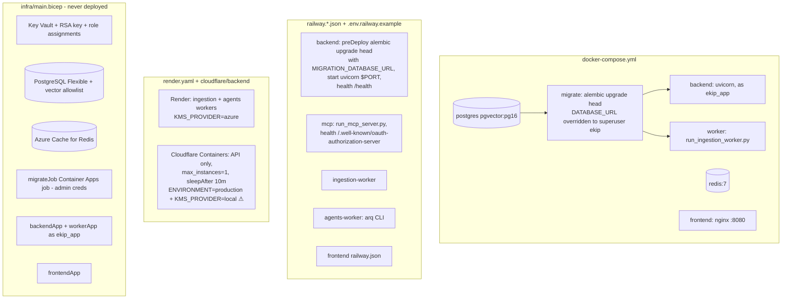

| Target | Status (per repo) | Services | Migrations | Notes |
|---|---|---|---|---|
| docker-compose | code complete; "static review only" per PROJECT_STATUS | postgres, redis, migrate, backend, worker, frontend | `migrate` service as superuser, then backend/worker as `ekip_app` | **no agents worker, no MCP server** in compose |
| Railway | evidence of real production use (`mcp-logs-production.up.railway.app` in PROJECT_STATUS Phase 30) | backend, mcp, ingestion-worker, agents-worker, frontend | `preDeployCommand: alembic upgrade head` using `MIGRATION_DATABASE_URL` | example uses `ENVIRONMENT=development` + local KMS (avoids the production guard); `sslmode=disable` on the private network |
| Render | config only | two workers | none | `KMS_PROVIDER=azure` |
| Cloudflare Containers | config + deploy workflow | API only | none | **`ENVIRONMENT=production` with `KMS_PROVIDER=local` fails `_reject_local_kms_in_production`** as committed [INFERRED FROM CODE] |
| Azure Bicep | "CODE COMPLETE", "never deployed" | Key Vault, Postgres Flexible, Redis, Container Apps (backend, worker, frontend), migrate job | `migrateJob` with admin creds | `scripts/deploy.sh` drives it |

## 18.3 Health checks, CORS, public URLs, MCP exposure
- `/health`: liveness, no dependencies (Docker HEALTHCHECK, Railway). `/ready`: DB required, Redis reported.
- CORS: `CORS_ALLOWED_ORIGINS` must list the deployed frontend origin (Railway example: `https://${{frontend.RAILWAY_PUBLIC_DOMAIN}}`), which is also the SSO redirect allowlist.
- Frontend must be built with `VITE_API_BASE_URL` (public backend URL) and `VITE_USE_MOCK_DATA=false`.
- MCP: public HTTPS URL in `MCP_PUBLIC_BASE_URL`; that hostname is auto-added to `allowed_hosts`; endpoint `/mcp`; OAuth metadata under `/.well-known/`.

## 18.4 From laptop to production

```
1. uv sync --extra dev ; cp .env.example .env ; alembic upgrade head ; uvicorn app.api.main:app --reload
2. python scripts/run_ingestion_worker.py ; (optional) arq app.agents.workers.main.WorkerSettings ;
   python scripts/run_mcp_server.py ; cd frontend && npm run dev
3. docker compose up --build   (production-shaped: migrate as admin → app as ekip_app)
4. CI on PR: gitleaks, pytest, lint-imports, deterministic eval, frontend build, RLS gate;
   on main: empty-DB migrations + alembic check + Docker builds; E2E/eval if secrets exist
5. Deploy (Railway documented path): set env from .env.railway.example, preDeploy runs migrations
   with MIGRATION_DATABASE_URL, services start as ekip_app; MCP_PUBLIC_BASE_URL = public MCP domain
6. Verify: /health, /ready, python scripts/verify_rls_isolation.py against the target DB
```

---

# PART 19 — Design Decisions

Only decisions with repository evidence.

| Decision | Why | Alternative | Why current approach |
|---|---|---|---|
| Modular monolith | solo developer; hard problems are retrieval/agents, not distribution (#001) | microservices | boundaries enforced by import-linter; extractable later |
| Separate ingestion worker process | bursty, slow, rate-limited work must not block API (#002) | in-process background tasks | process isolation without a separate service |
| arq | asyncio-native, retries/cron built in (#003) | Celery, hand-rolled queue | matches async stack; Redis already needed |
| PostgreSQL (Neon in dev) | relational integrity + JSONB + FTS + RLS + vectors | MySQL, Mongo | one system for all needs; Neon supports `vector` |
| pgvector (Qdrant planned) | tenant/ACL filters in the same SQL; RLS covers vectors | Qdrant, Pinecone | "simplest to stand up first"; per-collection tables keep a Qdrant option |
| One table per collection | allow per-collection backend choice | single `chunks` table | docstring rationale |
| Hybrid search + RRF | paraphrase recall (dense) + exact terms (lexical) | dense only | RRF needs no score calibration |
| Postgres FTS instead of BM25 engine | reuse the DB | Elasticsearch, BM25 lib | honest naming note in `retrieval_models.py` |
| all-MiniLM-L6-v2, 384-d | CPU-only, free; benchmark showed no gain from 768-d at current scale (#006) | bge-base, OpenAI embeddings | cost/ops simplicity |
| Cross-encoder reranker ms-marco-MiniLM-L-6-v2 | precision over a small candidate set (#009) | none / bigger model | small, standard; toggleable |
| OpenAI `gpt-4o-mini` via LangChain | user's explicit choice; settings already assumed OpenAI (#008) | Anthropic | one provider, cost-conscious |
| LangGraph for Q&A/investigation; plain pipelines for postmortem/gaps | explicit routing only where routing exists | agent loops everywhere | testable wiring, no cycles |
| Deterministic confidence gate | honest "don't know" behavior; unit-testable | LLM self-assessment | pure function, logged signals |
| Sufficiency before generation + sentence grounding after | catches both "not enough evidence" and "unsupported sentences" | trust the LLM | core product principle |
| `Identity` object threaded through every call | identical authorization for REST, MCP, workers (#004) | per-transport auth | one resolver, frozen, org-scoped |
| Global roles assigned per org | simple RBAC; one "admin" role today | per-org custom roles | minimal catalog (evidence: `ensure_admin_role`) |
| Project-level overrides in `Identity` | finer-grained permissions inside an org | separate project ACL tables | reuses role/permission vocabulary |
| RLS keyed on a transaction-local GUC | database backstop; fail-closed; no leak across pooled connections | app-only filters; per-tenant schemas/DBs | minimal schema change; works with a shared pool |
| `SECURITY DEFINER` narrow bypass functions | bootstrap lookups before the org is known | `BYPASSRLS` app role | least privilege: only org ids, never rows |
| Dedicated `ekip_app` role, migration/runtime split | RLS is a no-op for BYPASSRLS/superuser | run as owner | makes RLS real; app can't do DDL |
| JWT HS256 access (60 min) + opaque rotating refresh (30 days) | stateless verification; revocable sessions | server sessions; RS256 | single issuer/verifier [INFERRED] |
| OIDC + PKCE + JIT provisioning policy (#005) | enterprise SSO for 4 providers with one code path | per-provider SDKs | discovery-based, policy separated from authentication |
| Password auth in parallel to SSO | self-service orgs with no IdP | SSO only | ends in the same `_issue_session` |
| External identity mapping per org | IdP `sub` unique per IdP/org | email-based matching | stable, IdP-independent user ids |
| Envelope encryption + KMS abstraction | credentials at rest; KEK rotation | plaintext; Vault | local dev + Azure Key Vault prod; prod guard |
| MCP over streamable HTTP, per-call identity | hosted multi-tenant endpoint | stdio | each request carries its own token |
| MCP OAuth bridge | Claude's connector UI requires OAuth | static header (beta-gated) | reuses EKIP tokens; no new identity system |
| MCP gets DB via dependency injection | import-linter forbids `app.mcp → app.database` | allow import | keeps MCP a thin transport |
| Same-transaction audit rows | audit and change commit together | async audit queue | consistency |
| Separate-session MCP request log | failures must still be logged | same transaction | failure visibility |
| Page-level durable checkpoints | long syncs survive timeouts/retries | restart from scratch | measured multi-hour syncs |
| Redis-backed distributed rate limiting for REST | N replicas must share one budget | in-process | fails open to avoid outages |
| Fail-open on Redis for API startup | Redis blip shouldn't kill login/incidents | fail startup | only queue endpoints degrade |
| Models baked into the image | non-root user, rate-limited HF downloads | download at runtime | predictable cold start |
| Native thread caps at import | memory stability with two transformer models | defaults | observed OOM/alloc failures |

---

# PART 20 — "Why not X?"

**Why not REST only?** REST serves the UI. AI clients (Claude) speak MCP; without it they'd need custom glue. MCP costs little here because tools are thin wrappers over the same services.

**Why MCP at all instead of a plugin per vendor?** One protocol, discoverable tools with model-facing descriptions, and Claude's connector flow (with OAuth) works against it.

**Why not plain PostgreSQL full-text search only?** It misses paraphrases ("checkout is down" vs "payment-service 500"). Dense vectors catch meaning; FTS catches exact identifiers (error codes, function names). RRF combines both.

**Why vector search at all?** See above; also reused for grounding, memory recall, gap clustering, historical-incident similarity.

**Why pgvector rather than a vector DB?** Filters (`organization_id`, ACL, deleted docs, repository) run in the same SQL as the similarity search, and RLS protects vectors like any other row. A separate store would need its own tenant filtering and would sit outside RLS.

**Why Redis?** arq needs it; locks and distributed rate limits need shared state across replicas.

**Why background jobs?** Syncs take minutes to hours and are CPU-bound; scheduled scans iterate over every organization.

**Why LangGraph instead of a simple function?** The central behavior is a branch on a computed score with shared state; the graph makes that explicit and testable. Where there's no branch (postmortem, gaps), the code deliberately uses plain functions.

**Why RLS if application authorization already exists?** Because application code can forget a filter. RLS guarantees tenant isolation independently of every query author. It doesn't replace permissions (it can't know them).

**Why both authentication and authorization?** Knowing who someone is (valid token) doesn't tell you whether they may approve a postmortem in project P. `Identity` separates the two: token → identity; identity → permission checks.

**Why external identity mapping instead of matching by email?** Emails change and can collide across IdPs; the IdP `sub` is stable per IdP. The mapping is per organization, matching per-org SSO configs.

**Why credential "references" (encrypted envelopes) instead of storing credentials directly?** A database dump alone reveals nothing usable without the KEK; the plaintext exists only momentarily in the worker; KEK rotation doesn't require re-encrypting data.

**Why HS256 JWTs instead of opaque sessions?** Verification needs no DB round trip (`verify_access_token` is DB-free); permissions are still loaded fresh per request, and refresh tokens give revocability.

**Why a separate graph for triage?** Triage always investigates; faking a confidence score to force the main graph's branch would be dishonest state.

**Why not trust the LLM to say "I don't know"?** It often won't. The system uses a deterministic gate, a sufficiency check, and grounding verification. The model's own `NO_ANSWER` is just one of several decline paths.

**Why not an ANN index (HNSW/IVFFlat) now?** Corpus is small; exact scans over tenant-filtered rows are accurate and fast enough; the index type is deliberately deferred until real volume exists (and for memory, approximate recall is a bad trade for permission-sensitive results).

**Why a per-connector Redis lock?** Clicks, webhooks, and the hourly cron can enqueue the same connector concurrently; two concurrent syncs would race on checkpoints and documents.

**Why not re-raise ingestion failures?** The failure record would be rolled back with the transaction; the worker reads `job.status` instead.

**Why global roles?** Minimal RBAC for the current product (one admin role). Per-org custom roles would need `organization_id` on `roles` plus RLS.

---

# PART 21 — Debugging Guide

### "MCP request fails"
1. **421 Invalid Host header** → host not in `allowed_hosts`: set `MCP_PUBLIC_BASE_URL` / `MCP_ALLOWED_HOSTS` (`scripts/run_mcp_server.py`). Check the `mcp_server_starting` log's `allowed_hosts`.
2. **401 with WWW-Authenticate** → `load_access_token` rejected the token: expired (60 min), wrong `JWT_SECRET_KEY` between API and MCP processes, or not an `access`-type token.
3. **403 `mcp.missing_token` / `mcp.no_transport_context`** → client not sending `Authorization`.
4. **`McpServerNotReadyError`** → server not started via `scripts/run_mcp_server.py` (injection missing).
5. **429 `rate_limited.mcp`** → per-tool per-caller limit (in-process).
6. **403 `permission_denied`** → check `detail.required_permission`; check the user's roles in that org.
7. Check `mcp_requests` for `tool_name`, `status_code`, `latency_ms`; correlate logs by the `request_id` bound in `run_mcp_tool`.
8. Claude connector broken after restart → OAuth client must exist in `oauth_clients`; pending flows/codes are in memory (restart mid-flow = retry).

### "Authentication fails"
1. 403 `auth.missing_bearer_token` → header missing/malformed (`deps._extract_bearer_token`).
2. 403 `auth.invalid_token` → decode failure (expired/secret mismatch) or token `type` isn't `access` (e.g. a selection token).
3. 404 `user.not_found` / 403 `user.inactive` → `resolve_identity`.
4. Login: 403 `auth.invalid_credentials` (any credential problem), `auth.no_organization` (no `user_roles`), or an `OrganizationSelectionRequired` response the client didn't handle.
5. Refresh: `auth.refresh_token_reused` means the family was revoked (e.g. two tabs refreshed with the same token) → log in again.
6. SSO: `auth.redirect_uri_not_allowed` (origin not in `CORS_ALLOWED_ORIGINS`), `auth.idp_key_not_found`, `auth.idp_token_invalid` (aud/iss mismatch: `client_id`/`issuer_url` in `sso_configurations`), `auth.not_provisioned` (no invitation/domain/group rule).
7. Under `ekip_app`, a login path that forgets `set_tenant_context` shows `invalid input syntax for type uuid: ""` or empty results (see `_issue_session` docstring).
8. Frontend "randomly" gets 403s after an hour → access token expired; frontend refreshes only on load (Step 37).

### "User gets no retrieval results"
1. Has the connector synced? `GET /tenancy/connectors/{id}/runs`, `ingestion_jobs.status`, `chunks_embedded`.
2. Are chunks in the expected collection? GitHub commits/PRs/issues are in `documentation_chunks`, not `code_chunks`; incidents only via explicit `incidents` collection.
3. Embeddings present? (`embedding` NOT NULL; model loaded? check for `rerank_unavailable...` / embed timeouts in logs.)
4. Filters: `organization_id` matches the token's org? `documents.deleted_at` NULL? `acl_permission_code` NULL or in the user's permissions? `repository` filter only on code/documentation?
5. RLS: is the GUC set on this session (`set_tenant_context`)? Using a BYPASSRLS role hides RLS bugs; using `ekip_app` exposes missing GUC calls as empty results.
6. Lexical side: `plainto_tsquery`/`websearch_to_tsquery` with `english` config drops stop words; very short queries may match nothing lexically.
7. Threshold: retrieval has none; if results exist but the answer is "I don't have enough grounded information", look at `confidence_evaluated` logs (signals, score vs 0.5), then sufficiency/grounding outcomes.
8. `search_similar_incidents` empty → has the `incidents` connector been registered and synced? (It's a connector like any other.)

### "RLS isolation fails" (leak or over-restriction)
1. `SELECT current_user;` → must be `ekip_app`. Check `rolbypassrls`/`rolsuper` in `pg_roles`.
2. `SELECT relname, relrowsecurity, relforcerowsecurity FROM pg_class WHERE relname = '<table>';` and `pg_policies` for the table.
3. `SELECT current_setting('app.current_organization_id', true);` inside the failing transaction; was `set_tenant_context` called **after the last commit**?
4. Is the query on a table without RLS (`users`, `roles`, `organizations`, `mcp_requests`, `oauth_clients`)?
5. Project-level "leak" isn't an RLS problem (RLS is org-only).
6. Run `python scripts/verify_rls_isolation.py` against the environment.

### "Background job doesn't run"
1. Redis reachable? API logs `arq_pool_unavailable_at_startup`; `/ready` shows `redis: degraded`; `/sync` returns 503.
2. Worker running and polling the right queue? Ingestion `arq:queue:ingestion`; API enqueues there (`default_queue_name`). Agents worker uses `arq:queue:agents`.
3. Duplicate skipped? Log `ingestion_job_task_skipped_duplicate` → a lock `ekip:ingestion:lock:{id}` exists (TTL = job timeout + 300 s). Root `check_connector_locks.py`, `clear_stuck_*_lock.py`.
4. Connector disconnected → `ingestion_job_task_skipped_disconnected`.
5. Job failed → `ingestion_jobs.failed_stage`, `last_error_type`, `retry_count`; after 3 tries `dead_lettered` → replay endpoint.
6. Worker silent after startup → dead idle Redis connection (fixed by `socket_timeout`/`health_check_interval` in `_on_startup`; the resilient worker backs off on poll errors).
7. Timeouts on first sync → increase `INGESTION_JOB_TIMEOUT_SECONDS`; progress resumes from checkpoints.
8. Enqueue "succeeded" but nothing happened after long idle → the API pool's `health_check_interval` fix; confirm with `test_direct_enqueue.py` / `check_arq_queue.py` (root diagnostics).

### "Answer quality is poor / always investigates"
1. `confidence_evaluated` log: which signal is low?
2. Reranker disabled or failing → neutral score −8 (0.5 signal).
3. Threshold is a placeholder; see `Settings.confidence_threshold` comment and `scripts/eval_confidence.py`.
4. Stale duplicate versions in results (Step 23 limitation).

### "Postmortem generation fails"
409 `postmortem.incident_not_resolved` / `postmortem.already_exists`; 403 without `postmortem:write`; 503 `agents.llm_unavailable` on OpenAI outages; 429 `cost_budget_exceeded`.

### "API won't start"
Settings validation: missing required env; `kms_provider=local` in production; `*` in CORS; missing `CONNECTOR_SECRET_MASTER_KEY`; `OTEL_EXPORTER_OTLP_ENDPOINT` set without the exporter package.

---

# PART 22 — Code Reading Roadmap

Adjusted to this repository. Each level lists exact files; read them in order.

**LEVEL 0 — Project idea**
`README.md` → `docs/Architecture.md` §1–2 → `docs/ENGINEERING_DECISIONS.md` (#001–#009) → `EKIP_TENANT_ISOLATION_SECURITY_REVIEW.md` (skim) → this guide Parts 1–3.

**LEVEL 1 — Configuration and entry points**
`pyproject.toml` → `app/shared/config/settings.py` → `app/__init__.py` + `app/shared/config/native_runtime.py` → `app/shared/config/logging.py` → `app/shared/config/tracing.py` → `scripts/run_api_server.py` → `app/api/main.py` → `scripts/run_mcp_server.py` → `scripts/run_ingestion_worker.py` → `app/ingestion/workers/main.py` → `app/agents/workers/main.py`.

**LEVEL 2 — Database**
`app/database/session.py` → `app/database/models/tenancy_models.py` → `core_models.py` → `auth_models.py` → `ingestion_models.py` → `retrieval_models.py` → `agent_models.py` → `mcp_models.py` → `memory_models.py` → `graph_models.py` → `pattern_models.py` → `alembic.ini` → `app/database/migrations/base.py` → migrations in chain order (Part 7.6).

**LEVEL 3 — Identity and authentication**
`app/shared/schemas/identity.py` → `app/shared/schemas/common.py` → `app/core/exceptions.py` → `app/shared/security/tokens.py` → `app/core/auth/schemas.py` → `app/core/auth/repository.py` → `app/core/auth/service.py` → `app/api/routers/auth.py`.

**LEVEL 4 — Authorization / RBAC / tenancy**
`app/core/users/repository.py` → `app/core/users/service.py` → `app/core/audit/service.py` → `app/core/tenancy/schemas.py` → `app/core/tenancy/repository.py` → `app/core/tenancy/service.py` → `app/api/deps.py` → `app/api/errors.py` → `app/api/rate_limit.py` → `app/api/routers/tenancy.py` → `app/api/routers/users.py`.

**LEVEL 5 — MCP**
`app/mcp/servers/server.py` → `app/mcp/auth.py` → `app/mcp/rate_limit.py` → `app/core/observability/service.py` → `app/mcp/dispatch.py` → `app/mcp/servers/main.py` → `scripts/run_mcp_server.py` → `app/mcp/oauth/provider.py` → `app/core/mcp_oauth/service.py`.

**LEVEL 6 — Tools, resources, prompts**
`app/mcp/tools/__init__.py` → `ask_question.py` → `investigate_incident.py` → `search_similar_incidents.py` → `search_recent_changes.py` → `generate_postmortem.py` → `propose_runbook_update.py` → `create_project.py` → `create_invitation.py` → `configure_sso.py` → `create_access_rule.py` → `app/mcp/resources/*` → `app/mcp/prompts/*`.

**LEVEL 7 — Domain services**
`app/core/incidents/service.py` (+ repository, reads, schemas) → `app/core/knowledge/service.py` → `app/core/memory/service.py` → `app/core/graph/service.py` + `contract.py` → `app/core/proactive/service.py` + `contract.py` → `app/core/privacy/service.py` → the matching routers (`incidents`, `postmortems`, `knowledge`, `memory`, `graph`, `insights`, `observability`).

**LEVEL 8 — Connectors / ingestion**
`app/ingestion/schemas.py` → `app/ingestion/connectors/base.py` → `app/ingestion/processors/cleaning.py` → `metadata.py` → `chunking.py` → `pipeline.py` → `app/ingestion/url_safety.py` → `app/ingestion/repository.py` → `app/ingestion/service.py` → `app/ingestion/connectors/github.py` → `slack.py` → `jira.py` → `incidents.py` → `runbooks.py` → others as needed.

**LEVEL 9 — Embeddings / vector search**
`app/retrieval/schemas.py` → `app/retrieval/embedding.py` → `app/retrieval/interfaces/base.py` → `app/retrieval/pgvector/store.py` → `app/retrieval/ranking/fusion.py` → `app/retrieval/service.py`.

**LEVEL 10 — RAG (answering)**
`app/agents/llm.py` → `app/agents/retry.py` → `app/agents/prompt_safety.py` → `app/agents/retrieval/rewriting.py` → `reranking.py` → `context_assembly.py` → `app/agents/confidence.py` → `app/agents/answer/sufficiency.py` → `generation.py` → `grounding.py` → `markers.py` → `citations.py` → `node.py`.

**LEVEL 11 — LangGraph / agents**
`app/agents/graph.py` → `app/agents/retrieval/node.py` → `app/agents/investigation/evidence.py` → `live/base.py` → `live/github_live.py` → `hypothesis.py` → `critique.py` → `node.py` → `app/agents/telemetry.py` → `app/agents/cost_budget.py` → `app/agents/repository.py` → `app/agents/service.py` → `app/agents/postmortem/*` → `app/agents/knowledge_gap/*` → `app/api/routers/ask.py`.

**LEVEL 12 — Background jobs**
`app/shared/backoff.py` → `app/shared/rate_limiter.py` → `app/shared/distributed_rate_limiter.py` → `app/shared/redis_settings.py` → `app/ingestion/workers/tasks.py` → `app/agents/workers/tasks.py` → `scripts/run_ingestion_worker.py`.

**LEVEL 13 — Security / RLS**
`c7d4e8f19a2b` → `d2e5f8a3c1b6` → `b8f3d6a1c4e7` → `c5e2a9f4d7b3` → `f6a7b8c9d0e1` → `app/shared/security/kms.py` → `envelope.py` → `scripts/verify_rls_isolation.py` → `scripts/rls_isolation_test.py` → `.github/workflows/rls-security.yml` → `docs/operations/security-definer-audit.md` → `docs/operations/rbac-audit-phase-4.7.md`.

**LEVEL 14 — Tests**
`tests/conftest.py` → `tests/database/*` → `tests/api/test_deps.py` → `tests/mcp/test_dispatch.py` → `tests/core/auth/test_multi_organization_login.py` → `tests/core/memory/test_authorization.py` → `tests/agents/test_graph_wiring.py` → `tests/agents/test_confidence.py` → `tests/ingestion/test_worker_settings.py` → `tests/ingestion/test_service.py` → `app/evaluation/runner.py` + `scripts/run_evaluation.py`.

**LEVEL 15 — Deployment**
`Dockerfile` → `scripts/bake_models.py` → `docker-compose.yml` → `.env.docker.example` → `railway.*.json` → `.env.railway.example` → `render.yaml` → `cloudflare/backend/*` → `infra/main.bicep` → `scripts/deploy.sh` → `.github/workflows/*` → `docs/operations/deployment*.md`.

**LEVEL 16 — Frontend (optional)**
`frontend/src/api/config.ts` → `client.ts` → `context/tokenStore.ts` → `context/AuthContext.tsx` → `api/auth.ts` → `routes/index.tsx` → `pages/ask/AskPage.tsx` → `components/domain/ChatMessage.tsx`.

---

# PART 23 — Interview Master Section

Format for every question: **Answer** (what you'd say in 20–40 seconds) → **Deeper** (follow-up detail) → **Files**.

## Basic

**Q1. What is mcp-logs?**
- **Answer:** It's EKIP, a multi-tenant platform that ingests engineering knowledge (GitHub, Slack, Jira, Confluence, Teams, SharePoint, Azure DevOps, plus our own incidents and postmortems), answers questions with cited, grounded AI, and runs incident investigations and postmortem drafting. It serves a React UI over REST and AI clients like Claude over MCP.
- **Deeper:** FastAPI modular monolith, Postgres + pgvector, LangGraph agents, arq/Redis workers, RLS-backed tenant isolation. The folder name "mcp-logs" is just the repo/deployment name.
- **Files:** `README.md`, `pyproject.toml`, `app/`.

**Q2. What problem does it solve?**
- **Answer:** Engineers waste time hunting for knowledge during incidents, and naive AI answers confidently when it doesn't know. EKIP finds and cites the evidence, and when evidence is weak it says so and investigates instead.
- **Deeper:** The confidence gate (`confidence_threshold` 0.5), a sufficiency check before generation, sentence-level grounding after it.
- **Files:** `docs/Architecture.md` §1, `app/agents/confidence.py`, `app/agents/answer/node.py`.

**Q3. What technologies are used?**
- **Answer:** Python 3.13, FastAPI, SQLAlchemy async + asyncpg, Alembic, PostgreSQL with pgvector and full-text search, sentence-transformers (MiniLM embeddings + MS MARCO cross-encoder), LangChain/LangGraph with OpenAI gpt-4o-mini, Redis + arq, the MCP Python SDK 2.0, python-jose, bcrypt, AES-GCM envelope encryption with Azure Key Vault, structlog, OpenTelemetry, React/Vite frontend.
- **Files:** `pyproject.toml`, `uv.lock`, `frontend/package.json`.

**Q4. Who uses it?**
- **Answer:** On-call engineers, engineers asking from IDEs/Claude, incident leads approving postmortems, knowledge owners watching gap reports, and org admins configuring SSO and connectors.
- **Files:** `docs/Architecture.md`, `app/api/routers/tenancy.py`.

## Architecture

**Q5. Explain the architecture.**
- **Answer:** One codebase, several processes: REST API, MCP server, ingestion worker, agents worker, frontend. They share Postgres and Redis. Inside, modules have strict import rules: `api` and `mcp` are thin transports, `core` holds domain logic and authorization, `agents` holds LangGraph flows, `retrieval` is a storage-agnostic search library, `ingestion` runs connectors, `database` is a leaf.
- **Deeper:** Seven import-linter contracts enforce this in CI; MCP can't even import the database, so it gets sessions through dependency injection from its entrypoint.
- **Files:** `pyproject.toml [tool.importlinter]`, `app/mcp/servers/server.py`, `scripts/run_mcp_server.py`.

**Q6. Why MCP?**
- **Answer:** So AI assistants can call EKIP natively: search incidents, ask grounded questions, trigger investigations. MCP gives tool discovery and model-readable descriptions, and Claude's connector flow works with it.
- **Deeper:** Streamable HTTP, per-call identity, an OAuth 2.1 bridge that issues normal EKIP tokens.
- **Files:** `app/mcp/*`, `app/mcp/oauth/provider.py`.

**Q7. How does a request flow?**
- **Answer:** Bearer JWT → `verify_access_token` → `resolve_identity` builds an immutable `Identity` with permissions and sets the Postgres tenant setting → rate limit → one service call that checks same-org and permissions → repository queries under RLS → audit row in the same transaction → response.
- **Deeper:** REST does this via FastAPI dependencies (`get_current_identity`), MCP via `run_mcp_tool`; both call the same two functions.
- **Files:** `app/api/deps.py`, `app/mcp/dispatch.py`, `app/core/users/service.py`.

**Q8. How do REST and MCP stay consistent?**
- **Answer:** Neither contains business logic; both resolve identity identically and call the same `core`/`agents` functions, which do all authorization. Errors are one hierarchy (`EKIPError` with `status_hint`) mapped by each transport.
- **Files:** `app/core/exceptions.py`, `app/api/errors.py`, `app/mcp/dispatch.py`.

**Q9. Why a modular monolith and not microservices?**
- **Answer:** A solo developer; the hard problems are retrieval and agents, not distribution. Boundaries are enforced by import contracts so modules can be extracted later. Only ingestion runs as a separate process, for a concrete reason: it's slow and would block the API.
- **Files:** `docs/ENGINEERING_DECISIONS.md` #001, #002.

## Backend

**Q10. Why FastAPI?**
- **Answer:** The whole stack is async, and FastAPI's dependency injection lets us compose session, identity, and rate-limit dependencies per route cleanly.
- **Files:** `app/api/main.py`, `app/api/deps.py`, `app/api/rate_limit.py`.

**Q11. How is dependency injection used?**
- **Answer:** `DbSession = Depends(get_db_session)` yields a session that commits/rolls back; `CurrentIdentity = Depends(get_current_identity)` depends on the same session, so the tenant setting it applies covers every query in the route. Rate limits are `dependencies=[Depends(rate_limit_by_user(...))]`. `ArqPool` gives the queue or a 503.
- **Deeper:** FastAPI caches a dependency per request, which is why the identity dependency and the route share one session. MCP can't use FastAPI DI, so it injects `session_factory` and `set_tenant_context` as module attributes at startup.
- **Files:** `app/api/deps.py`, `app/mcp/servers/server.py`.

**Q12. How are errors handled?**
- **Answer:** Services raise typed `EKIPError` subclasses (400/403/404/409/429/503); one FastAPI handler returns `{error_code, message, detail}`. Unexpected exceptions are 500s. Agents catch unexpected errors and return a generic apologetic answer instead.
- **Files:** `app/core/exceptions.py`, `app/api/errors.py`, `app/agents/service.py::_run_graph_and_record`.

**Q13. How do sessions and transactions work?**
- **Answer:** One session per request (or per worker job), committed on success and rolled back on any `BaseException`, including cancellation. Services never open sessions; they receive them, so audit rows commit atomically with the change.
- **Files:** `app/database/session.py`.

## Database

**Q14. Why PostgreSQL?**
- **Answer:** Relational integrity for tenancy, JSONB for configs, full-text search for the lexical half of hybrid retrieval, pgvector for the semantic half, and RLS for database-enforced isolation, all in one system.
- **Files:** `app/database/migrations/versions/*`.

**Q15. Why pgvector?**
- **Answer:** Chunks store `organization_id`, `project_id`, and `acl_permission_code` next to the vector, so tenant and ACL filters are hard `WHERE` clauses in the same query, and RLS protects vectors like any other row.
- **Deeper:** `<#>` inner product on normalized vectors equals cosine; no ANN index yet (exact scans over filtered rows). Qdrant is planned but the package is an empty placeholder.
- **Files:** `app/retrieval/pgvector/store.py`, `app/retrieval/qdrant/__init__.py`.

**Q16. Explain the schema.**
- **Answer:** Tenancy (`organizations`, `projects`, `user_roles`, `project_memberships`, `sso_configurations`, `external_identity_mappings`, `organization_access_rules`, `invitations`, `connector_configs`); global RBAC catalog (`users`, `roles`, `permissions`, `role_permissions`); sessions (`refresh_tokens`); incidents (`incidents`, `incident_timeline`, `postmortems`); knowledge (`documents` versioned, `document_metadata`, four `*_chunks` tables); agents (`agent_executions`, `knowledge_gap_reports`, `agent_memories`, `knowledge_graph_edges`, `proactive_findings`); ops (`ingestion_jobs`, `audit_logs`, `mcp_requests`, `oauth_clients`).
- **Files:** `app/database/models/*`, Part 7.

**Q17. How are documents versioned and deduplicated?**
- **Answer:** Unique `(org, source, external_id, content_hash)`; unchanged content is skipped; changed content becomes a new row with `version + 1`.
- **Deeper:** Honest limitation: old versions' chunks aren't removed, so both versions are retrievable.
- **Files:** `app/ingestion/repository.py`, `app/ingestion/service.py::_process_one_item`.

## Security

**Q18. Why RLS?**
- **Answer:** Defense in depth. App code checks org and permissions, but one missing filter would leak data. RLS makes Postgres itself refuse rows outside the transaction's declared tenant, and a missing tenant setting returns zero rows (fail-closed).
- **Files:** `c7d4e8f19a2b_milestone_10_row_level_security.py`, `app/database/session.py::set_tenant_context`.

**Q19. How does tenant isolation work?**
- **Answer:** The org comes from a signed JWT claim; `resolve_identity` loads permissions only within that org; services check `actor.organization_id == organization_id`; every query runs after `set_config('app.current_organization_id', org, true)`, and RLS policies compare each row's `organization_id` to it.
- **Deeper:** Transaction-local so it can't leak across pooled connections; re-set after commits; `SECURITY DEFINER` functions answer "which org owns this id" for bootstrap paths.
- **Files:** Parts 8, 10.

**Q20. Why NOSUPERUSER/NOBYPASSRLS?**
- **Answer:** Postgres ignores RLS entirely for superusers and BYPASSRLS roles. The default managed-DB owner (Neon's `neondb_owner`) has BYPASSRLS, which made every policy a no-op, so we created `ekip_app` without those attributes and run the app as it, while migrations use an admin role.
- **Files:** `b8f3d6a1c4e7_provision_ekip_app_application_role.py`, `Settings.database_url` description, `.github/workflows/rls-security.yml`.

**Q21. How is authentication different from authorization?**
- **Answer:** Authentication proves who you are: `verify_access_token` checks the JWT signature, expiry, and type. Authorization decides what you can do: `require_permission` checks permission codes on the resolved `Identity`, optionally per project.
- **Files:** `app/core/auth/service.py`, `app/core/users/service.py`.

**Q22. How are third-party credentials protected?**
- **Answer:** Envelope encryption: a fresh AES-GCM data key per secret, wrapped by a KEK (local master key in dev, Azure Key Vault in prod). Only the envelope is stored; plaintext exists only inside the ingestion job; reads are redacted; production refuses the local KMS.
- **Files:** `app/shared/security/envelope.py`, `kms.py`, `core.tenancy.service.register_connector`.

**Q23. How do refresh tokens work?**
- **Answer:** Opaque random tokens stored as SHA-256 hashes with a family id; each use revokes the old token and issues a new one in the same family; presenting an already-revoked token revokes the whole family (theft signal).
- **Files:** `core.auth.service.refresh`, `refresh_tokens`.

**Q24. How do you prevent prompt injection from ingested content?**
- **Answer:** Retrieved evidence is fenced and labeled untrusted in a structured message layout; answers must pass sufficiency and grounding checks against retrieved text. It reduces, not eliminates, risk.
- **Files:** `app/agents/prompt_safety.py`, `app/agents/answer/grounding.py`.

**Q25. What about SSRF from connectors?**
- **Answer:** Admin-configurable base URLs (Jira, Confluence, GitLab, ServiceNow) pass `assert_safe_connector_url`, which blocks non-HTTP(S) schemes and private/loopback/link-local IPs. GitHub/Slack/Teams/SharePoint hit fixed hosts.
- **Files:** `app/ingestion/url_safety.py`.

## MCP

**Q26. How does the MCP endpoint work?**
- **Answer:** `scripts/run_mcp_server.py` registers all tools, injects DB dependencies, builds a Host allowlist, and runs `MCPServer.run(transport="streamable-http")`. Clients POST JSON-RPC to `/mcp` with a bearer token.
- **Files:** `scripts/run_mcp_server.py`, `app/mcp/servers/*`.

**Q27. How are tools dispatched?**
- **Answer:** Each `@mcp_server.tool()` function extracts the token and calls `run_mcp_tool` with a small handler. `run_mcp_tool` opens a session, resolves identity, rate-limits, sets the tenant, runs the handler, and logs to `mcp_requests` in a separate session.
- **Files:** `app/mcp/dispatch.py`, `app/mcp/tools/*`.

**Q28. How is MCP authenticated?**
- **Answer:** Twice: the SDK's bearer middleware validates the token (`load_access_token`) so Claude gets a proper 401 challenge, and each tool call resolves a full `Identity` from the same token. For Claude's connector, an OAuth 2.1 bridge issues standard EKIP tokens after the user proves identity with an existing EKIP token.
- **Files:** `app/mcp/oauth/provider.py`, `app/mcp/auth.py`.

**Q29. Why can't MCP code import the database?**
- **Answer:** To keep it a transport layer that can't bypass `core` authorization. It gets a session factory and the tenant-setting function injected at startup (dependency inversion).
- **Files:** `pyproject.toml` contract 3, `app/mcp/servers/server.py`.

## RAG

**Q30. How are documents embedded?**
- **Answer:** After cleaning and chunking (≤2000 chars by shape), each changed document's chunks are embedded in one batch with all-MiniLM-L6-v2 (384-d, normalized) on a dedicated thread pool with a timeout, then upserted into the collection's table.
- **Files:** `app/ingestion/processors/*`, `app/retrieval/embedding.py`, `app/retrieval/service.py::upsert`.

**Q31. How does retrieval work?**
- **Answer:** Hybrid: dense inner-product search and Postgres full-text search run over the same tenant/ACL-filtered rows, fused with reciprocal rank fusion; the agent then reranks with a cross-encoder and trims to a token budget.
- **Files:** `app/retrieval/service.py`, `app/retrieval/pgvector/store.py`, `app/agents/retrieval/*`.

**Q32. What does the threshold mean?**
- **Answer:** There's no similarity cutoff in retrieval itself. The key threshold is `confidence_threshold = 0.5` on a weighted score from top dense similarity, cross-encoder score, and number of distinct sources (plus historical similarity for incidents). At or above → try to answer; below → investigate. Separately, grounding keeps sentences with embedding similarity ≥ 0.55 and escalates 0.35–0.55 to an LLM check.
- **Deeper:** The threshold is documented as an uncalibrated placeholder.
- **Files:** `app/agents/confidence.py`, `app/shared/config/settings.py`, `app/agents/answer/grounding.py`.

**Q33. What happens when nothing relevant is found?**
- **Answer:** Confidence is ~0, so it routes to investigation; if investigation also finds no evidence, it returns "no automated evidence found" with manual next steps. If the gate passes but evidence is insufficient or ungrounded, it returns an explicit "I don't have enough grounded information" decline.
- **Files:** Part 12.4.

**Q34. How are citations produced?**
- **Answer:** Context chunks are numbered; the model writes `[n]` markers; after grounding, markers map back to chunks (with title, URL, excerpt ≤300 chars), then are stripped from the text.
- **Files:** `app/agents/answer/generation.py`, `citations.py`, `markers.py`.

## Agents

**Q35. Why LangGraph?**
- **Answer:** The core flow is a branch on a computed score over shared state. LangGraph makes that explicit, typed, and testable. Linear flows use plain functions.
- **Files:** `app/agents/graph.py`, `tests/agents/test_graph_wiring.py`.

**Q36. Explain the investigation graph.**
- **Answer:** A single-node graph for triage (or the investigation branch of the main graph): gather evidence from code/docs, runbooks, chat, recent postmortems, and optionally live GitHub/Slack; generate hypotheses with the LLM; run a bounded critique (max 2 passes, 1 revision, hard-coded); return evidence and hypotheses separately, and attach to the incident timeline.
- **Files:** `app/agents/investigation/*`.

**Q37. How do you keep agents from writing things they shouldn't?**
- **Answer:** Agents return computed content; `core` services persist it under an agent identity after checking the human's permissions (e.g. postmortems are created as drafts by `agent:postmortem_agent` only after the caller passes `postmortem:write`).
- **Files:** `core.incidents.service.trigger_postmortem_generation`.

**Q38. How do you control LLM cost?**
- **Answer:** Per-user rate limits on LLM endpoints, a per-org daily budget (opt-in) checked before each run from recorded token usage, token capture on every execution, and the cheap default model.
- **Files:** `app/agents/cost_budget.py`, `app/agents/telemetry.py`, `app/api/rate_limit.py`.

## Production

**Q39. How would you scale this?**
- **Answer:** API and MCP are stateless per request, so add replicas (moving MCP rate limiting and OAuth flow state to Redis first). Add ingestion workers (the per-connector lock prevents duplicates). Add HNSW indexes when volume grows; consider Qdrant per collection; pool connections via PgBouncer in transaction mode (compatible with transaction-local GUCs); cache embeddings for repeated queries.
- **Files:** `app/mcp/rate_limit.py`, `app/mcp/oauth/provider.py`, `app/ingestion/workers/tasks.py`.

**Q40. What happens if Redis fails?**
- **Answer:** The API still starts and serves everything except connector sync endpoints (503). REST rate limits fail open. Workers back off and reconnect. Locks expire by TTL.
- **Files:** `app/api/main.py::_lifespan`, `app/shared/distributed_rate_limiter.py`, `scripts/run_ingestion_worker.py`.

**Q41. What happens if the vector database fails?**
- **Answer:** Vectors live in Postgres, so it's a database failure. `/ready` returns 503. In the agent, a failed search degrades to zero chunks and routes to investigation, which also can't gather indexed evidence; unexpected errors return a generic failure answer and are recorded in `agent_executions`.
- **Files:** `app/api/routers/health.py`, `app/agents/retrieval/node.py`.

**Q42. What happens if OpenAI fails?**
- **Answer:** SDK retries plus node-level retries; rewriting falls back to the original query; answer generation falls back to a decline; hypothesis generation falls back to "review manually"; postmortem generation returns 503 `agents.llm_unavailable`.
- **Files:** `app/agents/retry.py`, `app/agents/service.py`.

## Critical thinking

**Q43. What would you change?**
- **Answer:** Remove or hide superseded document versions' chunks; populate document ACLs and project filters in retrieval; move MCP rate limiting and OAuth flow state to Redis; verify SSO `state` server-side; call `configure_logging()` in the API app; fix the Cloudflare production/local-KMS conflict; sync `requirements.txt` and the `mcp` lower bound; empirically calibrate the confidence threshold; add HNSW indexes at scale; implement Qdrant or remove the setting.
- **Files:** Part 24.

**Q44. What are the current limitations?**
- **Answer:** See Part 24. The top ones: uncalibrated confidence threshold, stale versions retrievable, no deletion sync, project isolation app-only, SSO untested live, SAML/Qdrant/webhook adapters unimplemented, in-process MCP limits.

**Q45. What is the biggest security risk?**
- **Answer:** Running with a BYPASSRLS/superuser `DATABASE_URL`, which silently disables the database backstop. The repo's configs and CI gate use `ekip_app`, but whether every live environment does is not provable from the repo. After that: SSO `state` not verified server-side, refresh tokens in localStorage, and cross-tenant `mcp_requests`.
- **Files:** `Settings.database_url`, `scripts/verify_rls_isolation.py`, `docs/PROJECT_STATUS.md`.

**Q46. What happens if two organizations access the same document?**
- **Answer:** They can't share a row. Every document and chunk belongs to exactly one `organization_id`. If both orgs connect the same GitHub repo, each gets its own copy (dedup key includes `organization_id`), its own chunks, its own embeddings, and RLS keeps them apart.
- **Files:** `documents` unique constraint, `app/ingestion/service.py`.

**Q47. What happens if a user changes organizations?**
- **Answer:** A user can belong to several orgs. `POST /auth/switch-organization` re-checks membership and issues a brand-new token pair for the target org; the old token still works for the old org until expiry/logout. If a user is removed from an org, their next request resolves an `Identity` with no permissions there (every check fails closed), and they can't log in or switch to it; their existing access token remains cryptographically valid up to 60 minutes but grants nothing that requires a permission (note: endpoints requiring only org membership, like `/ask`, still work until expiry). [INFERRED FROM CODE]
- **Files:** `core.auth.service.switch_organization`, `core.users.service.resolve_identity`.

**Q48. Could a user of org A read org B's data by passing B's id in the URL?**
- **Answer:** No. Services compare the path's `organization_id` with `actor.organization_id` (403), permissions are resolved only within the token's org, and RLS scopes every query to the token's org even if a check were missing.
- **Files:** `_ensure_same_organization` in `core/*/service.py`, RLS migrations.

**Q49. How do you know RLS actually works?**
- **Answer:** A CI job migrates a real Postgres as admin, connects as `ekip_app`, verifies role attributes, grants, RLS enabled+forced on every policy table, then runs unscoped queries from each tenant's context and proves the other tenant's rows are invisible, and that no context sees nothing.
- **Files:** `scripts/verify_rls_isolation.py`, `.github/workflows/rls-security.yml`.

**Q50. How do you avoid the Identity being spoofed?**
- **Answer:** The only inputs are the HS256-signed claims (`sub`, `organization_id`); roles and permissions come from the DB, never from the client; `Identity` is frozen; select/switch-org re-verify membership rather than trusting a requested org id.
- **Files:** `core.auth.service.verify_access_token`, `select_organization`, `app/shared/schemas/identity.py`.

---

# PART 24 — Current Limitations / Gaps

Labels: **IMPLEMENTED**, **PARTIALLY IMPLEMENTED**, **PLANNED**, **UNUSED**, **UNKNOWN**.

## 24.1 Incomplete, placeholder, or unused features

| # | Item | Label | Evidence |
|---|---|---|---|
| 1 | Qdrant vector backend | **PLANNED** | `app/retrieval/qdrant/__init__.py` empty; `qdrant-client` dependency unused |
| 2 | `Settings.default_vector_backend` (default `"qdrant"`), `qdrant_url` | **UNUSED** | not read anywhere outside `settings.py` |
| 3 | `Settings.REFRESH_TOKEN_EXPIRY_DAYS` | **UNUSED** | auth hardcodes `_REFRESH_TOKEN_LIFETIME = timedelta(days=30)` |
| 4 | `GraphState.terminal_error` | **UNUSED** | declared only |
| 5 | SAML SSO | **PLANNED** | `SSOProtocol` includes `"saml"`; no SAML code |
| 6 | SSO against real IdPs | **PARTIALLY IMPLEMENTED** | code complete, never run against a live IdP (`core/auth/service.py` docstring) |
| 7 | Group-claim provisioning for Auth0/Google Workspace | **PARTIALLY IMPLEMENTED** | only standard `groups` claim read |
| 8 | SSO configuration update | **PLANNED/absent** | `configure_sso` is create-only (PROJECT_STATUS Phase 7.23) |
| 9 | Document-level ACL | **PARTIALLY IMPLEMENTED** | enforced in retrieval; never populated by ingestion (#007) |
| 10 | Project-scoped retrieval | **PARTIALLY IMPLEMENTED** | `SearchFilters.project_ids` exists; agents pass `None` |
| 11 | Jira/Azure DevOps evidence in investigations | **PARTIALLY IMPLEMENTED** | connectors exist; `_gather_jira_evidence` returns `[]` with a stale comment; content can still surface via documentation search |
| 12 | Monitoring evidence / `monitoring` connector | **PLANNED** (stub) | `MonitoringLiveSource` returns `[]`; no ingestion connector |
| 13 | Webhook signature adapters for `/connectors/{id}/events` | **PLANNED** | referenced in docstring; no code in repo |
| 14 | Deleting upstream-deleted items | **not implemented** | no deletion sync path found |
| 15 | Hiding superseded document versions from retrieval | **not implemented** | old version chunks remain; retrieval filters only `deleted_at` [INFERRED FROM CODE] |
| 16 | ANN (HNSW/IVFFlat) vector indexes | **PLANNED** (deliberately deferred) | `migrations/base.py` comment |
| 17 | Frontend registration UI for all 14 connector types | **PARTIALLY IMPLEMENTED/UNKNOWN** | Phase 9 notes only GitHub/Slack/Jira/Confluence; later state unknown |
| 18 | MCP OAuth `/authorize` via per-org SSO | **PLANNED** | explicitly not built (provider docstring) |
| 19 | Per-org custom roles | **not implemented** | roles are global; only `admin` created by code |
| 20 | Automatic memory extraction from conversations | **not implemented** (deliberate) | `core/memory/service.py` docstring |
| 21 | Confidence threshold calibration | **PARTIALLY IMPLEMENTED** | 0.5 is "an honest placeholder"; live eval blocked |
| 22 | OTLP trace export | **PARTIALLY IMPLEMENTED** | exporter package not in dependencies |
| 23 | Evaluation persistence tables (`eval_runs`) | **removed** | dropped by `90ff736ced55` (branch scaffolding) |
| 24 | Email sending for invitations | **not implemented** | UI copies a link (PROJECT_STATUS Phase 7.5) |
| 25 | Azure deployment | **PARTIALLY IMPLEMENTED** | Bicep compiles; never deployed |

## 24.2 Security limitations
See Part 8.10 (15 items). The highest-impact ones: runtime DB role in live environments **UNKNOWN**; project isolation app-only; SSO `state` not verified server-side; access tokens not revocable; refresh token in `localStorage`; MCP limiter per process; `mcp_requests` cross-tenant; API possibly running without log redaction under plain `uvicorn`.

## 24.3 Scalability limitations
- Exact vector scans (no ANN index).
- Embedding/reranking models loaded in every process that needs them; CPU-bound; `max_jobs=2` per ingestion worker.
- Per-request identity resolution = several queries per call (fine, but no caching).
- MCP OAuth flows and codes in memory → single-instance MCP for the OAuth step.
- Cloudflare container config pins `max_instances = 1`.
- `search_recent_changes`' `since` filter is client-side after retrieval (can return fewer than `top_k`).
- A single global "admin" role row shared by all organizations: permission changes to it affect every org at once.

## 24.4 Testing gaps
See Part 17.4.

## 24.5 Documentation gaps and inconsistencies (docs vs code)

| # | Inconsistency | Where |
|---|---|---|
| 1 | `requirements.txt` lists `langchain-anthropic`, lacks `langchain-openai` (decision #008 says anthropic was removed) | `requirements.txt` vs `pyproject.toml` |
| 2 | `pyproject.toml` says `mcp>=1.0`; code requires mcp 2.0 (`mcp.server.mcpserver`) | `pyproject.toml`, `app/mcp/servers/server.py` |
| 3 | `requires-python >=3.11` / ruff+mypy target 3.11 vs README "Requires Python 3.13" and Dockerfile 3.13 | `pyproject.toml`, `README.md` |
| 4 | `app/mcp/rate_limit.py` says it uses the "same engine" as the API limiter; the API limiter is now Redis-based | `app/mcp/rate_limit.py` |
| 5 | Retrieval Agent comment: `project_permissions` has "no populated resolution path"; `resolve_identity` now populates it | `app/agents/retrieval/node.py` |
| 6 | `_gather_jira_evidence` says no Jira/Azure DevOps connector exists; both exist | `app/agents/investigation/evidence.py` |
| 7 | `embedding.py` docstring says `asyncio.to_thread`; code uses a dedicated executor | `app/retrieval/embedding.py` |
| 8 | `f1a2b3c4d5e6` says `vector` was enabled by the initial migration; it's enabled in `f8698cb5abae` | migration docstrings |
| 9 | `verify_rls_isolation.py` says `create_organization` fails under RLS; the service now sets the GUC first | script docstring vs `core/tenancy/service.py` |
| 10 | `complete_sso_login` docstring says the API layer checks `state`; the router doesn't | `core/auth/service.py`, `app/api/routers/auth.py` |
| 11 | `docs/PROJECT_STATUS.md` summary: migration head `c5e2a9f4d7b3`, 487 tests; actual head `a4c8e1f3b6d2`, and later phases exist | `docs/PROJECT_STATUS.md` |
| 12 | `90ff736ced55` docstring says the `incident:read` gap is "currently still live on main"; fixed by `d706a360fc2a` + code | migration docstring |
| 13 | `1269a7b553a9` references `docs/operations/invitation-flow.md`, which does not exist | migration docstring |
| 14 | `lexical_search_all` uses `websearch_to_tsquery`, `lexical_search` uses `plainto_tsquery`; the latter's docstring explains a choice the former contradicts | `app/retrieval/pgvector/store.py` |
| 15 | `docs/Architecture.md` is "superseded in part" by `PROJECT_PLAN.md` (tenancy sections) | `docs/Architecture.md` header |
| 16 | `cloudflare/backend/wrangler.toml` sets `ENVIRONMENT=production` + `KMS_PROVIDER=local`, which `Settings` rejects | `wrangler.toml` vs `settings.py` |
| 17 | `/connectors/{id}/events` docstring references edge adapters that aren't in the repo | `app/api/routers/tenancy.py` |
| 18 | `ingestion.workers.main` comments say embedding uses `asyncio.to_thread` | same as #7 |
| 19 | MCP rate-limit docstring references `POST /ask/investigate`; the real route is `POST /incidents/{id}/investigate` | `app/mcp/rate_limit.py`, `app/api/routers/ask.py` |

## 24.6 Architectural compromises and technical debt
- **Retrofitted RLS**: many functions carry "Milestone 10 RLS note" logic calling `set_tenant_context` redundantly; correct but easy to forget in new code paths (the verify script found at least one such miss historically).
- **Global roles** limit multi-tenant customization.
- **Two limiter implementations** (in-process vs Redis) with different failure semantics.
- **Two document writers** (`ingestion.repository.insert_document`, `core.knowledge.repository.insert_document`) to one table (documented, deliberate).
- **Root-level one-off scripts** (~30) with hardcoded ids; `_to_delete/` and `Claude outputs/` leftovers.
- **Large docstrings as history**: valuable context, but some are stale (24.5).
- **mcp_requests without org** limits per-tenant MCP dashboards.
- **Unexpected agent errors return HTTP 200** with a generic message (a documented choice; makes monitoring rely on `agent_executions.status`).

## 24.7 Unknowns
- Which DB role the live Neon/Railway `DATABASE_URL` currently uses. **UNKNOWN**
- Whether CI workflows have passed on GitHub (PROJECT_STATUS says actual run history wasn't observable at that time). **UNKNOWN**
- Current live corpus size and real retrieval/answer quality numbers. **UNKNOWN**
- Current frontend coverage of all connectors and admin flows beyond what I read. **UNKNOWN**

---

# PART 25 — Final Mental Model

## 25.1 The whole system on one page

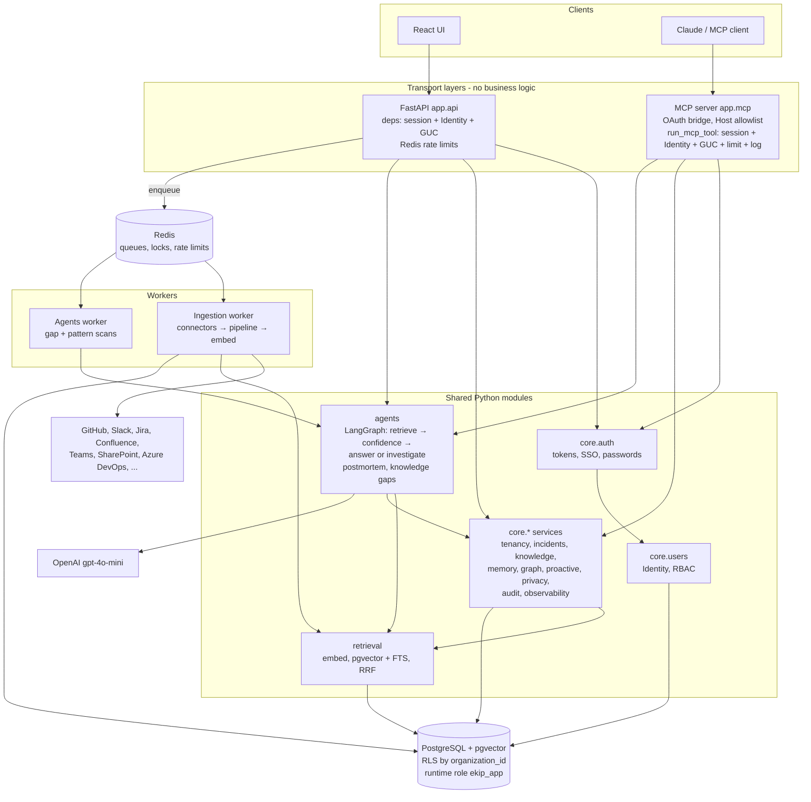

## 25.2 Fourteen questions, fourteen answers

1. **What is the project?** EKIP (repo name `mcp-logs`): a multi-tenant engineering-knowledge and incident-intelligence platform.
2. **Why does it exist?** To give fast, cited answers from scattered engineering knowledge, and to refuse or investigate honestly instead of hallucinating.
3. **Major components?** REST API, MCP server, ingestion worker, agents worker, React frontend; modules `core`, `agents`, `retrieval`, `ingestion`, `mcp`, `api`, `database`, `shared`; Postgres+pgvector; Redis.
4. **How does data enter?** Admins register connectors (credentials envelope-encrypted); syncs are enqueued (click, webhook endpoint, hourly cron); the ingestion worker fetches pages, normalizes, cleans, hashes, chunks, embeds, and stores. Humans/agents can also propose documents that reviewers publish.
5. **How is data stored?** Versioned `documents` + metadata; chunks with 384-d vectors and tsvectors in four collection tables; everything tagged with `organization_id` (+ project, ACL code).
6. **How does a user authenticate?** Password (bcrypt, with org selection if multi-org), OIDC SSO with PKCE (JIT provisioning by invitation/domain/group), or invitation token → EKIP issues a 60-minute HS256 access JWT and a rotating, hashed 30-day refresh token.
7. **How is authorization performed?** Each request resolves a frozen `Identity` (roles/permissions within the token's org, plus project overrides); services check same-org and `require_permission`/`require_project_permission`.
8. **How does MCP work?** Streamable HTTP at `/mcp`; thin tool handlers call `run_mcp_tool`, which resolves the same `Identity`, sets the tenant, rate-limits, calls one service, and logs to `mcp_requests`; Claude connects via an OAuth bridge that issues normal EKIP tokens.
9. **How does retrieval work?** Embed the (possibly rewritten) query; dense `<#>` + full-text search under hard tenant/ACL filters; RRF fusion; cross-encoder rerank; 4000-token context.
10. **How do agents work?** LangGraph: Retrieval Agent → deterministic Confidence (≥0.5) → Answer Agent (sufficiency → generate → grounding → citations) or Investigation Agent (evidence → hypotheses → bounded critique). Postmortem and knowledge-gap agents are linear pipelines.
11. **How does an incident get investigated?** `POST /incidents/{id}/investigate` or MCP `investigate_incident` → incident-read check → incident title+description as the query → evidence from code/docs/runbooks/chat/postmortems (+live GitHub/Slack) → hypotheses → critique → result attached to the incident timeline.
12. **How does tenant isolation work?** Org from the signed token → app-level org and permission checks → transaction-local `app.current_organization_id` → RLS policies on every tenant table, enforced because the app connects as `ekip_app` (NOSUPERUSER, NOBYPASSRLS); narrow `SECURITY DEFINER` functions handle "which org owns this?" bootstraps.
13. **How is everything audited?** `audit_logs` rows written in the same transaction as each mutation; `agent_executions` for every agent run (status, confidence, tokens); `mcp_requests` for every MCP call (separate transaction); `ingestion_jobs` for every sync; structlog events with request/org/user correlation.
14. **How is the system deployed?** One Docker image with different commands; migrations run as an admin role, services as `ekip_app`; Railway is the path with evidence of real use (backend, MCP, two workers, frontend); docker-compose for local production-shaped runs; Render/Cloudflare/Azure configs exist with the caveats in Part 18.

## 25.3 The five sentences to remember

1. **Identity is resolved once per call, frozen, org-scoped, and threaded everywhere.**
2. **The database, not just the code, enforces tenant isolation, but only when the app connects as `ekip_app`.**
3. **Retrieval is hybrid and filtered in SQL; confidence decides whether to answer; grounding decides what may be said.**
4. **Transports are thin: REST and MCP share one security path and one set of services.**
5. **Slow work lives in arq workers that checkpoint, lock, retry, and dead-letter.**

---

## Appendix — Final quality check performed

| Check | Result |
|---|---|
| 1. Re-scanned repository structure | Done via directory listings of `app/`, `tests/`, `scripts/`, `docs/`, `.github/`, `infra/`, `cloudflare/`, `frontend/`, root. |
| 2. Important source files omitted? | Every `app/` package is covered (individual connectors, evaluation submodules, and frontend components at group level). |
| 3. Migrations omitted? | All 24 revisions listed in 7.6 and Step 46. |
| 4. Tests omitted? | Key tests mapped in 17.3; full test directories listed in 4.1/17.1. |
| 5. Config/deployment omitted? | Dockerfile, compose (both), Railway (4 + frontend), Render, Cloudflare, Bicep, 5 workflows, env examples covered. |
| 6. MCP flow fully traced? | Yes (9.6, 15 Flow A). |
| 7. AuthN vs AuthZ separate? | Yes (Part 10). |
| 8. RLS fully explained? | Yes (Step 36, Part 8). |
| 9. Ingestion and RAG traced? | Yes (Parts 11, 12, Step 23). |
| 10. LangGraph/agents traced? | Yes (Part 13, Steps 28–35). |
| 11. Background jobs traced? | Yes (Part 14, Step 26). |
| 12. Every major decision has a WHY? | Parts 2, 19, 20. |
| 13. Limitations documented? | Part 24 (with labels). |
| 14. Interview questions grounded in code? | Each answer cites files (Part 23). |

*This guide was generated by reading the repository; it did not modify any other file.*
