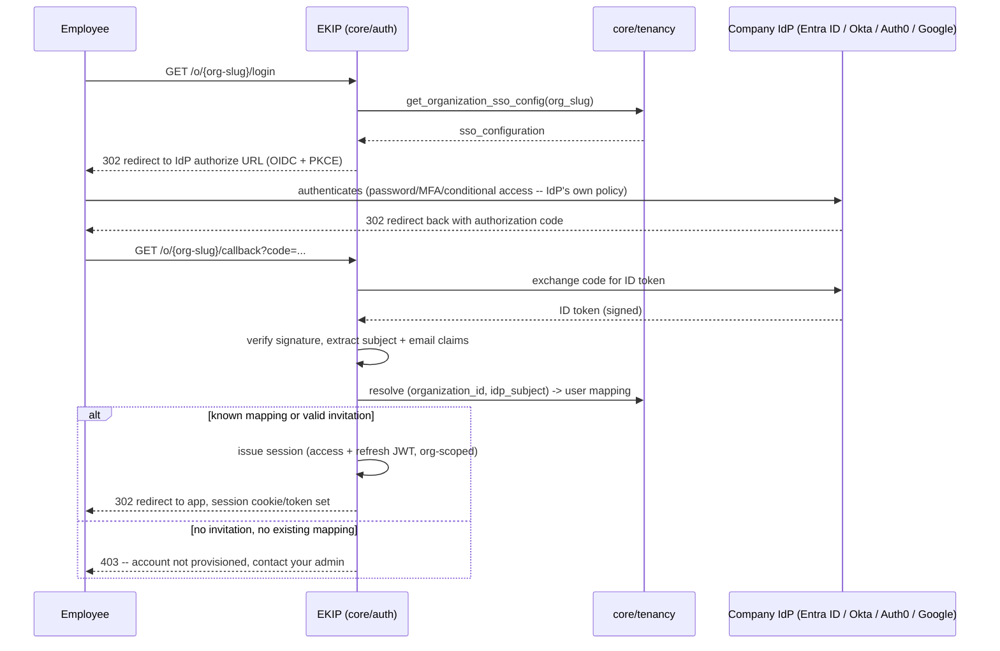
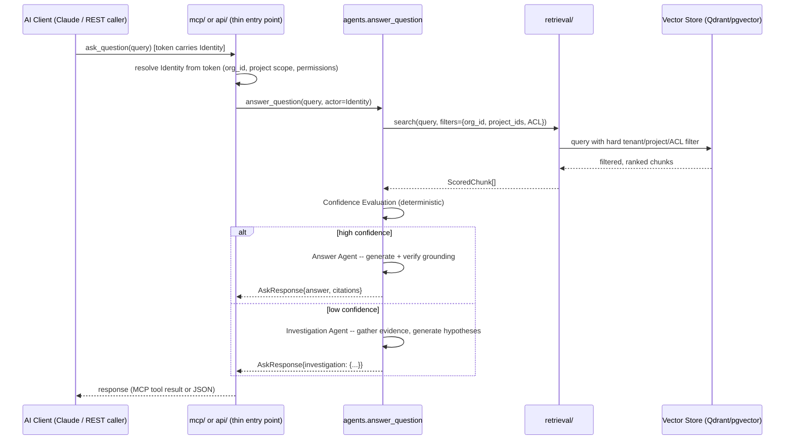
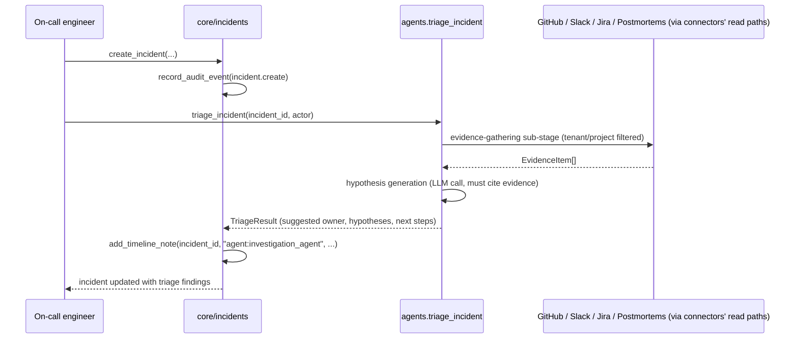
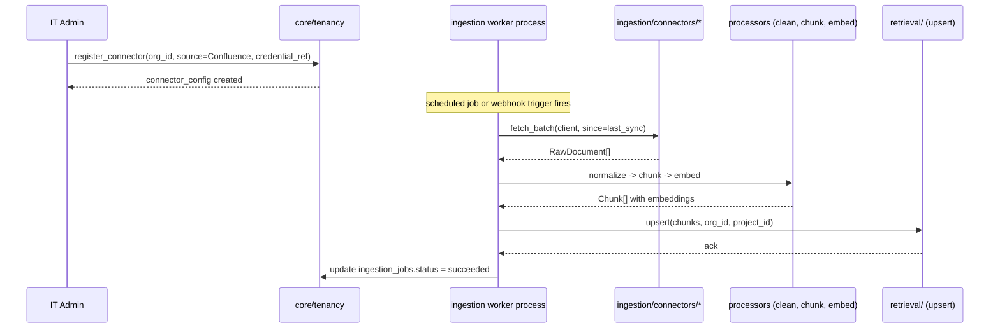
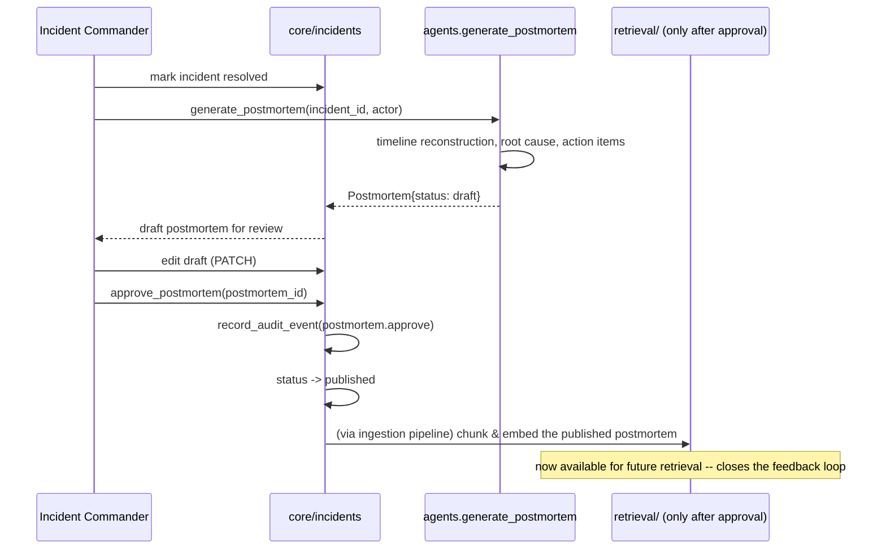

# EKIP — Enterprise AI Knowledge & Incident Intelligence Platform
## Project Plan & Architecture Reference

Status: **Design document — pre-implementation.** This document supersedes
parts of `DATABASE_DESIGN.md` and `ARCHITECTURE.md` where noted — specifically
everywhere multi-tenancy, SSO, and project-level authorization are introduced.
Those existing docs described a single-tenant system; this document upgrades
the design to multi-tenant SaaS before further implementation continues.
Treat disagreements between this file and the older docs as resolved in favor
of this file, and reconcile the older docs during the next documentation pass.

This is written for an engineer learning enterprise architecture, not just as
a spec — every non-obvious decision explains *why*, not just *what*.

---

## Table of Contents

1. Project Overview
2. High-Level Architecture
3. Multi-Tenancy & Authentication
4. Data Ingestion
5. Retrieval
6. Agents
7. MCP Integration
8. Database Architecture
9. Module Design
10. Folder Structure
11. Request Flows
12. Security
13. Scaling & Microservice Extraction
14. Development Roadmap

---

## 1. Project Overview

### 1.1 The problem

Engineering knowledge is scattered across tools that don't talk to each
other — Teams, Slack, Azure DevOps, Jira, GitHub, Confluence, SharePoint,
runbooks, incident reports, postmortems. When an incident happens, the
knowledge needed to resolve it fast is usually *somewhere* in that sprawl, but
finding it costs more time than the incident itself often warrants. Worse: an
AI system that naively searches this sprawl will confidently produce an
answer even when nothing relevant actually exists — a fabricated, plausible
answer is more dangerous during an incident than an honest "I don't know."

### 1.2 The non-negotiable design principle

**EKIP must never present a fabricated or unverifiable claim as fact.** Every
answer is either:
- Grounded — traceable to a specific retrieved passage, cited explicitly, or
- Explicitly uncertain — routed into an Investigation workflow that produces
  labeled hypotheses (never disguised as verified fact), or
- An honest refusal — "insufficient information," when even investigation
  turns up nothing.

This principle is not a prompt instruction. It is enforced structurally, at
multiple points in the pipeline (see §5 and §6) — a prompt asking the model to
"only cite real sources" is not a control, it's a suggestion. The actual
controls are: retrieval happens before generation and is the *only* source of
facts; a post-generation grounding check verifies every claim traces to a
retrieved chunk; and confidence scoring is a separate, deterministic function
the LLM cannot talk itself around.

### 1.3 Who uses it, and how that shapes the design

| Persona | Need | Architectural consequence |
|---|---|---|
| On-call engineer | Fast, cited answer during an active incident; if none exists, a real investigation start, not silence | Confidence-based routing (§6.2); Investigation Agent (§6.4) |
| Everyday engineer | "How does X work / where's this documented," via chat client | MCP as a first-class interface (§7), not a REST-only afterthought |
| Incident commander | Draft postmortems; review AI proposals before they become official | Human-approval gates before anything becomes "knowledge" (§6.5, §12) |
| Documentation/platform owner | Know which topics are under-documented | Knowledge Gap Agent (§6.6) |
| IT Admin (new persona for SaaS) | Onboard the company, connect tools, manage who has access | Multi-tenant onboarding & connector management (§3, §4) |
| Company employee (new framing for SaaS) | Log in with existing company identity, no separate password | SSO federation (§3.3), never a local password store |

### 1.4 Core capabilities (restated as a checklist)

- Cited, retrieval-grounded Q&A over enterprise knowledge, scoped to what the
  asking user is actually allowed to see.
- Incident triage: similar-incident retrieval, root-cause hypotheses,
  suggested owning team.
- Confidence-aware routing between "answer directly" and "investigate."
- Automated postmortem drafting, gated by mandatory human review.
- Continuous knowledge-gap detection, feeding back into documentation.
- MCP as the primary AI-client interface, so Claude Desktop/Code (or any
  MCP-compatible client) can use all of the above through one stable
  contract.
- **New in this document:** multi-tenant SaaS onboarding, enterprise SSO
  (Entra ID / Okta / Auth0 / Google Workspace), and project-level
  authorization within a tenant.

---

## 2. High-Level Architecture

### 2.1 Decision: modular monolith, not microservices, still

Nothing in the multi-tenancy requirement changes this decision — if anything
it reinforces it. A SaaS platform onboarding many companies has *more*
surface area to get right (tenant isolation bugs are catastrophic — one
company seeing another's incidents is not a bug, it's a breach), and a single
well-tested codebase with strict internal boundaries is easier to get
provably correct than a distributed system where the tenant-isolation check
has to be re-implemented consistently across N services.

The rule from the original architecture holds without modification:

> Every cross-module call is written as if it could become a network call
> tomorrow — plain, serializable data in and out, no shared database
> sessions, no reaching into another module's ORM models or tables.

### 2.2 What's new at the top level

One structural addition: tenancy is not a feature bolted onto `core/`, it is
a *cross-cutting concern* that every module must respect, the same way
`Identity` already is. Concretely: **every** table that stores tenant data
carries a `tenant_id`; **every** retrieval query is filtered by tenant (and
usually project) before it ever reaches ranking logic, let alone an LLM;
**every** `Identity` now carries which organization (and which projects
within it) the caller belongs to.

This is why tenancy is discussed before ingestion/retrieval/agents in this
document — it is a constraint those sections must be designed around, not an
add-on to bolt on afterward.

### 2.3 Module map (updated)

```
app/
├── core/
│   ├── auth/          # SSO federation, session issuance, token verification
│   ├── tenancy/        # organizations, projects, membership, connector config (NEW)
│   ├── users/          # user records, roles, permission resolution (now org-scoped)
│   ├── incidents/      # incident + postmortem + timeline records
│   └── audit/          # append-only audit trail
├── mcp/                 # MCP server(s): tools, resources, prompts — interface only
├── agents/              # LangGraph orchestration
├── ingestion/           # connectors, processing, chunking, embedding — background workers
├── retrieval/           # Qdrant / pgvector abstraction, hybrid search, reranking
├── database/            # SQLAlchemy models, migrations, session management
└── shared/              # config, logging, exceptions, common schemas (Identity, TenantContext)
```

The only structural addition versus the original module list is
`core/tenancy/`. Everything else keeps its original responsibility; each one
simply becomes tenant-aware.

---

## 3. Multi-Tenancy & Authentication

This is the section that changes the most relative to the original
single-tenant design, so it gets the most detail.

### 3.1 The tenant model

**Decision: shared database, shared schema, `tenant_id` on every tenant-owned
row — not schema-per-tenant, not database-per-tenant.**

Three standard approaches exist for multi-tenant data isolation:

| Approach | Isolation strength | Operational cost | Fits EKIP? |
|---|---|---|---|
| Database-per-tenant | Strongest (physical separation) | Very high — migrations, connection pooling, and backups all multiply per tenant | No — over-engineered for a platform that isn't yet at a scale where per-tenant physical isolation is a sales requirement |
| Schema-per-tenant | Strong | High — one schema migration per tenant on every release; connection/pool management complexity | No — same migration multiplication problem without full DB-level isolation |
| Shared schema, `tenant_id` column, enforced filtering | Weaker *if done carelessly*, strong *if enforced at multiple layers* | Low — one schema, one migration, N tenants | **Yes** |

The shared-schema approach only qualifies as production-grade if isolation is
enforced at more than one layer (defense in depth), because a single missed
`WHERE tenant_id = ...` clause in application code is a real, catastrophic
failure mode (cross-tenant data leak). EKIP enforces it at three layers:

1. **Application-level query scoping** — every repository function in every
   module that touches tenant-owned data takes a resolved tenant context and
   applies it as a mandatory filter; there is no code path that queries a
   tenant table without one (enforced by code review and, once the ORM layer
   supports it, a lint rule flagging any query against a tenant-scoped model
   missing a tenant filter).
2. **Database-level Row-Level Security (RLS)** — Postgres RLS policies on
   every tenant-owned table, keyed to a session-local `app.tenant_id`
   variable set once per request/connection. This is the last line of
   defense: even if application code has a bug, the database itself refuses
   to return rows outside the current tenant.
3. **Retrieval-time metadata filtering** — the vector store never returns a
   chunk whose `tenant_id` doesn't match the caller's, enforced as a hard
   filter passed into the search call itself, not a post-filter on results
   (see §5.5 for why this distinction matters).

If EKIP later sells to customers who contractually require physical data
separation (common in regulated industries), the shared-schema design does
not block that — it becomes a per-large-customer *deployment* decision
(stand up a dedicated instance of the whole monolith for that one tenant),
not a schema redesign.

### 3.2 New/changed data model concepts

- **`organizations`** — one row per company that purchases EKIP. Owns
  billing plan, SSO configuration, and is the root of the tenant_id used
  everywhere else (`organization_id` *is* the tenant id in this system —
  there is no separate "tenant" abstraction above organization).
- **`projects`** — a scoping unit *within* an organization (e.g., "Payments
  team," "Platform team"). Incidents, documents, and connectors can be scoped
  to a project. This is what "project-level authorization" (§3.6) filters on.
  A default/"General" project exists for organizations that don't need finer
  scoping — this keeps the model uniform (every incident has a project_id;
  small customers just have one project) rather than making project
  membership optional and forking query logic.
- **`sso_configurations`** — one row per organization, storing which IdP
  (Entra ID / Okta / Auth0 / Google Workspace) and the federation metadata
  needed to complete OIDC/SAML login for that org's employees.
- **`external_identity_mappings`** — maps an IdP's stable subject claim
  (e.g., Entra ID's `oid`) to an EKIP `users` row, per organization. This is
  what lets "Continue with Microsoft" resolve to the right internal user
  without EKIP ever storing a password.
- **`connector_configs`** — one row per (organization, source system)
  connection: which Slack workspace, which GitHub org, which Azure DevOps
  project, the OAuth/service-account credential reference (never the raw
  secret — see §12.5), sync schedule, and status.
- **`project_memberships`** — join table: which users belong to which
  projects, with which project-scoped role. This is the second tier of RBAC
  (§3.6).

Every existing table from `DATABASE_DESIGN.md` (`users`, `incidents`,
`documents`, `postmortems`, `audit_logs`, etc.) gains an `organization_id`
column, and the ones that support project-scoping (`incidents`, `documents`,
`connector_configs`) gain a `project_id` as well.

### 3.3 SSO federation architecture

**Decision: EKIP is never the identity provider. It federates to the
customer's existing IdP and issues its own short-lived session after
federation succeeds.**

Flow, in words:

1. Employee visits EKIP, or clicks a link scoped to their organization
   (`https://app.ekip.io/o/{org-slug}/login` or a domain-based lookup from
   their email).
2. EKIP looks up that organization's `sso_configurations` row to determine
   which protocol/IdP to redirect to.
3. Standard OIDC Authorization Code flow (with PKCE) for Entra ID, Okta,
   Auth0, Google Workspace — all four are OIDC-capable, so **one federation
   code path handles all of them**, configured per-organization rather than
   forked per-provider. (SAML support can be added later as a second code
   path behind the same internal interface, for IdPs that only offer SAML —
   not needed for the four listed providers, all of which support OIDC
   natively.)
4. IdP authenticates the employee (however that company has configured it —
   password, MFA, conditional access — EKIP has no visibility into or
   opinion on this).
5. IdP redirects back to EKIP with an authorization code; EKIP exchanges it
   for an ID token, verifies its signature against the IdP's published keys,
   and extracts the subject claim + email + org-specific claims (e.g., Entra
   ID group memberships, if configured).
6. EKIP resolves `(organization_id, idp_subject)` against
   `external_identity_mappings`. First-time login for a known-invited email
   creates the mapping (just-in-time provisioning); an email/subject with no
   invitation and no existing mapping is rejected — EKIP does not silently
   create accounts for arbitrary IdP users, only for ones the org admin
   invited or that fall under a pre-approved domain/group rule the admin
   configured.
7. EKIP issues its own signed session (JWT or opaque session token — see
   §3.4), scoped to that user + organization, and the employee is now
   "logged in" to EKIP proper.

**Why federate instead of accepting a bare IdP token from the client on
every request:** decouples every downstream module from IdP-specific token
formats entirely. `core/users`, `agents`, `mcp` — none of them need to know
Entra ID's claims differ from Okta's. They only ever see one `Identity`
shape, resolved once at the login boundary. Adding a fifth IdP later is a
change contained entirely to `core/auth`'s federation adapter, not a change
that ripples through the codebase.

### 3.4 Session/token model after login

EKIP issues a short-lived JWT access token (existing `jwt_secret_key` /
`jwt_algorithm` / `jwt_expiry_minutes` settings already in
`shared/config/settings.py` are the right mechanism, extended to carry
`organization_id` as a claim) plus a longer-lived refresh token. This is
identical in shape to the original single-tenant design — the only change is
that the claims now include which organization the session belongs to, and
every subsequent request's `Identity` resolution reads that claim to scope
all queries.

This is also the token used by MCP clients (§7) and the REST API alike — one
token format, one verification path, so RBAC enforcement is identical
regardless of entry point (a principle already established in
`ARCHITECTURE.md §6` and unchanged here).

### 3.5 RBAC — updated for multi-tenancy

The original RBAC model (`roles`, `permissions`, `role_permissions`,
`user_roles`) was global — one flat set of roles for the whole platform. That
no longer makes sense once organizations are independent customers: two
companies must not be able to see or influence each other's role
configuration, and (usually) a fixed catalog of roles per company is
sufficient — companies buying a SaaS product expect a curated role set
(`admin`, `engineer`, `incident_commander`, `viewer`), not a bespoke
permission-builder UI, at least for the MVP.

**Decision: roles and permissions remain a fixed, platform-defined catalog
(not customer-editable in the MVP), but role *assignment* to a user is
scoped per-organization.**

Concretely: `user_roles` becomes `(user_id, organization_id, role_id)` —
the same user could theoretically belong to multiple organizations (e.g., a
consultant), with a different role in each, though the common case is one
user in one organization. `authorize()` becomes tenant-aware: it checks not
just "does this identity have permission X" but "does this identity have
permission X *within organization Y*" — the organization the request is
scoped to. This closes the obvious gap where a user's permissions could
leak across organizations if they somehow belonged to more than one.

### 3.6 Project-level authorization

A second, finer-grained scope beneath organization: `project_memberships`
grants a user a role *within a specific project*, which can be more
restrictive (or occasionally broader — e.g., an org admin auto-belongs to
every project) than their organization-level role. Example: an engineer with
the org-wide `engineer` role might only be a `viewer` on the "Payments"
project's incidents if they're not on that team, and a full `engineer` on
"Platform," reflecting real team boundaries.

`Identity` (already defined in `shared/schemas/identity.py`) needs to grow to
carry this. The extension, conceptually:

```
Identity (already exists):
    kind, subject, user_id, display_name, roles, permissions

Identity (extended for tenancy):
    + organization_id: UUID          # which org this session is scoped to
    + project_permissions: dict[project_id, frozenset[str]]
                                       # per-project permission overrides,
                                       # falling back to org-level `permissions`
                                       # for any project not listed
```

`authorize(actor, permission_code, project_id=None)` becomes: if
`project_id` is given and `actor.project_permissions` has an entry for it,
check that set; otherwise fall back to the org-level `permissions` set. This
keeps the common case (no project-level override) exactly as cheap as today's
pure set-membership check, and only pays the extra lookup cost when a project
override actually exists.

*(Flag: this is a breaking change to the already-implemented
`Identity`/`authorize`/`resolve_identity` code from earlier in this project.
When implementation resumes, this needs a deliberate migration step, not a
silent rewrite — call it out as a new numbered entry in
`ENGINEERING_DECISIONS.md` when that happens.)*

### 3.7 Tenant isolation — summary of every enforcement point

| Layer | Mechanism |
|---|---|
| Login | Session token is minted with exactly one `organization_id`; a user cannot request a token for an org they don't belong to |
| Application queries | Every repository function requires a tenant context parameter; no tenant-owned table is queryable without it |
| Database | Postgres RLS policies as a hard backstop independent of application code |
| Vector search | `organization_id` (and `project_id` where relevant) is a mandatory filter passed into the retrieval query itself |
| Background jobs | Ingestion jobs are queued per-`connector_config`, which is itself organization-scoped; a job can never process or write data for an org other than the one that owns the connector |
| Audit log | Every audit row carries `organization_id`; audit queries are tenant-scoped like everything else |
| MCP | The token resolved at MCP connection time carries the org scope; no MCP tool call can specify a different organization than the caller's own token |

---

## 4. Data Ingestion

### 4.1 Why connectors must contain zero business logic

A connector's only job is: authenticate to one external system, pull raw
content, and normalize it into a common `RawDocument` shape (source, external
id, raw content, basic metadata). It must not decide what's "important," must
not summarize, must not chunk, must not embed, and must not know anything
about incidents, postmortems, or confidence scoring.

The reason this boundary matters more than it might seem: connectors are the
part of the system most likely to grow in count (today: Teams, Slack, Azure
DevOps, Jira, GitHub, Confluence, SharePoint — tomorrow, more). If each new
connector had to re-implement "how do I decide if this is worth chunking" or
"how do I detect duplicate content," every connector addition would risk
subtly different business behavior per source. Centralizing chunking,
dedup, and metadata normalization in the shared processing pipeline means
adding connector #8 is purely "how do I authenticate and fetch from this
API" — a bounded, mechanical task.

### 4.2 Connector architecture

Every connector implements one common interface (conceptually a `Protocol`,
not a base class with inherited behavior — composition over inheritance, so a
connector can't accidentally inherit pipeline logic it shouldn't own):

```
Connector:
    source_name: str
    authenticate(config: ConnectorConfig) -> AuthenticatedClient
    fetch_batch(client, since: datetime | None, cursor: str | None) -> FetchResult
    normalize(raw_item) -> RawDocument
```

`fetch_batch` supports both full syncs (`since=None`) and incremental syncs
(`since=last_successful_sync_at`), with cursor-based pagination so a
connector can resume a partial fetch without re-processing everything.

### 4.3 OAuth vs. service accounts — two different credential flows

This distinguishes two *separate* OAuth concerns that are easy to conflate:

1. **Platform login OAuth/OIDC** (§3.3) — how an *employee* authenticates to
   EKIP itself, via the company's SSO.
2. **Connector OAuth** — how *EKIP itself* authenticates to Slack, GitHub,
   Azure DevOps, etc., to pull data on the organization's behalf. This is set
   up once by the IT Admin during onboarding (not per-employee), using
   either a standard OAuth app-install flow (Slack, GitHub) or a service
   account / app registration with delegated or application permissions
   (Azure DevOps, SharePoint via Microsoft Graph).

Employees never provide API keys for either of these — this is stated as a
hard requirement in the brief and it holds throughout: the *organization*
authorizes data access once at setup time; employees only ever authenticate
themselves via SSO.

### 4.4 Scheduling vs. webhooks

Both are used, chosen per source based on what it supports and how latency-
sensitive its content is:

- **Webhooks** (preferred where available: Slack Events API, GitHub
  webhooks, Azure DevOps service hooks) — near-real-time ingestion of new
  content, without polling. The webhook handler does the minimum possible
  work: verify the signature, enqueue a job with the event payload, return
  200 immediately. All real processing happens in the background worker, not
  in the webhook request/response cycle — webhook senders have short
  timeouts and will retry (creating duplicate-delivery risk) if the handler
  is slow, so keeping the handler trivial is a reliability requirement, not
  just a performance nicety.
- **Scheduled polling** (Jira, Confluence, SharePoint, or any source without
  reliable webhooks, plus as a periodic reconciliation pass even for
  webhook-supported sources, to catch anything a missed/failed webhook
  delivery would otherwise silently drop) — a periodic job per
  `connector_config`, using `since=last_successful_sync_at` for incremental
  fetches.

### 4.5 Background workers, retries, rate limiting

Ingestion runs as a **separate worker process from the API server from day
one** (this decision predates the multi-tenancy work and still holds,
recorded in `ENGINEERING_DECISIONS.md #002`), backed by a Redis job queue
(`arq`, decision `#003`).

- **Retries:** exponential backoff per job, with a bounded max-attempt count.
  A job that exhausts retries is marked `failed` with the specific pipeline
  stage recorded (`ingestion_jobs.failed_stage`), so a manual or automatic
  retry resumes from that stage rather than re-fetching from the source
  entirely — important because re-fetching a large Confluence space or
  GitHub org from scratch is expensive and usually unnecessary; only the
  stage that actually failed (e.g., embedding generation timing out) needs
  to re-run.
- **Rate limiting:** every connector declares its source's rate limit
  characteristics (requests/second, or a token-bucket budget); the worker
  pool enforces this per-`connector_config` — critically, per organization's
  connection, not globally, so one tenant's aggressive GitHub org sync
  cannot starve another tenant's Slack sync of worker capacity. This is
  itself a tenant-isolation concern, just at the resource-fairness level
  rather than the data level.

### 4.6 Metadata, chunking, embeddings, vector storage

Unchanged in principle from the original design, with tenant/project tags
added at every stage:

```
Source
    ↓
Connector            — auth + fetch, normalize → RawDocument
    ↓
Document Processing  — strip noise, extract metadata (author, timestamp,
                        source URL), attach organization_id + project_id
    ↓
Chunking             — split into retrieval-sized units, preserving
                        source-anchored offsets for citation; chunking
                        strategy varies by content type (code chunked by
                        function/class boundary; chat/tickets by
                        message/comment boundary; long docs by heading
                        section) — this is a per-content-type decision,
                        not per-source, since e.g. code can arrive via
                        GitHub or Azure DevOps but should chunk the same way
    ↓
Embedding Generation — dense vector via a sentence-transformers model
    ↓
Vector Storage       — upsert into Qdrant or pgvector, tagged with
                        organization_id, project_id, source, ACL metadata
    ↓
Metadata Storage     — Postgres row per document/chunk, linked by chunk ID
    ↓
Indexing             — lexical (BM25) index update alongside the vector
                        index, for hybrid search
```

Idempotency (`(organization_id, source, external_id, content_hash)` as the
uniqueness key — organization_id added to the original key) ensures
re-ingesting unchanged content is a no-op and changed content versions
rather than duplicates, exactly as in the original design.

---

## 5. Retrieval

### 5.1 Semantic search

Dense vector similarity search: embed the query with the same model used at
ingestion time, find nearest neighbors in the vector store. Good at "meaning"
matches even when wording differs, weak at exact-identifier matches (error
codes, function names, ticket IDs — an embedding model doesn't treat
`ERR_5023` as special).

### 5.2 Hybrid search

Combine dense retrieval with BM25 (lexical/keyword) retrieval, merged via
reciprocal rank fusion. This specifically compensates for semantic search's
weakness on exact identifiers, which are extremely common in engineering
queries ("why does `ERR_5023` happen," "what changed in `PR-4821`"). Both
retrieval modes run against the same tenant/project-filtered candidate set
(filtering happens before fusion, not after — see §5.5).

### 5.3 Reranking

A cross-encoder reranker re-scores the fused candidate set with a more
expensive but more accurate model than the initial retrieval pass. Initial
retrieval optimizes for recall over a large corpus cheaply; reranking
optimizes precision over a small candidate set (typically top 20-50)
expensively — a standard two-stage retrieval pattern.

### 5.4 Metadata filtering (tenant, project, RBAC)

This is the most safety-critical part of retrieval in a multi-tenant system,
so it's given its own subsection rather than folded into "metadata
filtering" generically.

Three filters are applied, all as **hard constraints on the search query
itself** — passed to the vector store / SQL query as part of the `WHERE`
clause or Qdrant payload filter, not as a post-processing step on returned
results:

1. **Tenant filter** — `organization_id = caller's organization_id`,
   always, unconditionally, on every retrieval call with no exceptions and
   no "admin override" query path that skips it (an admin needing
   cross-tenant visibility, if ever required, gets a distinct, explicitly
   audited operation — not a bypassable flag on the normal search path).
2. **Project filter** — `project_id IN (caller's accessible projects)`,
   derived from `Identity.project_permissions` (§3.6).
3. **Document-level ACL filter** — some documents may be restricted below
   the project level (e.g., an HR-sensitive postmortem, or a document
   explicitly marked confidential); each document carries an ACL reference
   checked against the caller's permissions, same pattern as project
   filtering but at finer grain.

### 5.5 Why this must happen *before* the LLM ever sees anything

**The LLM must never receive a document the caller isn't authorized to see —
not even to "ignore" it.**

Two independent reasons this is a hard requirement, not a nice-to-have:

1. **Prompt injection / instruction-following is not a security boundary.**
   An LLM told "here are some documents, but ignore document #3, it's
   restricted" is trusting the model to reliably comply with an instruction
   embedded in its own context — and that instruction can be undermined by
   adversarial content in the documents themselves, or simply by ordinary
   model imperfection. A security boundary must be enforced by code that
   either includes or excludes data, not by hoping a probabilistic model
   honors a request.
2. **The context window itself is an exposure surface.** Even if the model
   perfectly ignores restricted content in its final answer, that content
   still passed through the LLM API call, potentially through logging,
   caching, or observability tooling downstream. The only way to guarantee
   an unauthorized document never leaks through any of those paths is for
   it to never enter the request in the first place.

This is why §5.4's filters are described as being on "the search query
itself," not "the search results" — a query with `WHERE organization_id =
X` never returns another organization's rows from the database or vector
store engine at all; there is nothing to accidentally leak downstream because
it was never fetched.

### 5.6 Confidence scoring

Unchanged in principle from the original single-tenant design: a
deterministic (non-LLM) function combining top similarity score, reranker
score, and distinct-source count into a confidence value, checked against a
threshold to route between the Answer Agent and the Investigation Agent
(§6.2 for full detail). Multi-tenancy adds no new signal here — it only
constrains what's eligible to be scored in the first place (only chunks that
passed the §5.4 filters ever reach this stage).

### 5.7 Citation verification

After the Answer Agent generates a response, every factual sentence is
checked for traceability back to a specific retrieved chunk (embedding
similarity between generated sentence and source chunk, escalating to an
LLM-based check only when that similarity is ambiguous — avoiding a second
full LLM call for the common, clearly-grounded case). A sentence that can't
be traced is either removed or triggers a fallback to "insufficient grounded
information," per the non-hallucination principle in §1.2.

---

## 6. Agents

All agents run inside a single LangGraph state machine (except the Knowledge
Gap Agent, which is a separate scheduled graph). One typed state object is
threaded through every node — never a raw dict — carrying the query,
retrieved evidence, confidence score, and the resolved `Identity` (so every
node has access to the tenant/project scope without re-deriving it).

### 6.1 Retrieval Agent

- **Responsibility:** turn a raw query into ranked, citation-anchored,
  authorization-filtered evidence.
- **Inputs:** `query: str`, `incident_id: UUID | None`, `actor: Identity`.
- **Outputs:** `retrieved_chunks: list[ScoredChunk]`, `rewritten_query: str`.
- **Internal workflow:** (1) query understanding/rewriting — resolves
  vague references like "this error" into the actual incident's error text,
  skipped as a cheap pass-through when the query is already specific enough
  to avoid unnecessary LLM latency; (2) hybrid retrieval against
  `retrieval.search()`, with tenant/project/ACL filters applied as
  mandatory query parameters (§5.4); (3) cross-encoder reranking;
  (4) context assembly within a token budget, preserving source offsets for
  citation.
- **Failure cases:** vector-store or embedding-service timeout → retried
  with backoff; zero results after retry exhaustion → proceeds to Confidence
  Evaluation anyway with an effectively-zero score (this is not an error
  state — it's exactly the case the Investigation route exists for).

### 6.2 Confidence Evaluation Node

- **Responsibility:** deterministic scoring — no LLM call — combining
  signals into a single confidence value and routing.
- **Inputs:** `retrieved_chunks` and their scores.
- **Outputs:** `confidence_score: float`, `confidence_signals: dict` (kept
  for observability — routing decisions must be explainable after the fact),
  `route: "answer" | "investigation"`.
- **Internal workflow:** combines top similarity, top rerank score,
  distinct-source count (five chunks from one document is weaker evidence
  than one chunk each from five documents), and — for incident-triage calls
  — historical similarity to past *resolved* incidents specifically, into a
  weighted score checked against a configurable threshold.
- **Failure cases:** none in the traditional sense — this node is pure
  computation with no I/O, so it cannot time out or fail transiently; the
  only "failure" is an eventually-tuned threshold being wrong, which is a
  data/tuning problem, not a code-failure one.

### 6.3 Answer Agent

- **Responsibility:** generate the final cited response, reached only when
  `route == "answer"`.
- **Inputs:** `retrieved_chunks`, `rewritten_query`.
- **Outputs:** `result.answer: str`, `result.citations: list[Citation]`.
- **Internal workflow:** generation constrained to the retrieved context
  only, followed immediately by the grounding/citation verification pass
  from §5.7.
- **Failure cases:** LLM timeout/rate-limit → retried with backoff;
  grounding check fails repeatedly even after retry → falls back to
  "insufficient grounded information" rather than shipping an ungrounded
  answer.

### 6.4 Investigation Agent

- **Responsibility:** reached only when `route == "investigation"`;
  evidence-gathering and hypothesis generation, kept as two explicit
  sub-stages so "verified vs. AI-generated" is structural, not just a prompt
  convention.
- **Inputs:** `query`, `incident_id`, `actor`.
- **Outputs:** `result.investigation.evidence: list[EvidenceItem]`,
  `result.investigation.hypotheses: list[RootCauseHypothesis]`,
  `suggested_owner_team`, `suggested_next_steps`.
- **Internal workflow — Sub-stage A (evidence gathering, no interpretation):**
  searches, in priority order, recent deployments/commits, related pull
  requests, Slack/Teams conversations mentioning similar symptoms, Jira/Azure
  DevOps tickets with related labels, and existing postmortems (even
  below the direct-answer confidence threshold — partial matches are still
  useful investigative context here). All searches are tenant/project
  filtered identically to §5.4. **Sub-stage B (hypothesis generation):** one
  LLM call over the assembled evidence, producing hypotheses that must each
  cite specific `supporting_evidence_ids` from Sub-stage A — a hypothesis
  with no cited evidence is rejected by a validation step, never surfaced.
- **Failure cases:** an individual source failing (e.g., a rate-limited
  GitHub API) is logged and skipped, not treated as fatal — partial evidence
  is still useful; zero evidence found across every source → returns an
  empty evidence list with generic next steps ("no automated evidence found,
  recommend manual investigation starting with X") rather than fabricating a
  hypothesis from nothing.

### 6.5 Postmortem Agent

- **Responsibility:** draft a postmortem after a human marks an incident
  resolved — never runs automatically on every incident.
- **Inputs:** `incident_id`, `actor`.
- **Outputs:** a `Postmortem` row, always created with `status = "draft"`.
- **Internal workflow:** timeline reconstruction from `incident_timeline`
  (merging human notes and any attached Investigation Agent evidence) →
  root-cause extraction (starting from an uncontradicted Investigation
  hypothesis if one exists, otherwise derived fresh) → action-item generation
  (one LLM call) → structured report assembly.
- **Failure cases:** this is a linear pipeline with no confidence gating,
  because the actual quality gate is the mandatory human review
  (`/postmortems/{id}/approve`), not agent self-assessment — a bad draft is
  a review-and-edit problem, not a system failure.

### 6.6 Knowledge Gap Agent

- **Responsibility:** runs as a separate scheduled graph (or triggered after
  postmortem approval), not part of the per-question flow.
- **Inputs:** recent `agent_executions` rows (tenant-scoped).
- **Outputs:** `list[GapReport]` — suggested topic, supporting execution
  IDs, suggested action (new runbook vs. update existing).
- **Internal workflow:** query recent low-confidence executions per
  organization, cluster by topic similarity (embedding-based clustering over
  `input_summary`) to find *repeated* gaps rather than one-off low-confidence
  queries, and for clusters above a repetition threshold, generate a report.
- **Failure cases / boundary:** **never auto-creates a document.** A gap
  report is a recommendation surfaced to a human; turning it into an actual
  proposed runbook is a separate, explicit human-triggered action. This
  keeps the agent's blast radius limited to "suggest."

---

## 7. MCP Integration

### 7.1 Why MCP exists here

MCP gives any MCP-compatible AI client (Claude Desktop, Claude Code, future
internal tools) a stable way to use EKIP's capabilities without knowing
anything about its internals — module structure, database schema, or agent
implementation. It is the primary interface for engineers interacting with
EKIP through their existing AI tools, rather than a bespoke chat UI.

### 7.2 Architecture

```
Claude Desktop / Claude Code
         │  (MCP protocol over stdio or HTTP+SSE)
         ▼
   EKIP MCP Server  (app/mcp/)
         │  translates tool call → internal call
         ▼
  core/ and agents/ public interfaces
         │
         ▼
   (database/, retrieval/, ingestion/ — never touched directly by mcp/)
```

### 7.3 Why MCP must stay thin

Every tool handler's body is, without exception: validate MCP input →
resolve `Identity` (including `organization_id`) from the MCP auth token →
call the matching `core` or `agents` public interface function → translate
the result into an MCP tool response. **No business logic, no database
access, no direct calls to external knowledge-source APIs.**

The concrete failure mode this prevents: a tool handler that "just quickly"
queries a table directly instead of going through `core` becomes a second,
divergent business-logic path — one that skips whatever validation or
tenant-filtering logic lives in the real `core` interface. Because MCP and
the REST API are two entry points into the *same* `core`/`agents` functions,
keeping MCP thin is what guarantees both entry points enforce identical
authorization, identical tenant isolation, and identical confidence-routing
logic — they cannot drift apart in behavior if neither has its own copy of
the logic to drift.

### 7.4 Authentication boundary for MCP

An MCP client authenticates with a token scoped to a user or service
identity — the same session token described in §3.4, including its
`organization_id` claim. `mcp/` resolves that identity once at connection
time and passes it into every downstream call; **MCP never has broader
access than the REST API would grant the same identity**, and it cannot be
used to specify or access a different organization than the one embedded in
the token.

---

## 8. Database Architecture

### 8.1 SQL (Postgres / Neon) — what belongs here

Everything transactional, relational, and requiring strong consistency:
organizations, projects, users, roles/permissions, project memberships,
connector configs, sso configurations, external identity mappings,
incidents, incident timeline, postmortems, audit logs, agent executions, mcp
requests, ingestion jobs, documents, document metadata. Also: the
`<collection>_chunks` tables *when* a collection uses pgvector as its
backend, so vector and metadata stay in one transactionally-consistent
store for those collections.

### 8.2 Vector database (Qdrant or pgvector) — what belongs here

Chunk embeddings for semantic search, one collection per content category
(documentation, incidents, code, conversations), each tagged with
`organization_id`, `project_id`, `source`, and ACL metadata as payload
fields usable as hard query filters (§5.4-§5.5).

### 8.3 Why both exist

A relational database is the right tool for anything requiring joins,
transactions, and exact-match/range queries with strong consistency
guarantees — access control, audit trails, incident state machines. It is
not the right tool for approximate nearest-neighbor search over
high-dimensional embeddings at scale (pgvector narrows this gap for
moderate-scale collections, which is exactly why it's an acceptable default
for smaller collections, but a purpose-built vector engine like Qdrant wins
at larger scale or when payload-filtered ANN search throughput matters more
than transactional co-location).

### 8.4 The pgvector-vs-Qdrant choice is per-collection, not global

Both backends sit behind one `retrieval.VectorStore` interface
(`search`, `upsert`, `delete`), so choosing pgvector for the "incidents"
collection (moderate size, benefits from transactional consistency with the
relational incident data) and Qdrant for "documentation" (larger, read-heavy,
benefits from independent scaling) is a configuration decision per
collection, not an architectural fork requiring different code paths.

---

## 9. Module Design

For each module: purpose, responsibilities, public API (conceptual, not
literal code), internal components, dependencies, what it must never do, and
its future extraction path.

### 9.1 `core/auth`

- **Purpose:** turn a raw credential (an SSO federation result, or a
  refresh token) into a verified, resolved session.
- **Responsibilities:** OIDC federation orchestration per organization's
  `sso_configurations`; issuing and verifying EKIP's own JWTs; refresh-token
  rotation.
- **Public API:** `complete_sso_login(org_slug, auth_code) -> SessionTokens`,
  `verify_access_token(token) -> ResolvedClaims`, `refresh(refresh_token) ->
  SessionTokens`.
- **Internal components:** an OIDC client adapter (provider-agnostic, since
  all four supported IdPs speak OIDC), JWT signing/verification, refresh
  token storage.
- **Dependencies:** `core/tenancy` (to look up an org's SSO config),
  `core/users` (to resolve/create the mapped user), `database`, `shared`.
- **Must never do:** store a password (there is none to store); read
  roles/permissions directly (that's `core/users`'s job — auth answers "who
  is this," not "what can they do"); know anything about incidents or
  documents.
- **Future extraction:** a natural second candidate after `ingestion` — auth
  is stateless-ish per request (verification is a pure JWT check) and could
  become a small, independently-scaled "identity service" if request volume
  ever demanded it. Low priority; nothing about the current design blocks it
  later.

### 9.2 `core/tenancy` (new module)

- **Purpose:** the source of truth for "what organization/project does this
  belong to, and what's connected to it."
- **Responsibilities:** organization CRUD and onboarding state; project
  CRUD; `connector_configs` management (not the connectors themselves — just
  the configuration/credential-reference records); `sso_configurations`
  management.
- **Public API:** `create_organization(...)`, `get_organization(...)`,
  `create_project(...)`, `register_connector(org_id, source, credential_ref,
  ...)`, `list_connectors(org_id)`.
- **Internal components:** onboarding state machine (invited → connecting
  tools → active), connector credential reference handling (the actual
  secret lives in a secrets store, per §12.5 — this module stores only a
  reference/identifier to it).
- **Dependencies:** `database`, `shared`.
- **Must never do:** perform the actual OAuth handshake with Slack/GitHub/etc.
  (that's `ingestion`'s connector layer's job, using the credential this
  module manages a reference to); make retrieval/RBAC decisions (those
  consume tenancy data, they don't live inside it).
- **Future extraction:** could become a standalone "tenant management
  service" if EKIP grows a dedicated admin console product surface distinct
  from the core knowledge platform — speculative, not planned.

### 9.3 `core/users`

- **Purpose:** identity resolution and RBAC (org- and project-scoped).
- **Responsibilities:** user records, role catalog, role assignment (now
  per-organization), project membership and project-scoped role assignment,
  building a fully-populated `Identity` from persisted assignments.
- **Public API:** `resolve_identity(user_id, organization_id) -> Identity`,
  `authorize(actor, permission_code, project_id=None) -> bool`,
  `require_permission(actor, permission_code, project_id=None) -> None`,
  `get_user_profile(...)`.
- **Internal components:** role/permission resolution queries (joins across
  `user_roles`, `role_permissions`, `project_memberships`).
- **Dependencies:** `database`, `shared`.
- **Must never do:** verify credentials or talk to an IdP (that's
  `core/auth`); make retrieval or agent decisions.
- **Future extraction:** low priority; tightly coupled to `core/incidents`'
  authorization needs in practice, so extracting it alone without its
  callers would mostly just add a network hop for every permission check.

### 9.4 `core/incidents`

- **Purpose:** the incident and postmortem system of record.
- **Responsibilities:** incident CRUD, timeline entries, postmortem records
  and their review/approval state machine.
- **Public API:** `create_incident`, `get_incident`, `update_incident`,
  `add_timeline_note`, `approve_postmortem`.
- **Dependencies:** `core/users` (authorization checks),
  `core/audit` (recording changes), `database`, `shared`; calls into
  `agents` to trigger postmortem generation / triage (one-way — `agents`
  never calls back into `core/incidents` directly, it returns data that
  `core/incidents` or the calling entry point then persists).
- **Must never do:** call external APIs directly; contain LangGraph/agent
  logic; query `retrieval` directly (goes through `agents` for anything
  requiring search).
- **Future extraction:** a plausible second-tier candidate once incident
  volume or the desire for independent on-call-tooling deployment justifies
  it — not urgent.

### 9.5 `core/audit`

- **Purpose:** append-only record of who did what, when — unchanged in
  responsibility from the original design, now tenant-scoped.
- **Public API:** `record_audit_event(...)`, `query_audit_log(...)`.
- **Must never do:** update or delete a row, ever.
- **Future extraction:** could become a shared platform-wide audit service
  if EKIP ever has multiple products needing one audit trail — speculative.

### 9.6 `mcp/`

- Purpose, responsibilities, and constraints as detailed in §7.
- **Public API:** the MCP server's declared tool set is the interface, from
  the outside world's perspective.
- **Dependencies:** `core/*` and `agents/` public interfaces only.
- **Must never do:** touch `database`, `retrieval`, or `ingestion` directly;
  contain business logic (§7.3).
- **Future extraction:** the **second** most likely extraction candidate
  after `ingestion` (§13), if external AI-client traffic grows large enough
  to want independent scaling from the REST API.

### 9.7 `agents/`

- Purpose and per-agent detail as in §6.
- **Public API:** `answer_question`, `triage_incident`, `generate_postmortem`,
  `detect_knowledge_gaps`.
- **Dependencies:** `retrieval` (search), `core` (read-only lookups, writing
  back results like postmortem drafts), `shared`.
- **Must never do:** own a copy of business data (reads incidents through
  `core`'s interface, not by querying tables); perform raw
  embedding/chunking (that's `ingestion`/`retrieval`'s job); call `mcp` or
  `ingestion` internals directly.
- **Future extraction:** a strong long-term candidate given it's the most
  compute/LLM-cost-heavy module and the one most likely to benefit from
  independent scaling (e.g., GPU/inference-optimized infrastructure distinct
  from the transactional API) — not the *first* candidate only because
  `ingestion`'s failure-isolation need is more urgent than agents' scaling
  need, at current expected load.

### 9.8 `ingestion/`

- Purpose and pipeline detail as in §4.
- **Public API:** `run_ingestion_job(connector_config_id)`,
  `reindex(document_id)`, `get_job_status(job_id)`.
- **Dependencies:** `retrieval` (to write vectors), `database` (job/document
  metadata), `shared`.
- **Must never do:** answer user questions, run agent logic, expose
  anything over MCP directly.
- **Future extraction:** **first** and clearest extraction candidate (§13)
  — already runs as a separate process, already communicates via a queue,
  already has bursty/independent scaling needs distinct from the rest of the
  system.

### 9.9 `retrieval/`

- Purpose and detail as in §5.
- **Public API:** `search(query, filters, top_k) -> list[ScoredChunk]`,
  `upsert(chunks)`, `delete(...)`.
- **Dependencies:** `database` (metadata joins), `shared`.
- **Must never do:** know anything about incidents, postmortems, agents, or
  organizations-as-a-concept beyond "a filter value" — it only knows
  documents, chunks, and queries, which is what keeps it reusable and
  independently testable.
- **Future extraction:** natural to extract alongside or shortly after
  `ingestion`, since both revolve around the same vector store; Qdrant being
  already a separate process makes this extraction closer to "point the
  existing client at a new deployment" than a rewrite.

### 9.10 `database/`

- **Purpose:** the single shared persistence layer.
- **Responsibilities:** SQLAlchemy models, Alembic migrations, session
  management, Postgres RLS policy definitions (§3.7).
- **Dependencies:** none — it's the bottom of the dependency graph.
- **Must never do:** contain business logic of any kind; be imported for
  anything other than models/session/migrations.
- **Future extraction:** not extracted itself — it's infrastructure that
  every extracted module continues to depend on directly (each extracted
  service would get its own connection to the same physical database, or a
  split database per service *if and when* that specific service's data no
  longer needs transactional consistency with the rest — a later, evidence-
  driven decision, not a default assumption).

### 9.11 `shared/`

- **Purpose:** cross-cutting concerns with no business meaning of their own.
- **Responsibilities:** config loading, structured logging, base exception
  types, `Identity`, `TenantContext`, common Pydantic schemas (`Citation`,
  etc.) used by more than one module.
- **Dependencies:** none.
- **Must never do:** depend on any business module; accumulate business
  logic (the moment `shared/` needs to know what an "incident" is, that code
  belongs in `core/incidents`, not here).
- **Future extraction:** never extracted as a service — it becomes a shared
  library/package instead, published and versioned, consumed by whichever
  modules have been extracted.

---

## 10. Folder Structure

```
ekip/
├── docs/                          # design-of-record documents (this file and its siblings)
│
├── app/
│   ├── core/
│   │   ├── auth/                  # SSO federation, session issuance/verification
│   │   │   ├── schemas.py         # LoginRequest, TokenResponse, TokenClaims
│   │   │   ├── repository.py      # persistence for refresh tokens / federation state
│   │   │   └── service.py         # public interface: complete_sso_login, verify_access_token
│   │   │
│   │   ├── tenancy/                # organizations, projects, connector configs, SSO config (NEW)
│   │   │   ├── schemas.py
│   │   │   ├── repository.py
│   │   │   └── service.py
│   │   │
│   │   ├── users/                  # identity resolution, RBAC (org + project scoped)
│   │   │   ├── schemas.py
│   │   │   ├── repository.py
│   │   │   └── service.py
│   │   │
│   │   ├── incidents/              # incident + postmortem system of record
│   │   │   ├── schemas.py
│   │   │   ├── repository.py
│   │   │   └── service.py
│   │   │
│   │   ├── audit/                  # append-only audit trail
│   │   │   ├── schemas.py
│   │   │   ├── repository.py
│   │   │   └── service.py
│   │   │
│   │   └── exceptions.py           # EKIPError hierarchy shared across core submodules
│   │
│   ├── mcp/
│   │   ├── servers/                 # MCP server setup/registration
│   │   ├── tools/                   # one handler per MCP tool -- thin translation only
│   │   └── resources/               # incident://, document:// resource handlers
│   │
│   ├── agents/
│   │   ├── graph.py                 # state schema + node wiring (the composing layer)
│   │   ├── retrieval/                # Retrieval Agent node (distinct from app/retrieval/ -- see note below)
│   │   ├── investigation/            # Investigation Agent, its two sub-stages
│   │   ├── postmortem/               # Postmortem Agent
│   │   └── knowledge_gap/            # Knowledge Gap Agent + its separate scheduled graph
│   │
│   ├── ingestion/
│   │   ├── connectors/                # one module per source: teams.py, slack.py, azure_devops.py,
│   │   │                               # jira.py, github.py, confluence.py, sharepoint.py, runbooks.py
│   │   ├── processors/                # cleaning, metadata extraction, chunking
│   │   └── workers/                   # the queue consumer entrypoint -- the actual separate process
│   │
│   ├── retrieval/
│   │   ├── interfaces/                # the VectorStore protocol
│   │   ├── qdrant/                    # Qdrant-backed implementation
│   │   ├── pgvector/                  # pgvector-backed implementation
│   │   └── ranking/                   # hybrid-search fusion + cross-encoder reranking
│   │
│   ├── database/
│   │   ├── models/                    # one file per owning module's table group
│   │   ├── migrations/                # Alembic
│   │   └── policies/                  # Postgres RLS policy definitions (NEW -- tenant isolation backstop)
│   │
│   ├── shared/
│   │   ├── config/                    # settings, logging
│   │   ├── schemas/                    # Identity, TenantContext, Citation, domain vocab
│   │   └── security/                   # secret/token encryption helpers (NEW -- see §12.5)
│   │
│   └── api/                            # FastAPI routers -- thin, built only after service layers exist
│
├── tests/
│   ├── unit/                          # mirrors app/ 1:1
│   └── integration/                    # cross-module flows against a real test DB/vector store
│
├── deployment/                         # deployment manifests, environment templates
├── docker/                             # local dev: Postgres, Redis, Qdrant
└── pyproject.toml
```

*Naming-collision note, carried over from the original design:*
`app/agents/retrieval/` is the **Retrieval Agent** (a graph node containing
agent logic and prompts); `app/retrieval/` is the **retrieval library** (a
storage-agnostic `VectorStore` abstraction with no agent logic at all). The
dependency direction is one-way: agents/retrieval imports and calls
app/retrieval's interface, never the reverse.

---

## 11. Request Flows

### 11.1 Employee login (SSO)



### 11.2 Question answer (MCP or REST)



### 11.3 Incident investigation



### 11.4 Document ingestion



### 11.5 Postmortem approval



---

## 12. Security

### 12.1 Authentication

Federated via each organization's own IdP (§3.3) — EKIP never stores a
password. Session tokens are short-lived JWTs with rotation via a longer-
lived refresh token; refresh tokens are stored hashed, never in plaintext,
and revocable (e.g., on logout, or admin-forced session termination).

### 12.2 Authorization

Two-tier RBAC: organization-scoped roles/permissions plus optional
project-scoped overrides (§3.5-§3.6). Every mutating operation requires a
resolved `Identity` and a passed `require_permission` check before the
operation proceeds — enforced identically whether the request arrived via
REST or MCP (§7.4), because both are thin entry points into the same
`core`/`agents` functions.

### 12.3 Tenant isolation

Defense in depth across three layers (§3.7): application-level mandatory
query scoping, Postgres Row-Level Security as a database-enforced backstop,
and hard (not post-filtered) tenant/project/ACL constraints on every
retrieval query, so an unauthorized document is never fetched, let alone
shown or passed to an LLM.

### 12.4 Audit logs

Append-only (`core/audit`), no update/delete capability exists at the code
level. Every mutating action across every module is expected to call
`record_audit_event`, tagged with the acting `Identity`'s `audit_tag` (which
disambiguates human vs. agent-originated actions) and now additionally
scoped by `organization_id`.

### 12.5 Secret management

Two distinct categories of secret, handled differently:

- **Platform secrets** (database credentials, JWT signing keys, the
  platform's own OIDC client secrets registered with each IdP) — injected
  via environment configuration from a secrets manager in production (e.g.,
  a cloud provider's secret store), never committed, never logged.
- **Per-tenant connector credentials** (a customer's Slack bot token,
  GitHub App private key, Azure DevOps PAT/service principal secret) —
  stored **encrypted at rest** using envelope encryption: each secret is
  encrypted with a per-secret data encryption key (DEK), which is itself
  encrypted by a key-encryption key (KEK) held in a managed KMS. The
  database only ever stores the encrypted secret and the encrypted DEK,
  never a usable plaintext credential nor the KEK itself. This means a
  database compromise alone does not expose customer connector credentials
  — the KMS is a separate trust boundary that must also be compromised.
  `core/tenancy` stores only a reference/identifier to the secret record,
  consistent with its "must never do actual OAuth handshakes" boundary
  (§9.2) — the encryption/decryption operations live in a dedicated
  `shared/security` helper, used by `ingestion/connectors` at the moment a
  credential is actually needed to make an API call, not held decrypted in
  memory longer than that.

### 12.6 Encrypted tokens

Both the platform's own session tokens (signed, not encrypted — a JWT's
claims are visible but tamper-evident, which is the correct property for a
token whose content isn't secret) and connector OAuth tokens (encrypted at
rest per §12.5, since these *are* secret and grant access to a customer's
external systems) are handled according to what property each actually
needs: integrity for session tokens, confidentiality for connector tokens.

### 12.7 PII handling

Ingested content (Slack messages, Teams conversations, tickets) will
routinely contain names, emails, and potentially more sensitive personal
data incidentally. Two concrete controls: (1) `agent_executions.input_summary`
is a structured *summary*, deliberately not the full prompt/context, exactly
to bound how much potentially-PII-containing content persists indefinitely
in logs/observability data (already a stated design property in the original
`DATABASE_DESIGN.md`); (2) any future data-subject deletion request (e.g.,
GDPR) needs a defined path to purge a specific person's content from both
Postgres and the vector store — this is flagged here as a **required
follow-up design decision**, not yet fully specified, since it depends on
which regions/customers require it.

### 12.8 Least privilege

Applied at every layer discussed above: connector service accounts request
the minimum API scope needed for read-only ingestion (never write access to
Slack/GitHub/etc. unless a specific feature requires it); role permission
grants default to the narrowest role catalog entry that satisfies a user's
actual job function; the database user the application connects as should
itself be scoped (via standard Postgres roles) to only the operations the
application layer actually performs, as an additional backstop beneath RLS.

---

## 13. Scaling & Microservice Extraction

### 13.1 Which module extracts first, and why

**`ingestion/` first.** Three independent reasons converge on the same
answer:

1. It already runs as a separate process (`ENGINEERING_DECISIONS.md #002`),
   communicating via a Redis queue — extraction is "deploy this process
   somewhere else and point the queue at it," not "invent a new interface."
2. Its workload shape (bursty, I/O-bound, rate-limited by external APIs) is
   the most different from every other module's, meaning it's also the one
   most likely to actually need independent scaling in practice, not just in
   theory.
3. Its failure isolation need is the most urgent — a stuck or
   rate-limited connector must never be able to degrade incident-response
   latency for the transactional API, and full process separation is the
   strongest form of that isolation available short of a network boundary
   (which extraction would complete).

**`retrieval/` is a natural second**, often extracted alongside or shortly
after `ingestion`, since both revolve around the same vector store and
`ingestion` is already the module writing to it.

**`mcp/` and `agents/` are plausible thirds**, in either order depending on
which pressure materializes first: MCP if external AI-client request volume
grows large enough to want independent scaling from the REST API; agents if
LLM/compute cost and latency profile diverge enough from the rest of the
system to want dedicated (e.g., GPU-aware) infrastructure.

**`core/*` and `database/` are extracted last, if ever** — they are the most
interdependent (auth, users, incidents, and audit all reference each other
constantly) and the least differentiated in workload shape from a plain
transactional API, so there's the least evidence-based pressure to split
them.

### 13.2 What actually changes at extraction time

Per the original architecture's table (reproduced and still accurate):

| Today (in-process) | After extraction |
|---|---|
| Direct async function call | HTTP call or message on a queue |
| Python exception propagation | HTTP error codes / retry-with-backoff |
| Shared transaction (same DB session) | No shared transaction — explicit compensation/saga logic or eventual consistency |
| Implicit trust (same process) | Explicit service-to-service auth token |
| In-memory Pydantic contract | Same Pydantic models, now serialized as JSON over the wire |

Because every module's public interface is already fully typed
(Pydantic in, Pydantic out) and callers never depend on a module's
internals, extraction becomes "add a thin transport adapter," not
"rewrite the caller." This is the entire payoff of the modular-monolith
discipline described in §2 — it is worth nothing on day one and worth
everything on the day extraction actually becomes necessary.

### 13.3 A tenancy-specific scaling note

One additional lever unique to multi-tenant SaaS, not present in the
original single-tenant design: if a specific large customer eventually
requires physical data isolation (common in regulated industries) or simply
generates load disproportionate to every other tenant combined, the
response is not to redesign the schema — it's to deploy a **dedicated
instance of the whole monolith** for that one tenant, pointed at its own
database and vector store. Because tenant scoping is already enforced
throughout (§3.7), running one tenant's data in a physically separate
deployment requires no code change, only a deployment/configuration change —
another dividend of taking tenant isolation seriously from the start rather
than retrofitting it.

---

## 14. Development Roadmap

Milestones are ordered so that each one only depends on work already
completed — no milestone requires guessing ahead at a later one's design.

### Milestone 1 — Foundation (mostly complete already)

- Configuration management, structured logging.
- Database session management, migration base.
- Core database models for the original single-tenant shape (existing).
- **New work needed:** extend the schema with `organizations`, `projects`,
  `sso_configurations`, `external_identity_mappings`, `connector_configs`,
  `project_memberships`, and add `organization_id`/`project_id` to every
  existing tenant-owned table. This is the foundational schema migration
  the rest of this document depends on.

### Milestone 2 — Tenancy & Authentication

- `core/tenancy`: organization + project CRUD, onboarding state.
- `core/auth`: OIDC federation adapter (provider-agnostic across Entra ID /
  Okta / Auth0 / Google Workspace), session issuance/verification, refresh
  rotation.
- `core/users`: extend identity resolution and `authorize()` for
  org-scoped and project-scoped permissions (§3.5-§3.6) — this supersedes
  the single-tenant RBAC resolution already built.
- Postgres RLS policies for every tenant-owned table.

### Milestone 3 — Incident Management

- `core/incidents`: incident CRUD, timeline, postmortem records and their
  review/approval state machine — now organization/project-scoped.
- `core/audit`: extend to carry `organization_id` (largely additive to what
  already exists).

### Milestone 4 — Ingestion Foundation

- Connector protocol/interface definition.
- First 2-3 connectors (recommend starting with Slack and GitHub — well-
  documented APIs, webhook support, representative of both "conversation"
  and "code" content types).
- Processing pipeline: normalization, metadata extraction, chunking.
- Background worker process, job queue (`arq`), retry/idempotency handling.

### Milestone 5 — Retrieval

- `VectorStore` interface definition.
- pgvector backend (simplest to stand up first, reuses the existing
  Postgres instance).
- Embedding generation integration.
- Hybrid search (dense + BM25) and reciprocal rank fusion.
- Tenant/project/ACL hard-filtering wired through end-to-end — this is the
  milestone where §5.4-§5.5's safety property becomes real and testable.

### Milestone 6 — Agent Orchestration (core loop)

- LangGraph state schema.
- Retrieval Agent, Confidence Evaluation Node, Answer Agent — the "answer a
  question" happy path end-to-end.
- Citation/grounding verification.

### Milestone 7 — Investigation & Postmortems

- Investigation Agent (both sub-stages).
- Postmortem Agent.
- Human review/approval endpoints wired to `core/incidents`.

### Milestone 8 — MCP Layer

- MCP server scaffold.
- Thin tool handlers wrapping the now-complete `core`/`agents` interfaces:
  `ask_question`, `investigate_incident`, `search_similar_incidents`,
  `generate_postmortem`, `propose_runbook_update`.
- Resource handlers (`incident://`, `document://`).

### Milestone 9 — Remaining Connectors & Knowledge Gap Agent

- Additional connectors: Teams, Azure DevOps, Jira, Confluence, SharePoint,
  runbooks/incident-report ingestion.
- Knowledge Gap Agent and its scheduled graph.

### Milestone 10 — Production Hardening (pre-MVP-launch gate)

- Secret management wired to a real KMS (§12.5).
- Rate limiting per connector, per tenant.
- Observability: `agent_executions`/`mcp_requests` dashboards, latency
  metrics referenced throughout this document.
- Security review pass specifically on tenant isolation (§3.7) — this
  deserves a dedicated review, not just code review as a byproduct of
  regular feature work, given the severity of a cross-tenant leak.

**MVP is reached at the end of Milestone 8**: an organization can onboard,
connect Slack and GitHub, employees can log in via SSO, ask questions and get
cited answers, triage incidents, and get postmortems drafted for review —
all reachable via both the REST API and MCP. Milestones 9-10 round out
source coverage and production readiness but are not required to validate
the core product loop.
